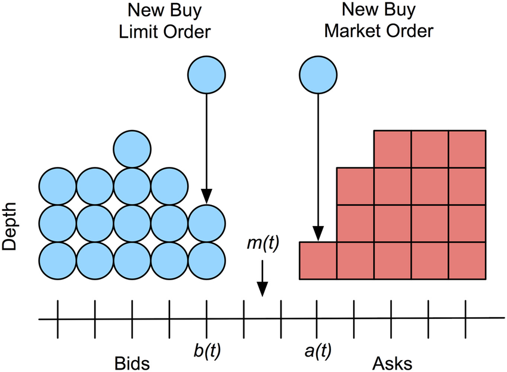
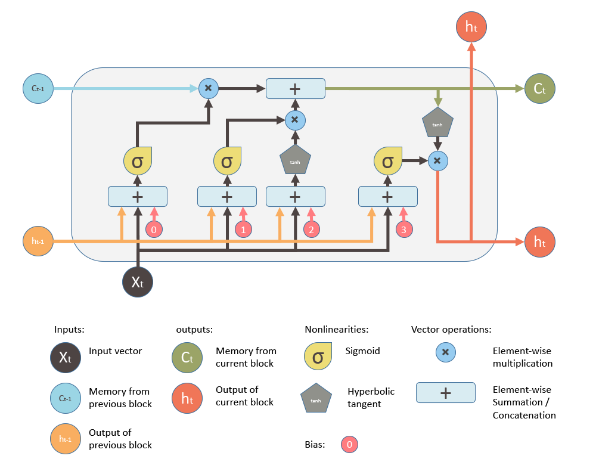

# A Deep Learning Approach to Limit Order Book Forecasting
By Aric Cutuli<br>
***

## Opening Remarks
The enigma concerning the predictability of markets has always been the principal driver of my interest in finance, and it inpires my ongoing exploration of machine learning's applications within the analysis and forecasting of financial time series. Today, we compare the performance of a studied deep learning model for limit order book forecasting on two stationary representations of the limit order book.

## Abstract
In this notebook, we implement an artificial neural network originally employed by Zhang et al[<sub>[1]</sub>](#ref1) that combines convolutional neural networks (CNNs) and a long short-term memory (LSTM) neural network in order to classify future directions of an order book at a high frequency. Specifically, given Coinbase order book data for Bitcoin, we seek to predict whether the mid price increases, decreases, or does not change in the next observation of the time series. Unlike Zhang et al's papers we reference[<sub>[1]</sub>](#ref1)[<sub>[2]</sub>](#ref2), which use non-stationary order book states as inputs to the network, our instantiation of the architecture is trained on order flow and order flow imbalance, which are stationary quantities derived from the limit order book[<sub>[3]</sub>](#ref3). Hence, this discussion also draws heavy inspiration from a 2021 article by Kolm et al[<sub>[4]</sub>](#ref4), which demonstrated that forecasting using order flow significantly outperforms raw order book inputs. Today, we further this discussion by doing an analysis of the impact that differencing order flow into order flow imbalance has on the forecasting performance of the model. We also approach the problem from a time series modeling perspective via the Box-Jenkins method, a procedure that was not explicitly documented in those papers.

## Order Books, Flow, and Imbalance
Today's trading of equities and other securities is often facilitated by a [*limit order book*](https://en.wikipedia.org/wiki/Order_book), also known as an *order book*. The order book collects bids and offers made by prospective buyers and sellers and determines which incoming orders get executed and which are added to the book. The *bid price* is the highest price buyers are prepared to buy at, and the *ask price* is the lowest price sellers are willing to sell at. The *mid price*, which our model seeks to predict moves in, is the midpoint of the bid price and the ask price.

An order is defined by its side, quantity demanded, price to trade at, and time of submission. As one enters the system, the matching engine of the exchange tries to match the order with existing orders in the book. Orders that match are executed and called *market orders*, and orders that do not match or only partially match are added to the book and called *limit orders*.

[](https://www.researchgate.net/figure/Limit-order-book-diagram-A-new-buy-limit-order-arrives-at-price-bt-increasing-the_fig1_297725489)

Our model takes as inputs representations of the first ten levels of the order book. A level is denoted by its price and volume that is bid or asked. So, as we progress down levels on the bid side of the order book, the price decreases, and as we progress down levels of the ask side, the price increases. Each observation in our dataset will be a 40-variable vector displaying the price and volume for each of the top ten bid and ask levels, giving us a truncated screenshot of the *state of the limit order book* at each timestep. 

$$ \text{s}_t^{LOB} := (a_t^1, v_t^{1,a}, b_t^1, v_t^{1,b}, ..., a_t^{10}, v_t^{10,a}, b_t^{10}, v_t^{10,b})^T \in \mathbb{R}^{40} $$

We define the *bid order flows* (bOF) and *ask order flows* (aOF) at a timestamp to be 10-variable vectors computed using two consecutive order book states, where each element is given by

$$ \text{bOF}_{t,i} :=   \left\{
\begin{array}{ll}
      v_t^{i,b}, & b_t^i > b_{t-1}^i \\
      v_t^{i,b} - v_{t-1}^{i,b}, & b_t^i = b_{t-1}^i \\
      -v_t^{i,b}, & b_t^i < b_{t-1}^i \\
\end{array} 
\right. $$

$$ \text{aOF}_{t,i} :=   \left\{
\begin{array}{ll}
      -v_t^{i,a}, & a_t^i > a_{t-1}^i \\
      v_t^{i,a} - v_{t-1}^{i,a}, & a_t^i = a_{t-1}^i \\
      v_t^{i,a}, & a_t^i < a_{t-1}^i \\
\end{array} 
\right. $$

for $i = 1, ..., 10$. With this, we define *order flow* (OF)

$$ \text{OF}_t :=  (\text{bOF}_{t,1}, \text{aOF}_{t,1}, ..., \text{bOF}_{t,10}, \text{aOF}_{t,10})^T \in \mathbb{R}^{20} $$

and *order flow imbalance* (OFI)

$$ \text{OFI}_t := \text{bOF}_t - \text{aOF}_t \in \mathbb{R}^{10}. $$

While a sequence of limit order book states is a complex non-stationary process, the above formulas for order flow and order flow imbalance transform consecutive order book states into a [stationary process](https://en.wikipedia.org/wiki/Stationary_process). This property allows for our eventual test test of the deep learning model to be reasonably similar to the training set and thus appropriate to predict off of using the model. It also allows for more ease in the learning of long-term dependencies by our LSTM layer, which Kolm et al see as a reason behind their finding that sequence length only marginally impacted model performance[<sub>[4]</sub>](#ref4). On a separate note, when trained on order flow, which keeps the bid and ask sides separate, the CNN layers of our model will be given the added flexibility of being able to combine bid and ask order flows asymmetrically, so we hypothesize that our forecasting model will perform better on order flow than on order flow imbalance. This theory is expressed by Kolm et al[<sub>[4]</sub>](#ref4) and shared by time series analysis theory[<sub>[5]</sub>](#ref5).

## Introducing the CNN-LSTM Model
While the [universal approximation theorem](https://en.wikipedia.org/wiki/Universal_approximation_theorem) states that a feedforward neural network with a single hidden layer can approximate any continuous function on any compact set, different neural network architectures are capable of exploiting unique structures in data, a quality that is particularly useful for the learning of complex financial time series. These different architectures, which include CNNs and LSTMs among others, can compress data and change their behavior over time in a way that supports their efficacy in difficult modeling situations. On the other hand, simple feedforward neural networks can suffer from instability and less interpretability when seeking to learn complex relationships in data[<sub>[6]</sub>](#ref6).

Although artificial neural networks can be used individually, they are often complementary in their modeling capabilities and, when used together, can learn unique structures in data and improve a model's ability to execute a desired task. For instance, our CNN-LSTM model architecture we adopt consists of CNN layers and an Inception Module that compress and wrap the order book data in a manner that allows a LSTM module to learn temporal dependencies from a smaller parameter space, leading to a more parsimonious model[<sub>[1]</sub>](#ref1).

[*Convolutional neural networks*](https://en.wikipedia.org/wiki/Convolutional_neural_network) (CNNs) are feedforward neural networks that can exploit data locality in an input, so in the CNN-LSTM model, CNN layers reduce the dimension of the multivariate input by aggregating bid and ask sides and levels in the order book. The output of these convolutional layers serve as an input to the [*Inception Module*](https://arxiv.org/pdf/1409.4842v1.pdf), which wraps convolutions together to capture behavior over multiple timescales, acting as a sort of moving average indicator whose decay weights are learned via [backpropagation](https://en.wikipedia.org/wiki/Backpropagation)[<sub>[1]</sub>](#ref1). Then, the outputs of the Inception Module are concatenated and reshaped into an input to the [*long short-term memory*](https://en.wikipedia.org/wiki/Long_short-term_memory) (LSTM) layer. LSTMs are a class of [*recurrent neural networks*](https://en.wikipedia.org/wiki/Recurrent_neural_network) (RNNs) that are designed to handle temporal dependencies in sequential data and alleviate the [vanishing gradient problem](https://en.wikipedia.org/wiki/Vanishing_gradient_problem) faced by generic RNNs[<sub>[7]</sub>](#ref7). The LSTM unit consists of a memory cell and three gates that determine what information should be remembered by the memory cell. For an $ n $-dimensional input vector $\text{x}_t$, the LSTM unit is defined by

$$ \text{f}_t = \sigma (\text{U}^f \text{x}_t + \text{W}^f \text{h}_{t-1} + \text{b}^f) $$
$$ \text{i}_t = \sigma (\text{U}^i \text{x}_t + \text{W}^i \text{h}_{t-1} + \text{b}^i) $$
$$ \text{o}_t = \sigma (\text{U}^o \text{x}_t + \text{W}^o \text{h}_{t-1} + \text{b}^o) $$
$$ \text{c}_t = \text{f}_t \circ \text{c}_{t-1} + \text{i}_t \circ \text{tanh} (\text{U}^c \text{x}_t + \text{W}^c \text{h}_{t-1} + \text{b}^c) $$
$$ \text{h}_t = \text{o}_t \circ \text{tanh} (\text{c}_t) $$

where $ m $ is the number of LSTM units in the module, $ \sigma := (1+e^{-x})^{-1} $ is the sigmoid activation function, $ \text{f}_t \in \mathbb{R}^m $ is the forget gate's activation vector, $ \text{i}_t \in \mathbb{R}^m $ is the input gate's activation vector, $ \text{o}_t \in \mathbb{R}^m $ is the output gate's activation vector, $ \text{c}_t \in \mathbb{R}^m $ is the LSTM unit's hidden state vector, and $ \text{h}_t \in \mathbb{R}^m $ is the unit's output vector. $ \text{U} \in \mathbb{R}^{m \times n} $, $ \text{W} \in \mathbb{R}^{m \times m} $, and $ \text{b} \in \mathbb{R}^m $ are learned during training and represent the weight matrices in connection to the input vector, the weight matrices in connection to the previous output state, and the bias vectors, respectively. 

[](https://blog.mlreview.com/understanding-lstm-and-its-diagrams-37e2f46f1714)

Moreover, Zhang et al[<sub>[2]</sub>](#ref2) showcase the performance benefit of applying [variational dropout](https://arxiv.org/pdf/1512.05287v5.pdf) to the model by serving as a stochastic [regularizer](https://en.wikipedia.org/wiki/Regularization_(mathematics)) to reduce [overfitting](https://en.wikipedia.org/wiki/Overfitting) and make decisions with some understanding of the predictive variation produced by our model parameters. That is, with [*Monte-Carlo (MC) dropout*](https://docs.aws.amazon.com/prescriptive-guidance/latest/ml-quantifying-uncertainty/mc-dropout.html), we can add [epistemic uncertainty](https://en.wikipedia.org/wiki/Uncertainty_quantification#Aleatoric_and_epistemic)[<sup>1</sup>](#fn1) to our neural network architecture by making multiple predictions and dropping a different random sample of neurons with every forward pass. This random sampling leads to different predictions on each evaluation iteration, so we can average the results to—in theory—improve out-of-sample predictions. The dropout layer is inserted after the Inception Module, and we determine its rate with [cross-validated grid-search](https://scikit-learn.org/stable/modules/grid_search.html).

Lastly, since we formulate this forecasting problem as one of classification, we add an output layer with a [softmax activation function](https://en.wikipedia.org/wiki/Softmax_function), resulting in a final output whose elements represent the probability of observing each price movement in the next timestamp. We train the models by minimizing [categorical cross-entropy loss](https://en.wikipedia.org/wiki/Cross_entropy#Cross-entropy_loss_function_and_logistic_regression) with [stochastic gradient descent](https://en.wikipedia.org/wiki/Stochastic_gradient_descent) using the [Adam optimization algorithm](https://arxiv.org/pdf/1412.6980.pdf), whose parameters we set to those of the DeepLOB implementation of the model[<sub>[1]</sub>](#ref1).

<sup>1. </sup><span id="fn1"><sup>Here, epistemic uncertainty refers to the fact that we don't have an analytical understanding of the posterior distribution of the model parameters. Because of our lack of data, we are uncertain of the integrity of the model parameters we estimate via backpropagation.</sup></span>


```python
from tensorflow.keras import Input, layers
from tensorflow.keras.models import Model
from tensorflow.keras.optimizers import Adam

def CNN_LSTM(time_series, lag_param, dropout):
    
    # Convolutions across LOB levels
    if time_series == 'OF':
        input_tensor = Input(shape=(lag_param,20,1))
        # Combine imbalance information across sides for each level of the order book
        layer_x = layers.Conv2D(filters=16, kernel_size=(1,2), strides=(1,2))(input_tensor)
        layer_x = layers.LeakyReLU(alpha=0.01)(layer_x)
        # Combine imbalance information across time for each side and level of the order book
        layer_x = layers.Conv2D(filters=16, kernel_size=(4,1), padding='same')(layer_x)
        layer_x = layers.LeakyReLU(alpha=0.01)(layer_x)
        layer_x = layers.Conv2D(filters=16, kernel_size=(4,1), padding='same')(layer_x)
        layer_x = layers.LeakyReLU(alpha=0.01)(layer_x)
    elif time_series == 'OFI':
        input_tensor = Input(shape=(lag_param,10,1))
        # Combine imbalance information across time for each side and level of the order book
        layer_x = layers.Conv2D(filters=16, kernel_size=(4,1), padding='same')(input_tensor)
        layer_x = layers.LeakyReLU(alpha=0.01)(layer_x)
        layer_x = layers.Conv2D(filters=16, kernel_size=(4,1), padding='same')(layer_x)
        layer_x = layers.LeakyReLU(alpha=0.01)(layer_x)
    else:
        raise Exception("'time_series' should be 'OF' or 'OFI'")

    # Combine imbalance information across all levels of the book
    layer_x = layers.Conv2D(filters=16, kernel_size=(1,10))(layer_x)
    layer_x = layers.LeakyReLU(alpha=0.01)(layer_x)

    # Inception Module
    # Tower 1
    tower_1 = layers.Conv2D(filters=32, kernel_size=(1,1), padding='same')(layer_x)
    tower_1 = layers.LeakyReLU(alpha=0.01)(tower_1)
    tower_1 = layers.Conv2D(filters=32, kernel_size=(3,1), padding='same')(tower_1)
    tower_1 = layers.LeakyReLU(alpha=0.01)(tower_1)
    # Tower 2
    tower_2 = layers.Conv2D(filters=32, kernel_size=(1,1), padding='same')(layer_x)
    tower_2 = layers.LeakyReLU(alpha=0.01)(tower_2)
    tower_2 = layers.Conv2D(filters=32, kernel_size=(5,1), padding='same')(tower_2)
    tower_2 = layers.LeakyReLU(alpha=0.01)(tower_2)  
    # Tower 3
    tower_3 = layers.MaxPooling2D(pool_size=(3,1), padding='same', strides=(1,1))(layer_x)
    tower_3 = layers.Conv2D(filters=32, kernel_size=(1,1), padding='same')(tower_3)
    tower_3 = layers.LeakyReLU(alpha=0.01)(tower_3)

    # Concatenation and reshaping
    layer_x = layers.concatenate([tower_1, tower_2, tower_3], axis=-1)
    layer_x = layers.Reshape(target_shape=(lag_param, 96))(layer_x)
    
    # Insert variational dropout layer
    # By setting training to true, we enable dropout during evaluation passes
    layer_x = layers.Dropout(dropout)(layer_x, training=True)
    
    # LSTM with 64 hidden units
    layer_x = layers.LSTM(units=64)(layer_x)
    
    # Final output layer
    output = layers.Dense(units=3, activation='softmax')(layer_x)
    
    model = Model(input_tensor, output)
    
    opt = Adam(learning_rate=0.01, epsilon=1)
    model.compile(loss='categorical_crossentropy', optimizer=opt, metrics=['accuracy'])
    
    return model

```


```python
model_details = {
    'OF': {
        'model': None, 'function': CNN_LSTM, 'data': None
    },
    'OFI': {
        'model': None, 'function': CNN_LSTM, 'data': None
    }
}
```

## Data
We scrape our data using [Coinbase's public API](https://github.com/danpaquin/coinbasepro-python). Our method pulls live order book state information for Bitcoin traded on Coinbase. We essentially have the ability to choose however many observations we desire. But to avoid processing the data pull for an obscene length of time, we unfortunately decide not to get as many observations as the datasets used in the aforementioned related papers, since the purpose of this notebook is not to submit a solution to the model risk management team but instead to showcase what I've taught myself in the past few months. That being said, we extract 100,000 observations over the course of about a day, and we add a couple extra to account for the transformations we make later.


```python
import pandas as pd
import numpy as np
from cbpro import PublicClient
from time import time, strftime, gmtime

public_client = PublicClient()
lob_data = pd.DataFrame()
start = time()
while len(lob_data) < 100002:
    raw_data = pd.concat((pd.DataFrame.from_dict(public_client.get_product_order_book('BTC-USD',level=2)['asks'])[:10],
                     pd.DataFrame.from_dict(public_client.get_product_order_book('BTC-USD',level=2)['bids'])[:10]),axis=1)
    lob_data = pd.concat((lob_data, pd.concat((pd.DataFrame(raw_data.drop(2,axis=1).iloc[i]).T for i in range(10)), axis=1).apply(lambda x: pd.Series(x.dropna().values))))
end = time()

print((end-start)/len(lob_data))

lob_data.columns = ['PRICE_ASK_1','VOLUME_ASK_1','PRICE_BID_1','VOLUME_BID_1',
           'PRICE_ASK_2','VOLUME_ASK_2','PRICE_BID_2','VOLUME_BID_2',
           'PRICE_ASK_3','VOLUME_ASK_3','PRICE_BID_3','VOLUME_BID_3',
           'PRICE_ASK_4','VOLUME_ASK_4','PRICE_BID_4','VOLUME_BID_4',
           'PRICE_ASK_5','VOLUME_ASK_5','PRICE_BID_5','VOLUME_BID_5',
           'PRICE_ASK_6','VOLUME_ASK_6','PRICE_BID_6','VOLUME_BID_6',
           'PRICE_ASK_7','VOLUME_ASK_7','PRICE_BID_7','VOLUME_BID_7',
           'PRICE_ASK_8','VOLUME_ASK_8','PRICE_BID_8','VOLUME_BID_8',
           'PRICE_ASK_9','VOLUME_ASK_9','PRICE_BID_9','VOLUME_BID_9',
           'PRICE_ASK_10','VOLUME_ASK_10','PRICE_BID_10','VOLUME_BID_10']
lob_data.index = range(len(lob_data))
lob_data = lob_data.astype(float)
```

    0.7618932478344387


While it can vary between any two events in the dataset, the time interval between two observations is on average 0.7619 seconds. So, in lieu of the granularity that Zhang et al and Ntakaris et al boast in their respective datasets[<sub>[1]</sub>](#ref1)[<sub>[3]</sub>](#ref3)[<sub>[8]</sub>](#ref9), we simply extract labels for relative changes in only the next event. Just as in those datasets, our labels describe the percentage change of the mid price between events. For percentage changes greater than 0.002, we use label 1, for percentages change between -0.002 and 0.002, we use label 0, and for percentage changes smaller than -0.002, we use label -1.


```python
lob_data['LABEL_1'] = np.zeros(len(lob_data))
for i in range(len(lob_data)-1):
    if (lob_data.loc[i+1,'PRICE_ASK_0'] + lob_data.loc[i+1,'PRICE_ASK_0']) > 1.00002*(lob_data.loc[i,'PRICE_ASK_0'] + lob_data.loc[i,'PRICE_ASK_0']):
        lob_data['LABEL_1'][i] = 1
    elif (lob_data.loc[i+1,'PRICE_BID_0'] + lob_data.loc[i+1,'PRICE_BID_0']) < 0.99998*(lob_data.loc[i,'PRICE_BID_0'] + lob_data.loc[i,'PRICE_BID_0']):
        lob_data['LABEL_1'][i] = -1
lob_data = lob_data.head(len(lob_data)-1)

# Save the LOB data
lob_data.to_csv('BTC-USD-LOB-{}'.format(strftime('%d-%b-%Y', gmtime())), index=False)

# Load the saved data
# lob_data = pd.read_csv('BTC-USD-LOB- ...')

lob_data
```


<div>
<style scoped>
    .dataframe tbody tr th:only-of-type {
        vertical-align: middle;
    }

    .dataframe tbody tr th {
        vertical-align: top;
    }

    .dataframe thead th {
        text-align: right;
    }
</style>
<table border="1" class="dataframe">
  <thead>
    <tr style="text-align: right;">
      <th></th>
      <th>PRICE_ASK_0</th>
      <th>VOLUME_ASK_0</th>
      <th>PRICE_BID_0</th>
      <th>VOLUME_BID_0</th>
      <th>PRICE_ASK_1</th>
      <th>VOLUME_ASK_1</th>
      <th>PRICE_BID_1</th>
      <th>VOLUME_BID_1</th>
      <th>PRICE_ASK_2</th>
      <th>VOLUME_ASK_2</th>
      <th>...</th>
      <th>VOLUME_BID_7</th>
      <th>PRICE_ASK_8</th>
      <th>VOLUME_ASK_8</th>
      <th>PRICE_BID_8</th>
      <th>VOLUME_BID_8</th>
      <th>PRICE_ASK_9</th>
      <th>VOLUME_ASK_9</th>
      <th>PRICE_BID_9</th>
      <th>VOLUME_BID_9</th>
      <th>LABEL_1TICK</th>
    </tr>
  </thead>
  <tbody>
    <tr>
      <th>0</th>
      <td>20690.00</td>
      <td>0.084309</td>
      <td>20689.99</td>
      <td>0.011289</td>
      <td>20690.02</td>
      <td>0.000143</td>
      <td>20689.98</td>
      <td>0.000348</td>
      <td>20691.38</td>
      <td>0.981250</td>
      <td>...</td>
      <td>0.000300</td>
      <td>20695.72</td>
      <td>0.100000</td>
      <td>20685.97</td>
      <td>0.003401</td>
      <td>20696.33</td>
      <td>0.358238</td>
      <td>20685.65</td>
      <td>0.002158</td>
      <td>0.0</td>
    </tr>
    <tr>
      <th>1</th>
      <td>20690.00</td>
      <td>0.084309</td>
      <td>20689.99</td>
      <td>0.011289</td>
      <td>20690.02</td>
      <td>0.000143</td>
      <td>20689.98</td>
      <td>0.000348</td>
      <td>20691.38</td>
      <td>0.981250</td>
      <td>...</td>
      <td>0.000300</td>
      <td>20695.72</td>
      <td>0.100000</td>
      <td>20685.97</td>
      <td>0.003401</td>
      <td>20696.33</td>
      <td>0.358238</td>
      <td>20685.65</td>
      <td>0.002158</td>
      <td>0.0</td>
    </tr>
    <tr>
      <th>2</th>
      <td>20690.00</td>
      <td>0.084309</td>
      <td>20689.99</td>
      <td>0.011289</td>
      <td>20690.02</td>
      <td>0.000143</td>
      <td>20689.98</td>
      <td>0.000348</td>
      <td>20691.38</td>
      <td>0.981250</td>
      <td>...</td>
      <td>0.000300</td>
      <td>20695.72</td>
      <td>0.100000</td>
      <td>20685.97</td>
      <td>0.003401</td>
      <td>20696.33</td>
      <td>0.358238</td>
      <td>20685.65</td>
      <td>0.002158</td>
      <td>0.0</td>
    </tr>
    <tr>
      <th>3</th>
      <td>20690.00</td>
      <td>0.084309</td>
      <td>20689.65</td>
      <td>0.005000</td>
      <td>20690.02</td>
      <td>0.000143</td>
      <td>20689.64</td>
      <td>0.006213</td>
      <td>20691.38</td>
      <td>0.981250</td>
      <td>...</td>
      <td>0.150000</td>
      <td>20695.72</td>
      <td>0.100000</td>
      <td>20685.57</td>
      <td>2.043200</td>
      <td>20696.33</td>
      <td>0.358238</td>
      <td>20685.32</td>
      <td>0.018317</td>
      <td>0.0</td>
    </tr>
    <tr>
      <th>4</th>
      <td>20689.88</td>
      <td>0.017278</td>
      <td>20689.83</td>
      <td>0.011799</td>
      <td>20689.89</td>
      <td>0.000100</td>
      <td>20686.69</td>
      <td>0.003841</td>
      <td>20689.90</td>
      <td>0.000100</td>
      <td>...</td>
      <td>0.024724</td>
      <td>20692.00</td>
      <td>0.231488</td>
      <td>20682.78</td>
      <td>0.025542</td>
      <td>20693.47</td>
      <td>0.016210</td>
      <td>20682.10</td>
      <td>0.241633</td>
      <td>0.0</td>
    </tr>
    <tr>
      <th>...</th>
      <td>...</td>
      <td>...</td>
      <td>...</td>
      <td>...</td>
      <td>...</td>
      <td>...</td>
      <td>...</td>
      <td>...</td>
      <td>...</td>
      <td>...</td>
      <td>...</td>
      <td>...</td>
      <td>...</td>
      <td>...</td>
      <td>...</td>
      <td>...</td>
      <td>...</td>
      <td>...</td>
      <td>...</td>
      <td>...</td>
      <td>...</td>
    </tr>
    <tr>
      <th>99996</th>
      <td>21076.00</td>
      <td>0.020025</td>
      <td>21072.72</td>
      <td>0.002722</td>
      <td>21076.08</td>
      <td>0.025441</td>
      <td>21072.71</td>
      <td>0.091130</td>
      <td>21076.14</td>
      <td>0.020467</td>
      <td>...</td>
      <td>0.018979</td>
      <td>21078.66</td>
      <td>0.008612</td>
      <td>21071.74</td>
      <td>0.227235</td>
      <td>21078.72</td>
      <td>0.227227</td>
      <td>21071.32</td>
      <td>0.100000</td>
      <td>-1.0</td>
    </tr>
    <tr>
      <th>99997</th>
      <td>21071.31</td>
      <td>0.005324</td>
      <td>21068.78</td>
      <td>0.094586</td>
      <td>21071.35</td>
      <td>0.013313</td>
      <td>21068.65</td>
      <td>0.080000</td>
      <td>21071.41</td>
      <td>0.005000</td>
      <td>...</td>
      <td>0.237270</td>
      <td>21073.46</td>
      <td>0.013086</td>
      <td>21066.24</td>
      <td>0.120000</td>
      <td>21073.48</td>
      <td>0.021072</td>
      <td>21065.65</td>
      <td>0.355873</td>
      <td>0.0</td>
    </tr>
    <tr>
      <th>99998</th>
      <td>21071.31</td>
      <td>0.005324</td>
      <td>21068.78</td>
      <td>0.094586</td>
      <td>21071.35</td>
      <td>0.013313</td>
      <td>21068.65</td>
      <td>0.080000</td>
      <td>21071.41</td>
      <td>0.005000</td>
      <td>...</td>
      <td>0.237270</td>
      <td>21073.46</td>
      <td>0.013086</td>
      <td>21066.24</td>
      <td>0.120000</td>
      <td>21073.48</td>
      <td>0.021072</td>
      <td>21065.65</td>
      <td>0.355873</td>
      <td>-1.0</td>
    </tr>
    <tr>
      <th>99999</th>
      <td>21064.51</td>
      <td>0.111293</td>
      <td>21064.50</td>
      <td>0.005000</td>
      <td>21064.60</td>
      <td>0.041741</td>
      <td>21061.10</td>
      <td>0.744450</td>
      <td>21065.25</td>
      <td>0.008726</td>
      <td>...</td>
      <td>0.355963</td>
      <td>21066.80</td>
      <td>0.009655</td>
      <td>21058.89</td>
      <td>0.004937</td>
      <td>21067.00</td>
      <td>0.227349</td>
      <td>21057.91</td>
      <td>0.098579</td>
      <td>-1.0</td>
    </tr>
    <tr>
      <th>100000</th>
      <td>21064.19</td>
      <td>0.094998</td>
      <td>21061.10</td>
      <td>0.744450</td>
      <td>21064.25</td>
      <td>0.012357</td>
      <td>21059.36</td>
      <td>0.002087</td>
      <td>21064.31</td>
      <td>0.227376</td>
      <td>...</td>
      <td>0.195993</td>
      <td>21065.25</td>
      <td>0.009204</td>
      <td>21056.68</td>
      <td>0.000969</td>
      <td>21065.26</td>
      <td>0.686197</td>
      <td>21056.15</td>
      <td>0.058778</td>
      <td>0.0</td>
    </tr>
  </tbody>
</table>
<p>100001 rows × 41 columns</p>
</div>


As we now have our sequence of 40-variable vectors of order book states, we can obtain the order flow data as well as the order flow imbalance data for the dataset.


```python
of_data = pd.DataFrame()
for i in range(10):
    
    of_data['bOF_{}'.format(i)] = [None] * len(lob_data)
    of_data['aOF_{}'.format(i)] = [None] * len(lob_data)

    for j in range(1,len(lob_data)):
            
        # Bid Order Flow
        if lob_data.loc[j,'PRICE_BID_{}'.format(i)] > lob_data.loc[j-1,'PRICE_BID_{}'.format(i)]:
            of_data['bOF_{}'.format(i)][j] = lob_data.loc[j,'VOLUME_BID_{}'.format(i)]
        elif lob_data.loc[j,'PRICE_BID_{}'.format(i)] < lob_data.loc[j-1,'PRICE_BID_{}'.format(i)]:
            of_data['bOF_{}'.format(i)][j] = -1*lob_data.loc[j,'VOLUME_BID_{}'.format(i)]
        else:
            of_data['bOF_{}'.format(i)][j] = lob_data.loc[j,'VOLUME_BID_{}'.format(i)] - lob_data.loc[j-1,'VOLUME_BID_{}'.format(i)]
            
        # Ask Order Flow
        if lob_data.loc[j,'PRICE_ASK_{}'.format(i)] > lob_data.loc[j-1,'PRICE_ASK_{}'.format(i)]:
            of_data['aOF_{}'.format(i)][j] = -1*lob_data.loc[j,'VOLUME_ASK_{}'.format(i)]
        elif lob_data.loc[j,'PRICE_ASK_{}'.format(i)] < lob_data.loc[j-1,'PRICE_ASK_{}'.format(i)]:
            of_data['aOF_{}'.format(i)][j] = lob_data.loc[j,'VOLUME_ASK_{}'.format(i)]
        else:
            of_data['aOF_{}'.format(i)][j] = lob_data.loc[j,'VOLUME_ASK_{}'.format(i)] - lob_data.loc[j-1,'VOLUME_ASK_{}'.format(i)]
            
# Add output column to of_data
of_data = pd.concat([of_data,lob_data.iloc[:,-1:]],axis=1)

# Drop first row, which is null
of_data = of_data.iloc[1:,:].reset_index(drop=True)

model_details['OF']['data'] = of_data
of_data
```


<div>
<style scoped>
    .dataframe tbody tr th:only-of-type {
        vertical-align: middle;
    }

    .dataframe tbody tr th {
        vertical-align: top;
    }

    .dataframe thead th {
        text-align: right;
    }
</style>
<table border="1" class="dataframe">
  <thead>
    <tr style="text-align: right;">
      <th></th>
      <th>bOF_0</th>
      <th>aOF_0</th>
      <th>bOF_1</th>
      <th>aOF_1</th>
      <th>bOF_2</th>
      <th>aOF_2</th>
      <th>bOF_3</th>
      <th>aOF_3</th>
      <th>bOF_4</th>
      <th>aOF_4</th>
      <th>...</th>
      <th>aOF_5</th>
      <th>bOF_6</th>
      <th>aOF_6</th>
      <th>bOF_7</th>
      <th>aOF_7</th>
      <th>bOF_8</th>
      <th>aOF_8</th>
      <th>bOF_9</th>
      <th>aOF_9</th>
      <th>LABEL_1TICK</th>
    </tr>
  </thead>
  <tbody>
    <tr>
      <th>0</th>
      <td>0.0</td>
      <td>0.0</td>
      <td>0.0</td>
      <td>0.0</td>
      <td>0.0</td>
      <td>0.0</td>
      <td>0.0</td>
      <td>0.0</td>
      <td>0.0</td>
      <td>0.0</td>
      <td>...</td>
      <td>0.0</td>
      <td>0.0</td>
      <td>0.0</td>
      <td>0.0</td>
      <td>0.0</td>
      <td>0.0</td>
      <td>0.0</td>
      <td>0.0</td>
      <td>0.0</td>
      <td>0.0</td>
    </tr>
    <tr>
      <th>1</th>
      <td>0.0</td>
      <td>0.0</td>
      <td>0.0</td>
      <td>0.0</td>
      <td>0.0</td>
      <td>0.0</td>
      <td>0.0</td>
      <td>0.0</td>
      <td>0.0</td>
      <td>0.0</td>
      <td>...</td>
      <td>0.0</td>
      <td>0.0</td>
      <td>0.0</td>
      <td>0.0</td>
      <td>0.0</td>
      <td>0.0</td>
      <td>0.0</td>
      <td>0.0</td>
      <td>0.0</td>
      <td>0.0</td>
    </tr>
    <tr>
      <th>2</th>
      <td>-0.005</td>
      <td>0.0</td>
      <td>-0.006213</td>
      <td>0.0</td>
      <td>-0.003067</td>
      <td>0.0</td>
      <td>-0.009612</td>
      <td>0.0</td>
      <td>-0.0003</td>
      <td>0.0</td>
      <td>...</td>
      <td>0.0</td>
      <td>-0.002158</td>
      <td>0.0</td>
      <td>-0.15</td>
      <td>0.0</td>
      <td>-2.0432</td>
      <td>0.0</td>
      <td>-0.018317</td>
      <td>0.0</td>
      <td>0.0</td>
    </tr>
    <tr>
      <th>3</th>
      <td>0.011799</td>
      <td>0.017278</td>
      <td>-0.003841</td>
      <td>0.0001</td>
      <td>-1.513803</td>
      <td>0.0001</td>
      <td>-0.018317</td>
      <td>0.0001</td>
      <td>-0.1</td>
      <td>0.006624</td>
      <td>...</td>
      <td>0.057827</td>
      <td>-0.01607</td>
      <td>0.000143</td>
      <td>-0.024724</td>
      <td>0.98125</td>
      <td>-0.025542</td>
      <td>0.231488</td>
      <td>-0.241633</td>
      <td>0.01621</td>
      <td>0.0</td>
    </tr>
    <tr>
      <th>4</th>
      <td>0.0</td>
      <td>0.0</td>
      <td>0.0</td>
      <td>0.0</td>
      <td>0.0</td>
      <td>0.0</td>
      <td>0.0</td>
      <td>0.0</td>
      <td>0.0</td>
      <td>0.0</td>
      <td>...</td>
      <td>0.0</td>
      <td>0.0</td>
      <td>0.0</td>
      <td>0.0</td>
      <td>0.0</td>
      <td>0.0</td>
      <td>0.0</td>
      <td>0.0</td>
      <td>0.0</td>
      <td>0.0</td>
    </tr>
    <tr>
      <th>...</th>
      <td>...</td>
      <td>...</td>
      <td>...</td>
      <td>...</td>
      <td>...</td>
      <td>...</td>
      <td>...</td>
      <td>...</td>
      <td>...</td>
      <td>...</td>
      <td>...</td>
      <td>...</td>
      <td>...</td>
      <td>...</td>
      <td>...</td>
      <td>...</td>
      <td>...</td>
      <td>...</td>
      <td>...</td>
      <td>...</td>
      <td>...</td>
    </tr>
    <tr>
      <th>99995</th>
      <td>0.0</td>
      <td>0.0</td>
      <td>0.0</td>
      <td>0.0</td>
      <td>0.0</td>
      <td>0.0</td>
      <td>0.0</td>
      <td>0.0</td>
      <td>0.0</td>
      <td>0.0</td>
      <td>...</td>
      <td>0.0</td>
      <td>0.0</td>
      <td>0.0</td>
      <td>0.0</td>
      <td>0.0</td>
      <td>0.0</td>
      <td>0.0</td>
      <td>0.0</td>
      <td>0.0</td>
      <td>-1.0</td>
    </tr>
    <tr>
      <th>99996</th>
      <td>-0.094586</td>
      <td>0.005324</td>
      <td>-0.08</td>
      <td>0.013313</td>
      <td>-0.227265</td>
      <td>0.005</td>
      <td>-0.339581</td>
      <td>0.006926</td>
      <td>-0.000495</td>
      <td>0.016311</td>
      <td>...</td>
      <td>0.01686</td>
      <td>-0.010967</td>
      <td>0.238264</td>
      <td>-0.23727</td>
      <td>0.061199</td>
      <td>-0.12</td>
      <td>0.013086</td>
      <td>-0.355873</td>
      <td>0.021072</td>
      <td>0.0</td>
    </tr>
    <tr>
      <th>99997</th>
      <td>0.0</td>
      <td>0.0</td>
      <td>0.0</td>
      <td>0.0</td>
      <td>0.0</td>
      <td>0.0</td>
      <td>0.0</td>
      <td>0.0</td>
      <td>0.0</td>
      <td>0.0</td>
      <td>...</td>
      <td>0.0</td>
      <td>0.0</td>
      <td>0.0</td>
      <td>0.0</td>
      <td>0.0</td>
      <td>0.0</td>
      <td>0.0</td>
      <td>0.0</td>
      <td>0.0</td>
      <td>-1.0</td>
    </tr>
    <tr>
      <th>99998</th>
      <td>-0.005</td>
      <td>0.111293</td>
      <td>-0.74445</td>
      <td>0.041741</td>
      <td>-0.007445</td>
      <td>0.008726</td>
      <td>-1.085</td>
      <td>0.044998</td>
      <td>-0.05</td>
      <td>0.227351</td>
      <td>...</td>
      <td>0.052319</td>
      <td>-0.006386</td>
      <td>0.007704</td>
      <td>-0.355963</td>
      <td>0.637379</td>
      <td>-0.004937</td>
      <td>0.009655</td>
      <td>-0.098579</td>
      <td>0.227349</td>
      <td>-1.0</td>
    </tr>
    <tr>
      <th>99999</th>
      <td>-0.74445</td>
      <td>0.094998</td>
      <td>-0.002087</td>
      <td>0.012357</td>
      <td>-0.227364</td>
      <td>0.227376</td>
      <td>-0.237347</td>
      <td>0.016477</td>
      <td>-0.000697</td>
      <td>0.034887</td>
      <td>...</td>
      <td>0.01841</td>
      <td>-0.75</td>
      <td>0.009204</td>
      <td>-0.195993</td>
      <td>0.009204</td>
      <td>-0.000969</td>
      <td>0.009204</td>
      <td>-0.058778</td>
      <td>0.686197</td>
      <td>0.0</td>
    </tr>
  </tbody>
</table>
<p>100000 rows × 21 columns</p>
</div>


```python
ofi_data = pd.DataFrame()
for i in range(10):
    ofi_data['OFI_{}'.format(i)] = of_data['bOF_{}'.format(i)] - of_data['aOF_{}'.format(i)]

ofi_data = pd.concat([ofi_data,of_data.iloc[:,-1:]],axis=1).apply(lambda x: pd.Series(x.dropna().values))

model_details['OFI']['data'] = ofi_data
ofi_data
```


<div>
<style scoped>
    .dataframe tbody tr th:only-of-type {
        vertical-align: middle;
    }

    .dataframe tbody tr th {
        vertical-align: top;
    }

    .dataframe thead th {
        text-align: right;
    }
</style>
<table border="1" class="dataframe">
  <thead>
    <tr style="text-align: right;">
      <th></th>
      <th>OFI_0</th>
      <th>OFI_1</th>
      <th>OFI_2</th>
      <th>OFI_3</th>
      <th>OFI_4</th>
      <th>OFI_5</th>
      <th>OFI_6</th>
      <th>OFI_7</th>
      <th>OFI_8</th>
      <th>OFI_9</th>
      <th>LABEL_1TICK</th>
    </tr>
  </thead>
  <tbody>
    <tr>
      <th>0</th>
      <td>0.0</td>
      <td>0.0</td>
      <td>0.0</td>
      <td>0.0</td>
      <td>0.0</td>
      <td>0.0</td>
      <td>0.0</td>
      <td>0.0</td>
      <td>0.0</td>
      <td>0.0</td>
      <td>0.0</td>
    </tr>
    <tr>
      <th>1</th>
      <td>0.0</td>
      <td>0.0</td>
      <td>0.0</td>
      <td>0.0</td>
      <td>0.0</td>
      <td>0.0</td>
      <td>0.0</td>
      <td>0.0</td>
      <td>0.0</td>
      <td>0.0</td>
      <td>0.0</td>
    </tr>
    <tr>
      <th>2</th>
      <td>-0.005</td>
      <td>-0.006213</td>
      <td>-0.003067</td>
      <td>-0.009612</td>
      <td>-0.0003</td>
      <td>-0.003401</td>
      <td>-0.002158</td>
      <td>-0.15</td>
      <td>-2.0432</td>
      <td>-0.018317</td>
      <td>0.0</td>
    </tr>
    <tr>
      <th>3</th>
      <td>-0.005478</td>
      <td>-0.003941</td>
      <td>-1.513903</td>
      <td>-0.018417</td>
      <td>-0.106624</td>
      <td>-0.807827</td>
      <td>-0.016213</td>
      <td>-1.005974</td>
      <td>-0.25703</td>
      <td>-0.257842</td>
      <td>0.0</td>
    </tr>
    <tr>
      <th>4</th>
      <td>0.0</td>
      <td>0.0</td>
      <td>0.0</td>
      <td>0.0</td>
      <td>0.0</td>
      <td>0.0</td>
      <td>0.0</td>
      <td>0.0</td>
      <td>0.0</td>
      <td>0.0</td>
      <td>0.0</td>
    </tr>
    <tr>
      <th>...</th>
      <td>...</td>
      <td>...</td>
      <td>...</td>
      <td>...</td>
      <td>...</td>
      <td>...</td>
      <td>...</td>
      <td>...</td>
      <td>...</td>
      <td>...</td>
      <td>...</td>
    </tr>
    <tr>
      <th>99995</th>
      <td>0.0</td>
      <td>0.0</td>
      <td>0.0</td>
      <td>0.0</td>
      <td>0.0</td>
      <td>0.0</td>
      <td>0.0</td>
      <td>0.0</td>
      <td>0.0</td>
      <td>0.0</td>
      <td>-1.0</td>
    </tr>
    <tr>
      <th>99996</th>
      <td>-0.099911</td>
      <td>-0.093313</td>
      <td>-0.232265</td>
      <td>-0.346507</td>
      <td>-0.016806</td>
      <td>-0.76686</td>
      <td>-0.249231</td>
      <td>-0.298469</td>
      <td>-0.133086</td>
      <td>-0.376945</td>
      <td>0.0</td>
    </tr>
    <tr>
      <th>99997</th>
      <td>0.0</td>
      <td>0.0</td>
      <td>0.0</td>
      <td>0.0</td>
      <td>0.0</td>
      <td>0.0</td>
      <td>0.0</td>
      <td>0.0</td>
      <td>0.0</td>
      <td>0.0</td>
      <td>-1.0</td>
    </tr>
    <tr>
      <th>99998</th>
      <td>-0.116293</td>
      <td>-0.786191</td>
      <td>-0.016171</td>
      <td>-1.129998</td>
      <td>-0.277351</td>
      <td>-0.289645</td>
      <td>-0.01409</td>
      <td>-0.993342</td>
      <td>-0.014593</td>
      <td>-0.325928</td>
      <td>-1.0</td>
    </tr>
    <tr>
      <th>99999</th>
      <td>-0.839448</td>
      <td>-0.014444</td>
      <td>-0.45474</td>
      <td>-0.253823</td>
      <td>-0.035584</td>
      <td>-0.067699</td>
      <td>-0.759204</td>
      <td>-0.205197</td>
      <td>-0.010173</td>
      <td>-0.744974</td>
      <td>0.0</td>
    </tr>
  </tbody>
</table>
<p>100000 rows × 11 columns</p>
</div>


## Methodology and Experimentation
Now that we have our data, we seek to train the CNN-LSTM to accomplish the forecasting task of classifying future mid prices by their directional moves. In this section, we adopt the [Box-Jenkins approach](https://en.wikipedia.org/wiki/Box%E2%80%93Jenkins_method) to time series modeling by first taking a comically long-winded aside to recognize the time series as vector autoregressive (VAR) processes and then by tuning necessary hyperparameters of the deep learning model and evaluating the trained deep learning model.

### Vector Autoregressive Processes
[*Vector autoregression*](https://en.wikipedia.org/wiki/Vector_autoregression) (VAR) is the multivariate extension of [*autoregression*](https://en.wikipedia.org/wiki/Autoregressive_model). That is, a VAR model is a statistical representation of a collection of time-varying [stochastic processes](https://en.wikipedia.org/wiki/Stochastic_process) that often serves a role in the modeling of multivariate financial time series and other complex randomly-evolving processes. The term *autoregressive* indicates that each realization of the process is a linear function of previous values in the sequence plus a stochastic error term that is uncorrelated with those of other periods. That is, for a $ K $-variate time series $ \left\{y_i\right\}_{i=1}^{t-1} $ in which we assume only $ p $ past values are necessary to forecast the next observation $ y_{t} $, we have the VAR$(p)$ representation

$$ y_{t}= c + A_1 y_t + A_2 y_{t-1} + ... + A_p y_{t-p} + u_{t}, $$

where $ c = (c_1, ..., c_K)' $, $ A_i =  \begin{bmatrix}
\alpha_{11,i} & \dots & \alpha_{1K,i} \\
\vdots & \ddots & \vdots \\
\alpha_{K1,i} & \dots & \alpha_{KK,i} \end{bmatrix} $, and $ \left\{u_i\right\}_{i=1}^{t} = \left\{(u_{1i}, ..., u_{Ki})' \right\}_{i=1}^{t} \subset \mathbb{R}^K$ is independently identically distributed with mean zero. We do not assume that all $ A_i $ are nonzero, so $p$ really represents an upper bound on the order of the process[<sub>[5]</sub>](#ref5).

Now, in order to be confident that our lag parameters generalize well to out-of-sample predictions, we want to assert that the VAR$(p)$ processes are *stable*. That is, we want to check that they fluctuate about constant means and their variances do not change with respect to time. If this condition holds, then the processes are stationary[<sub>[5]</sub>](#ref5).

### Stationarity and Cointegration
A time series is considered weakly [*stationary*](https://en.wikipedia.org/wiki/Stationary_process) if its mean and correlation coefficients remain constant as time progresses. That is, a stationary time series is one that changes over time in a manner that is consistent. This is important because when a model is learned, what the model is really learning are the regression coefficients. So, when a model predicts on data in the time series, it is doing so using its knowledge of the relationship that was learned in previous data points. Because of this, we want to ensure that that relationship remains consistent in unseen future data.

As an interesting and relevant aside on the topic of stationarity, we introduce the related concepts of integration and cointegration. A time series $x_t$ is [*integrated*](https://en.wikipedia.org/wiki/Order_of_integration) of order $d$ if $(1-L)^dx_t$ is stationary, where $(1-L)x_t=x_t-x_{t-1}$. And for a collection of individually integrated time series, if a stationary linear combination of them exists, then the combined (multivariate) time series is said to be [*cointegrated*](https://en.wikipedia.org/wiki/Cointegration). We consider a multivariate time series to be stationary if the number of cointegrated relationships is equal to the number of variables in the time series[<sub>[10]</sub>](#ref10).

With this understanding of cointegration, it's easy to conclude that our multivariate time series for order flow and order flow imbalance are stationary; since we know order flow and order flow imbalance to be univariately stationary[<sup>2</sup>](#fn2), they are univariately integrated of order 0 and thus a stationary linear combination can be constructed from any collection of variables in their respective time series. Moreover, for a VAR model to be a feasible representation of a time series, all variables must be of the same order of integration, so currently we feel pretty confident thinking that a VAR model is a good way to represent the data since our time series variables are all stationary.  Now, while stability in a VAR$(p)$ process implies stationarity of the process, the converse is not always true[<sub>[5]</sub>](#ref5), so although we accept our time series to be stationary, we still should assert that the VAR processes are stable in order to make appropriate use of their VAR orders.

<sup>2. </sup><span id="fn2"><sup>We can easily verify this with a bunch of [Augmented Dickey-Fuller (ADF) tests](https://en.wikipedia.org/wiki/Augmented_Dickey%E2%80%93Fuller_test) but choose to accept the statement as fact.</sup></span>

### VAR Order Selection
We turn now to fitting the order flow and order flow imbalance data as VAR models

$$ y_{t}= c + A_1 y_t + A_2 y_{t-1} + ... + A_p y_{t-p} + u_{t} $$

from which we extract the orders $p$ for use as the lag parameters in the deep learning model, pending that the processes are stable. Now, the articles from which we adopt the CNN-LSTM choose a generic rolling window of 100 timestamps, but squared forecast errors are higher in higher order models than in lower order models, so we want to avoid choosing unnecessarily high VAR orders by statistically estimating $p$ such that $A_p \neq 0$ and $A_i = 0$ for $i>p$ [<sub>[5]</sub>](#ref5).

In practice, estimating the optimal lag is accomplished by iteratively fitting the model with an increasing estimate $m$ for $p$ and selecting the estimate $\hat{p}$ that minimizes the [Akaike information criterion](https://en.wikipedia.org/wiki/Akaike_information_criterion) (AIC)
$$ \text{AIC}(m)=2\ln|\tilde{\Sigma}_u(m)|+\frac{2mK^2}{T} $$
for the $K$-variate VAR$(m)$ process, where $\tilde{\Sigma}_u(m)$ is the [maximum likelihood estimator](https://en.wikipedia.org/wiki/Maximum_likelihood_estimation) of the covariance matrix of $u_t$ and $T$ is the number of observations in the process. For a more rigorous exploration of the VAR order selection process and of multivariate time series analysis as a whole, check out Helmut Lütkepohl's book on the topic[<sub>[5]</sub>](#ref5).


```python
from statsmodels.tsa.api import VAR
for time_series in model_details:
    model = VAR(model_details[time_series]['data'].iloc[:,:-1])
    results = model.fit(maxlags=100, ic='aic')
    var_order = results.k_ar
    print(time_series + ' VAR order estimate: ', var_order)
    model_details[time_series]['var_model'] = results
    model_details[time_series]['lag_param'] = var_order
```

    OF VAR order estimate:  69
    OFI VAR order estimate:  76


A final point to mention here with regards to order selection: when using a lookback period of $m$, our sequential learning model will not be able to learn dependencies over intervals longer than $m$, so while we trust the estimation of VAR order, it does not guarantee that the deep learning model does not [underfit](https://en.wikipedia.org/wiki/Overfitting#Underfitting) the data. In such a circumstance, it would be compulsory to circle back and increase our window length in order to resolve underfitting and be in accordance with the Box-Jenkins approach. More on this in a later section on model diagnostics.

### VAR Stability
A VAR$(p)$ process $y_t$ is *stable* if all $Kp$ eigenvalues of the companion matrix $ A = \begin{bmatrix}
A_1 & A_2 & A_3 & \dots & A_p \\
I_K & 0 & 0 & \dots & 0 \\
0 & I_K & 0 & \dots & 0 \\
\vdots &  & \ddots &  & \vdots \\
0 & \dots & 0 & I_K & 0 \end{bmatrix} $[<sup>3</sup>](#fn3)  are inside the [unit circle](https://en.wikipedia.org/wiki/Unit_circle). That is, the process is stable if all $Kp$ solutions to $\text{det}(A-\lambda I_{Kp})=0$ satisfy $|\lambda| < 1$. We can easily check this with [`statsmodels`](https://www.statsmodels.org/stable/generated/statsmodels.tsa.vector_ar.var_model.VAR.html#statsmodels.tsa.vector_ar.var_model.VAR).

<sup>3. </sup><span id="fn3"><sup>$I_n$ is the $n\times n$ [identity matrix](https://en.wikipedia.org/wiki/Identity_matrix).</sup></span>


```python
for time_series in model_details:
    if model_details[time_series]['var_model'].is_stable():
        print(time_series + ' VAR process is stable.')
    else:
        print(time_series + ' VAR process is unstable.')
```

    OF VAR process is stable.
    OFI VAR process is stable.


### Prepping the Data

#### Splitting the Time Series
For each time series, we split the data by using the first 80% for training and the remaining 20% for out-of-sample testing. Since the ordering of our data matters, we want to avoid look-ahead bias by ensuring that the test set is in the future of the training set.


```python
# Train test split
train_weight = 0.8

model_details['OF']['train'] = of_data.iloc[:int(len(of_data)*train_weight)]
model_details['OF']['test'] = of_data.iloc[int(len(of_data)*train_weight):]

model_details['OFI']['train'] = ofi_data.iloc[:int(len(ofi_data)*train_weight)]
model_details['OFI']['test'] = ofi_data.iloc[int(len(ofi_data)*train_weight):]
```

#### Scaling
Data normalization helps avoid potential fitting difficulties that can arise as a result of multiple features assuming different value ranges. Since we are dealing with time series data in which look-ahead bias must be mitigated, we scale the training data without knowledge of the test set and use those same parameters of the training set to scale the test set. This is another reason why stationarity is important. And since our time series are multivariate, we scale each variable with its respective training column's mean and standard deviation.


```python
# Standardize data
for time_series in model_details.values():
    for col in time_series['train'].columns[:-1]:
        mu = np.float(time_series['train'].loc[:,col].mean())
        sigma = np.float(time_series['train'].loc[:,col].std())
        stdize_input = lambda x: (x - mu) / sigma
        time_series['train'][col] = time_series['train'].loc[:,col].apply(stdize_input)
        time_series['test'][col] = time_series['test'].loc[:,col].apply(stdize_input)

```

    /var/folders/b2/s2446cr942bb0jd09xl930y80000gn/T/ipykernel_7953/1394416655.py:7: SettingWithCopyWarning: 
    A value is trying to be set on a copy of a slice from a DataFrame.
    Try using .loc[row_indexer,col_indexer] = value instead
    
    See the caveats in the documentation: https://pandas.pydata.org/pandas-docs/stable/user_guide/indexing.html#returning-a-view-versus-a-copy
      time_series['train'][col] = time_series['train'].loc[:,col].apply(stdize_input)
    /var/folders/b2/s2446cr942bb0jd09xl930y80000gn/T/ipykernel_7953/1394416655.py:8: SettingWithCopyWarning: 
    A value is trying to be set on a copy of a slice from a DataFrame.
    Try using .loc[row_indexer,col_indexer] = value instead
    
    See the caveats in the documentation: https://pandas.pydata.org/pandas-docs/stable/user_guide/indexing.html#returning-a-view-versus-a-copy
      time_series['test'][col] = time_series['test'].loc[:,col].apply(stdize_input)


#### Data Formatting
To perform our sequential learning task in TensorFlow, we must transform our data into multi-dimensional arrays, called tensors, to create a time series that will serve as the inputs to the network. From this next block of code, we generate series of over-lapping subsequences to reshape the data.


```python
from tensorflow.keras.utils import to_categorical

# define method to format the data
def format_data(data, lag, dimension):
    '''
    lag: the order of the VAR process, or the sequence length or lookback window
    dimension: number of variables in the time series
    '''
    data = data.values
    shape = data.shape
    X = np.zeros((shape[0]-lag, lag, dimension))
    Y = np.zeros((shape[0]-lag, 1)) # 1 for the number of forecasting horizons
    for i in range(shape[0]-lag):
        X[i] = data[i:i+lag, :dimension] # take the variables' columns as features
        Y[i] = data[i+lag-1, -1:] # take the last column as labels
    X = X.reshape(X.shape[0], lag, dimension, 1)
    
    Y += 1 # relabel as 0, 1, 2
    
    Y = to_categorical(Y.astype(int)) # format channel as binary vector where 1 is in the position of the true mid price change
    
    return X,Y

# format the data
for time_series in model_details.values():
    time_series['train_x'], time_series['train_y'] = format_data(time_series['train'], time_series['lag_param'], 
                                                                 len(time_series['train'].columns)-1)
    time_series['test_x'], time_series['test_y'] = format_data(time_series['test'], time_series['lag_param'], 
                                                               len(time_series['test'].columns)-1)

```


```python
# tensor shape
print(model_details['OF']['train_x'].shape)
print(model_details['OFI']['train_x'].shape)
print(model_details['OF']['train_y'].shape)
print(model_details['OFI']['train_y'].shape)

```

    (79931, 69, 20, 1)
    (79924, 76, 10, 1)
    (79931, 3)
    (79924, 3)


So, our input data for the model trained on order flow is a sequence of length 79,931, where each element is a snapshot capturing 69 consecutive observations of order flow, which we recall to be vectors in $\mathbb{R}^{20}$. On the other hand, the order flow imbalance process had a slightly higher VAR order of 76, so the input sequence has 79,924 observations since each snapshot of consecutive order book representations is not as short. The label data that we use for supervised learning must have the same length as the input data, and the second channel is a binary vector of length 3 to represent the true 1-step mid price change at each observation.

### Dropout Tuning with Cross-Validated Grid-Search
In order to assess the [bias-variance tradeoff](https://en.wikipedia.org/wiki/Bias%E2%80%93variance_tradeoff) of selecting different [hyperparameters](https://en.wikipedia.org/wiki/Hyperparameter_(machine_learning), we apply time series [cross-validated grid-search](https://scikit-learn.org/stable/modules/generated/sklearn.model_selection.GridSearchCV.html). As advocated for in BDLOB[<sub>[2]</sub>](#ref2), we employ variational dropout as a stochastic regularizer in the deep neural network and exhaustively compare scoring over several different dropout rates. We apply [early stopping](https://en.wikipedia.org/wiki/Early_stopping) to avoid overfitting by terminating training when validation loss has not inmproved for 5 consecutive epochs[<sub>[4]</sub>](#ref4).

In each time series, the ordering of data matters, so we can't apply the typical [$k$-fold cross-validation](https://en.wikipedia.org/wiki/Cross-validation_(statistics)#k-fold_cross-validation) that is applied in cross-sectional models. Instead, a sliding or expanding training window must be used over multiple repetitions of out-of-sample predictions in order to find optimal hyperparameters.
[](https://stackoverflow.com/questions/56601488/is-there-a-way-to-get-a-sliding-nested-cross-validation-using-sklearn)

There are pros and cons to choosing either window type. For example, the expanding window includes more observations for training, but parameter confidence can lose interpretability due to the loss of sample size control[<sub>[5]</sub>](#ref5). Data permitting, the sliding window can offer sufficient training data in each repetition, but since we are in scarce supply, we choose to perform cross-validation with an expanding window.

Also, although batch size and learning rate are tunable hyperparameters, we choose them to be the same as those of DeepLOB[<sub>[1]</sub>](#ref1).

After many unfortunate validation attempts that resulted in no significant improvement in loss or accuracy, I decided to train using CPU instead of GPU and saw much better results[<sup>4</sup>](#fn4).

<sup>4. </sup><span id="fn3"><sup>This doesn't seem to be an isolated incident when dealing with Apple Silicon chips. See [this thread](https://developer.apple.com/forums/thread/701056). I updated my tensorflow-metal and tensorflow-macos installations as recommended and still got the same issue.</sup></span>


```python
from keras.callbacks import EarlyStopping
es = EarlyStopping(monitor='loss', mode='min', verbose=1, patience=5, min_delta=3e-5, restore_best_weights=True)
```


```python
max_epochs = 100
batch_size = 32
```


```python
from sklearn.model_selection import KFold, TimeSeriesSplit, GridSearchCV
from keras.wrappers.scikit_learn import KerasRegressor
from tensorflow import device

with device('cpu:0'):
    for time_series in model_details:

        param_grid = {'time_series': [time_series],
                  'lag_param': [model_details[time_series]['lag_param']],
                  'dropout': [0.1,0.2,0.3,0.4,0.5]} # list of 5 dropout rates to iterate through in the search
        tscv = TimeSeriesSplit(n_splits = 5) # kth split returns first k folds for training and (k+1)st fold for testing
        model = KerasRegressor(build_fn=model_details[time_series]['function'], 
                               epochs=max_epochs, batch_size=batch_size, verbose=2)
        grid = GridSearchCV(estimator=model, param_grid=param_grid, cv=tscv, n_jobs=1, verbose=1)
        grid_result = grid.fit(model_details[time_series]['train_x'], model_details[time_series]['train_y'],
                               callbacks=[es])

        # save the dropout rate that performs the best
        model_details[time_series]['dropout'] = grid_result.best_params_['dropout']

# print the optimized dropout rates
for time_series in model_details:
    print(time_series + ' dropout rate: ' + str(model_details[time_series]['dropout']))

```

    Fitting 5 folds for each of 5 candidates, totalling 25 fits
    Epoch 1/100
    417/417 - 13s - loss: 0.8570 - accuracy: 0.7226
    Epoch 2/100
    417/417 - 12s - loss: 0.7544 - accuracy: 0.7389
    Epoch 3/100
    417/417 - 12s - loss: 0.7538 - accuracy: 0.7389
    Epoch 4/100
    417/417 - 12s - loss: 0.7532 - accuracy: 0.7389
    Epoch 5/100
    417/417 - 12s - loss: 0.7527 - accuracy: 0.7389
    Epoch 6/100
    417/417 - 12s - loss: 0.7516 - accuracy: 0.7389
    Epoch 7/100
    417/417 - 12s - loss: 0.7506 - accuracy: 0.7389
    Epoch 8/100
    417/417 - 12s - loss: 0.7487 - accuracy: 0.7389
    Epoch 9/100
    417/417 - 12s - loss: 0.7466 - accuracy: 0.7389
    Epoch 10/100
    417/417 - 12s - loss: 0.7437 - accuracy: 0.7389
    Epoch 11/100
    417/417 - 12s - loss: 0.7398 - accuracy: 0.7389
    Epoch 12/100
    417/417 - 12s - loss: 0.7345 - accuracy: 0.7389
    Epoch 13/100
    417/417 - 12s - loss: 0.7280 - accuracy: 0.7389
    Epoch 14/100
    417/417 - 12s - loss: 0.7193 - accuracy: 0.7389
    Epoch 15/100
    417/417 - 12s - loss: 0.7071 - accuracy: 0.7389
    Epoch 16/100
    417/417 - 12s - loss: 0.6923 - accuracy: 0.7389
    Epoch 17/100
    417/417 - 12s - loss: 0.6755 - accuracy: 0.7389
    Epoch 18/100
    417/417 - 12s - loss: 0.6588 - accuracy: 0.7389
    Epoch 19/100
    417/417 - 12s - loss: 0.6460 - accuracy: 0.7395
    Epoch 20/100
    417/417 - 12s - loss: 0.6355 - accuracy: 0.7407
    Epoch 21/100
    417/417 - 12s - loss: 0.6274 - accuracy: 0.7435
    Epoch 22/100
    417/417 - 12s - loss: 0.6243 - accuracy: 0.7470
    Epoch 23/100
    417/417 - 12s - loss: 0.6193 - accuracy: 0.7479
    Epoch 24/100
    417/417 - 12s - loss: 0.6160 - accuracy: 0.7503
    Epoch 25/100
    417/417 - 12s - loss: 0.6107 - accuracy: 0.7521
    Epoch 26/100
    417/417 - 12s - loss: 0.6060 - accuracy: 0.7528
    Epoch 27/100
    417/417 - 12s - loss: 0.6023 - accuracy: 0.7543
    Epoch 28/100
    417/417 - 12s - loss: 0.6053 - accuracy: 0.7513
    Epoch 29/100
    417/417 - 12s - loss: 0.5976 - accuracy: 0.7575
    Epoch 30/100
    417/417 - 12s - loss: 0.5959 - accuracy: 0.7536
    Epoch 31/100
    417/417 - 12s - loss: 0.5922 - accuracy: 0.7527
    Epoch 32/100
    417/417 - 12s - loss: 0.5835 - accuracy: 0.7584
    Epoch 33/100
    417/417 - 12s - loss: 0.5816 - accuracy: 0.7560
    Epoch 34/100
    417/417 - 12s - loss: 0.5783 - accuracy: 0.7581
    Epoch 35/100
    417/417 - 12s - loss: 0.5742 - accuracy: 0.7578
    Epoch 36/100
    417/417 - 12s - loss: 0.5699 - accuracy: 0.7620
    Epoch 37/100
    417/417 - 12s - loss: 0.5711 - accuracy: 0.7604
    Epoch 38/100
    417/417 - 12s - loss: 0.5670 - accuracy: 0.7633
    Epoch 39/100
    417/417 - 12s - loss: 0.5647 - accuracy: 0.7628
    Epoch 40/100
    417/417 - 12s - loss: 0.5615 - accuracy: 0.7635
    Epoch 41/100
    417/417 - 12s - loss: 0.5624 - accuracy: 0.7643
    Epoch 42/100
    417/417 - 12s - loss: 0.5589 - accuracy: 0.7617
    Epoch 43/100
    417/417 - 12s - loss: 0.5548 - accuracy: 0.7655
    Epoch 44/100
    417/417 - 12s - loss: 0.5534 - accuracy: 0.7647
    Epoch 45/100
    417/417 - 12s - loss: 0.5510 - accuracy: 0.7672
    Epoch 46/100
    417/417 - 12s - loss: 0.5494 - accuracy: 0.7683
    Epoch 47/100
    417/417 - 12s - loss: 0.5480 - accuracy: 0.7701
    Epoch 48/100
    417/417 - 12s - loss: 0.5458 - accuracy: 0.7678
    Epoch 49/100
    417/417 - 12s - loss: 0.5459 - accuracy: 0.7670
    Epoch 50/100
    417/417 - 12s - loss: 0.5432 - accuracy: 0.7677
    Epoch 51/100
    417/417 - 12s - loss: 0.5422 - accuracy: 0.7720
    Epoch 52/100
    417/417 - 12s - loss: 0.5411 - accuracy: 0.7709
    Epoch 53/100
    417/417 - 12s - loss: 0.5386 - accuracy: 0.7694
    Epoch 54/100
    417/417 - 12s - loss: 0.5389 - accuracy: 0.7689
    Epoch 55/100
    417/417 - 12s - loss: 0.5369 - accuracy: 0.7725
    Epoch 56/100
    417/417 - 12s - loss: 0.5376 - accuracy: 0.7698
    Epoch 57/100
    417/417 - 12s - loss: 0.5353 - accuracy: 0.7736
    Epoch 58/100
    417/417 - 12s - loss: 0.5342 - accuracy: 0.7734
    Epoch 59/100
    417/417 - 12s - loss: 0.5324 - accuracy: 0.7732
    Epoch 60/100
    417/417 - 12s - loss: 0.5326 - accuracy: 0.7724
    Epoch 61/100
    417/417 - 12s - loss: 0.5321 - accuracy: 0.7729
    Epoch 62/100
    417/417 - 12s - loss: 0.5304 - accuracy: 0.7738
    Epoch 63/100
    417/417 - 12s - loss: 0.5284 - accuracy: 0.7759
    Epoch 64/100
    417/417 - 12s - loss: 0.5276 - accuracy: 0.7747
    Epoch 65/100
    417/417 - 12s - loss: 0.5284 - accuracy: 0.7739
    Epoch 66/100
    417/417 - 12s - loss: 0.5272 - accuracy: 0.7786
    Epoch 67/100
    417/417 - 12s - loss: 0.5266 - accuracy: 0.7773
    Epoch 68/100
    417/417 - 12s - loss: 0.5270 - accuracy: 0.7732
    Epoch 69/100
    417/417 - 12s - loss: 0.5257 - accuracy: 0.7733
    Epoch 70/100
    417/417 - 12s - loss: 0.5249 - accuracy: 0.7753
    Epoch 71/100
    417/417 - 12s - loss: 0.5242 - accuracy: 0.7755
    Epoch 72/100
    417/417 - 12s - loss: 0.5225 - accuracy: 0.7766
    Epoch 73/100
    417/417 - 12s - loss: 0.5252 - accuracy: 0.7738
    Epoch 74/100
    417/417 - 12s - loss: 0.5227 - accuracy: 0.7765
    Epoch 75/100
    417/417 - 12s - loss: 0.5223 - accuracy: 0.7755
    Epoch 76/100
    417/417 - 12s - loss: 0.5218 - accuracy: 0.7774
    Epoch 77/100
    417/417 - 12s - loss: 0.5212 - accuracy: 0.7757
    Epoch 78/100
    417/417 - 12s - loss: 0.5214 - accuracy: 0.7745
    Epoch 79/100
    417/417 - 12s - loss: 0.5221 - accuracy: 0.7756
    Epoch 80/100
    417/417 - 12s - loss: 0.5187 - accuracy: 0.7774
    Epoch 81/100
    417/417 - 12s - loss: 0.5172 - accuracy: 0.7790
    Epoch 82/100
    417/417 - 12s - loss: 0.5178 - accuracy: 0.7777
    Epoch 83/100
    417/417 - 12s - loss: 0.5167 - accuracy: 0.7759
    Epoch 84/100
    417/417 - 12s - loss: 0.5156 - accuracy: 0.7776
    Epoch 85/100
    417/417 - 12s - loss: 0.5163 - accuracy: 0.7787
    Epoch 86/100
    417/417 - 12s - loss: 0.5145 - accuracy: 0.7801
    Epoch 87/100
    417/417 - 12s - loss: 0.5139 - accuracy: 0.7786
    Epoch 88/100
    417/417 - 12s - loss: 0.5156 - accuracy: 0.7783
    Epoch 89/100
    417/417 - 12s - loss: 0.5134 - accuracy: 0.7777
    Epoch 90/100
    417/417 - 12s - loss: 0.5147 - accuracy: 0.7802
    Epoch 91/100
    417/417 - 12s - loss: 0.5150 - accuracy: 0.7810
    Epoch 92/100
    417/417 - 12s - loss: 0.5122 - accuracy: 0.7788
    Epoch 93/100
    417/417 - 12s - loss: 0.5117 - accuracy: 0.7798
    Epoch 94/100
    417/417 - 12s - loss: 0.5134 - accuracy: 0.7818
    Epoch 95/100
    417/417 - 12s - loss: 0.5098 - accuracy: 0.7795
    Epoch 96/100
    417/417 - 12s - loss: 0.5096 - accuracy: 0.7795
    Epoch 97/100
    417/417 - 12s - loss: 0.5113 - accuracy: 0.7795
    Epoch 98/100
    417/417 - 12s - loss: 0.5091 - accuracy: 0.7797
    Epoch 99/100
    417/417 - 12s - loss: 0.5112 - accuracy: 0.7797
    Epoch 100/100
    417/417 - 12s - loss: 0.5106 - accuracy: 0.7771
    417/417 - 3s - loss: 0.5450 - accuracy: 0.7736
    Epoch 1/100
    833/833 - 25s - loss: 0.7986 - accuracy: 0.7337
    Epoch 2/100
    833/833 - 24s - loss: 0.7524 - accuracy: 0.7396
    Epoch 3/100
    833/833 - 24s - loss: 0.7509 - accuracy: 0.7396
    Epoch 4/100
    833/833 - 24s - loss: 0.7483 - accuracy: 0.7396
    Epoch 5/100
    833/833 - 24s - loss: 0.7435 - accuracy: 0.7396
    Epoch 6/100
    833/833 - 24s - loss: 0.7329 - accuracy: 0.7396
    Epoch 7/100
    833/833 - 24s - loss: 0.7108 - accuracy: 0.7396
    Epoch 8/100
    833/833 - 24s - loss: 0.6753 - accuracy: 0.7396
    Epoch 9/100
    833/833 - 24s - loss: 0.6378 - accuracy: 0.7405
    Epoch 10/100
    833/833 - 24s - loss: 0.6154 - accuracy: 0.7444
    Epoch 11/100
    833/833 - 24s - loss: 0.6042 - accuracy: 0.7514
    Epoch 12/100
    833/833 - 24s - loss: 0.5973 - accuracy: 0.7534
    Epoch 13/100
    833/833 - 24s - loss: 0.5920 - accuracy: 0.7564
    Epoch 14/100
    833/833 - 24s - loss: 0.5874 - accuracy: 0.7605
    Epoch 15/100
    833/833 - 24s - loss: 0.5849 - accuracy: 0.7630
    Epoch 16/100
    833/833 - 24s - loss: 0.5813 - accuracy: 0.7627
    Epoch 17/100
    833/833 - 24s - loss: 0.5804 - accuracy: 0.7623
    Epoch 18/100
    833/833 - 24s - loss: 0.5771 - accuracy: 0.7657
    Epoch 19/100
    833/833 - 24s - loss: 0.5760 - accuracy: 0.7632
    Epoch 20/100
    833/833 - 24s - loss: 0.5735 - accuracy: 0.7649
    Epoch 21/100
    833/833 - 24s - loss: 0.5733 - accuracy: 0.7640
    Epoch 22/100
    833/833 - 24s - loss: 0.5696 - accuracy: 0.7668
    Epoch 23/100
    833/833 - 24s - loss: 0.5691 - accuracy: 0.7650
    Epoch 24/100
    833/833 - 24s - loss: 0.5677 - accuracy: 0.7652
    Epoch 25/100
    833/833 - 24s - loss: 0.5646 - accuracy: 0.7669
    Epoch 26/100
    833/833 - 24s - loss: 0.5628 - accuracy: 0.7688
    Epoch 27/100
    833/833 - 24s - loss: 0.5620 - accuracy: 0.7648
    Epoch 28/100
    833/833 - 24s - loss: 0.5586 - accuracy: 0.7691
    Epoch 29/100
    833/833 - 24s - loss: 0.5587 - accuracy: 0.7661
    Epoch 30/100
    833/833 - 24s - loss: 0.5559 - accuracy: 0.7665
    Epoch 31/100
    833/833 - 24s - loss: 0.5532 - accuracy: 0.7706
    Epoch 32/100
    833/833 - 24s - loss: 0.5510 - accuracy: 0.7695
    Epoch 33/100
    833/833 - 24s - loss: 0.5489 - accuracy: 0.7701
    Epoch 34/100
    833/833 - 24s - loss: 0.5497 - accuracy: 0.7682
    Epoch 35/100
    833/833 - 24s - loss: 0.5472 - accuracy: 0.7688
    Epoch 36/100
    833/833 - 24s - loss: 0.5452 - accuracy: 0.7694
    Epoch 37/100
    833/833 - 24s - loss: 0.5427 - accuracy: 0.7706
    Epoch 38/100
    833/833 - 24s - loss: 0.5398 - accuracy: 0.7706
    Epoch 39/100
    833/833 - 24s - loss: 0.5378 - accuracy: 0.7715
    Epoch 40/100
    833/833 - 24s - loss: 0.5362 - accuracy: 0.7738
    Epoch 41/100
    833/833 - 24s - loss: 0.5325 - accuracy: 0.7739
    Epoch 42/100
    833/833 - 24s - loss: 0.5314 - accuracy: 0.7737
    Epoch 43/100
    833/833 - 24s - loss: 0.5293 - accuracy: 0.7747
    Epoch 44/100
    833/833 - 24s - loss: 0.5308 - accuracy: 0.7733
    Epoch 45/100
    833/833 - 24s - loss: 0.5291 - accuracy: 0.7735
    Epoch 46/100
    833/833 - 24s - loss: 0.5254 - accuracy: 0.7775
    Epoch 47/100
    833/833 - 24s - loss: 0.5257 - accuracy: 0.7735
    Epoch 48/100
    833/833 - 24s - loss: 0.5238 - accuracy: 0.7754
    Epoch 49/100
    833/833 - 24s - loss: 0.5226 - accuracy: 0.7751
    Epoch 50/100
    833/833 - 24s - loss: 0.5210 - accuracy: 0.7768
    Epoch 51/100
    833/833 - 24s - loss: 0.5212 - accuracy: 0.7766
    Epoch 52/100
    833/833 - 24s - loss: 0.5199 - accuracy: 0.7785
    Epoch 53/100
    833/833 - 24s - loss: 0.5186 - accuracy: 0.7796
    Epoch 54/100
    833/833 - 24s - loss: 0.5174 - accuracy: 0.7783
    Epoch 55/100
    833/833 - 24s - loss: 0.5166 - accuracy: 0.7778
    Epoch 56/100
    833/833 - 24s - loss: 0.5156 - accuracy: 0.7797
    Epoch 57/100
    833/833 - 24s - loss: 0.5155 - accuracy: 0.7796
    Epoch 58/100
    833/833 - 24s - loss: 0.5138 - accuracy: 0.7785
    Epoch 59/100
    833/833 - 24s - loss: 0.5118 - accuracy: 0.7825
    Epoch 60/100
    833/833 - 24s - loss: 0.5115 - accuracy: 0.7811
    Epoch 61/100
    833/833 - 24s - loss: 0.5099 - accuracy: 0.7807
    Epoch 62/100
    833/833 - 24s - loss: 0.5095 - accuracy: 0.7799
    Epoch 63/100
    833/833 - 24s - loss: 0.5082 - accuracy: 0.7807
    Epoch 64/100
    833/833 - 24s - loss: 0.5074 - accuracy: 0.7824
    Epoch 65/100
    833/833 - 24s - loss: 0.5071 - accuracy: 0.7810
    Epoch 66/100
    833/833 - 24s - loss: 0.5063 - accuracy: 0.7815
    Epoch 67/100
    833/833 - 24s - loss: 0.5053 - accuracy: 0.7817
    Epoch 68/100
    833/833 - 24s - loss: 0.5035 - accuracy: 0.7845
    Epoch 69/100
    833/833 - 24s - loss: 0.5032 - accuracy: 0.7843
    Epoch 70/100
    833/833 - 24s - loss: 0.5016 - accuracy: 0.7828
    Epoch 71/100
    833/833 - 24s - loss: 0.5015 - accuracy: 0.7855
    Epoch 72/100
    833/833 - 24s - loss: 0.5009 - accuracy: 0.7821
    Epoch 73/100
    833/833 - 24s - loss: 0.4988 - accuracy: 0.7847
    Epoch 74/100
    833/833 - 24s - loss: 0.4972 - accuracy: 0.7866
    Epoch 75/100
    833/833 - 24s - loss: 0.4967 - accuracy: 0.7864
    Epoch 76/100
    833/833 - 24s - loss: 0.4974 - accuracy: 0.7858
    Epoch 77/100
    833/833 - 24s - loss: 0.4951 - accuracy: 0.7862
    Epoch 78/100
    833/833 - 24s - loss: 0.4943 - accuracy: 0.7867
    Epoch 79/100
    833/833 - 24s - loss: 0.4947 - accuracy: 0.7861
    Epoch 80/100
    833/833 - 24s - loss: 0.4929 - accuracy: 0.7853
    Epoch 81/100
    833/833 - 24s - loss: 0.4922 - accuracy: 0.7872
    Epoch 82/100
    833/833 - 24s - loss: 0.4914 - accuracy: 0.7870
    Epoch 83/100
    833/833 - 24s - loss: 0.4907 - accuracy: 0.7879
    Epoch 84/100
    833/833 - 24s - loss: 0.4903 - accuracy: 0.7882
    Epoch 85/100
    833/833 - 24s - loss: 0.4891 - accuracy: 0.7870
    Epoch 86/100
    833/833 - 24s - loss: 0.4891 - accuracy: 0.7874
    Epoch 87/100
    833/833 - 24s - loss: 0.4870 - accuracy: 0.7883
    Epoch 88/100
    833/833 - 24s - loss: 0.4888 - accuracy: 0.7880
    Epoch 89/100
    833/833 - 24s - loss: 0.4870 - accuracy: 0.7897
    Epoch 90/100
    833/833 - 24s - loss: 0.4863 - accuracy: 0.7906
    Epoch 91/100
    833/833 - 24s - loss: 0.4845 - accuracy: 0.7893
    Epoch 92/100
    833/833 - 24s - loss: 0.4844 - accuracy: 0.7897
    Epoch 93/100
    833/833 - 24s - loss: 0.4844 - accuracy: 0.7893
    Epoch 94/100
    833/833 - 24s - loss: 0.4834 - accuracy: 0.7902
    Epoch 95/100
    833/833 - 24s - loss: 0.4838 - accuracy: 0.7886
    Epoch 96/100
    833/833 - 24s - loss: 0.4824 - accuracy: 0.7902
    Epoch 97/100
    833/833 - 24s - loss: 0.4827 - accuracy: 0.7894
    Epoch 98/100
    833/833 - 24s - loss: 0.4804 - accuracy: 0.7934
    Epoch 99/100
    833/833 - 24s - loss: 0.4795 - accuracy: 0.7917
    Epoch 100/100
    833/833 - 24s - loss: 0.4807 - accuracy: 0.7900
    417/417 - 3s - loss: 0.5064 - accuracy: 0.7731
    Epoch 1/100
    1249/1249 - 33s - loss: 0.7762 - accuracy: 0.7424
    Epoch 2/100
    1249/1249 - 33s - loss: 0.7410 - accuracy: 0.7440
    Epoch 3/100
    1249/1249 - 33s - loss: 0.7315 - accuracy: 0.7440
    Epoch 4/100
    1249/1249 - 33s - loss: 0.7011 - accuracy: 0.7440
    Epoch 5/100
    1249/1249 - 33s - loss: 0.6460 - accuracy: 0.7441
    Epoch 6/100
    1249/1249 - 33s - loss: 0.6069 - accuracy: 0.7476
    Epoch 7/100
    1249/1249 - 32s - loss: 0.5927 - accuracy: 0.7539
    Epoch 8/100
    1249/1249 - 32s - loss: 0.5842 - accuracy: 0.7594
    Epoch 9/100
    1249/1249 - 33s - loss: 0.5781 - accuracy: 0.7618
    Epoch 10/100
    1249/1249 - 33s - loss: 0.5743 - accuracy: 0.7633
    Epoch 11/100
    1249/1249 - 33s - loss: 0.5687 - accuracy: 0.7649
    Epoch 12/100
    1249/1249 - 33s - loss: 0.5696 - accuracy: 0.7655
    Epoch 13/100
    1249/1249 - 34s - loss: 0.5663 - accuracy: 0.7648
    Epoch 14/100
    1249/1249 - 33s - loss: 0.5642 - accuracy: 0.7661
    Epoch 15/100
    1249/1249 - 34s - loss: 0.5612 - accuracy: 0.7680
    Epoch 16/100
    1249/1249 - 33s - loss: 0.5578 - accuracy: 0.7659
    Epoch 17/100
    1249/1249 - 33s - loss: 0.5530 - accuracy: 0.7682
    Epoch 18/100
    1249/1249 - 33s - loss: 0.5486 - accuracy: 0.7693
    Epoch 19/100
    1249/1249 - 33s - loss: 0.5474 - accuracy: 0.7717
    Epoch 20/100
    1249/1249 - 33s - loss: 0.5446 - accuracy: 0.7708
    Epoch 21/100
    1249/1249 - 33s - loss: 0.5487 - accuracy: 0.7699
    Epoch 22/100
    1249/1249 - 33s - loss: 0.5469 - accuracy: 0.7709
    Epoch 23/100
    1249/1249 - 34s - loss: 0.5444 - accuracy: 0.7706
    Epoch 24/100
    1249/1249 - 34s - loss: 0.5403 - accuracy: 0.7719
    Epoch 25/100
    1249/1249 - 34s - loss: 0.5475 - accuracy: 0.7703
    Epoch 26/100
    1249/1249 - 33s - loss: 0.5495 - accuracy: 0.7702
    Epoch 27/100
    1249/1249 - 33s - loss: 0.5486 - accuracy: 0.7701
    Epoch 28/100
    1249/1249 - 33s - loss: 0.5465 - accuracy: 0.7696
    Epoch 29/100
    1249/1249 - 33s - loss: 0.5446 - accuracy: 0.7712
    Restoring model weights from the end of the best epoch.
    Epoch 00029: early stopping
    417/417 - 3s - loss: 0.5952 - accuracy: 0.7445
    Epoch 1/100
    1666/1666 - 48s - loss: 0.7722 - accuracy: 0.7413
    Epoch 2/100
    1666/1666 - 47s - loss: 0.7472 - accuracy: 0.7413
    Epoch 3/100
    1666/1666 - 47s - loss: 0.7389 - accuracy: 0.7413
    Epoch 4/100
    1666/1666 - 48s - loss: 0.7089 - accuracy: 0.7413
    Epoch 5/100
    1666/1666 - 48s - loss: 0.6493 - accuracy: 0.7418
    Epoch 6/100
    1666/1666 - 48s - loss: 0.6145 - accuracy: 0.7512
    Epoch 7/100
    1666/1666 - 48s - loss: 0.6011 - accuracy: 0.7556
    Epoch 8/100
    1666/1666 - 48s - loss: 0.5936 - accuracy: 0.7572
    Epoch 9/100
    1666/1666 - 48s - loss: 0.5821 - accuracy: 0.7591
    Epoch 10/100
    1666/1666 - 48s - loss: 0.5725 - accuracy: 0.7612
    Epoch 11/100
    1666/1666 - 48s - loss: 0.5662 - accuracy: 0.7621
    Epoch 12/100
    1666/1666 - 48s - loss: 0.5614 - accuracy: 0.7626
    Epoch 13/100
    1666/1666 - 48s - loss: 0.5575 - accuracy: 0.7643
    Epoch 14/100
    1666/1666 - 48s - loss: 0.5539 - accuracy: 0.7660
    Epoch 15/100
    1666/1666 - 48s - loss: 0.5500 - accuracy: 0.7656
    Epoch 16/100
    1666/1666 - 48s - loss: 0.5467 - accuracy: 0.7669
    Epoch 17/100
    1666/1666 - 48s - loss: 0.5430 - accuracy: 0.7663
    Epoch 18/100
    1666/1666 - 48s - loss: 0.5415 - accuracy: 0.7657
    Epoch 19/100
    1666/1666 - 48s - loss: 0.5378 - accuracy: 0.7660
    Epoch 20/100
    1666/1666 - 48s - loss: 0.5359 - accuracy: 0.7664
    Epoch 21/100
    1666/1666 - 48s - loss: 0.5329 - accuracy: 0.7674
    Epoch 22/100
    1666/1666 - 48s - loss: 0.5316 - accuracy: 0.7676
    Epoch 23/100
    1666/1666 - 48s - loss: 0.5287 - accuracy: 0.7679
    Epoch 24/100
    1666/1666 - 48s - loss: 0.5264 - accuracy: 0.7700
    Epoch 25/100
    1666/1666 - 48s - loss: 0.5248 - accuracy: 0.7689
    Epoch 26/100
    1666/1666 - 48s - loss: 0.5238 - accuracy: 0.7700
    Epoch 27/100
    1666/1666 - 48s - loss: 0.5235 - accuracy: 0.7688
    Epoch 28/100
    1666/1666 - 48s - loss: 0.5223 - accuracy: 0.7699
    Epoch 29/100
    1666/1666 - 48s - loss: 0.5223 - accuracy: 0.7705
    Epoch 30/100
    1666/1666 - 48s - loss: 0.5198 - accuracy: 0.7720
    Epoch 31/100
    1666/1666 - 48s - loss: 0.5184 - accuracy: 0.7726
    Epoch 32/100
    1666/1666 - 49s - loss: 0.5185 - accuracy: 0.7707
    Epoch 33/100
    1666/1666 - 49s - loss: 0.5173 - accuracy: 0.7719
    Epoch 34/100
    1666/1666 - 49s - loss: 0.5160 - accuracy: 0.7731
    Epoch 35/100
    1666/1666 - 49s - loss: 0.5155 - accuracy: 0.7727
    Epoch 36/100
    1666/1666 - 48s - loss: 0.5150 - accuracy: 0.7729
    Epoch 37/100
    1666/1666 - 48s - loss: 0.5134 - accuracy: 0.7731
    Epoch 38/100
    1666/1666 - 48s - loss: 0.5127 - accuracy: 0.7735
    Epoch 39/100
    1666/1666 - 48s - loss: 0.5115 - accuracy: 0.7722
    Epoch 40/100
    1666/1666 - 48s - loss: 0.5114 - accuracy: 0.7739
    Epoch 41/100
    1666/1666 - 48s - loss: 0.5105 - accuracy: 0.7747
    Epoch 42/100
    1666/1666 - 48s - loss: 0.5090 - accuracy: 0.7728
    Epoch 43/100
    1666/1666 - 48s - loss: 0.5085 - accuracy: 0.7734
    Epoch 44/100
    1666/1666 - 48s - loss: 0.5078 - accuracy: 0.7728
    Epoch 45/100
    1666/1666 - 48s - loss: 0.5065 - accuracy: 0.7736
    Epoch 46/100
    1666/1666 - 48s - loss: 0.5068 - accuracy: 0.7740
    Epoch 47/100
    1666/1666 - 48s - loss: 0.5056 - accuracy: 0.7731
    Epoch 48/100
    1666/1666 - 48s - loss: 0.5042 - accuracy: 0.7735
    Epoch 49/100
    1666/1666 - 48s - loss: 0.5047 - accuracy: 0.7745
    Epoch 50/100
    1666/1666 - 48s - loss: 0.5029 - accuracy: 0.7740
    Epoch 51/100
    1666/1666 - 48s - loss: 0.5025 - accuracy: 0.7759
    Epoch 52/100
    1666/1666 - 48s - loss: 0.5020 - accuracy: 0.7768
    Epoch 53/100
    1666/1666 - 48s - loss: 0.5013 - accuracy: 0.7757
    Epoch 54/100
    1666/1666 - 48s - loss: 0.5015 - accuracy: 0.7755
    Epoch 55/100
    1666/1666 - 48s - loss: 0.4996 - accuracy: 0.7774
    Epoch 56/100
    1666/1666 - 48s - loss: 0.4988 - accuracy: 0.7770
    Epoch 57/100
    1666/1666 - 48s - loss: 0.4985 - accuracy: 0.7742
    Epoch 58/100
    1666/1666 - 48s - loss: 0.4981 - accuracy: 0.7764
    Epoch 59/100
    1666/1666 - 48s - loss: 0.4979 - accuracy: 0.7772
    Epoch 60/100
    1666/1666 - 48s - loss: 0.4967 - accuracy: 0.7769
    Epoch 61/100
    1666/1666 - 48s - loss: 0.4964 - accuracy: 0.7783
    Epoch 62/100
    1666/1666 - 48s - loss: 0.4964 - accuracy: 0.7762
    Epoch 63/100
    1666/1666 - 48s - loss: 0.4956 - accuracy: 0.7781
    Epoch 64/100
    1666/1666 - 48s - loss: 0.4952 - accuracy: 0.7772
    Epoch 65/100
    1666/1666 - 48s - loss: 0.4953 - accuracy: 0.7780
    Epoch 66/100
    1666/1666 - 48s - loss: 0.4946 - accuracy: 0.7777
    Epoch 67/100
    1666/1666 - 48s - loss: 0.4945 - accuracy: 0.7783
    Epoch 68/100
    1666/1666 - 48s - loss: 0.4936 - accuracy: 0.7783
    Epoch 69/100
    1666/1666 - 48s - loss: 0.4932 - accuracy: 0.7784
    Epoch 70/100
    1666/1666 - 48s - loss: 0.4931 - accuracy: 0.7797
    Epoch 71/100
    1666/1666 - 48s - loss: 0.4924 - accuracy: 0.7791
    Epoch 72/100
    1666/1666 - 48s - loss: 0.4917 - accuracy: 0.7789
    Epoch 73/100
    1666/1666 - 48s - loss: 0.4912 - accuracy: 0.7777
    Epoch 74/100
    1666/1666 - 48s - loss: 0.4909 - accuracy: 0.7793
    Epoch 75/100
    1666/1666 - 48s - loss: 0.4902 - accuracy: 0.7791
    Epoch 76/100
    1666/1666 - 52s - loss: 0.4904 - accuracy: 0.7794
    Epoch 77/100
    1666/1666 - 48s - loss: 0.4902 - accuracy: 0.7797
    Epoch 78/100
    1666/1666 - 48s - loss: 0.4894 - accuracy: 0.7811
    Epoch 79/100
    1666/1666 - 48s - loss: 0.4882 - accuracy: 0.7812
    Epoch 80/100
    1666/1666 - 48s - loss: 0.4883 - accuracy: 0.7808
    Epoch 81/100
    1666/1666 - 48s - loss: 0.4877 - accuracy: 0.7818
    Epoch 82/100
    1666/1666 - 48s - loss: 0.4873 - accuracy: 0.7803
    Epoch 83/100
    1666/1666 - 48s - loss: 0.4869 - accuracy: 0.7829
    Epoch 84/100
    1666/1666 - 49s - loss: 0.4867 - accuracy: 0.7810
    Epoch 85/100
    1666/1666 - 49s - loss: 0.4856 - accuracy: 0.7829
    Epoch 86/100
    1666/1666 - 49s - loss: 0.4861 - accuracy: 0.7830
    Epoch 87/100
    1666/1666 - 49s - loss: 0.4861 - accuracy: 0.7819
    Epoch 88/100
    1666/1666 - 49s - loss: 0.4857 - accuracy: 0.7819
    Epoch 89/100
    1666/1666 - 49s - loss: 0.4851 - accuracy: 0.7831
    Epoch 90/100
    1666/1666 - 49s - loss: 0.4841 - accuracy: 0.7842
    Epoch 91/100
    1666/1666 - 49s - loss: 0.4844 - accuracy: 0.7833
    Epoch 92/100
    1666/1666 - 49s - loss: 0.4837 - accuracy: 0.7828
    Epoch 93/100
    1666/1666 - 49s - loss: 0.4831 - accuracy: 0.7828
    Epoch 94/100
    1666/1666 - 49s - loss: 0.4836 - accuracy: 0.7835
    Epoch 95/100
    1666/1666 - 49s - loss: 0.4830 - accuracy: 0.7836
    Epoch 96/100
    1666/1666 - 49s - loss: 0.4824 - accuracy: 0.7837
    Epoch 97/100
    1666/1666 - 49s - loss: 0.4822 - accuracy: 0.7835
    Epoch 98/100
    1666/1666 - 49s - loss: 0.4816 - accuracy: 0.7847
    Epoch 99/100
    1666/1666 - 49s - loss: 0.4813 - accuracy: 0.7844
    Epoch 100/100
    1666/1666 - 49s - loss: 0.4810 - accuracy: 0.7848
    417/417 - 3s - loss: 0.4977 - accuracy: 0.7630
    Epoch 1/100
    2082/2082 - 61s - loss: 0.7710 - accuracy: 0.7405
    Epoch 2/100
    2082/2082 - 60s - loss: 0.7505 - accuracy: 0.7405
    Epoch 3/100
    2082/2082 - 60s - loss: 0.7459 - accuracy: 0.7405
    Epoch 4/100
    2082/2082 - 60s - loss: 0.7187 - accuracy: 0.7405
    Epoch 5/100
    2082/2082 - 60s - loss: 0.6406 - accuracy: 0.7411
    Epoch 6/100
    2082/2082 - 60s - loss: 0.6041 - accuracy: 0.7493
    Epoch 7/100
    2082/2082 - 61s - loss: 0.5891 - accuracy: 0.7557
    Epoch 8/100
    2082/2082 - 61s - loss: 0.5773 - accuracy: 0.7563
    Epoch 9/100
    2082/2082 - 61s - loss: 0.5749 - accuracy: 0.7577
    Epoch 10/100
    2082/2082 - 61s - loss: 0.5685 - accuracy: 0.7581
    Epoch 11/100
    2082/2082 - 61s - loss: 0.5641 - accuracy: 0.7587
    Epoch 12/100
    2082/2082 - 61s - loss: 0.5570 - accuracy: 0.7598
    Epoch 13/100
    2082/2082 - 61s - loss: 0.5513 - accuracy: 0.7596
    Epoch 14/100
    2082/2082 - 61s - loss: 0.5466 - accuracy: 0.7614
    Epoch 15/100
    2082/2082 - 61s - loss: 0.5428 - accuracy: 0.7614
    Epoch 16/100
    2082/2082 - 61s - loss: 0.5390 - accuracy: 0.7601
    Epoch 17/100
    2082/2082 - 61s - loss: 0.5344 - accuracy: 0.7624
    Epoch 18/100
    2082/2082 - 61s - loss: 0.5306 - accuracy: 0.7628
    Epoch 19/100
    2082/2082 - 63s - loss: 0.5287 - accuracy: 0.7621
    Epoch 20/100
    2082/2082 - 61s - loss: 0.5262 - accuracy: 0.7637
    Epoch 21/100
    2082/2082 - 62s - loss: 0.5229 - accuracy: 0.7655
    Epoch 22/100
    2082/2082 - 62s - loss: 0.5216 - accuracy: 0.7641
    Epoch 23/100
    2082/2082 - 61s - loss: 0.5192 - accuracy: 0.7652
    Epoch 24/100
    2082/2082 - 61s - loss: 0.5183 - accuracy: 0.7653
    Epoch 25/100
    2082/2082 - 61s - loss: 0.5157 - accuracy: 0.7645
    Epoch 26/100
    2082/2082 - 61s - loss: 0.5142 - accuracy: 0.7663
    Epoch 27/100
    2082/2082 - 61s - loss: 0.5139 - accuracy: 0.7648
    Epoch 28/100
    2082/2082 - 62s - loss: 0.5120 - accuracy: 0.7668
    Epoch 29/100
    2082/2082 - 61s - loss: 0.5103 - accuracy: 0.7673
    Epoch 30/100
    2082/2082 - 61s - loss: 0.5092 - accuracy: 0.7666
    Epoch 31/100
    2082/2082 - 62s - loss: 0.5086 - accuracy: 0.7686
    Epoch 32/100
    2082/2082 - 61s - loss: 0.5071 - accuracy: 0.7683
    Epoch 33/100
    2082/2082 - 62s - loss: 0.5062 - accuracy: 0.7688
    Epoch 34/100
    2082/2082 - 61s - loss: 0.5056 - accuracy: 0.7684
    Epoch 35/100
    2082/2082 - 61s - loss: 0.5049 - accuracy: 0.7679
    Epoch 36/100
    2082/2082 - 61s - loss: 0.5027 - accuracy: 0.7697
    Epoch 37/100
    2082/2082 - 61s - loss: 0.5025 - accuracy: 0.7693
    Epoch 38/100
    2082/2082 - 61s - loss: 0.5013 - accuracy: 0.7715
    Epoch 39/100
    2082/2082 - 61s - loss: 0.5010 - accuracy: 0.7702
    Epoch 40/100
    2082/2082 - 61s - loss: 0.5002 - accuracy: 0.7710
    Epoch 41/100
    2082/2082 - 61s - loss: 0.5001 - accuracy: 0.7714
    Epoch 42/100
    2082/2082 - 61s - loss: 0.4984 - accuracy: 0.7720
    Epoch 43/100
    2082/2082 - 61s - loss: 0.4982 - accuracy: 0.7721
    Epoch 44/100
    2082/2082 - 61s - loss: 0.4976 - accuracy: 0.7724
    Epoch 45/100
    2082/2082 - 61s - loss: 0.4971 - accuracy: 0.7720
    Epoch 46/100
    2082/2082 - 61s - loss: 0.4957 - accuracy: 0.7734
    Epoch 47/100
    2082/2082 - 61s - loss: 0.4964 - accuracy: 0.7745
    Epoch 48/100
    2082/2082 - 61s - loss: 0.4953 - accuracy: 0.7741
    Epoch 49/100
    2082/2082 - 61s - loss: 0.4948 - accuracy: 0.7733
    Epoch 50/100
    2082/2082 - 61s - loss: 0.4943 - accuracy: 0.7737
    Epoch 51/100
    2082/2082 - 61s - loss: 0.4927 - accuracy: 0.7746
    Epoch 52/100
    2082/2082 - 61s - loss: 0.4928 - accuracy: 0.7753
    Epoch 53/100
    2082/2082 - 61s - loss: 0.4926 - accuracy: 0.7753
    Epoch 54/100
    2082/2082 - 61s - loss: 0.4924 - accuracy: 0.7746
    Epoch 55/100
    2082/2082 - 61s - loss: 0.4916 - accuracy: 0.7744
    Epoch 56/100
    2082/2082 - 61s - loss: 0.4907 - accuracy: 0.7760
    Epoch 57/100
    2082/2082 - 61s - loss: 0.4909 - accuracy: 0.7757
    Epoch 58/100
    2082/2082 - 61s - loss: 0.4897 - accuracy: 0.7766
    Epoch 59/100
    2082/2082 - 61s - loss: 0.4896 - accuracy: 0.7758
    Epoch 60/100
    2082/2082 - 61s - loss: 0.4889 - accuracy: 0.7757
    Epoch 61/100
    2082/2082 - 61s - loss: 0.4887 - accuracy: 0.7773
    Epoch 62/100
    2082/2082 - 61s - loss: 0.4880 - accuracy: 0.7759
    Epoch 63/100
    2082/2082 - 61s - loss: 0.4877 - accuracy: 0.7757
    Epoch 64/100
    2082/2082 - 61s - loss: 0.4879 - accuracy: 0.7773
    Epoch 65/100
    2082/2082 - 61s - loss: 0.4868 - accuracy: 0.7768
    Epoch 66/100
    2082/2082 - 61s - loss: 0.4862 - accuracy: 0.7770
    Epoch 67/100
    2082/2082 - 61s - loss: 0.4864 - accuracy: 0.7766
    Epoch 68/100
    2082/2082 - 61s - loss: 0.4856 - accuracy: 0.7778
    Epoch 69/100
    2082/2082 - 61s - loss: 0.4858 - accuracy: 0.7772
    Epoch 70/100
    2082/2082 - 61s - loss: 0.4837 - accuracy: 0.7772
    Epoch 71/100
    2082/2082 - 61s - loss: 0.4846 - accuracy: 0.7785
    Epoch 72/100
    2082/2082 - 61s - loss: 0.4831 - accuracy: 0.7787
    Epoch 73/100
    2082/2082 - 61s - loss: 0.4834 - accuracy: 0.7790
    Epoch 74/100
    2082/2082 - 61s - loss: 0.4832 - accuracy: 0.7787
    Epoch 75/100
    2082/2082 - 61s - loss: 0.4825 - accuracy: 0.7792
    Epoch 76/100
    2082/2082 - 61s - loss: 0.4821 - accuracy: 0.7800
    Epoch 77/100
    2082/2082 - 60s - loss: 0.4812 - accuracy: 0.7796
    Epoch 78/100
    2082/2082 - 61s - loss: 0.4820 - accuracy: 0.7793
    Epoch 79/100
    2082/2082 - 61s - loss: 0.4811 - accuracy: 0.7794
    Epoch 80/100
    2082/2082 - 61s - loss: 0.4807 - accuracy: 0.7797
    Epoch 81/100
    2082/2082 - 61s - loss: 0.4812 - accuracy: 0.7792
    Epoch 82/100
    2082/2082 - 61s - loss: 0.4803 - accuracy: 0.7799
    Epoch 83/100
    2082/2082 - 61s - loss: 0.4794 - accuracy: 0.7796
    Epoch 84/100
    2082/2082 - 61s - loss: 0.4792 - accuracy: 0.7810
    Epoch 85/100
    2082/2082 - 61s - loss: 0.4799 - accuracy: 0.7807
    Epoch 86/100
    2082/2082 - 61s - loss: 0.4788 - accuracy: 0.7805
    Epoch 87/100
    2082/2082 - 61s - loss: 0.4781 - accuracy: 0.7813
    Epoch 88/100
    2082/2082 - 61s - loss: 0.4776 - accuracy: 0.7817
    Epoch 89/100
    2082/2082 - 61s - loss: 0.4778 - accuracy: 0.7815
    Epoch 90/100
    2082/2082 - 61s - loss: 0.4772 - accuracy: 0.7805
    Epoch 91/100
    2082/2082 - 61s - loss: 0.4773 - accuracy: 0.7803
    Epoch 92/100
    2082/2082 - 61s - loss: 0.4762 - accuracy: 0.7811
    Epoch 93/100
    2082/2082 - 61s - loss: 0.4767 - accuracy: 0.7818
    Epoch 94/100
    2082/2082 - 61s - loss: 0.4761 - accuracy: 0.7817
    Epoch 95/100
    2082/2082 - 61s - loss: 0.4760 - accuracy: 0.7818
    Epoch 96/100
    2082/2082 - 61s - loss: 0.4752 - accuracy: 0.7830
    Epoch 97/100
    2082/2082 - 61s - loss: 0.4744 - accuracy: 0.7821
    Epoch 98/100
    2082/2082 - 61s - loss: 0.4746 - accuracy: 0.7834
    Epoch 99/100
    2082/2082 - 61s - loss: 0.4746 - accuracy: 0.7827
    Epoch 100/100
    2082/2082 - 61s - loss: 0.4741 - accuracy: 0.7824
    417/417 - 3s - loss: 0.6021 - accuracy: 0.7447
    Epoch 1/100
    417/417 - 13s - loss: 0.8593 - accuracy: 0.7157
    Epoch 2/100
    417/417 - 12s - loss: 0.7549 - accuracy: 0.7389
    Epoch 3/100
    417/417 - 12s - loss: 0.7545 - accuracy: 0.7389
    Epoch 4/100
    417/417 - 12s - loss: 0.7541 - accuracy: 0.7389
    Epoch 5/100
    417/417 - 12s - loss: 0.7534 - accuracy: 0.7389
    Epoch 6/100
    417/417 - 12s - loss: 0.7527 - accuracy: 0.7389
    Epoch 7/100
    417/417 - 12s - loss: 0.7516 - accuracy: 0.7389
    Epoch 8/100
    417/417 - 12s - loss: 0.7498 - accuracy: 0.7389
    Epoch 9/100
    417/417 - 12s - loss: 0.7466 - accuracy: 0.7389
    Epoch 10/100
    417/417 - 12s - loss: 0.7429 - accuracy: 0.7389
    Epoch 11/100
    417/417 - 12s - loss: 0.7371 - accuracy: 0.7389
    Epoch 12/100
    417/417 - 12s - loss: 0.7279 - accuracy: 0.7389
    Epoch 13/100
    417/417 - 12s - loss: 0.7140 - accuracy: 0.7389
    Epoch 14/100
    417/417 - 12s - loss: 0.6940 - accuracy: 0.7389
    Epoch 15/100
    417/417 - 12s - loss: 0.6708 - accuracy: 0.7389
    Epoch 16/100
    417/417 - 12s - loss: 0.6507 - accuracy: 0.7389
    Epoch 17/100
    417/417 - 12s - loss: 0.6390 - accuracy: 0.7394
    Epoch 18/100
    417/417 - 12s - loss: 0.6291 - accuracy: 0.7417
    Epoch 19/100
    417/417 - 12s - loss: 0.6258 - accuracy: 0.7431
    Epoch 20/100
    417/417 - 12s - loss: 0.6183 - accuracy: 0.7443
    Epoch 21/100
    417/417 - 12s - loss: 0.6137 - accuracy: 0.7465
    Epoch 22/100
    417/417 - 12s - loss: 0.6128 - accuracy: 0.7466
    Epoch 23/100
    417/417 - 12s - loss: 0.6067 - accuracy: 0.7494
    Epoch 24/100
    417/417 - 12s - loss: 0.6014 - accuracy: 0.7510
    Epoch 25/100
    417/417 - 12s - loss: 0.5984 - accuracy: 0.7536
    Epoch 26/100
    417/417 - 12s - loss: 0.5938 - accuracy: 0.7536
    Epoch 27/100
    417/417 - 12s - loss: 0.5925 - accuracy: 0.7504
    Epoch 28/100
    417/417 - 12s - loss: 0.5866 - accuracy: 0.7525
    Epoch 29/100
    417/417 - 12s - loss: 0.5829 - accuracy: 0.7553
    Epoch 30/100
    417/417 - 12s - loss: 0.5772 - accuracy: 0.7559
    Epoch 31/100
    417/417 - 12s - loss: 0.5765 - accuracy: 0.7593
    Epoch 32/100
    417/417 - 12s - loss: 0.5726 - accuracy: 0.7618
    Epoch 33/100
    417/417 - 12s - loss: 0.5689 - accuracy: 0.7645
    Epoch 34/100
    417/417 - 12s - loss: 0.5723 - accuracy: 0.7566
    Epoch 35/100
    417/417 - 12s - loss: 0.5655 - accuracy: 0.7651
    Epoch 36/100
    417/417 - 12s - loss: 0.5644 - accuracy: 0.7633
    Epoch 37/100
    417/417 - 12s - loss: 0.5609 - accuracy: 0.7674
    Epoch 38/100
    417/417 - 12s - loss: 0.5604 - accuracy: 0.7659
    Epoch 39/100
    417/417 - 12s - loss: 0.5578 - accuracy: 0.7685
    Epoch 40/100
    417/417 - 12s - loss: 0.5551 - accuracy: 0.7682
    Epoch 41/100
    417/417 - 12s - loss: 0.5534 - accuracy: 0.7689
    Epoch 42/100
    417/417 - 12s - loss: 0.5537 - accuracy: 0.7663
    Epoch 43/100
    417/417 - 12s - loss: 0.5499 - accuracy: 0.7726
    Epoch 44/100
    417/417 - 12s - loss: 0.5474 - accuracy: 0.7725
    Epoch 45/100
    417/417 - 12s - loss: 0.5431 - accuracy: 0.7705
    Epoch 46/100
    417/417 - 12s - loss: 0.5411 - accuracy: 0.7725
    Epoch 47/100
    417/417 - 12s - loss: 0.5394 - accuracy: 0.7742
    Epoch 48/100
    417/417 - 12s - loss: 0.5403 - accuracy: 0.7716
    Epoch 49/100
    417/417 - 12s - loss: 0.5349 - accuracy: 0.7747
    Epoch 50/100
    417/417 - 12s - loss: 0.5351 - accuracy: 0.7731
    Epoch 51/100
    417/417 - 12s - loss: 0.5330 - accuracy: 0.7759
    Epoch 52/100
    417/417 - 12s - loss: 0.5298 - accuracy: 0.7744
    Epoch 53/100
    417/417 - 12s - loss: 0.5297 - accuracy: 0.7742
    Epoch 54/100
    417/417 - 12s - loss: 0.5265 - accuracy: 0.7756
    Epoch 55/100
    417/417 - 12s - loss: 0.5276 - accuracy: 0.7764
    Epoch 56/100
    417/417 - 12s - loss: 0.5231 - accuracy: 0.7792
    Epoch 57/100
    417/417 - 12s - loss: 0.5228 - accuracy: 0.7771
    Epoch 58/100
    417/417 - 12s - loss: 0.5222 - accuracy: 0.7768
    Epoch 59/100
    417/417 - 12s - loss: 0.5216 - accuracy: 0.7795
    Epoch 60/100
    417/417 - 12s - loss: 0.5184 - accuracy: 0.7802
    Epoch 61/100
    417/417 - 12s - loss: 0.5191 - accuracy: 0.7762
    Epoch 62/100
    417/417 - 12s - loss: 0.5166 - accuracy: 0.7806
    Epoch 63/100
    417/417 - 12s - loss: 0.5126 - accuracy: 0.7822
    Epoch 64/100
    417/417 - 12s - loss: 0.5149 - accuracy: 0.7787
    Epoch 65/100
    417/417 - 12s - loss: 0.5141 - accuracy: 0.7822
    Epoch 66/100
    417/417 - 12s - loss: 0.5098 - accuracy: 0.7809
    Epoch 67/100
    417/417 - 12s - loss: 0.5107 - accuracy: 0.7825
    Epoch 68/100
    417/417 - 12s - loss: 0.5111 - accuracy: 0.7793
    Epoch 69/100
    417/417 - 12s - loss: 0.5097 - accuracy: 0.7811
    Epoch 70/100
    417/417 - 12s - loss: 0.5067 - accuracy: 0.7829
    Epoch 71/100
    417/417 - 12s - loss: 0.5053 - accuracy: 0.7836
    Epoch 72/100
    417/417 - 12s - loss: 0.5065 - accuracy: 0.7823
    Epoch 73/100
    417/417 - 12s - loss: 0.5046 - accuracy: 0.7826
    Epoch 74/100
    417/417 - 12s - loss: 0.5041 - accuracy: 0.7821
    Epoch 75/100
    417/417 - 12s - loss: 0.5028 - accuracy: 0.7847
    Epoch 76/100
    417/417 - 12s - loss: 0.5021 - accuracy: 0.7810
    Epoch 77/100
    417/417 - 12s - loss: 0.5000 - accuracy: 0.7846
    Epoch 78/100
    417/417 - 12s - loss: 0.5008 - accuracy: 0.7844
    Epoch 79/100
    417/417 - 12s - loss: 0.5000 - accuracy: 0.7852
    Epoch 80/100
    417/417 - 12s - loss: 0.4986 - accuracy: 0.7862
    Epoch 81/100
    417/417 - 12s - loss: 0.4977 - accuracy: 0.7870
    Epoch 82/100
    417/417 - 12s - loss: 0.4972 - accuracy: 0.7858
    Epoch 83/100
    417/417 - 12s - loss: 0.4977 - accuracy: 0.7843
    Epoch 84/100
    417/417 - 12s - loss: 0.4977 - accuracy: 0.7878
    Epoch 85/100
    417/417 - 12s - loss: 0.4936 - accuracy: 0.7864
    Epoch 86/100
    417/417 - 12s - loss: 0.4955 - accuracy: 0.7853
    Epoch 87/100
    417/417 - 12s - loss: 0.4951 - accuracy: 0.7849
    Epoch 88/100
    417/417 - 12s - loss: 0.4939 - accuracy: 0.7828
    Epoch 89/100
    417/417 - 12s - loss: 0.4931 - accuracy: 0.7873
    Epoch 90/100
    417/417 - 12s - loss: 0.4933 - accuracy: 0.7872
    Epoch 91/100
    417/417 - 12s - loss: 0.4906 - accuracy: 0.7885
    Epoch 92/100
    417/417 - 12s - loss: 0.4896 - accuracy: 0.7882
    Epoch 93/100
    417/417 - 12s - loss: 0.4921 - accuracy: 0.7863
    Epoch 94/100
    417/417 - 12s - loss: 0.4920 - accuracy: 0.7861
    Epoch 95/100
    417/417 - 12s - loss: 0.4879 - accuracy: 0.7907
    Epoch 96/100
    417/417 - 12s - loss: 0.4895 - accuracy: 0.7893
    Epoch 97/100
    417/417 - 12s - loss: 0.4901 - accuracy: 0.7871
    Epoch 98/100
    417/417 - 12s - loss: 0.4850 - accuracy: 0.7915
    Epoch 99/100
    417/417 - 12s - loss: 0.4840 - accuracy: 0.7901
    Epoch 100/100
    417/417 - 12s - loss: 0.4854 - accuracy: 0.7903
    417/417 - 3s - loss: 0.5534 - accuracy: 0.7736
    Epoch 1/100
    833/833 - 25s - loss: 0.8139 - accuracy: 0.7218
    Epoch 2/100
    833/833 - 27s - loss: 0.7533 - accuracy: 0.7396
    Epoch 3/100
    833/833 - 25s - loss: 0.7527 - accuracy: 0.7396
    Epoch 4/100
    833/833 - 25s - loss: 0.7520 - accuracy: 0.7396
    Epoch 5/100
    833/833 - 24s - loss: 0.7504 - accuracy: 0.7396
    Epoch 6/100
    833/833 - 24s - loss: 0.7476 - accuracy: 0.7396
    Epoch 7/100
    833/833 - 24s - loss: 0.7414 - accuracy: 0.7396
    Epoch 8/100
    833/833 - 24s - loss: 0.7252 - accuracy: 0.7396
    Epoch 9/100
    833/833 - 24s - loss: 0.6857 - accuracy: 0.7396
    Epoch 10/100
    833/833 - 24s - loss: 0.6348 - accuracy: 0.7401
    Epoch 11/100
    833/833 - 24s - loss: 0.6158 - accuracy: 0.7428
    Epoch 12/100
    833/833 - 24s - loss: 0.6087 - accuracy: 0.7457
    Epoch 13/100
    833/833 - 24s - loss: 0.6031 - accuracy: 0.7475
    Epoch 14/100
    833/833 - 24s - loss: 0.5980 - accuracy: 0.7522
    Epoch 15/100
    833/833 - 25s - loss: 0.5951 - accuracy: 0.7526
    Epoch 16/100
    833/833 - 25s - loss: 0.5917 - accuracy: 0.7562
    Epoch 17/100
    833/833 - 25s - loss: 0.5870 - accuracy: 0.7585
    Epoch 18/100
    833/833 - 25s - loss: 0.5843 - accuracy: 0.7603
    Epoch 19/100
    833/833 - 25s - loss: 0.5813 - accuracy: 0.7597
    Epoch 20/100
    833/833 - 25s - loss: 0.5775 - accuracy: 0.7625
    Epoch 21/100
    833/833 - 25s - loss: 0.5769 - accuracy: 0.7600
    Epoch 22/100
    833/833 - 28s - loss: 0.5726 - accuracy: 0.7629
    Epoch 23/100
    833/833 - 25s - loss: 0.5695 - accuracy: 0.7655
    Epoch 24/100
    833/833 - 25s - loss: 0.5656 - accuracy: 0.7666
    Epoch 25/100
    833/833 - 25s - loss: 0.5626 - accuracy: 0.7677
    Epoch 26/100
    833/833 - 25s - loss: 0.5591 - accuracy: 0.7670
    Epoch 27/100
    833/833 - 25s - loss: 0.5562 - accuracy: 0.7668
    Epoch 28/100
    833/833 - 25s - loss: 0.5509 - accuracy: 0.7668
    Epoch 29/100
    833/833 - 25s - loss: 0.5480 - accuracy: 0.7677
    Epoch 30/100
    833/833 - 25s - loss: 0.5422 - accuracy: 0.7707
    Epoch 31/100
    833/833 - 25s - loss: 0.5426 - accuracy: 0.7679
    Epoch 32/100
    833/833 - 25s - loss: 0.5387 - accuracy: 0.7712
    Epoch 33/100
    833/833 - 25s - loss: 0.5358 - accuracy: 0.7721
    Epoch 34/100
    833/833 - 25s - loss: 0.5335 - accuracy: 0.7755
    Epoch 35/100
    833/833 - 25s - loss: 0.5324 - accuracy: 0.7727
    Epoch 36/100
    833/833 - 24s - loss: 0.5295 - accuracy: 0.7727
    Epoch 37/100
    833/833 - 24s - loss: 0.5277 - accuracy: 0.7746
    Epoch 38/100
    833/833 - 24s - loss: 0.5269 - accuracy: 0.7733
    Epoch 39/100
    833/833 - 24s - loss: 0.5241 - accuracy: 0.7738
    Epoch 40/100
    833/833 - 24s - loss: 0.5217 - accuracy: 0.7756
    Epoch 41/100
    833/833 - 24s - loss: 0.5204 - accuracy: 0.7769
    Epoch 42/100
    833/833 - 24s - loss: 0.5189 - accuracy: 0.7741
    Epoch 43/100
    833/833 - 24s - loss: 0.5171 - accuracy: 0.7767
    Epoch 44/100
    833/833 - 24s - loss: 0.5166 - accuracy: 0.7778
    Epoch 45/100
    833/833 - 24s - loss: 0.5162 - accuracy: 0.7777
    Epoch 46/100
    833/833 - 24s - loss: 0.5135 - accuracy: 0.7773
    Epoch 47/100
    833/833 - 24s - loss: 0.5123 - accuracy: 0.7798
    Epoch 48/100
    833/833 - 24s - loss: 0.5102 - accuracy: 0.7790
    Epoch 49/100
    833/833 - 24s - loss: 0.5105 - accuracy: 0.7787
    Epoch 50/100
    833/833 - 24s - loss: 0.5088 - accuracy: 0.7800
    Epoch 51/100
    833/833 - 24s - loss: 0.5063 - accuracy: 0.7807
    Epoch 52/100
    833/833 - 24s - loss: 0.5065 - accuracy: 0.7812
    Epoch 53/100
    833/833 - 24s - loss: 0.5064 - accuracy: 0.7814
    Epoch 54/100
    833/833 - 24s - loss: 0.5054 - accuracy: 0.7808
    Epoch 55/100
    833/833 - 24s - loss: 0.5043 - accuracy: 0.7807
    Epoch 56/100
    833/833 - 24s - loss: 0.5038 - accuracy: 0.7816
    Epoch 57/100
    833/833 - 24s - loss: 0.5014 - accuracy: 0.7835
    Epoch 58/100
    833/833 - 24s - loss: 0.5016 - accuracy: 0.7812
    Epoch 59/100
    833/833 - 24s - loss: 0.5014 - accuracy: 0.7823
    Epoch 60/100
    833/833 - 24s - loss: 0.4996 - accuracy: 0.7828
    Epoch 61/100
    833/833 - 24s - loss: 0.5009 - accuracy: 0.7836
    Epoch 62/100
    833/833 - 24s - loss: 0.4984 - accuracy: 0.7831
    Epoch 63/100
    833/833 - 24s - loss: 0.4977 - accuracy: 0.7841
    Epoch 64/100
    833/833 - 24s - loss: 0.4981 - accuracy: 0.7838
    Epoch 65/100
    833/833 - 24s - loss: 0.4981 - accuracy: 0.7847
    Epoch 66/100
    833/833 - 24s - loss: 0.4962 - accuracy: 0.7840
    Epoch 67/100
    833/833 - 24s - loss: 0.4952 - accuracy: 0.7866
    Epoch 68/100
    833/833 - 24s - loss: 0.4940 - accuracy: 0.7853
    Epoch 69/100
    833/833 - 24s - loss: 0.4931 - accuracy: 0.7858
    Epoch 70/100
    833/833 - 24s - loss: 0.4945 - accuracy: 0.7842
    Epoch 71/100
    833/833 - 24s - loss: 0.4923 - accuracy: 0.7863
    Epoch 72/100
    833/833 - 24s - loss: 0.4921 - accuracy: 0.7859
    Epoch 73/100
    833/833 - 24s - loss: 0.4912 - accuracy: 0.7858
    Epoch 74/100
    833/833 - 24s - loss: 0.4900 - accuracy: 0.7858
    Epoch 75/100
    833/833 - 24s - loss: 0.4892 - accuracy: 0.7865
    Epoch 76/100
    833/833 - 24s - loss: 0.4898 - accuracy: 0.7867
    Epoch 77/100
    833/833 - 24s - loss: 0.4876 - accuracy: 0.7894
    Epoch 78/100
    833/833 - 24s - loss: 0.4868 - accuracy: 0.7903
    Epoch 79/100
    833/833 - 24s - loss: 0.4868 - accuracy: 0.7910
    Epoch 80/100
    833/833 - 24s - loss: 0.4864 - accuracy: 0.7873
    Epoch 81/100
    833/833 - 24s - loss: 0.4861 - accuracy: 0.7894
    Epoch 82/100
    833/833 - 24s - loss: 0.4859 - accuracy: 0.7888
    Epoch 83/100
    833/833 - 24s - loss: 0.4841 - accuracy: 0.7898
    Epoch 84/100
    833/833 - 24s - loss: 0.4835 - accuracy: 0.7908
    Epoch 85/100
    833/833 - 24s - loss: 0.4829 - accuracy: 0.7898
    Epoch 86/100
    833/833 - 24s - loss: 0.4818 - accuracy: 0.7901
    Epoch 87/100
    833/833 - 24s - loss: 0.4819 - accuracy: 0.7922
    Epoch 88/100
    833/833 - 24s - loss: 0.4819 - accuracy: 0.7905
    Epoch 89/100
    833/833 - 24s - loss: 0.4796 - accuracy: 0.7921
    Epoch 90/100
    833/833 - 24s - loss: 0.4798 - accuracy: 0.7932
    Epoch 91/100
    833/833 - 24s - loss: 0.4800 - accuracy: 0.7905
    Epoch 92/100
    833/833 - 24s - loss: 0.4769 - accuracy: 0.7927
    Epoch 93/100
    833/833 - 24s - loss: 0.4773 - accuracy: 0.7929
    Epoch 94/100
    833/833 - 24s - loss: 0.4766 - accuracy: 0.7928
    Epoch 95/100
    833/833 - 24s - loss: 0.4751 - accuracy: 0.7933
    Epoch 96/100
    833/833 - 24s - loss: 0.4778 - accuracy: 0.7939
    Epoch 97/100
    833/833 - 24s - loss: 0.4765 - accuracy: 0.7932
    Epoch 98/100
    833/833 - 24s - loss: 0.4735 - accuracy: 0.7933
    Epoch 99/100
    833/833 - 24s - loss: 0.4738 - accuracy: 0.7934
    Epoch 100/100
    833/833 - 24s - loss: 0.4724 - accuracy: 0.7961
    417/417 - 3s - loss: 0.5114 - accuracy: 0.7748
    Epoch 1/100
    1249/1249 - 33s - loss: 0.7782 - accuracy: 0.7435
    Epoch 2/100
    1249/1249 - 33s - loss: 0.7443 - accuracy: 0.7440
    Epoch 3/100
    1249/1249 - 33s - loss: 0.7408 - accuracy: 0.7440
    Epoch 4/100
    1249/1249 - 33s - loss: 0.7281 - accuracy: 0.7440
    Epoch 5/100
    1249/1249 - 33s - loss: 0.6882 - accuracy: 0.7440
    Epoch 6/100
    1249/1249 - 33s - loss: 0.6335 - accuracy: 0.7447
    Epoch 7/100
    1249/1249 - 33s - loss: 0.6073 - accuracy: 0.7475
    Epoch 8/100
    1249/1249 - 33s - loss: 0.5953 - accuracy: 0.7518
    Epoch 9/100
    1249/1249 - 33s - loss: 0.5882 - accuracy: 0.7556
    Epoch 10/100
    1249/1249 - 33s - loss: 0.5816 - accuracy: 0.7591
    Epoch 11/100
    1249/1249 - 33s - loss: 0.5751 - accuracy: 0.7609
    Epoch 12/100
    1249/1249 - 32s - loss: 0.5689 - accuracy: 0.7624
    Epoch 13/100
    1249/1249 - 33s - loss: 0.5638 - accuracy: 0.7646
    Epoch 14/100
    1249/1249 - 35s - loss: 0.5594 - accuracy: 0.7655
    Epoch 15/100
    1249/1249 - 33s - loss: 0.5552 - accuracy: 0.7667
    Epoch 16/100
    1249/1249 - 33s - loss: 0.5523 - accuracy: 0.7682
    Epoch 17/100
    1249/1249 - 33s - loss: 0.5500 - accuracy: 0.7677
    Epoch 18/100
    1249/1249 - 33s - loss: 0.5474 - accuracy: 0.7678
    Epoch 19/100
    1249/1249 - 35s - loss: 0.5447 - accuracy: 0.7707
    Epoch 20/100
    1249/1249 - 33s - loss: 0.5419 - accuracy: 0.7711
    Epoch 21/100
    1249/1249 - 33s - loss: 0.5411 - accuracy: 0.7710
    Epoch 22/100
    1249/1249 - 33s - loss: 0.5380 - accuracy: 0.7724
    Epoch 23/100
    1249/1249 - 33s - loss: 0.5359 - accuracy: 0.7721
    Epoch 24/100
    1249/1249 - 33s - loss: 0.5346 - accuracy: 0.7714
    Epoch 25/100
    1249/1249 - 33s - loss: 0.5327 - accuracy: 0.7751
    Epoch 26/100
    1249/1249 - 33s - loss: 0.5306 - accuracy: 0.7730
    Epoch 27/100
    1249/1249 - 33s - loss: 0.5287 - accuracy: 0.7738
    Epoch 28/100
    1249/1249 - 33s - loss: 0.5262 - accuracy: 0.7747
    Epoch 29/100
    1249/1249 - 33s - loss: 0.5242 - accuracy: 0.7751
    Epoch 30/100
    1249/1249 - 33s - loss: 0.5241 - accuracy: 0.7733
    Epoch 31/100
    1249/1249 - 35s - loss: 0.5221 - accuracy: 0.7751
    Epoch 32/100
    1249/1249 - 33s - loss: 0.5213 - accuracy: 0.7754
    Epoch 33/100
    1249/1249 - 33s - loss: 0.5185 - accuracy: 0.7777
    Epoch 34/100
    1249/1249 - 33s - loss: 0.5175 - accuracy: 0.7768
    Epoch 35/100
    1249/1249 - 33s - loss: 0.5176 - accuracy: 0.7760
    Epoch 36/100
    1249/1249 - 33s - loss: 0.5149 - accuracy: 0.7773
    Epoch 37/100
    1249/1249 - 33s - loss: 0.5157 - accuracy: 0.7773
    Epoch 38/100
    1249/1249 - 33s - loss: 0.5140 - accuracy: 0.7789
    Epoch 39/100
    1249/1249 - 33s - loss: 0.5110 - accuracy: 0.7792
    Epoch 40/100
    1249/1249 - 33s - loss: 0.5117 - accuracy: 0.7781
    Epoch 41/100
    1249/1249 - 33s - loss: 0.5112 - accuracy: 0.7770
    Epoch 42/100
    1249/1249 - 33s - loss: 0.5100 - accuracy: 0.7767
    Epoch 43/100
    1249/1249 - 33s - loss: 0.5094 - accuracy: 0.7798
    Epoch 44/100
    1249/1249 - 33s - loss: 0.5074 - accuracy: 0.7787
    Epoch 45/100
    1249/1249 - 33s - loss: 0.5070 - accuracy: 0.7800
    Epoch 46/100
    1249/1249 - 33s - loss: 0.5065 - accuracy: 0.7785
    Epoch 47/100
    1249/1249 - 33s - loss: 0.5068 - accuracy: 0.7783
    Epoch 48/100
    1249/1249 - 33s - loss: 0.5047 - accuracy: 0.7781
    Epoch 49/100
    1249/1249 - 33s - loss: 0.5042 - accuracy: 0.7799
    Epoch 50/100
    1249/1249 - 33s - loss: 0.5032 - accuracy: 0.7802
    Epoch 51/100
    1249/1249 - 33s - loss: 0.5031 - accuracy: 0.7812
    Epoch 52/100
    1249/1249 - 33s - loss: 0.5028 - accuracy: 0.7815
    Epoch 53/100
    1249/1249 - 33s - loss: 0.5016 - accuracy: 0.7791
    Epoch 54/100
    1249/1249 - 33s - loss: 0.5009 - accuracy: 0.7818
    Epoch 55/100
    1249/1249 - 33s - loss: 0.4999 - accuracy: 0.7804
    Epoch 56/100
    1249/1249 - 33s - loss: 0.4994 - accuracy: 0.7818
    Epoch 57/100
    1249/1249 - 33s - loss: 0.4989 - accuracy: 0.7820
    Epoch 58/100
    1249/1249 - 33s - loss: 0.4992 - accuracy: 0.7812
    Epoch 59/100
    1249/1249 - 33s - loss: 0.4982 - accuracy: 0.7819
    Epoch 60/100
    1249/1249 - 33s - loss: 0.4972 - accuracy: 0.7820
    Epoch 61/100
    1249/1249 - 33s - loss: 0.4969 - accuracy: 0.7811
    Epoch 62/100
    1249/1249 - 33s - loss: 0.4970 - accuracy: 0.7818
    Epoch 63/100
    1249/1249 - 33s - loss: 0.4960 - accuracy: 0.7821
    Epoch 64/100
    1249/1249 - 33s - loss: 0.4952 - accuracy: 0.7821
    Epoch 65/100
    1249/1249 - 33s - loss: 0.4953 - accuracy: 0.7819
    Epoch 66/100
    1249/1249 - 33s - loss: 0.4959 - accuracy: 0.7829
    Epoch 67/100
    1249/1249 - 33s - loss: 0.4939 - accuracy: 0.7826
    Epoch 68/100
    1249/1249 - 33s - loss: 0.4944 - accuracy: 0.7838
    Epoch 69/100
    1249/1249 - 33s - loss: 0.4927 - accuracy: 0.7842
    Epoch 70/100
    1249/1249 - 33s - loss: 0.4926 - accuracy: 0.7820
    Epoch 71/100
    1249/1249 - 33s - loss: 0.4918 - accuracy: 0.7821
    Epoch 72/100
    1249/1249 - 33s - loss: 0.4921 - accuracy: 0.7843
    Epoch 73/100
    1249/1249 - 33s - loss: 0.4920 - accuracy: 0.7827
    Epoch 74/100
    1249/1249 - 33s - loss: 0.4913 - accuracy: 0.7831
    Epoch 75/100
    1249/1249 - 34s - loss: 0.4910 - accuracy: 0.7853
    Epoch 76/100
    1249/1249 - 33s - loss: 0.4906 - accuracy: 0.7831
    Epoch 77/100
    1249/1249 - 36s - loss: 0.4906 - accuracy: 0.7838
    Epoch 78/100
    1249/1249 - 33s - loss: 0.4904 - accuracy: 0.7826
    Epoch 79/100
    1249/1249 - 33s - loss: 0.4893 - accuracy: 0.7844
    Epoch 80/100
    1249/1249 - 33s - loss: 0.4881 - accuracy: 0.7836
    Epoch 81/100
    1249/1249 - 33s - loss: 0.4886 - accuracy: 0.7841
    Epoch 82/100
    1249/1249 - 33s - loss: 0.4886 - accuracy: 0.7847
    Epoch 83/100
    1249/1249 - 33s - loss: 0.4884 - accuracy: 0.7836
    Epoch 84/100
    1249/1249 - 33s - loss: 0.4881 - accuracy: 0.7872
    Epoch 85/100
    1249/1249 - 33s - loss: 0.4881 - accuracy: 0.7848
    Restoring model weights from the end of the best epoch.
    Epoch 00085: early stopping
    417/417 - 3s - loss: 0.5396 - accuracy: 0.7614
    Epoch 1/100
    Epoch 1/100
    2082/2082 - 61s - loss: 0.7718 - accuracy: 0.7387
    Epoch 2/100
    2082/2082 - 60s - loss: 0.7484 - accuracy: 0.7405
    Epoch 3/100
    2082/2082 - 60s - loss: 0.7297 - accuracy: 0.7405
    Epoch 4/100
    2082/2082 - 60s - loss: 0.6628 - accuracy: 0.7408
    Epoch 5/100
    2082/2082 - 59s - loss: 0.6131 - accuracy: 0.7451
    Epoch 6/100
    2082/2082 - 59s - loss: 0.5990 - accuracy: 0.7509
    Epoch 7/100
    2082/2082 - 60s - loss: 0.5896 - accuracy: 0.7545
    Epoch 8/100
    2082/2082 - 59s - loss: 0.5857 - accuracy: 0.7550
    Epoch 9/100
    2082/2082 - 60s - loss: 0.5804 - accuracy: 0.7567
    Epoch 10/100
    2082/2082 - 60s - loss: 0.5757 - accuracy: 0.7575
    Epoch 11/100
    2082/2082 - 60s - loss: 0.5716 - accuracy: 0.7582
    Epoch 12/100
    2082/2082 - 60s - loss: 0.5656 - accuracy: 0.7588
    Epoch 13/100
    2082/2082 - 61s - loss: 0.5605 - accuracy: 0.7595
    Epoch 14/100
    2082/2082 - 61s - loss: 0.5554 - accuracy: 0.7612
    Epoch 15/100
    2082/2082 - 60s - loss: 0.5524 - accuracy: 0.7610
    Epoch 16/100
    2082/2082 - 61s - loss: 0.5495 - accuracy: 0.7619
    Epoch 17/100
    2082/2082 - 61s - loss: 0.5484 - accuracy: 0.7620
    Epoch 18/100
    2082/2082 - 61s - loss: 0.5450 - accuracy: 0.7625
    Epoch 19/100
    2082/2082 - 61s - loss: 0.5428 - accuracy: 0.7638
    Epoch 20/100
    2082/2082 - 60s - loss: 0.5381 - accuracy: 0.7635
    Epoch 21/100
    2082/2082 - 61s - loss: 0.5366 - accuracy: 0.7652
    Epoch 22/100
    2082/2082 - 61s - loss: 0.5342 - accuracy: 0.7641
    Epoch 23/100
    2082/2082 - 61s - loss: 0.5305 - accuracy: 0.7655
    Epoch 24/100
    2082/2082 - 61s - loss: 0.5280 - accuracy: 0.7651
    Epoch 25/100
    2082/2082 - 61s - loss: 0.5254 - accuracy: 0.7652
    Epoch 26/100
    2082/2082 - 61s - loss: 0.5235 - accuracy: 0.7648
    Epoch 27/100
    2082/2082 - 61s - loss: 0.5224 - accuracy: 0.7658
    Epoch 28/100
    2082/2082 - 61s - loss: 0.5195 - accuracy: 0.7678
    Epoch 29/100
    2082/2082 - 61s - loss: 0.5186 - accuracy: 0.7663
    Epoch 30/100
    2082/2082 - 61s - loss: 0.5176 - accuracy: 0.7669
    Epoch 31/100
    2082/2082 - 61s - loss: 0.5159 - accuracy: 0.7673
    Epoch 32/100
    2082/2082 - 61s - loss: 0.5146 - accuracy: 0.7669
    Epoch 33/100
    2082/2082 - 61s - loss: 0.5141 - accuracy: 0.7665
    Epoch 34/100
    2082/2082 - 62s - loss: 0.5120 - accuracy: 0.7677
    Epoch 35/100
    2082/2082 - 62s - loss: 0.5120 - accuracy: 0.7669
    Epoch 36/100
    2082/2082 - 62s - loss: 0.5102 - accuracy: 0.7690
    Epoch 37/100
    2082/2082 - 62s - loss: 0.5089 - accuracy: 0.7675
    Epoch 38/100
    2082/2082 - 61s - loss: 0.5087 - accuracy: 0.7693
    Epoch 39/100
    2082/2082 - 61s - loss: 0.5078 - accuracy: 0.7677
    Epoch 40/100
    2082/2082 - 61s - loss: 0.5060 - accuracy: 0.7697
    Epoch 41/100
    2082/2082 - 61s - loss: 0.5056 - accuracy: 0.7702
    Epoch 42/100
    2082/2082 - 62s - loss: 0.5043 - accuracy: 0.7694
    Epoch 43/100
    2082/2082 - 61s - loss: 0.5042 - accuracy: 0.7704
    Epoch 44/100
    2082/2082 - 61s - loss: 0.5032 - accuracy: 0.7709
    Epoch 45/100
    2082/2082 - 61s - loss: 0.5025 - accuracy: 0.7702
    Epoch 46/100
    2082/2082 - 66s - loss: 0.5017 - accuracy: 0.7710
    Epoch 47/100
    2082/2082 - 62s - loss: 0.5002 - accuracy: 0.7711
    Epoch 48/100
    2082/2082 - 62s - loss: 0.4998 - accuracy: 0.7718
    Epoch 49/100
    2082/2082 - 61s - loss: 0.4993 - accuracy: 0.7721
    Epoch 50/100
    2082/2082 - 62s - loss: 0.4983 - accuracy: 0.7733
    Epoch 51/100
    2082/2082 - 61s - loss: 0.4979 - accuracy: 0.7727
    Epoch 52/100
    2082/2082 - 62s - loss: 0.4969 - accuracy: 0.7715
    Epoch 53/100
    2082/2082 - 61s - loss: 0.4970 - accuracy: 0.7729
    Epoch 54/100
    2082/2082 - 62s - loss: 0.4962 - accuracy: 0.7714
    Epoch 55/100
    2082/2082 - 62s - loss: 0.4962 - accuracy: 0.7727
    Epoch 56/100
    2082/2082 - 62s - loss: 0.4949 - accuracy: 0.7731
    Epoch 57/100
    2082/2082 - 62s - loss: 0.4948 - accuracy: 0.7731
    Epoch 58/100
    2082/2082 - 62s - loss: 0.4944 - accuracy: 0.7726
    Epoch 59/100
    2082/2082 - 62s - loss: 0.4927 - accuracy: 0.7744
    Epoch 60/100
    2082/2082 - 62s - loss: 0.4933 - accuracy: 0.7742
    Epoch 61/100
    2082/2082 - 61s - loss: 0.4929 - accuracy: 0.7750
    Epoch 62/100
    2082/2082 - 61s - loss: 0.4927 - accuracy: 0.7740
    Epoch 63/100
    2082/2082 - 61s - loss: 0.4920 - accuracy: 0.7764
    Epoch 64/100
    2082/2082 - 61s - loss: 0.4910 - accuracy: 0.7762
    Epoch 65/100
    2082/2082 - 61s - loss: 0.4910 - accuracy: 0.7752
    Epoch 66/100
    2082/2082 - 61s - loss: 0.4902 - accuracy: 0.7758
    Epoch 67/100
    2082/2082 - 61s - loss: 0.4904 - accuracy: 0.7762
    Epoch 68/100
    2082/2082 - 61s - loss: 0.4904 - accuracy: 0.7763
    Epoch 69/100
    2082/2082 - 61s - loss: 0.4895 - accuracy: 0.7773
    Epoch 70/100
    2082/2082 - 64s - loss: 0.4892 - accuracy: 0.7771
    Epoch 71/100
    2082/2082 - 61s - loss: 0.4883 - accuracy: 0.7777
    Epoch 72/100
    2082/2082 - 61s - loss: 0.4883 - accuracy: 0.7777
    Epoch 73/100
    2082/2082 - 61s - loss: 0.4878 - accuracy: 0.7767
    Epoch 74/100
    2082/2082 - 61s - loss: 0.4874 - accuracy: 0.7785
    Epoch 75/100
    2082/2082 - 61s - loss: 0.4869 - accuracy: 0.7775
    Epoch 76/100
    2082/2082 - 61s - loss: 0.4865 - accuracy: 0.7781
    Epoch 77/100
    2082/2082 - 61s - loss: 0.4863 - accuracy: 0.7787
    Epoch 78/100
    2082/2082 - 61s - loss: 0.4860 - accuracy: 0.7796
    Epoch 79/100
    2082/2082 - 61s - loss: 0.4856 - accuracy: 0.7782
    Epoch 80/100
    2082/2082 - 61s - loss: 0.4850 - accuracy: 0.7794
    Epoch 81/100
    2082/2082 - 61s - loss: 0.4855 - accuracy: 0.7790
    Epoch 82/100
    2082/2082 - 61s - loss: 0.4849 - accuracy: 0.7794
    Epoch 83/100
    2082/2082 - 61s - loss: 0.4848 - accuracy: 0.7798
    Epoch 84/100
    2082/2082 - 61s - loss: 0.4848 - accuracy: 0.7796
    Epoch 85/100
    2082/2082 - 61s - loss: 0.4836 - accuracy: 0.7785
    Epoch 86/100
    2082/2082 - 61s - loss: 0.4839 - accuracy: 0.7805
    Epoch 87/100
    2082/2082 - 61s - loss: 0.4833 - accuracy: 0.7805
    Epoch 88/100
    2082/2082 - 61s - loss: 0.4822 - accuracy: 0.7810
    Epoch 89/100
    2082/2082 - 61s - loss: 0.4824 - accuracy: 0.7798
    Epoch 90/100
    2082/2082 - 61s - loss: 0.4833 - accuracy: 0.7803
    Epoch 91/100
    2082/2082 - 61s - loss: 0.4822 - accuracy: 0.7809
    Epoch 92/100
    2082/2082 - 61s - loss: 0.4819 - accuracy: 0.7818
    Epoch 93/100
    2082/2082 - 61s - loss: 0.4814 - accuracy: 0.7812
    Epoch 94/100
    2082/2082 - 61s - loss: 0.4812 - accuracy: 0.7818
    Epoch 95/100
    2082/2082 - 61s - loss: 0.4810 - accuracy: 0.7818
    Epoch 96/100
    2082/2082 - 61s - loss: 0.4807 - accuracy: 0.7810
    Epoch 97/100
    2082/2082 - 61s - loss: 0.4799 - accuracy: 0.7823
    Epoch 98/100
    2082/2082 - 61s - loss: 0.4797 - accuracy: 0.7813
    Epoch 99/100
    2082/2082 - 61s - loss: 0.4803 - accuracy: 0.7814
    Epoch 100/100
    2082/2082 - 61s - loss: 0.4790 - accuracy: 0.7825
    417/417 - 3s - loss: 0.6044 - accuracy: 0.7366
    Epoch 1/100
    417/417 - 13s - loss: 0.8448 - accuracy: 0.7368
    Epoch 2/100
    417/417 - 12s - loss: 0.7544 - accuracy: 0.7389
    Epoch 3/100
    417/417 - 12s - loss: 0.7535 - accuracy: 0.7389
    Epoch 4/100
    417/417 - 12s - loss: 0.7530 - accuracy: 0.7389
    Epoch 5/100
    417/417 - 12s - loss: 0.7520 - accuracy: 0.7389
    Epoch 6/100
    417/417 - 12s - loss: 0.7512 - accuracy: 0.7389
    Epoch 7/100
    417/417 - 12s - loss: 0.7491 - accuracy: 0.7389
    Epoch 8/100
    417/417 - 12s - loss: 0.7463 - accuracy: 0.7389
    Epoch 9/100
    417/417 - 12s - loss: 0.7424 - accuracy: 0.7389
    Epoch 10/100
    417/417 - 12s - loss: 0.7362 - accuracy: 0.7389
    Epoch 11/100
    417/417 - 12s - loss: 0.7260 - accuracy: 0.7389
    Epoch 12/100
    417/417 - 12s - loss: 0.7109 - accuracy: 0.7389
    Epoch 13/100
    417/417 - 12s - loss: 0.6929 - accuracy: 0.7389
    Epoch 14/100
    417/417 - 12s - loss: 0.6748 - accuracy: 0.7389
    Epoch 15/100
    417/417 - 12s - loss: 0.6539 - accuracy: 0.7389
    Epoch 16/100
    417/417 - 12s - loss: 0.6427 - accuracy: 0.7394
    Epoch 17/100
    417/417 - 12s - loss: 0.6324 - accuracy: 0.7411
    Epoch 18/100
    417/417 - 12s - loss: 0.6243 - accuracy: 0.7438
    Epoch 19/100
    417/417 - 12s - loss: 0.6219 - accuracy: 0.7447
    Epoch 20/100
    417/417 - 12s - loss: 0.6145 - accuracy: 0.7473
    Epoch 21/100
    417/417 - 12s - loss: 0.6134 - accuracy: 0.7505
    Epoch 22/100
    417/417 - 12s - loss: 0.6098 - accuracy: 0.7469
    Epoch 23/100
    417/417 - 12s - loss: 0.6057 - accuracy: 0.7528
    Epoch 24/100
    417/417 - 12s - loss: 0.6050 - accuracy: 0.7503
    Epoch 25/100
    417/417 - 12s - loss: 0.6025 - accuracy: 0.7565
    Epoch 26/100
    417/417 - 12s - loss: 0.5996 - accuracy: 0.7532
    Epoch 27/100
    417/417 - 17s - loss: 0.5954 - accuracy: 0.7554
    Epoch 28/100
    417/417 - 12s - loss: 0.5926 - accuracy: 0.7512
    Epoch 29/100
    417/417 - 12s - loss: 0.5950 - accuracy: 0.7520
    Epoch 30/100
    417/417 - 12s - loss: 0.5914 - accuracy: 0.7563
    Epoch 31/100
    417/417 - 12s - loss: 0.5895 - accuracy: 0.7566
    Epoch 32/100
    417/417 - 12s - loss: 0.5906 - accuracy: 0.7578
    Epoch 33/100
    417/417 - 12s - loss: 0.5848 - accuracy: 0.7578
    Epoch 34/100
    417/417 - 12s - loss: 0.5833 - accuracy: 0.7603
    Epoch 35/100
    417/417 - 12s - loss: 0.5850 - accuracy: 0.7634
    Epoch 36/100
    417/417 - 12s - loss: 0.5827 - accuracy: 0.7612
    Epoch 37/100
    417/417 - 12s - loss: 0.5777 - accuracy: 0.7613
    Epoch 38/100
    417/417 - 12s - loss: 0.5719 - accuracy: 0.7614
    Epoch 39/100
    417/417 - 12s - loss: 0.5699 - accuracy: 0.7660
    Epoch 40/100
    417/417 - 12s - loss: 0.5680 - accuracy: 0.7650
    Epoch 41/100
    417/417 - 12s - loss: 0.5677 - accuracy: 0.7663
    Epoch 42/100
    417/417 - 12s - loss: 0.5629 - accuracy: 0.7663
    Epoch 43/100
    417/417 - 12s - loss: 0.5636 - accuracy: 0.7650
    Epoch 44/100
    417/417 - 12s - loss: 0.5620 - accuracy: 0.7665
    Epoch 45/100
    417/417 - 12s - loss: 0.5612 - accuracy: 0.7689
    Epoch 46/100
    417/417 - 12s - loss: 0.5574 - accuracy: 0.7695
    Epoch 47/100
    417/417 - 12s - loss: 0.5593 - accuracy: 0.7653
    Epoch 48/100
    417/417 - 12s - loss: 0.5551 - accuracy: 0.7686
    Epoch 49/100
    417/417 - 12s - loss: 0.5555 - accuracy: 0.7711
    Epoch 50/100
    417/417 - 12s - loss: 0.5554 - accuracy: 0.7663
    Epoch 51/100
    417/417 - 12s - loss: 0.5527 - accuracy: 0.7693
    Epoch 52/100
    417/417 - 12s - loss: 0.5545 - accuracy: 0.7695
    Epoch 53/100
    417/417 - 12s - loss: 0.5486 - accuracy: 0.7722
    Epoch 54/100
    417/417 - 12s - loss: 0.5490 - accuracy: 0.7685
    Epoch 55/100
    417/417 - 12s - loss: 0.5481 - accuracy: 0.7719
    Epoch 56/100
    417/417 - 12s - loss: 0.5472 - accuracy: 0.7724
    Epoch 57/100
    417/417 - 12s - loss: 0.5446 - accuracy: 0.7722
    Epoch 58/100
    417/417 - 12s - loss: 0.5441 - accuracy: 0.7746
    Epoch 59/100
    417/417 - 12s - loss: 0.5403 - accuracy: 0.7739
    Epoch 60/100
    417/417 - 12s - loss: 0.5432 - accuracy: 0.7729
    Epoch 61/100
    417/417 - 12s - loss: 0.5430 - accuracy: 0.7727
    Epoch 62/100
    417/417 - 12s - loss: 0.5394 - accuracy: 0.7729
    Epoch 63/100
    417/417 - 12s - loss: 0.5380 - accuracy: 0.7733
    Epoch 64/100
    417/417 - 12s - loss: 0.5390 - accuracy: 0.7735
    Epoch 65/100
    417/417 - 12s - loss: 0.5348 - accuracy: 0.7749
    Epoch 66/100
    417/417 - 12s - loss: 0.5364 - accuracy: 0.7736
    Epoch 67/100
    417/417 - 12s - loss: 0.5345 - accuracy: 0.7732
    Epoch 68/100
    417/417 - 12s - loss: 0.5342 - accuracy: 0.7758
    Epoch 69/100
    417/417 - 12s - loss: 0.5341 - accuracy: 0.7748
    Epoch 70/100
    417/417 - 12s - loss: 0.5318 - accuracy: 0.7761
    Epoch 71/100
    417/417 - 12s - loss: 0.5314 - accuracy: 0.7737
    Epoch 72/100
    417/417 - 12s - loss: 0.5323 - accuracy: 0.7760
    Epoch 73/100
    417/417 - 12s - loss: 0.5316 - accuracy: 0.7783
    Epoch 74/100
    417/417 - 12s - loss: 0.5279 - accuracy: 0.7783
    Epoch 75/100
    417/417 - 12s - loss: 0.5266 - accuracy: 0.7753
    Epoch 76/100
    417/417 - 12s - loss: 0.5263 - accuracy: 0.7770
    Epoch 77/100
    417/417 - 12s - loss: 0.5262 - accuracy: 0.7777
    Epoch 78/100
    417/417 - 12s - loss: 0.5283 - accuracy: 0.7776
    Epoch 79/100
    417/417 - 12s - loss: 0.5246 - accuracy: 0.7771
    Epoch 80/100
    417/417 - 12s - loss: 0.5236 - accuracy: 0.7765
    Epoch 81/100
    417/417 - 12s - loss: 0.5217 - accuracy: 0.7752
    Epoch 82/100
    417/417 - 12s - loss: 0.5246 - accuracy: 0.7777
    Epoch 83/100
    417/417 - 12s - loss: 0.5214 - accuracy: 0.7746
    Epoch 84/100
    417/417 - 12s - loss: 0.5212 - accuracy: 0.7774
    Epoch 85/100
    417/417 - 12s - loss: 0.5207 - accuracy: 0.7790
    Epoch 86/100
    417/417 - 12s - loss: 0.5182 - accuracy: 0.7791
    Epoch 87/100
    417/417 - 12s - loss: 0.5199 - accuracy: 0.7789
    Epoch 88/100
    417/417 - 12s - loss: 0.5175 - accuracy: 0.7809
    Epoch 89/100
    417/417 - 12s - loss: 0.5178 - accuracy: 0.7801
    Epoch 90/100
    417/417 - 12s - loss: 0.5197 - accuracy: 0.7774
    Epoch 91/100
    417/417 - 12s - loss: 0.5175 - accuracy: 0.7801
    Epoch 92/100
    417/417 - 12s - loss: 0.5151 - accuracy: 0.7809
    Epoch 93/100
    417/417 - 12s - loss: 0.5163 - accuracy: 0.7777
    Epoch 94/100
    417/417 - 12s - loss: 0.5173 - accuracy: 0.7798
    Epoch 95/100
    417/417 - 12s - loss: 0.5144 - accuracy: 0.7808
    Epoch 96/100
    417/417 - 12s - loss: 0.5141 - accuracy: 0.7810
    Epoch 97/100
    417/417 - 12s - loss: 0.5119 - accuracy: 0.7816
    Epoch 98/100
    417/417 - 12s - loss: 0.5137 - accuracy: 0.7792
    Epoch 99/100
    417/417 - 12s - loss: 0.5133 - accuracy: 0.7818
    Epoch 100/100
    417/417 - 12s - loss: 0.5137 - accuracy: 0.7809
    417/417 - 3s - loss: 0.5443 - accuracy: 0.7750
    Epoch 1/100
    833/833 - 25s - loss: 0.8031 - accuracy: 0.7292
    Epoch 2/100
    833/833 - 25s - loss: 0.7519 - accuracy: 0.7396
    Epoch 3/100
    833/833 - 25s - loss: 0.7509 - accuracy: 0.7396
    Epoch 4/100
    833/833 - 25s - loss: 0.7474 - accuracy: 0.7396
    Epoch 5/100
    833/833 - 25s - loss: 0.7418 - accuracy: 0.7396
    Epoch 6/100
    833/833 - 25s - loss: 0.7291 - accuracy: 0.7396
    Epoch 7/100
    833/833 - 25s - loss: 0.7061 - accuracy: 0.7396
    Epoch 8/100
    833/833 - 25s - loss: 0.6702 - accuracy: 0.7396
    Epoch 9/100
    833/833 - 25s - loss: 0.6367 - accuracy: 0.7409
    Epoch 10/100
    833/833 - 25s - loss: 0.6181 - accuracy: 0.7450
    Epoch 11/100
    833/833 - 25s - loss: 0.6057 - accuracy: 0.7499
    Epoch 12/100
    833/833 - 25s - loss: 0.5981 - accuracy: 0.7546
    Epoch 13/100
    833/833 - 25s - loss: 0.5941 - accuracy: 0.7596
    Epoch 14/100
    833/833 - 25s - loss: 0.5905 - accuracy: 0.7621
    Epoch 15/100
    833/833 - 25s - loss: 0.5873 - accuracy: 0.7607
    Epoch 16/100
    833/833 - 25s - loss: 0.5845 - accuracy: 0.7626
    Epoch 17/100
    833/833 - 25s - loss: 0.5798 - accuracy: 0.7655
    Epoch 18/100
    833/833 - 25s - loss: 0.5780 - accuracy: 0.7646
    Epoch 19/100
    833/833 - 25s - loss: 0.5758 - accuracy: 0.7643
    Epoch 20/100
    833/833 - 25s - loss: 0.5747 - accuracy: 0.7644
    Epoch 21/100
    833/833 - 25s - loss: 0.5735 - accuracy: 0.7645
    Epoch 22/100
    833/833 - 25s - loss: 0.5691 - accuracy: 0.7645
    Epoch 23/100
    833/833 - 25s - loss: 0.5641 - accuracy: 0.7669
    Epoch 24/100
    833/833 - 25s - loss: 0.5603 - accuracy: 0.7662
    Epoch 25/100
    833/833 - 25s - loss: 0.5561 - accuracy: 0.7699
    Epoch 26/100
    833/833 - 25s - loss: 0.5548 - accuracy: 0.7679
    Epoch 27/100
    833/833 - 25s - loss: 0.5537 - accuracy: 0.7680
    Epoch 28/100
    833/833 - 25s - loss: 0.5520 - accuracy: 0.7699
    Epoch 29/100
    833/833 - 25s - loss: 0.5500 - accuracy: 0.7701
    Epoch 30/100
    833/833 - 25s - loss: 0.5490 - accuracy: 0.7709
    Epoch 31/100
    833/833 - 25s - loss: 0.5468 - accuracy: 0.7701
    Epoch 32/100
    833/833 - 25s - loss: 0.5451 - accuracy: 0.7700
    Epoch 33/100
    833/833 - 25s - loss: 0.5435 - accuracy: 0.7719
    Epoch 34/100
    833/833 - 25s - loss: 0.5418 - accuracy: 0.7714
    Epoch 35/100
    833/833 - 25s - loss: 0.5417 - accuracy: 0.7710
    Epoch 36/100
    833/833 - 25s - loss: 0.5391 - accuracy: 0.7709
    Epoch 37/100
    833/833 - 25s - loss: 0.5386 - accuracy: 0.7722
    Epoch 38/100
    833/833 - 25s - loss: 0.5366 - accuracy: 0.7715
    Epoch 39/100
    833/833 - 25s - loss: 0.5342 - accuracy: 0.7718
    Epoch 40/100
    833/833 - 25s - loss: 0.5350 - accuracy: 0.7709
    Epoch 41/100
    833/833 - 25s - loss: 0.5308 - accuracy: 0.7731
    Epoch 42/100
    833/833 - 25s - loss: 0.5326 - accuracy: 0.7721
    Epoch 43/100
    833/833 - 25s - loss: 0.5307 - accuracy: 0.7737
    Epoch 44/100
    833/833 - 25s - loss: 0.5298 - accuracy: 0.7719
    Epoch 45/100
    833/833 - 25s - loss: 0.5295 - accuracy: 0.7712
    Epoch 46/100
    833/833 - 25s - loss: 0.5276 - accuracy: 0.7727
    Epoch 47/100
    833/833 - 25s - loss: 0.5283 - accuracy: 0.7734
    Epoch 48/100
    833/833 - 25s - loss: 0.5250 - accuracy: 0.7731
    Epoch 49/100
    833/833 - 25s - loss: 0.5242 - accuracy: 0.7715
    Epoch 50/100
    833/833 - 25s - loss: 0.5222 - accuracy: 0.7755
    Epoch 51/100
    833/833 - 25s - loss: 0.5227 - accuracy: 0.7735
    Epoch 52/100
    833/833 - 25s - loss: 0.5204 - accuracy: 0.7744
    Epoch 53/100
    833/833 - 25s - loss: 0.5196 - accuracy: 0.7728
    Epoch 54/100
    833/833 - 25s - loss: 0.5197 - accuracy: 0.7740
    Epoch 55/100
    833/833 - 25s - loss: 0.5195 - accuracy: 0.7754
    Epoch 56/100
    833/833 - 25s - loss: 0.5179 - accuracy: 0.7731
    Epoch 57/100
    833/833 - 25s - loss: 0.5173 - accuracy: 0.7760
    Epoch 58/100
    833/833 - 25s - loss: 0.5160 - accuracy: 0.7759
    Epoch 59/100
    833/833 - 25s - loss: 0.5148 - accuracy: 0.7757
    Epoch 60/100
    833/833 - 25s - loss: 0.5162 - accuracy: 0.7735
    Epoch 61/100
    833/833 - 25s - loss: 0.5131 - accuracy: 0.7761
    Epoch 62/100
    833/833 - 25s - loss: 0.5130 - accuracy: 0.7769
    Epoch 63/100
    833/833 - 25s - loss: 0.5133 - accuracy: 0.7781
    Epoch 64/100
    833/833 - 25s - loss: 0.5109 - accuracy: 0.7778
    Epoch 65/100
    833/833 - 25s - loss: 0.5102 - accuracy: 0.7766
    Epoch 66/100
    833/833 - 25s - loss: 0.5112 - accuracy: 0.7743
    Epoch 67/100
    833/833 - 25s - loss: 0.5104 - accuracy: 0.7775
    Epoch 68/100
    833/833 - 25s - loss: 0.5092 - accuracy: 0.7789
    Epoch 69/100
    833/833 - 25s - loss: 0.5081 - accuracy: 0.7773
    Epoch 70/100
    833/833 - 25s - loss: 0.5061 - accuracy: 0.7797
    Epoch 71/100
    833/833 - 25s - loss: 0.5063 - accuracy: 0.7797
    Epoch 72/100
    833/833 - 24s - loss: 0.5066 - accuracy: 0.7778
    Epoch 73/100
    833/833 - 24s - loss: 0.5061 - accuracy: 0.7821
    Epoch 74/100
    833/833 - 24s - loss: 0.5051 - accuracy: 0.7788
    Epoch 75/100
    833/833 - 24s - loss: 0.5060 - accuracy: 0.7778
    Epoch 76/100
    833/833 - 24s - loss: 0.5051 - accuracy: 0.7792
    Epoch 77/100
    833/833 - 24s - loss: 0.5046 - accuracy: 0.7789
    Epoch 78/100
    833/833 - 24s - loss: 0.5028 - accuracy: 0.7810
    Epoch 79/100
    833/833 - 24s - loss: 0.5029 - accuracy: 0.7819
    Epoch 80/100
    833/833 - 24s - loss: 0.5038 - accuracy: 0.7805
    Epoch 81/100
    833/833 - 24s - loss: 0.5035 - accuracy: 0.7783
    Epoch 82/100
    833/833 - 24s - loss: 0.5008 - accuracy: 0.7801
    Epoch 83/100
    833/833 - 24s - loss: 0.5015 - accuracy: 0.7816
    Epoch 84/100
    833/833 - 24s - loss: 0.5012 - accuracy: 0.7805
    Epoch 85/100
    833/833 - 24s - loss: 0.5005 - accuracy: 0.7783
    Epoch 86/100
    833/833 - 24s - loss: 0.5001 - accuracy: 0.7799
    Epoch 87/100
    833/833 - 24s - loss: 0.4998 - accuracy: 0.7801
    Epoch 88/100
    833/833 - 24s - loss: 0.4991 - accuracy: 0.7830
    Epoch 89/100
    833/833 - 24s - loss: 0.4995 - accuracy: 0.7804
    Epoch 90/100
    833/833 - 24s - loss: 0.4982 - accuracy: 0.7836
    Epoch 91/100
    833/833 - 24s - loss: 0.4992 - accuracy: 0.7813
    Epoch 92/100
    833/833 - 24s - loss: 0.4985 - accuracy: 0.7813
    Epoch 93/100
    833/833 - 24s - loss: 0.4961 - accuracy: 0.7840
    Epoch 94/100
    833/833 - 24s - loss: 0.4972 - accuracy: 0.7834
    Epoch 95/100
    833/833 - 24s - loss: 0.4971 - accuracy: 0.7816
    Epoch 96/100
    833/833 - 24s - loss: 0.4969 - accuracy: 0.7816
    Epoch 97/100
    833/833 - 24s - loss: 0.4966 - accuracy: 0.7830
    Epoch 98/100
    833/833 - 24s - loss: 0.4970 - accuracy: 0.7823
    Restoring model weights from the end of the best epoch.
    Epoch 00098: early stopping
    417/417 - 3s - loss: 0.5070 - accuracy: 0.7766
    Epoch 1/100
    1249/1249 - 35s - loss: 0.7837 - accuracy: 0.7321
    Epoch 2/100
    1249/1249 - 33s - loss: 0.7452 - accuracy: 0.7440
    Epoch 3/100
    1249/1249 - 33s - loss: 0.7434 - accuracy: 0.7440
    Epoch 4/100
    1249/1249 - 33s - loss: 0.7386 - accuracy: 0.7440
    Epoch 5/100
    1249/1249 - 33s - loss: 0.7234 - accuracy: 0.7440
    Epoch 6/100
    1249/1249 - 33s - loss: 0.6834 - accuracy: 0.7440
    Epoch 7/100
    1249/1249 - 32s - loss: 0.6300 - accuracy: 0.7452
    Epoch 8/100
    1249/1249 - 33s - loss: 0.6060 - accuracy: 0.7501
    Epoch 9/100
    1249/1249 - 33s - loss: 0.5963 - accuracy: 0.7557
    Epoch 10/100
    1249/1249 - 33s - loss: 0.5906 - accuracy: 0.7578
    Epoch 11/100
    1249/1249 - 33s - loss: 0.5845 - accuracy: 0.7606
    Epoch 12/100
    1249/1249 - 33s - loss: 0.5800 - accuracy: 0.7620
    Epoch 13/100
    1249/1249 - 33s - loss: 0.5747 - accuracy: 0.7618
    Epoch 14/100
    1249/1249 - 33s - loss: 0.5673 - accuracy: 0.7656
    Epoch 15/100
    1249/1249 - 33s - loss: 0.5640 - accuracy: 0.7656
    Epoch 16/100
    1249/1249 - 33s - loss: 0.5642 - accuracy: 0.7656
    Epoch 17/100
    1249/1249 - 33s - loss: 0.5605 - accuracy: 0.7676
    Epoch 18/100
    1249/1249 - 36s - loss: 0.5558 - accuracy: 0.7683
    Epoch 19/100
    1249/1249 - 33s - loss: 0.5545 - accuracy: 0.7677
    Epoch 20/100
    1249/1249 - 33s - loss: 0.5527 - accuracy: 0.7675
    Epoch 21/100
    1249/1249 - 33s - loss: 0.5489 - accuracy: 0.7687
    Epoch 22/100
    1249/1249 - 33s - loss: 0.5465 - accuracy: 0.7695
    Epoch 23/100
    1249/1249 - 33s - loss: 0.5436 - accuracy: 0.7720
    Epoch 24/100
    1249/1249 - 33s - loss: 0.5415 - accuracy: 0.7712
    Epoch 25/100
    1249/1249 - 33s - loss: 0.5406 - accuracy: 0.7701
    Epoch 26/100
    1249/1249 - 33s - loss: 0.5384 - accuracy: 0.7724
    Epoch 27/100
    1249/1249 - 33s - loss: 0.5352 - accuracy: 0.7724
    Epoch 28/100
    1249/1249 - 33s - loss: 0.5308 - accuracy: 0.7746
    Epoch 29/100
    1249/1249 - 33s - loss: 0.5308 - accuracy: 0.7743
    Epoch 30/100
    1249/1249 - 33s - loss: 0.5289 - accuracy: 0.7728
    Epoch 31/100
    1249/1249 - 33s - loss: 0.5277 - accuracy: 0.7742
    Epoch 32/100
    1249/1249 - 33s - loss: 0.5263 - accuracy: 0.7741
    Epoch 33/100
    1249/1249 - 33s - loss: 0.5238 - accuracy: 0.7748
    Epoch 34/100
    1249/1249 - 33s - loss: 0.5231 - accuracy: 0.7744
    Epoch 35/100
    1249/1249 - 33s - loss: 0.5224 - accuracy: 0.7735
    Epoch 36/100
    1249/1249 - 33s - loss: 0.5200 - accuracy: 0.7746
    Epoch 37/100
    1249/1249 - 33s - loss: 0.5192 - accuracy: 0.7773
    Epoch 38/100
    1249/1249 - 33s - loss: 0.5175 - accuracy: 0.7758
    Epoch 39/100
    1249/1249 - 33s - loss: 0.5176 - accuracy: 0.7753
    Epoch 40/100
    1249/1249 - 33s - loss: 0.5160 - accuracy: 0.7761
    Epoch 41/100
    1249/1249 - 33s - loss: 0.5146 - accuracy: 0.7750
    Epoch 42/100
    1249/1249 - 33s - loss: 0.5142 - accuracy: 0.7756
    Epoch 43/100
    1249/1249 - 33s - loss: 0.5122 - accuracy: 0.7765
    Epoch 44/100
    1249/1249 - 33s - loss: 0.5115 - accuracy: 0.7768
    Epoch 45/100
    1249/1249 - 33s - loss: 0.5108 - accuracy: 0.7774
    Epoch 46/100
    1249/1249 - 33s - loss: 0.5087 - accuracy: 0.7778
    Epoch 47/100
    1249/1249 - 33s - loss: 0.5100 - accuracy: 0.7773
    Epoch 48/100
    1249/1249 - 33s - loss: 0.5081 - accuracy: 0.7776
    Epoch 49/100
    1249/1249 - 33s - loss: 0.5080 - accuracy: 0.7778
    Epoch 50/100
    1249/1249 - 33s - loss: 0.5058 - accuracy: 0.7785
    Epoch 51/100
    1249/1249 - 33s - loss: 0.5063 - accuracy: 0.7767
    Epoch 52/100
    1249/1249 - 33s - loss: 0.5044 - accuracy: 0.7776
    Epoch 53/100
    1249/1249 - 36s - loss: 0.5039 - accuracy: 0.7806
    Epoch 54/100
    1249/1249 - 33s - loss: 0.5035 - accuracy: 0.7789
    Epoch 55/100
    1249/1249 - 34s - loss: 0.5024 - accuracy: 0.7804
    Epoch 56/100
    1249/1249 - 33s - loss: 0.5015 - accuracy: 0.7787
    Epoch 57/100
    1249/1249 - 33s - loss: 0.5017 - accuracy: 0.7806
    Epoch 58/100
    1249/1249 - 33s - loss: 0.5006 - accuracy: 0.7803
    Epoch 59/100
    1249/1249 - 33s - loss: 0.5008 - accuracy: 0.7777
    Epoch 60/100
    1249/1249 - 33s - loss: 0.5001 - accuracy: 0.7792
    Epoch 61/100
    1249/1249 - 33s - loss: 0.4996 - accuracy: 0.7780
    Epoch 62/100
    1249/1249 - 33s - loss: 0.4991 - accuracy: 0.7795
    Epoch 63/100
    1249/1249 - 33s - loss: 0.4989 - accuracy: 0.7808
    Epoch 64/100
    1249/1249 - 33s - loss: 0.4981 - accuracy: 0.7798
    Epoch 65/100
    1249/1249 - 33s - loss: 0.4970 - accuracy: 0.7821
    Epoch 66/100
    1249/1249 - 33s - loss: 0.4970 - accuracy: 0.7797
    Epoch 67/100
    1249/1249 - 33s - loss: 0.4960 - accuracy: 0.7816
    Epoch 68/100
    1249/1249 - 33s - loss: 0.4958 - accuracy: 0.7816
    Epoch 69/100
    1249/1249 - 33s - loss: 0.4953 - accuracy: 0.7821
    Epoch 70/100
    1249/1249 - 33s - loss: 0.4960 - accuracy: 0.7811
    Epoch 71/100
    1249/1249 - 33s - loss: 0.4959 - accuracy: 0.7800
    Epoch 72/100
    1249/1249 - 33s - loss: 0.4949 - accuracy: 0.7827
    Epoch 73/100
    1249/1249 - 33s - loss: 0.4938 - accuracy: 0.7840
    Epoch 74/100
    1249/1249 - 33s - loss: 0.4946 - accuracy: 0.7827
    Epoch 75/100
    1249/1249 - 33s - loss: 0.4936 - accuracy: 0.7820
    Epoch 76/100
    1249/1249 - 33s - loss: 0.4939 - accuracy: 0.7816
    Epoch 77/100
    1249/1249 - 33s - loss: 0.4927 - accuracy: 0.7838
    Epoch 78/100
    1249/1249 - 33s - loss: 0.4926 - accuracy: 0.7830
    Epoch 79/100
    1249/1249 - 37s - loss: 0.4922 - accuracy: 0.7826
    Epoch 80/100
    1249/1249 - 33s - loss: 0.4921 - accuracy: 0.7835
    Epoch 81/100
    1249/1249 - 33s - loss: 0.4914 - accuracy: 0.7831
    Epoch 82/100
    1249/1249 - 33s - loss: 0.4897 - accuracy: 0.7843
    Epoch 83/100
    1249/1249 - 33s - loss: 0.4906 - accuracy: 0.7842
    Epoch 84/100
    1249/1249 - 33s - loss: 0.4918 - accuracy: 0.7830
    Epoch 85/100
    1249/1249 - 33s - loss: 0.4898 - accuracy: 0.7839
    Epoch 86/100
    1249/1249 - 33s - loss: 0.4892 - accuracy: 0.7853
    Epoch 87/100
    1249/1249 - 33s - loss: 0.4882 - accuracy: 0.7858
    Epoch 88/100
    1249/1249 - 33s - loss: 0.4887 - accuracy: 0.7852
    Epoch 89/100
    1249/1249 - 33s - loss: 0.4881 - accuracy: 0.7847
    Epoch 90/100
    1249/1249 - 33s - loss: 0.4886 - accuracy: 0.7846
    Epoch 91/100
    1249/1249 - 33s - loss: 0.4886 - accuracy: 0.7863
    Epoch 92/100
    1249/1249 - 33s - loss: 0.4871 - accuracy: 0.7851
    Epoch 93/100
    1249/1249 - 33s - loss: 0.4870 - accuracy: 0.7859
    Epoch 94/100
    1249/1249 - 33s - loss: 0.4865 - accuracy: 0.7853
    Epoch 95/100
    1249/1249 - 33s - loss: 0.4864 - accuracy: 0.7851
    Epoch 96/100
    1249/1249 - 33s - loss: 0.4866 - accuracy: 0.7859
    Epoch 97/100
    1249/1249 - 33s - loss: 0.4859 - accuracy: 0.7859
    Epoch 98/100
    1249/1249 - 33s - loss: 0.4852 - accuracy: 0.7857
    Epoch 99/100
    1249/1249 - 33s - loss: 0.4851 - accuracy: 0.7874
    Epoch 100/100
    1249/1249 - 33s - loss: 0.4852 - accuracy: 0.7856
    417/417 - 3s - loss: 0.5385 - accuracy: 0.7553
    Epoch 1/100
    1666/1666 - 49s - loss: 0.7803 - accuracy: 0.7381
    Epoch 2/100
    1666/1666 - 49s - loss: 0.7492 - accuracy: 0.7413
    Epoch 3/100
    1666/1666 - 48s - loss: 0.7451 - accuracy: 0.7413
    Epoch 4/100
    1666/1666 - 48s - loss: 0.7221 - accuracy: 0.7413
    Epoch 5/100
    1666/1666 - 48s - loss: 0.6522 - accuracy: 0.7413
    Epoch 6/100
    1666/1666 - 48s - loss: 0.6236 - accuracy: 0.7420
    Epoch 7/100
    1666/1666 - 48s - loss: 0.6114 - accuracy: 0.7455
    Epoch 8/100
    1666/1666 - 48s - loss: 0.6016 - accuracy: 0.7507
    Epoch 9/100
    1666/1666 - 48s - loss: 0.5963 - accuracy: 0.7535
    Epoch 10/100
    1666/1666 - 48s - loss: 0.5917 - accuracy: 0.7556
    Epoch 11/100
    1666/1666 - 48s - loss: 0.5877 - accuracy: 0.7569
    Epoch 12/100
    1666/1666 - 48s - loss: 0.5838 - accuracy: 0.7576
    Epoch 13/100
    1666/1666 - 48s - loss: 0.5808 - accuracy: 0.7594
    Epoch 14/100
    1666/1666 - 48s - loss: 0.5772 - accuracy: 0.7591
    Epoch 15/100
    1666/1666 - 48s - loss: 0.5728 - accuracy: 0.7608
    Epoch 16/100
    1666/1666 - 48s - loss: 0.5695 - accuracy: 0.7612
    Epoch 17/100
    1666/1666 - 48s - loss: 0.5626 - accuracy: 0.7636
    Epoch 18/100
    1666/1666 - 48s - loss: 0.5553 - accuracy: 0.7645
    Epoch 19/100
    1666/1666 - 48s - loss: 0.5503 - accuracy: 0.7664
    Epoch 20/100
    1666/1666 - 48s - loss: 0.5442 - accuracy: 0.7651
    Epoch 21/100
    1666/1666 - 48s - loss: 0.5405 - accuracy: 0.7681
    Epoch 22/100
    1666/1666 - 48s - loss: 0.5374 - accuracy: 0.7689
    Epoch 23/100
    1666/1666 - 48s - loss: 0.5348 - accuracy: 0.7676
    Epoch 24/100
    1666/1666 - 49s - loss: 0.5312 - accuracy: 0.7698
    Epoch 25/100
    1666/1666 - 48s - loss: 0.5282 - accuracy: 0.7687
    Epoch 26/100
    1666/1666 - 48s - loss: 0.5262 - accuracy: 0.7701
    Epoch 27/100
    1666/1666 - 48s - loss: 0.5238 - accuracy: 0.7706
    Epoch 28/100
    1666/1666 - 48s - loss: 0.5230 - accuracy: 0.7714
    Epoch 29/100
    1666/1666 - 48s - loss: 0.5213 - accuracy: 0.7722
    Epoch 30/100
    1666/1666 - 49s - loss: 0.5179 - accuracy: 0.7706
    Epoch 31/100
    1666/1666 - 49s - loss: 0.5179 - accuracy: 0.7721
    Epoch 32/100
    1666/1666 - 49s - loss: 0.5160 - accuracy: 0.7730
    Epoch 33/100
    1666/1666 - 49s - loss: 0.5135 - accuracy: 0.7742
    Epoch 34/100
    1666/1666 - 48s - loss: 0.5133 - accuracy: 0.7732
    Epoch 35/100
    1666/1666 - 49s - loss: 0.5116 - accuracy: 0.7732
    Epoch 36/100
    1666/1666 - 49s - loss: 0.5115 - accuracy: 0.7734
    Epoch 37/100
    1666/1666 - 49s - loss: 0.5098 - accuracy: 0.7738
    Epoch 38/100
    1666/1666 - 49s - loss: 0.5084 - accuracy: 0.7758
    Epoch 39/100
    1666/1666 - 49s - loss: 0.5073 - accuracy: 0.7753
    Epoch 40/100
    1666/1666 - 48s - loss: 0.5067 - accuracy: 0.7759
    Epoch 41/100
    1666/1666 - 49s - loss: 0.5052 - accuracy: 0.7738
    Epoch 42/100
    1666/1666 - 53s - loss: 0.5048 - accuracy: 0.7754
    Epoch 43/100
    1666/1666 - 49s - loss: 0.5038 - accuracy: 0.7765
    Epoch 44/100
    1666/1666 - 49s - loss: 0.5031 - accuracy: 0.7754
    Epoch 45/100
    1666/1666 - 49s - loss: 0.5017 - accuracy: 0.7756
    Epoch 46/100
    1666/1666 - 49s - loss: 0.5008 - accuracy: 0.7763
    Epoch 47/100
    1666/1666 - 49s - loss: 0.5007 - accuracy: 0.7752
    Epoch 48/100
    1666/1666 - 49s - loss: 0.4996 - accuracy: 0.7762
    Epoch 49/100
    1666/1666 - 49s - loss: 0.4992 - accuracy: 0.7762
    Epoch 50/100
    1666/1666 - 49s - loss: 0.4983 - accuracy: 0.7764
    Epoch 51/100
    1666/1666 - 49s - loss: 0.4973 - accuracy: 0.7755
    Epoch 52/100
    1666/1666 - 49s - loss: 0.4978 - accuracy: 0.7772
    Epoch 53/100
    1666/1666 - 49s - loss: 0.4968 - accuracy: 0.7778
    Epoch 54/100
    1666/1666 - 49s - loss: 0.4954 - accuracy: 0.7784
    Epoch 55/100
    1666/1666 - 49s - loss: 0.4953 - accuracy: 0.7779
    Epoch 56/100
    1666/1666 - 49s - loss: 0.4944 - accuracy: 0.7780
    Epoch 57/100
    1666/1666 - 49s - loss: 0.4944 - accuracy: 0.7782
    Epoch 58/100
    1666/1666 - 49s - loss: 0.4926 - accuracy: 0.7781
    Epoch 59/100
    1666/1666 - 49s - loss: 0.4925 - accuracy: 0.7785
    Epoch 60/100
    1666/1666 - 49s - loss: 0.4931 - accuracy: 0.7775
    Epoch 61/100
    1666/1666 - 49s - loss: 0.4919 - accuracy: 0.7783
    Epoch 62/100
    1666/1666 - 49s - loss: 0.4925 - accuracy: 0.7789
    Epoch 63/100
    1666/1666 - 49s - loss: 0.4909 - accuracy: 0.7803
    Epoch 64/100
    1666/1666 - 49s - loss: 0.4909 - accuracy: 0.7797
    Epoch 65/100
    1666/1666 - 49s - loss: 0.4894 - accuracy: 0.7804
    Epoch 66/100
    1666/1666 - 49s - loss: 0.4889 - accuracy: 0.7801
    Epoch 67/100
    1666/1666 - 49s - loss: 0.4894 - accuracy: 0.7805
    Epoch 68/100
    1666/1666 - 48s - loss: 0.4891 - accuracy: 0.7783
    Epoch 69/100
    1666/1666 - 48s - loss: 0.4886 - accuracy: 0.7804
    Epoch 70/100
    1666/1666 - 48s - loss: 0.4874 - accuracy: 0.7821
    Epoch 71/100
    1666/1666 - 48s - loss: 0.4877 - accuracy: 0.7807
    Epoch 72/100
    1666/1666 - 48s - loss: 0.4872 - accuracy: 0.7813
    Epoch 73/100
    1666/1666 - 49s - loss: 0.4865 - accuracy: 0.7818
    Epoch 74/100
    1666/1666 - 48s - loss: 0.4879 - accuracy: 0.7793
    Epoch 75/100
    1666/1666 - 48s - loss: 0.4860 - accuracy: 0.7814
    Epoch 76/100
    1666/1666 - 48s - loss: 0.4856 - accuracy: 0.7823
    Epoch 77/100
    1666/1666 - 48s - loss: 0.4863 - accuracy: 0.7821
    Epoch 78/100
    1666/1666 - 49s - loss: 0.4851 - accuracy: 0.7819
    Epoch 79/100
    1666/1666 - 49s - loss: 0.4848 - accuracy: 0.7834
    Epoch 80/100
    1666/1666 - 49s - loss: 0.4846 - accuracy: 0.7809
    Epoch 81/100
    1666/1666 - 49s - loss: 0.4839 - accuracy: 0.7836
    Epoch 82/100
    1666/1666 - 49s - loss: 0.4844 - accuracy: 0.7816
    Epoch 83/100
    1666/1666 - 49s - loss: 0.4831 - accuracy: 0.7831
    Epoch 84/100
    1666/1666 - 49s - loss: 0.4832 - accuracy: 0.7846
    Epoch 85/100
    1666/1666 - 49s - loss: 0.4829 - accuracy: 0.7831
    Epoch 86/100
    1666/1666 - 49s - loss: 0.4826 - accuracy: 0.7834
    Epoch 87/100
    1666/1666 - 49s - loss: 0.4819 - accuracy: 0.7843
    Epoch 88/100
    1666/1666 - 49s - loss: 0.4815 - accuracy: 0.7851
    Epoch 89/100
    1666/1666 - 49s - loss: 0.4822 - accuracy: 0.7852
    Epoch 90/100
    1666/1666 - 49s - loss: 0.4809 - accuracy: 0.7859
    Epoch 91/100
    1666/1666 - 49s - loss: 0.4797 - accuracy: 0.7856
    Epoch 92/100
    1666/1666 - 49s - loss: 0.4808 - accuracy: 0.7837
    Epoch 93/100
    1666/1666 - 49s - loss: 0.4792 - accuracy: 0.7850
    Epoch 94/100
    1666/1666 - 49s - loss: 0.4796 - accuracy: 0.7863
    Epoch 95/100
    1666/1666 - 49s - loss: 0.4796 - accuracy: 0.7858
    Epoch 96/100
    1666/1666 - 49s - loss: 0.4783 - accuracy: 0.7849
    Epoch 97/100
    1666/1666 - 49s - loss: 0.4779 - accuracy: 0.7866
    Epoch 98/100
    1666/1666 - 49s - loss: 0.4784 - accuracy: 0.7858
    Epoch 99/100
    1666/1666 - 49s - loss: 0.4775 - accuracy: 0.7862
    Epoch 100/100
    1666/1666 - 49s - loss: 0.4773 - accuracy: 0.7866
    417/417 - 3s - loss: 0.5210 - accuracy: 0.7608
    Epoch 1/100
    2082/2082 - 61s - loss: 0.7675 - accuracy: 0.7371
    Epoch 2/100
    2082/2082 - 60s - loss: 0.7471 - accuracy: 0.7405
    Epoch 3/100
    2082/2082 - 60s - loss: 0.7197 - accuracy: 0.7405
    Epoch 4/100
    2082/2082 - 60s - loss: 0.6474 - accuracy: 0.7406
    Epoch 5/100
    2082/2082 - 60s - loss: 0.6185 - accuracy: 0.7427
    Epoch 6/100
    2082/2082 - 60s - loss: 0.6052 - accuracy: 0.7467
    Epoch 7/100
    2082/2082 - 60s - loss: 0.5968 - accuracy: 0.7497
    Epoch 8/100
    2082/2082 - 60s - loss: 0.5922 - accuracy: 0.7499
    Epoch 9/100
    2082/2082 - 64s - loss: 0.5882 - accuracy: 0.7537
    Epoch 10/100
    2082/2082 - 60s - loss: 0.5839 - accuracy: 0.7557
    Epoch 11/100
    2082/2082 - 60s - loss: 0.5784 - accuracy: 0.7571
    Epoch 12/100
    2082/2082 - 60s - loss: 0.5752 - accuracy: 0.7578
    Epoch 13/100
    2082/2082 - 60s - loss: 0.5705 - accuracy: 0.7579
    Epoch 14/100
    2082/2082 - 60s - loss: 0.5658 - accuracy: 0.7587
    Epoch 15/100
    2082/2082 - 60s - loss: 0.5597 - accuracy: 0.7606
    Epoch 16/100
    2082/2082 - 60s - loss: 0.5547 - accuracy: 0.7619
    Epoch 17/100
    2082/2082 - 60s - loss: 0.5502 - accuracy: 0.7627
    Epoch 18/100
    2082/2082 - 60s - loss: 0.5450 - accuracy: 0.7651
    Epoch 19/100
    2082/2082 - 60s - loss: 0.5412 - accuracy: 0.7653
    Epoch 20/100
    2082/2082 - 60s - loss: 0.5364 - accuracy: 0.7660
    Epoch 21/100
    2082/2082 - 60s - loss: 0.5337 - accuracy: 0.7658
    Epoch 22/100
    2082/2082 - 60s - loss: 0.5285 - accuracy: 0.7661
    Epoch 23/100
    2082/2082 - 60s - loss: 0.5254 - accuracy: 0.7667
    Epoch 24/100
    2082/2082 - 60s - loss: 0.5223 - accuracy: 0.7682
    Epoch 25/100
    2082/2082 - 60s - loss: 0.5194 - accuracy: 0.7670
    Epoch 26/100
    2082/2082 - 60s - loss: 0.5166 - accuracy: 0.7688
    Epoch 27/100
    2082/2082 - 60s - loss: 0.5149 - accuracy: 0.7694
    Epoch 28/100
    2082/2082 - 59s - loss: 0.5127 - accuracy: 0.7686
    Epoch 29/100
    2082/2082 - 59s - loss: 0.5104 - accuracy: 0.7710
    Epoch 30/100
    2082/2082 - 59s - loss: 0.5090 - accuracy: 0.7709
    Epoch 31/100
    2082/2082 - 59s - loss: 0.5068 - accuracy: 0.7701
    Epoch 32/100
    2082/2082 - 59s - loss: 0.5054 - accuracy: 0.7712
    Epoch 33/100
    2082/2082 - 59s - loss: 0.5050 - accuracy: 0.7712
    Epoch 34/100
    2082/2082 - 60s - loss: 0.5030 - accuracy: 0.7718
    Epoch 35/100
    2082/2082 - 60s - loss: 0.5020 - accuracy: 0.7728
    Epoch 36/100
    2082/2082 - 60s - loss: 0.5008 - accuracy: 0.7717
    Epoch 37/100
    2082/2082 - 60s - loss: 0.4993 - accuracy: 0.7729
    Epoch 38/100
    2082/2082 - 60s - loss: 0.4989 - accuracy: 0.7747
    Epoch 39/100
    2082/2082 - 60s - loss: 0.4977 - accuracy: 0.7739
    Epoch 40/100
    2082/2082 - 59s - loss: 0.4977 - accuracy: 0.7732
    Epoch 41/100
    2082/2082 - 59s - loss: 0.4965 - accuracy: 0.7740
    Epoch 42/100
    2082/2082 - 60s - loss: 0.4955 - accuracy: 0.7750
    Epoch 43/100
    2082/2082 - 60s - loss: 0.4949 - accuracy: 0.7749
    Epoch 44/100
    2082/2082 - 60s - loss: 0.4938 - accuracy: 0.7752
    Epoch 45/100
    2082/2082 - 60s - loss: 0.4939 - accuracy: 0.7760
    Epoch 46/100
    2082/2082 - 60s - loss: 0.4926 - accuracy: 0.7766
    Epoch 47/100
    2082/2082 - 60s - loss: 0.4918 - accuracy: 0.7764
    Epoch 48/100
    2082/2082 - 61s - loss: 0.4916 - accuracy: 0.7756
    Epoch 49/100
    2082/2082 - 61s - loss: 0.4912 - accuracy: 0.7763
    Epoch 50/100
    2082/2082 - 61s - loss: 0.4905 - accuracy: 0.7766
    Epoch 51/100
    2082/2082 - 61s - loss: 0.4891 - accuracy: 0.7776
    Epoch 52/100
    2082/2082 - 61s - loss: 0.4894 - accuracy: 0.7773
    Epoch 53/100
    2082/2082 - 61s - loss: 0.4892 - accuracy: 0.7775
    Epoch 54/100
    2082/2082 - 61s - loss: 0.4878 - accuracy: 0.7790
    Epoch 55/100
    2082/2082 - 61s - loss: 0.4877 - accuracy: 0.7790
    Epoch 56/100
    2082/2082 - 61s - loss: 0.4874 - accuracy: 0.7779
    Epoch 57/100
    2082/2082 - 61s - loss: 0.4867 - accuracy: 0.7777
    Epoch 58/100
    2082/2082 - 59s - loss: 0.4860 - accuracy: 0.7791
    Epoch 59/100
    2082/2082 - 59s - loss: 0.4861 - accuracy: 0.7790
    Epoch 60/100
    2082/2082 - 60s - loss: 0.4852 - accuracy: 0.7796
    Epoch 61/100
    2082/2082 - 60s - loss: 0.4843 - accuracy: 0.7808
    Epoch 62/100
    2082/2082 - 61s - loss: 0.4830 - accuracy: 0.7809
    Epoch 63/100
    2082/2082 - 61s - loss: 0.4836 - accuracy: 0.7808
    Epoch 64/100
    2082/2082 - 61s - loss: 0.4830 - accuracy: 0.7817
    Epoch 65/100
    2082/2082 - 61s - loss: 0.4838 - accuracy: 0.7808
    Epoch 66/100
    2082/2082 - 61s - loss: 0.4822 - accuracy: 0.7808
    Epoch 67/100
    2082/2082 - 61s - loss: 0.4819 - accuracy: 0.7803
    Epoch 68/100
    2082/2082 - 61s - loss: 0.4809 - accuracy: 0.7813
    Epoch 69/100
    2082/2082 - 60s - loss: 0.4805 - accuracy: 0.7815
    Epoch 70/100
    2082/2082 - 61s - loss: 0.4806 - accuracy: 0.7824
    Epoch 71/100
    2082/2082 - 61s - loss: 0.4803 - accuracy: 0.7837
    Epoch 72/100
    2082/2082 - 61s - loss: 0.4796 - accuracy: 0.7835
    Epoch 73/100
    2082/2082 - 61s - loss: 0.4789 - accuracy: 0.7838
    Epoch 74/100
    2082/2082 - 61s - loss: 0.4792 - accuracy: 0.7829
    Epoch 75/100
    2082/2082 - 61s - loss: 0.4778 - accuracy: 0.7849
    Epoch 76/100
    2082/2082 - 62s - loss: 0.4777 - accuracy: 0.7849
    Epoch 77/100
    2082/2082 - 61s - loss: 0.4780 - accuracy: 0.7849
    Epoch 78/100
    2082/2082 - 61s - loss: 0.4777 - accuracy: 0.7841
    Epoch 79/100
    2082/2082 - 61s - loss: 0.4769 - accuracy: 0.7846
    Epoch 80/100
    2082/2082 - 60s - loss: 0.4769 - accuracy: 0.7853
    Epoch 81/100
    2082/2082 - 61s - loss: 0.4759 - accuracy: 0.7834
    Epoch 82/100
    2082/2082 - 61s - loss: 0.4760 - accuracy: 0.7852
    Epoch 83/100
    2082/2082 - 61s - loss: 0.4749 - accuracy: 0.7862
    Epoch 84/100
    2082/2082 - 61s - loss: 0.4751 - accuracy: 0.7852
    Epoch 85/100
    2082/2082 - 60s - loss: 0.4742 - accuracy: 0.7841
    Epoch 86/100
    2082/2082 - 60s - loss: 0.4744 - accuracy: 0.7863
    Epoch 87/100
    2082/2082 - 61s - loss: 0.4739 - accuracy: 0.7855
    Epoch 88/100
    2082/2082 - 61s - loss: 0.4733 - accuracy: 0.7870
    Epoch 89/100
    2082/2082 - 60s - loss: 0.4732 - accuracy: 0.7867
    Epoch 90/100
    2082/2082 - 61s - loss: 0.4729 - accuracy: 0.7867
    Epoch 91/100
    2082/2082 - 62s - loss: 0.4722 - accuracy: 0.7860
    Epoch 92/100
    2082/2082 - 61s - loss: 0.4714 - accuracy: 0.7870
    Epoch 93/100
    2082/2082 - 61s - loss: 0.4723 - accuracy: 0.7862
    Epoch 94/100
    2082/2082 - 61s - loss: 0.4705 - accuracy: 0.7879
    Epoch 95/100
    2082/2082 - 60s - loss: 0.4710 - accuracy: 0.7874
    Epoch 96/100
    2082/2082 - 61s - loss: 0.4709 - accuracy: 0.7868
    Epoch 97/100
    2082/2082 - 61s - loss: 0.4703 - accuracy: 0.7877
    Epoch 98/100
    2082/2082 - 61s - loss: 0.4697 - accuracy: 0.7881
    Epoch 99/100
    2082/2082 - 61s - loss: 0.4692 - accuracy: 0.7880
    Epoch 100/100
    2082/2082 - 62s - loss: 0.4691 - accuracy: 0.7872
    417/417 - 3s - loss: 0.6017 - accuracy: 0.7418
    Epoch 1/100
    417/417 - 13s - loss: 0.8301 - accuracy: 0.7389
    Epoch 2/100
    417/417 - 12s - loss: 0.7542 - accuracy: 0.7389
    Epoch 3/100
    417/417 - 12s - loss: 0.7537 - accuracy: 0.7389
    Epoch 4/100
    417/417 - 12s - loss: 0.7531 - accuracy: 0.7389
    Epoch 5/100
    417/417 - 12s - loss: 0.7517 - accuracy: 0.7389
    Epoch 6/100
    417/417 - 12s - loss: 0.7504 - accuracy: 0.7389
    Epoch 7/100
    417/417 - 12s - loss: 0.7490 - accuracy: 0.7389
    Epoch 8/100
    417/417 - 12s - loss: 0.7466 - accuracy: 0.7389
    Epoch 9/100
    417/417 - 12s - loss: 0.7426 - accuracy: 0.7389
    Epoch 10/100
    417/417 - 12s - loss: 0.7364 - accuracy: 0.7389
    Epoch 11/100
    417/417 - 12s - loss: 0.7287 - accuracy: 0.7389
    Epoch 12/100
    417/417 - 12s - loss: 0.7163 - accuracy: 0.7389
    Epoch 13/100
    417/417 - 12s - loss: 0.7010 - accuracy: 0.7389
    Epoch 14/100
    417/417 - 12s - loss: 0.6809 - accuracy: 0.7389
    Epoch 15/100
    417/417 - 12s - loss: 0.6602 - accuracy: 0.7389
    Epoch 16/100
    417/417 - 12s - loss: 0.6447 - accuracy: 0.7401
    Epoch 17/100
    417/417 - 12s - loss: 0.6355 - accuracy: 0.7400
    Epoch 18/100
    417/417 - 12s - loss: 0.6269 - accuracy: 0.7419
    Epoch 19/100
    417/417 - 12s - loss: 0.6190 - accuracy: 0.7443
    Epoch 20/100
    417/417 - 12s - loss: 0.6145 - accuracy: 0.7470
    Epoch 21/100
    417/417 - 12s - loss: 0.6148 - accuracy: 0.7443
    Epoch 22/100
    417/417 - 12s - loss: 0.6075 - accuracy: 0.7467
    Epoch 23/100
    417/417 - 12s - loss: 0.6041 - accuracy: 0.7502
    Epoch 24/100
    417/417 - 12s - loss: 0.6046 - accuracy: 0.7512
    Epoch 25/100
    417/417 - 12s - loss: 0.5999 - accuracy: 0.7528
    Epoch 26/100
    417/417 - 12s - loss: 0.5985 - accuracy: 0.7536
    Epoch 27/100
    417/417 - 12s - loss: 0.5929 - accuracy: 0.7562
    Epoch 28/100
    417/417 - 12s - loss: 0.5902 - accuracy: 0.7575
    Epoch 29/100
    417/417 - 12s - loss: 0.5900 - accuracy: 0.7554
    Epoch 30/100
    417/417 - 12s - loss: 0.5879 - accuracy: 0.7548
    Epoch 31/100
    417/417 - 12s - loss: 0.5865 - accuracy: 0.7533
    Epoch 32/100
    417/417 - 12s - loss: 0.5846 - accuracy: 0.7582
    Epoch 33/100
    417/417 - 12s - loss: 0.5827 - accuracy: 0.7573
    Epoch 34/100
    417/417 - 12s - loss: 0.5832 - accuracy: 0.7579
    Epoch 35/100
    417/417 - 12s - loss: 0.5813 - accuracy: 0.7576
    Epoch 36/100
    417/417 - 12s - loss: 0.5799 - accuracy: 0.7590
    Epoch 37/100
    417/417 - 12s - loss: 0.5767 - accuracy: 0.7626
    Epoch 38/100
    417/417 - 12s - loss: 0.5756 - accuracy: 0.7622
    Epoch 39/100
    417/417 - 12s - loss: 0.5773 - accuracy: 0.7602
    Epoch 40/100
    417/417 - 12s - loss: 0.5734 - accuracy: 0.7632
    Epoch 41/100
    417/417 - 12s - loss: 0.5697 - accuracy: 0.7647
    Epoch 42/100
    417/417 - 12s - loss: 0.5714 - accuracy: 0.7638
    Epoch 43/100
    417/417 - 12s - loss: 0.5696 - accuracy: 0.7635
    Epoch 44/100
    417/417 - 12s - loss: 0.5678 - accuracy: 0.7637
    Epoch 45/100
    417/417 - 12s - loss: 0.5674 - accuracy: 0.7665
    Epoch 46/100
    417/417 - 12s - loss: 0.5644 - accuracy: 0.7656
    Epoch 47/100
    417/417 - 12s - loss: 0.5617 - accuracy: 0.7685
    Epoch 48/100
    417/417 - 12s - loss: 0.5621 - accuracy: 0.7666
    Epoch 49/100
    417/417 - 12s - loss: 0.5586 - accuracy: 0.7669
    Epoch 50/100
    417/417 - 12s - loss: 0.5559 - accuracy: 0.7691
    Epoch 51/100
    417/417 - 12s - loss: 0.5551 - accuracy: 0.7677
    Epoch 52/100
    417/417 - 12s - loss: 0.5534 - accuracy: 0.7703
    Epoch 53/100
    417/417 - 12s - loss: 0.5534 - accuracy: 0.7719
    Epoch 54/100
    417/417 - 12s - loss: 0.5504 - accuracy: 0.7729
    Epoch 55/100
    417/417 - 12s - loss: 0.5477 - accuracy: 0.7713
    Epoch 56/100
    417/417 - 12s - loss: 0.5473 - accuracy: 0.7744
    Epoch 57/100
    417/417 - 12s - loss: 0.5475 - accuracy: 0.7703
    Epoch 58/100
    417/417 - 12s - loss: 0.5449 - accuracy: 0.7721
    Epoch 59/100
    417/417 - 12s - loss: 0.5474 - accuracy: 0.7734
    Epoch 60/100
    417/417 - 12s - loss: 0.5431 - accuracy: 0.7750
    Epoch 61/100
    417/417 - 12s - loss: 0.5432 - accuracy: 0.7728
    Epoch 62/100
    417/417 - 12s - loss: 0.5378 - accuracy: 0.7783
    Epoch 63/100
    417/417 - 12s - loss: 0.5393 - accuracy: 0.7750
    Epoch 64/100
    417/417 - 12s - loss: 0.5384 - accuracy: 0.7741
    Epoch 65/100
    417/417 - 12s - loss: 0.5341 - accuracy: 0.7755
    Epoch 66/100
    417/417 - 12s - loss: 0.5376 - accuracy: 0.7768
    Epoch 67/100
    417/417 - 12s - loss: 0.5332 - accuracy: 0.7754
    Epoch 68/100
    417/417 - 12s - loss: 0.5357 - accuracy: 0.7763
    Epoch 69/100
    417/417 - 12s - loss: 0.5338 - accuracy: 0.7806
    Epoch 70/100
    417/417 - 12s - loss: 0.5336 - accuracy: 0.7775
    Epoch 71/100
    417/417 - 12s - loss: 0.5315 - accuracy: 0.7802
    Epoch 72/100
    417/417 - 12s - loss: 0.5311 - accuracy: 0.7764
    Epoch 73/100
    417/417 - 12s - loss: 0.5342 - accuracy: 0.7767
    Epoch 74/100
    417/417 - 12s - loss: 0.5318 - accuracy: 0.7760
    Epoch 75/100
    417/417 - 12s - loss: 0.5259 - accuracy: 0.7778
    Epoch 76/100
    417/417 - 12s - loss: 0.5285 - accuracy: 0.7767
    Epoch 77/100
    417/417 - 12s - loss: 0.5229 - accuracy: 0.7828
    Epoch 78/100
    417/417 - 12s - loss: 0.5227 - accuracy: 0.7798
    Epoch 79/100
    417/417 - 12s - loss: 0.5220 - accuracy: 0.7795
    Epoch 80/100
    417/417 - 12s - loss: 0.5205 - accuracy: 0.7823
    Epoch 81/100
    417/417 - 12s - loss: 0.5207 - accuracy: 0.7831
    Epoch 82/100
    417/417 - 12s - loss: 0.5211 - accuracy: 0.7801
    Epoch 83/100
    417/417 - 12s - loss: 0.5202 - accuracy: 0.7810
    Epoch 84/100
    417/417 - 12s - loss: 0.5177 - accuracy: 0.7846
    Epoch 85/100
    417/417 - 12s - loss: 0.5189 - accuracy: 0.7810
    Epoch 86/100
    417/417 - 12s - loss: 0.5221 - accuracy: 0.7810
    Epoch 87/100
    417/417 - 12s - loss: 0.5192 - accuracy: 0.7825
    Epoch 88/100
    417/417 - 12s - loss: 0.5190 - accuracy: 0.7822
    Epoch 89/100
    417/417 - 12s - loss: 0.5143 - accuracy: 0.7841
    Epoch 90/100
    417/417 - 12s - loss: 0.5150 - accuracy: 0.7825
    Epoch 91/100
    417/417 - 12s - loss: 0.5115 - accuracy: 0.7845
    Epoch 92/100
    417/417 - 12s - loss: 0.5145 - accuracy: 0.7843
    Epoch 93/100
    417/417 - 12s - loss: 0.5071 - accuracy: 0.7868
    Epoch 94/100
    417/417 - 12s - loss: 0.5109 - accuracy: 0.7883
    Epoch 95/100
    417/417 - 12s - loss: 0.5126 - accuracy: 0.7879
    Epoch 96/100
    417/417 - 12s - loss: 0.5119 - accuracy: 0.7853
    Epoch 97/100
    417/417 - 12s - loss: 0.5087 - accuracy: 0.7864
    Epoch 98/100
    417/417 - 12s - loss: 0.5094 - accuracy: 0.7855
    Restoring model weights from the end of the best epoch.
    Epoch 00098: early stopping
    417/417 - 3s - loss: 0.5591 - accuracy: 0.7692
    Epoch 1/100
    833/833 - 25s - loss: 0.8074 - accuracy: 0.7260
    Epoch 2/100
    833/833 - 24s - loss: 0.7519 - accuracy: 0.7396
    Epoch 3/100
    833/833 - 24s - loss: 0.7506 - accuracy: 0.7396
    Epoch 4/100
    833/833 - 24s - loss: 0.7480 - accuracy: 0.7396
    Epoch 5/100
    833/833 - 24s - loss: 0.7431 - accuracy: 0.7396
    Epoch 6/100
    833/833 - 24s - loss: 0.7339 - accuracy: 0.7396
    Epoch 7/100
    833/833 - 24s - loss: 0.7158 - accuracy: 0.7396
    Epoch 8/100
    833/833 - 24s - loss: 0.6848 - accuracy: 0.7396
    Epoch 9/100
    833/833 - 24s - loss: 0.6499 - accuracy: 0.7396
    Epoch 10/100
    833/833 - 24s - loss: 0.6261 - accuracy: 0.7413
    Epoch 11/100
    833/833 - 25s - loss: 0.6119 - accuracy: 0.7473
    Epoch 12/100
    833/833 - 25s - loss: 0.6046 - accuracy: 0.7522
    Epoch 13/100
    833/833 - 25s - loss: 0.5979 - accuracy: 0.7563
    Epoch 14/100
    833/833 - 25s - loss: 0.5946 - accuracy: 0.7569
    Epoch 15/100
    833/833 - 24s - loss: 0.5921 - accuracy: 0.7590
    Epoch 16/100
    833/833 - 24s - loss: 0.5883 - accuracy: 0.7597
    Epoch 17/100
    833/833 - 24s - loss: 0.5855 - accuracy: 0.7606
    Epoch 18/100
    833/833 - 24s - loss: 0.5832 - accuracy: 0.7624
    Epoch 19/100
    833/833 - 24s - loss: 0.5814 - accuracy: 0.7625
    Epoch 20/100
    833/833 - 24s - loss: 0.5787 - accuracy: 0.7631
    Epoch 21/100
    833/833 - 24s - loss: 0.5780 - accuracy: 0.7625
    Epoch 22/100
    833/833 - 24s - loss: 0.5759 - accuracy: 0.7647
    Epoch 23/100
    833/833 - 24s - loss: 0.5731 - accuracy: 0.7646
    Epoch 24/100
    833/833 - 24s - loss: 0.5712 - accuracy: 0.7676
    Epoch 25/100
    833/833 - 24s - loss: 0.5699 - accuracy: 0.7665
    Epoch 26/100
    833/833 - 24s - loss: 0.5690 - accuracy: 0.7647
    Epoch 27/100
    833/833 - 24s - loss: 0.5675 - accuracy: 0.7670
    Epoch 28/100
    833/833 - 24s - loss: 0.5655 - accuracy: 0.7672
    Epoch 29/100
    833/833 - 24s - loss: 0.5642 - accuracy: 0.7670
    Epoch 30/100
    833/833 - 24s - loss: 0.5639 - accuracy: 0.7679
    Epoch 31/100
    833/833 - 24s - loss: 0.5628 - accuracy: 0.7648
    Epoch 32/100
    833/833 - 24s - loss: 0.5603 - accuracy: 0.7670
    Epoch 33/100
    833/833 - 24s - loss: 0.5589 - accuracy: 0.7674
    Epoch 34/100
    833/833 - 24s - loss: 0.5585 - accuracy: 0.7679
    Epoch 35/100
    833/833 - 24s - loss: 0.5546 - accuracy: 0.7679
    Epoch 36/100
    833/833 - 24s - loss: 0.5564 - accuracy: 0.7664
    Epoch 37/100
    833/833 - 24s - loss: 0.5532 - accuracy: 0.7662
    Epoch 38/100
    833/833 - 24s - loss: 0.5526 - accuracy: 0.7684
    Epoch 39/100
    833/833 - 24s - loss: 0.5488 - accuracy: 0.7670
    Epoch 40/100
    833/833 - 24s - loss: 0.5483 - accuracy: 0.7683
    Epoch 41/100
    833/833 - 24s - loss: 0.5458 - accuracy: 0.7687
    Epoch 42/100
    833/833 - 24s - loss: 0.5461 - accuracy: 0.7679
    Epoch 43/100
    833/833 - 25s - loss: 0.5441 - accuracy: 0.7698
    Epoch 44/100
    833/833 - 24s - loss: 0.5420 - accuracy: 0.7701
    Epoch 45/100
    833/833 - 24s - loss: 0.5399 - accuracy: 0.7701
    Epoch 46/100
    833/833 - 24s - loss: 0.5387 - accuracy: 0.7691
    Epoch 47/100
    833/833 - 24s - loss: 0.5390 - accuracy: 0.7697
    Epoch 48/100
    833/833 - 25s - loss: 0.5359 - accuracy: 0.7716
    Epoch 49/100
    833/833 - 24s - loss: 0.5343 - accuracy: 0.7719
    Epoch 50/100
    833/833 - 24s - loss: 0.5344 - accuracy: 0.7729
    Epoch 51/100
    833/833 - 24s - loss: 0.5337 - accuracy: 0.7709
    Epoch 52/100
    833/833 - 24s - loss: 0.5317 - accuracy: 0.7742
    Epoch 53/100
    833/833 - 24s - loss: 0.5293 - accuracy: 0.7742
    Epoch 54/100
    833/833 - 24s - loss: 0.5291 - accuracy: 0.7714
    Epoch 55/100
    833/833 - 24s - loss: 0.5272 - accuracy: 0.7732
    Epoch 56/100
    833/833 - 24s - loss: 0.5271 - accuracy: 0.7731
    Epoch 57/100
    833/833 - 24s - loss: 0.5273 - accuracy: 0.7713
    Epoch 58/100
    833/833 - 24s - loss: 0.5254 - accuracy: 0.7746
    Epoch 59/100
    833/833 - 24s - loss: 0.5229 - accuracy: 0.7760
    Epoch 60/100
    833/833 - 24s - loss: 0.5240 - accuracy: 0.7762
    Epoch 61/100
    833/833 - 24s - loss: 0.5234 - accuracy: 0.7748
    Epoch 62/100
    833/833 - 24s - loss: 0.5227 - accuracy: 0.7728
    Epoch 63/100
    833/833 - 24s - loss: 0.5207 - accuracy: 0.7734
    Epoch 64/100
    833/833 - 24s - loss: 0.5206 - accuracy: 0.7762
    Epoch 65/100
    833/833 - 25s - loss: 0.5199 - accuracy: 0.7746
    Epoch 66/100
    833/833 - 25s - loss: 0.5198 - accuracy: 0.7750
    Epoch 67/100
    833/833 - 25s - loss: 0.5189 - accuracy: 0.7759
    Epoch 68/100
    833/833 - 25s - loss: 0.5183 - accuracy: 0.7770
    Epoch 69/100
    833/833 - 25s - loss: 0.5155 - accuracy: 0.7782
    Epoch 70/100
    833/833 - 25s - loss: 0.5164 - accuracy: 0.7754
    Epoch 71/100
    833/833 - 25s - loss: 0.5153 - accuracy: 0.7785
    Epoch 72/100
    833/833 - 25s - loss: 0.5157 - accuracy: 0.7782
    Epoch 73/100
    833/833 - 25s - loss: 0.5139 - accuracy: 0.7769
    Epoch 74/100
    833/833 - 25s - loss: 0.5144 - accuracy: 0.7785
    Epoch 75/100
    833/833 - 25s - loss: 0.5132 - accuracy: 0.7773
    Epoch 76/100
    833/833 - 25s - loss: 0.5130 - accuracy: 0.7778
    Epoch 77/100
    833/833 - 25s - loss: 0.5123 - accuracy: 0.7773
    Epoch 78/100
    833/833 - 25s - loss: 0.5115 - accuracy: 0.7773
    Epoch 79/100
    833/833 - 25s - loss: 0.5112 - accuracy: 0.7794
    Epoch 80/100
    833/833 - 25s - loss: 0.5110 - accuracy: 0.7787
    Epoch 81/100
    833/833 - 25s - loss: 0.5088 - accuracy: 0.7823
    Epoch 82/100
    833/833 - 25s - loss: 0.5089 - accuracy: 0.7785
    Epoch 83/100
    833/833 - 25s - loss: 0.5088 - accuracy: 0.7803
    Epoch 84/100
    833/833 - 25s - loss: 0.5083 - accuracy: 0.7797
    Epoch 85/100
    833/833 - 25s - loss: 0.5076 - accuracy: 0.7797
    Epoch 86/100
    833/833 - 25s - loss: 0.5069 - accuracy: 0.7805
    Epoch 87/100
    833/833 - 25s - loss: 0.5077 - accuracy: 0.7810
    Epoch 88/100
    833/833 - 25s - loss: 0.5063 - accuracy: 0.7805
    Epoch 89/100
    833/833 - 25s - loss: 0.5054 - accuracy: 0.7807
    Epoch 90/100
    833/833 - 25s - loss: 0.5061 - accuracy: 0.7784
    Epoch 91/100
    833/833 - 25s - loss: 0.5060 - accuracy: 0.7828
    Epoch 92/100
    833/833 - 25s - loss: 0.5039 - accuracy: 0.7815
    Epoch 93/100
    833/833 - 25s - loss: 0.5052 - accuracy: 0.7817
    Epoch 94/100
    833/833 - 25s - loss: 0.5047 - accuracy: 0.7811
    Epoch 95/100
    833/833 - 25s - loss: 0.5027 - accuracy: 0.7810
    Epoch 96/100
    833/833 - 25s - loss: 0.5017 - accuracy: 0.7819
    Epoch 97/100
    833/833 - 25s - loss: 0.5026 - accuracy: 0.7817
    Epoch 98/100
    833/833 - 25s - loss: 0.5013 - accuracy: 0.7821
    Epoch 99/100
    833/833 - 25s - loss: 0.5011 - accuracy: 0.7814
    Epoch 100/100
    833/833 - 25s - loss: 0.5010 - accuracy: 0.7833
    417/417 - 3s - loss: 0.5123 - accuracy: 0.7717
    Epoch 1/100
    1249/1249 - 33s - loss: 0.7714 - accuracy: 0.7439
    Epoch 2/100
    1249/1249 - 33s - loss: 0.7438 - accuracy: 0.7440
    Epoch 3/100
    1249/1249 - 32s - loss: 0.7398 - accuracy: 0.7440
    Epoch 4/100
    1249/1249 - 34s - loss: 0.7292 - accuracy: 0.7440
    Epoch 5/100
    1249/1249 - 33s - loss: 0.6989 - accuracy: 0.7440
    Epoch 6/100
    1249/1249 - 33s - loss: 0.6466 - accuracy: 0.7440
    Epoch 7/100
    1249/1249 - 33s - loss: 0.6124 - accuracy: 0.7456
    Epoch 8/100
    1249/1249 - 33s - loss: 0.6000 - accuracy: 0.7526
    Epoch 9/100
    1249/1249 - 33s - loss: 0.5922 - accuracy: 0.7569
    Epoch 10/100
    1249/1249 - 33s - loss: 0.5850 - accuracy: 0.7600
    Epoch 11/100
    1249/1249 - 33s - loss: 0.5816 - accuracy: 0.7606
    Epoch 12/100
    1249/1249 - 33s - loss: 0.5782 - accuracy: 0.7622
    Epoch 13/100
    1249/1249 - 33s - loss: 0.5750 - accuracy: 0.7631
    Epoch 14/100
    1249/1249 - 33s - loss: 0.5719 - accuracy: 0.7628
    Epoch 15/100
    1249/1249 - 33s - loss: 0.5713 - accuracy: 0.7634
    Epoch 16/100
    1249/1249 - 33s - loss: 0.5690 - accuracy: 0.7641
    Epoch 17/100
    1249/1249 - 33s - loss: 0.5670 - accuracy: 0.7638
    Epoch 18/100
    1249/1249 - 33s - loss: 0.5643 - accuracy: 0.7648
    Epoch 19/100
    1249/1249 - 33s - loss: 0.5617 - accuracy: 0.7658
    Epoch 20/100
    1249/1249 - 33s - loss: 0.5593 - accuracy: 0.7661
    Epoch 21/100
    1249/1249 - 33s - loss: 0.5599 - accuracy: 0.7649
    Epoch 22/100
    1249/1249 - 33s - loss: 0.5550 - accuracy: 0.7668
    Epoch 23/100
    1249/1249 - 33s - loss: 0.5547 - accuracy: 0.7669
    Epoch 24/100
    1249/1249 - 33s - loss: 0.5518 - accuracy: 0.7676
    Epoch 25/100
    1249/1249 - 33s - loss: 0.5476 - accuracy: 0.7676
    Epoch 26/100
    1249/1249 - 33s - loss: 0.5452 - accuracy: 0.7689
    Epoch 27/100
    1249/1249 - 33s - loss: 0.5434 - accuracy: 0.7684
    Epoch 28/100
    1249/1249 - 33s - loss: 0.5458 - accuracy: 0.7694
    Epoch 29/100
    1249/1249 - 33s - loss: 0.5404 - accuracy: 0.7695
    Epoch 30/100
    1249/1249 - 33s - loss: 0.5382 - accuracy: 0.7713
    Epoch 31/100
    1249/1249 - 33s - loss: 0.5350 - accuracy: 0.7724
    Epoch 32/100
    1249/1249 - 33s - loss: 0.5346 - accuracy: 0.7719
    Epoch 33/100
    1249/1249 - 33s - loss: 0.5322 - accuracy: 0.7730
    Epoch 34/100
    1249/1249 - 33s - loss: 0.5302 - accuracy: 0.7728
    Epoch 35/100
    1249/1249 - 33s - loss: 0.5291 - accuracy: 0.7727
    Epoch 36/100
    1249/1249 - 33s - loss: 0.5285 - accuracy: 0.7721
    Epoch 37/100
    1249/1249 - 33s - loss: 0.5256 - accuracy: 0.7731
    Epoch 38/100
    1249/1249 - 33s - loss: 0.5247 - accuracy: 0.7744
    Epoch 39/100
    1249/1249 - 33s - loss: 0.5238 - accuracy: 0.7727
    Epoch 40/100
    1249/1249 - 33s - loss: 0.5222 - accuracy: 0.7750
    Epoch 41/100
    1249/1249 - 33s - loss: 0.5202 - accuracy: 0.7741
    Epoch 42/100
    1249/1249 - 33s - loss: 0.5198 - accuracy: 0.7755
    Epoch 43/100
    1249/1249 - 35s - loss: 0.5180 - accuracy: 0.7759
    Epoch 44/100
    1249/1249 - 33s - loss: 0.5176 - accuracy: 0.7743
    Epoch 45/100
    1249/1249 - 33s - loss: 0.5154 - accuracy: 0.7766
    Epoch 46/100
    1249/1249 - 33s - loss: 0.5152 - accuracy: 0.7762
    Epoch 47/100
    1249/1249 - 33s - loss: 0.5136 - accuracy: 0.7753
    Epoch 48/100
    1249/1249 - 33s - loss: 0.5129 - accuracy: 0.7763
    Epoch 49/100
    1249/1249 - 33s - loss: 0.5128 - accuracy: 0.7771
    Epoch 50/100
    1249/1249 - 33s - loss: 0.5106 - accuracy: 0.7773
    Epoch 51/100
    1249/1249 - 33s - loss: 0.5123 - accuracy: 0.7764
    Epoch 52/100
    1249/1249 - 33s - loss: 0.5113 - accuracy: 0.7785
    Epoch 53/100
    1249/1249 - 33s - loss: 0.5096 - accuracy: 0.7772
    Epoch 54/100
    1249/1249 - 33s - loss: 0.5075 - accuracy: 0.7778
    Epoch 55/100
    1249/1249 - 33s - loss: 0.5083 - accuracy: 0.7772
    Epoch 56/100
    1249/1249 - 33s - loss: 0.5058 - accuracy: 0.7789
    Epoch 57/100
    1249/1249 - 33s - loss: 0.5058 - accuracy: 0.7785
    Epoch 58/100
    1249/1249 - 33s - loss: 0.5068 - accuracy: 0.7788
    Epoch 59/100
    1249/1249 - 33s - loss: 0.5043 - accuracy: 0.7803
    Epoch 60/100
    1249/1249 - 33s - loss: 0.5041 - accuracy: 0.7797
    Epoch 61/100
    1249/1249 - 33s - loss: 0.5035 - accuracy: 0.7792
    Epoch 62/100
    1249/1249 - 33s - loss: 0.5026 - accuracy: 0.7785
    Epoch 63/100
    1249/1249 - 34s - loss: 0.5025 - accuracy: 0.7783
    Epoch 64/100
    1249/1249 - 34s - loss: 0.5018 - accuracy: 0.7800
    Epoch 65/100
    1249/1249 - 36s - loss: 0.5016 - accuracy: 0.7795
    Epoch 66/100
    1249/1249 - 33s - loss: 0.5003 - accuracy: 0.7798
    Epoch 67/100
    1249/1249 - 33s - loss: 0.5003 - accuracy: 0.7803
    Epoch 68/100
    1249/1249 - 36s - loss: 0.4996 - accuracy: 0.7789
    Epoch 69/100
    1249/1249 - 34s - loss: 0.4983 - accuracy: 0.7812
    Epoch 70/100
    1249/1249 - 33s - loss: 0.4975 - accuracy: 0.7805
    Epoch 71/100
    1249/1249 - 33s - loss: 0.4978 - accuracy: 0.7814
    Epoch 72/100
    1249/1249 - 33s - loss: 0.4972 - accuracy: 0.7827
    Epoch 73/100
    1249/1249 - 33s - loss: 0.4970 - accuracy: 0.7811
    Epoch 74/100
    1249/1249 - 33s - loss: 0.4955 - accuracy: 0.7807
    Epoch 75/100
    1249/1249 - 33s - loss: 0.4968 - accuracy: 0.7807
    Epoch 76/100
    1249/1249 - 34s - loss: 0.4962 - accuracy: 0.7805
    Epoch 77/100
    1249/1249 - 33s - loss: 0.4950 - accuracy: 0.7825
    Epoch 78/100
    1249/1249 - 34s - loss: 0.4943 - accuracy: 0.7800
    Epoch 79/100
    1249/1249 - 33s - loss: 0.4935 - accuracy: 0.7819
    Epoch 80/100
    1249/1249 - 35s - loss: 0.4942 - accuracy: 0.7826
    Epoch 81/100
    1249/1249 - 34s - loss: 0.4931 - accuracy: 0.7831
    Epoch 82/100
    1249/1249 - 33s - loss: 0.4934 - accuracy: 0.7799
    Epoch 83/100
    1249/1249 - 33s - loss: 0.4935 - accuracy: 0.7808
    Epoch 84/100
    1249/1249 - 33s - loss: 0.4906 - accuracy: 0.7837
    Epoch 85/100
    1249/1249 - 33s - loss: 0.4918 - accuracy: 0.7833
    Epoch 86/100
    1249/1249 - 33s - loss: 0.4915 - accuracy: 0.7824
    Epoch 87/100
    1249/1249 - 33s - loss: 0.4907 - accuracy: 0.7848
    Epoch 88/100
    1249/1249 - 33s - loss: 0.4900 - accuracy: 0.7841
    Epoch 89/100
    1249/1249 - 33s - loss: 0.4899 - accuracy: 0.7836
    Epoch 90/100
    1249/1249 - 33s - loss: 0.4897 - accuracy: 0.7840
    Epoch 91/100
    1249/1249 - 34s - loss: 0.4889 - accuracy: 0.7843
    Epoch 92/100
    1249/1249 - 33s - loss: 0.4895 - accuracy: 0.7837
    Epoch 93/100
    1249/1249 - 33s - loss: 0.4885 - accuracy: 0.7849
    Epoch 94/100
    1249/1249 - 34s - loss: 0.4878 - accuracy: 0.7840
    Epoch 95/100
    1249/1249 - 34s - loss: 0.4880 - accuracy: 0.7847
    Epoch 96/100
    1249/1249 - 33s - loss: 0.4886 - accuracy: 0.7843
    Epoch 97/100
    1249/1249 - 33s - loss: 0.4874 - accuracy: 0.7845
    Epoch 98/100
    1249/1249 - 33s - loss: 0.4873 - accuracy: 0.7828
    Epoch 99/100
    1249/1249 - 33s - loss: 0.4866 - accuracy: 0.7848
    Epoch 100/100
    1249/1249 - 33s - loss: 0.4862 - accuracy: 0.7846
    417/417 - 3s - loss: 0.5292 - accuracy: 0.7608
    Epoch 1/100
    1666/1666 - 49s - loss: 0.7767 - accuracy: 0.7412
    Epoch 2/100
    1666/1666 - 48s - loss: 0.7501 - accuracy: 0.7413
    Epoch 3/100
    1666/1666 - 48s - loss: 0.7486 - accuracy: 0.7413
    Epoch 4/100
    1666/1666 - 48s - loss: 0.7418 - accuracy: 0.7413
    Epoch 5/100
    1666/1666 - 48s - loss: 0.6980 - accuracy: 0.7413
    Epoch 6/100
    1666/1666 - 48s - loss: 0.6363 - accuracy: 0.7414
    Epoch 7/100
    1666/1666 - 48s - loss: 0.6208 - accuracy: 0.7443
    Epoch 8/100
    1666/1666 - 48s - loss: 0.6102 - accuracy: 0.7501
    Epoch 9/100
    1666/1666 - 48s - loss: 0.6026 - accuracy: 0.7522
    Epoch 10/100
    1666/1666 - 48s - loss: 0.5967 - accuracy: 0.7565
    Epoch 11/100
    1666/1666 - 48s - loss: 0.5929 - accuracy: 0.7563
    Epoch 12/100
    1666/1666 - 48s - loss: 0.5887 - accuracy: 0.7563
    Epoch 13/100
    1666/1666 - 48s - loss: 0.5834 - accuracy: 0.7594
    Epoch 14/100
    1666/1666 - 48s - loss: 0.5792 - accuracy: 0.7611
    Epoch 15/100
    1666/1666 - 48s - loss: 0.5738 - accuracy: 0.7614
    Epoch 16/100
    1666/1666 - 48s - loss: 0.5673 - accuracy: 0.7610
    Epoch 17/100
    1666/1666 - 48s - loss: 0.5602 - accuracy: 0.7636
    Epoch 18/100
    1666/1666 - 48s - loss: 0.5543 - accuracy: 0.7650
    Epoch 19/100
    1666/1666 - 48s - loss: 0.5501 - accuracy: 0.7648
    Epoch 20/100
    1666/1666 - 48s - loss: 0.5440 - accuracy: 0.7666
    Epoch 21/100
    1666/1666 - 48s - loss: 0.5408 - accuracy: 0.7664
    Epoch 22/100
    1666/1666 - 48s - loss: 0.5364 - accuracy: 0.7667
    Epoch 23/100
    1666/1666 - 48s - loss: 0.5352 - accuracy: 0.7680
    Epoch 24/100
    1666/1666 - 48s - loss: 0.5321 - accuracy: 0.7694
    Epoch 25/100
    1666/1666 - 48s - loss: 0.5297 - accuracy: 0.7683
    Epoch 26/100
    1666/1666 - 48s - loss: 0.5286 - accuracy: 0.7682
    Epoch 27/100
    1666/1666 - 48s - loss: 0.5266 - accuracy: 0.7680
    Epoch 28/100
    1666/1666 - 48s - loss: 0.5242 - accuracy: 0.7693
    Epoch 29/100
    1666/1666 - 48s - loss: 0.5216 - accuracy: 0.7709
    Epoch 30/100
    1666/1666 - 48s - loss: 0.5200 - accuracy: 0.7708
    Epoch 31/100
    1666/1666 - 48s - loss: 0.5197 - accuracy: 0.7695
    Epoch 32/100
    1666/1666 - 48s - loss: 0.5174 - accuracy: 0.7725
    Epoch 33/100
    1666/1666 - 48s - loss: 0.5177 - accuracy: 0.7708
    Epoch 34/100
    1666/1666 - 48s - loss: 0.5152 - accuracy: 0.7724
    Epoch 35/100
    1666/1666 - 48s - loss: 0.5146 - accuracy: 0.7725
    Epoch 36/100
    1666/1666 - 48s - loss: 0.5136 - accuracy: 0.7714
    Epoch 37/100
    1666/1666 - 48s - loss: 0.5123 - accuracy: 0.7723
    Epoch 38/100
    1666/1666 - 48s - loss: 0.5111 - accuracy: 0.7723
    Epoch 39/100
    1666/1666 - 48s - loss: 0.5108 - accuracy: 0.7731
    Epoch 40/100
    1666/1666 - 48s - loss: 0.5101 - accuracy: 0.7724
    Epoch 41/100
    1666/1666 - 48s - loss: 0.5078 - accuracy: 0.7739
    Epoch 42/100
    1666/1666 - 48s - loss: 0.5082 - accuracy: 0.7729
    Epoch 43/100
    1666/1666 - 48s - loss: 0.5064 - accuracy: 0.7747
    Epoch 44/100
    1666/1666 - 48s - loss: 0.5068 - accuracy: 0.7737
    Epoch 45/100
    1666/1666 - 48s - loss: 0.5062 - accuracy: 0.7741
    Epoch 46/100
    1666/1666 - 48s - loss: 0.5056 - accuracy: 0.7734
    Epoch 47/100
    1666/1666 - 48s - loss: 0.5037 - accuracy: 0.7738
    Epoch 48/100
    1666/1666 - 48s - loss: 0.5030 - accuracy: 0.7752
    Epoch 49/100
    1666/1666 - 48s - loss: 0.5032 - accuracy: 0.7740
    Epoch 50/100
    1666/1666 - 48s - loss: 0.5021 - accuracy: 0.7749
    Epoch 51/100
    1666/1666 - 48s - loss: 0.5009 - accuracy: 0.7747
    Epoch 52/100
    1666/1666 - 48s - loss: 0.5017 - accuracy: 0.7770
    Epoch 53/100
    1666/1666 - 48s - loss: 0.5011 - accuracy: 0.7741
    Epoch 54/100
    1666/1666 - 48s - loss: 0.5002 - accuracy: 0.7757
    Epoch 55/100
    1666/1666 - 49s - loss: 0.4989 - accuracy: 0.7758
    Epoch 56/100
    1666/1666 - 49s - loss: 0.4987 - accuracy: 0.7761
    Epoch 57/100
    1666/1666 - 50s - loss: 0.4991 - accuracy: 0.7763
    Epoch 58/100
    1666/1666 - 49s - loss: 0.4975 - accuracy: 0.7775
    Epoch 59/100
    1666/1666 - 49s - loss: 0.4975 - accuracy: 0.7771
    Epoch 60/100
    1666/1666 - 49s - loss: 0.4960 - accuracy: 0.7762
    Epoch 61/100
    1666/1666 - 49s - loss: 0.4956 - accuracy: 0.7768
    Epoch 62/100
    1666/1666 - 49s - loss: 0.4951 - accuracy: 0.7773
    Epoch 63/100
    1666/1666 - 49s - loss: 0.4952 - accuracy: 0.7786
    Epoch 64/100
    1666/1666 - 49s - loss: 0.4942 - accuracy: 0.7803
    Epoch 65/100
    1666/1666 - 49s - loss: 0.4939 - accuracy: 0.7779
    Epoch 66/100
    1666/1666 - 49s - loss: 0.4937 - accuracy: 0.7780
    Epoch 67/100
    1666/1666 - 49s - loss: 0.4924 - accuracy: 0.7794
    Epoch 68/100
    1666/1666 - 49s - loss: 0.4915 - accuracy: 0.7796
    Epoch 69/100
    1666/1666 - 49s - loss: 0.4920 - accuracy: 0.7802
    Epoch 70/100
    1666/1666 - 49s - loss: 0.4913 - accuracy: 0.7801
    Epoch 71/100
    1666/1666 - 49s - loss: 0.4912 - accuracy: 0.7793
    Epoch 72/100
    1666/1666 - 49s - loss: 0.4903 - accuracy: 0.7803
    Epoch 73/100
    1666/1666 - 49s - loss: 0.4899 - accuracy: 0.7794
    Epoch 74/100
    1666/1666 - 49s - loss: 0.4888 - accuracy: 0.7803
    Epoch 75/100
    1666/1666 - 49s - loss: 0.4892 - accuracy: 0.7816
    Epoch 76/100
    1666/1666 - 49s - loss: 0.4887 - accuracy: 0.7794
    Epoch 77/100
    1666/1666 - 49s - loss: 0.4879 - accuracy: 0.7806
    Epoch 78/100
    1666/1666 - 49s - loss: 0.4878 - accuracy: 0.7817
    Epoch 79/100
    1666/1666 - 49s - loss: 0.4876 - accuracy: 0.7798
    Epoch 80/100
    1666/1666 - 49s - loss: 0.4868 - accuracy: 0.7812
    Epoch 81/100
    1666/1666 - 49s - loss: 0.4866 - accuracy: 0.7820
    Epoch 82/100
    1666/1666 - 49s - loss: 0.4851 - accuracy: 0.7819
    Epoch 83/100
    1666/1666 - 49s - loss: 0.4848 - accuracy: 0.7814
    Epoch 84/100
    1666/1666 - 49s - loss: 0.4860 - accuracy: 0.7829
    Epoch 85/100
    1666/1666 - 49s - loss: 0.4854 - accuracy: 0.7828
    Epoch 86/100
    1666/1666 - 49s - loss: 0.4839 - accuracy: 0.7830
    Epoch 87/100
    1666/1666 - 49s - loss: 0.4841 - accuracy: 0.7819
    Epoch 88/100
    1666/1666 - 49s - loss: 0.4840 - accuracy: 0.7840
    Epoch 89/100
    1666/1666 - 49s - loss: 0.4835 - accuracy: 0.7843
    Epoch 90/100
    1666/1666 - 49s - loss: 0.4816 - accuracy: 0.7850
    Epoch 91/100
    1666/1666 - 49s - loss: 0.4824 - accuracy: 0.7836
    Epoch 92/100
    1666/1666 - 49s - loss: 0.4818 - accuracy: 0.7839
    Epoch 93/100
    1666/1666 - 49s - loss: 0.4812 - accuracy: 0.7841
    Epoch 94/100
    1666/1666 - 49s - loss: 0.4807 - accuracy: 0.7845
    Epoch 95/100
    1666/1666 - 49s - loss: 0.4805 - accuracy: 0.7849
    Epoch 96/100
    1666/1666 - 49s - loss: 0.4802 - accuracy: 0.7853
    Epoch 97/100
    1666/1666 - 49s - loss: 0.4798 - accuracy: 0.7865
    Epoch 98/100
    1666/1666 - 49s - loss: 0.4800 - accuracy: 0.7847
    Epoch 99/100
    1666/1666 - 52s - loss: 0.4782 - accuracy: 0.7848
    Epoch 100/100
    1666/1666 - 49s - loss: 0.4783 - accuracy: 0.7847
    417/417 - 3s - loss: 0.4963 - accuracy: 0.7645
    Epoch 1/100
    2082/2082 - 62s - loss: 0.7694 - accuracy: 0.7405
    Epoch 2/100
    2082/2082 - 61s - loss: 0.7468 - accuracy: 0.7405
    Epoch 3/100
    2082/2082 - 61s - loss: 0.7308 - accuracy: 0.7405
    Epoch 4/100
    2082/2082 - 60s - loss: 0.6805 - accuracy: 0.7406
    Epoch 5/100
    2082/2082 - 61s - loss: 0.6215 - accuracy: 0.7455
    Epoch 6/100
    2082/2082 - 61s - loss: 0.6027 - accuracy: 0.7515
    Epoch 7/100
    2082/2082 - 61s - loss: 0.5948 - accuracy: 0.7533
    Epoch 8/100
    2082/2082 - 61s - loss: 0.5894 - accuracy: 0.7548
    Epoch 9/100
    2082/2082 - 61s - loss: 0.5848 - accuracy: 0.7557
    Epoch 10/100
    2082/2082 - 60s - loss: 0.5797 - accuracy: 0.7572
    Epoch 11/100
    2082/2082 - 60s - loss: 0.5763 - accuracy: 0.7561
    Epoch 12/100
    2082/2082 - 60s - loss: 0.5719 - accuracy: 0.7590
    Epoch 13/100
    2082/2082 - 60s - loss: 0.5684 - accuracy: 0.7573
    Epoch 14/100
    2082/2082 - 60s - loss: 0.5631 - accuracy: 0.7591
    Epoch 15/100
    2082/2082 - 60s - loss: 0.5585 - accuracy: 0.7603
    Epoch 16/100
    2082/2082 - 61s - loss: 0.5537 - accuracy: 0.7614
    Epoch 17/100
    2082/2082 - 60s - loss: 0.5499 - accuracy: 0.7622
    Epoch 18/100
    2082/2082 - 61s - loss: 0.5465 - accuracy: 0.7621
    Epoch 19/100
    2082/2082 - 60s - loss: 0.5435 - accuracy: 0.7616
    Epoch 20/100
    2082/2082 - 61s - loss: 0.5395 - accuracy: 0.7644
    Epoch 21/100
    2082/2082 - 61s - loss: 0.5363 - accuracy: 0.7649
    Epoch 22/100
    2082/2082 - 61s - loss: 0.5335 - accuracy: 0.7640
    Epoch 23/100
    2082/2082 - 61s - loss: 0.5321 - accuracy: 0.7657
    Epoch 24/100
    2082/2082 - 61s - loss: 0.5287 - accuracy: 0.7654
    Epoch 25/100
    2082/2082 - 61s - loss: 0.5267 - accuracy: 0.7649
    Epoch 26/100
    2082/2082 - 61s - loss: 0.5242 - accuracy: 0.7660
    Epoch 27/100
    2082/2082 - 61s - loss: 0.5227 - accuracy: 0.7677
    Epoch 28/100
    2082/2082 - 61s - loss: 0.5208 - accuracy: 0.7672
    Epoch 29/100
    2082/2082 - 61s - loss: 0.5203 - accuracy: 0.7658
    Epoch 30/100
    2082/2082 - 61s - loss: 0.5177 - accuracy: 0.7670
    Epoch 31/100
    2082/2082 - 61s - loss: 0.5155 - accuracy: 0.7680
    Epoch 32/100
    2082/2082 - 61s - loss: 0.5143 - accuracy: 0.7697
    Epoch 33/100
    2082/2082 - 61s - loss: 0.5132 - accuracy: 0.7683
    Epoch 34/100
    2082/2082 - 61s - loss: 0.5120 - accuracy: 0.7691
    Epoch 35/100
    2082/2082 - 61s - loss: 0.5110 - accuracy: 0.7682
    Epoch 36/100
    2082/2082 - 61s - loss: 0.5102 - accuracy: 0.7676
    Epoch 37/100
    2082/2082 - 61s - loss: 0.5093 - accuracy: 0.7693
    Epoch 38/100
    2082/2082 - 61s - loss: 0.5087 - accuracy: 0.7709
    Epoch 39/100
    2082/2082 - 61s - loss: 0.5071 - accuracy: 0.7703
    Epoch 40/100
    2082/2082 - 61s - loss: 0.5058 - accuracy: 0.7706
    Epoch 41/100
    2082/2082 - 61s - loss: 0.5062 - accuracy: 0.7692
    Epoch 42/100
    2082/2082 - 61s - loss: 0.5047 - accuracy: 0.7714
    Epoch 43/100
    2082/2082 - 61s - loss: 0.5041 - accuracy: 0.7718
    Epoch 44/100
    2082/2082 - 65s - loss: 0.5026 - accuracy: 0.7722
    Epoch 45/100
    2082/2082 - 61s - loss: 0.5028 - accuracy: 0.7710
    Epoch 46/100
    2082/2082 - 61s - loss: 0.5022 - accuracy: 0.7721
    Epoch 47/100
    2082/2082 - 61s - loss: 0.5011 - accuracy: 0.7731
    Epoch 48/100
    2082/2082 - 61s - loss: 0.5003 - accuracy: 0.7726
    Epoch 49/100
    2082/2082 - 61s - loss: 0.5002 - accuracy: 0.7730
    Epoch 50/100
    2082/2082 - 61s - loss: 0.4990 - accuracy: 0.7734
    Epoch 51/100
    2082/2082 - 61s - loss: 0.4993 - accuracy: 0.7731
    Epoch 52/100
    2082/2082 - 61s - loss: 0.4984 - accuracy: 0.7738
    Epoch 53/100
    2082/2082 - 61s - loss: 0.4980 - accuracy: 0.7736
    Epoch 54/100
    2082/2082 - 61s - loss: 0.4979 - accuracy: 0.7736
    Epoch 55/100
    2082/2082 - 61s - loss: 0.4970 - accuracy: 0.7745
    Epoch 56/100
    2082/2082 - 61s - loss: 0.4968 - accuracy: 0.7754
    Epoch 57/100
    2082/2082 - 61s - loss: 0.4960 - accuracy: 0.7737
    Epoch 58/100
    2082/2082 - 61s - loss: 0.4955 - accuracy: 0.7751
    Epoch 59/100
    2082/2082 - 61s - loss: 0.4954 - accuracy: 0.7742
    Epoch 60/100
    2082/2082 - 61s - loss: 0.4953 - accuracy: 0.7758
    Epoch 61/100
    2082/2082 - 61s - loss: 0.4948 - accuracy: 0.7747
    Epoch 62/100
    2082/2082 - 61s - loss: 0.4942 - accuracy: 0.7747
    Epoch 63/100
    2082/2082 - 61s - loss: 0.4940 - accuracy: 0.7750
    Epoch 64/100
    2082/2082 - 61s - loss: 0.4934 - accuracy: 0.7764
    Epoch 65/100
    2082/2082 - 61s - loss: 0.4936 - accuracy: 0.7760
    Epoch 66/100
    2082/2082 - 61s - loss: 0.4920 - accuracy: 0.7770
    Epoch 67/100
    2082/2082 - 61s - loss: 0.4919 - accuracy: 0.7772
    Epoch 68/100
    2082/2082 - 61s - loss: 0.4911 - accuracy: 0.7784
    Epoch 69/100
    2082/2082 - 61s - loss: 0.4910 - accuracy: 0.7782
    Epoch 70/100
    2082/2082 - 61s - loss: 0.4911 - accuracy: 0.7766
    Epoch 71/100
    2082/2082 - 61s - loss: 0.4905 - accuracy: 0.7791
    Epoch 72/100
    2082/2082 - 61s - loss: 0.4895 - accuracy: 0.7792
    Epoch 73/100
    2082/2082 - 61s - loss: 0.4902 - accuracy: 0.7797
    Epoch 74/100
    2082/2082 - 61s - loss: 0.4894 - accuracy: 0.7783
    Epoch 75/100
    2082/2082 - 61s - loss: 0.4888 - accuracy: 0.7787
    Epoch 76/100
    2082/2082 - 61s - loss: 0.4881 - accuracy: 0.7796
    Epoch 77/100
    2082/2082 - 61s - loss: 0.4874 - accuracy: 0.7797
    Epoch 78/100
    2082/2082 - 61s - loss: 0.4879 - accuracy: 0.7791
    Epoch 79/100
    2082/2082 - 61s - loss: 0.4873 - accuracy: 0.7801
    Epoch 80/100
    2082/2082 - 61s - loss: 0.4872 - accuracy: 0.7810
    Epoch 81/100
    2082/2082 - 61s - loss: 0.4874 - accuracy: 0.7799
    Epoch 82/100
    2082/2082 - 61s - loss: 0.4856 - accuracy: 0.7813
    Epoch 83/100
    2082/2082 - 61s - loss: 0.4854 - accuracy: 0.7811
    Epoch 84/100
    2082/2082 - 61s - loss: 0.4865 - accuracy: 0.7808
    Epoch 85/100
    2082/2082 - 61s - loss: 0.4860 - accuracy: 0.7819
    Epoch 86/100
    2082/2082 - 61s - loss: 0.4853 - accuracy: 0.7814
    Epoch 87/100
    2082/2082 - 61s - loss: 0.4846 - accuracy: 0.7818
    Epoch 88/100
    2082/2082 - 61s - loss: 0.4842 - accuracy: 0.7822
    Epoch 89/100
    2082/2082 - 61s - loss: 0.4837 - accuracy: 0.7828
    Epoch 90/100
    2082/2082 - 61s - loss: 0.4835 - accuracy: 0.7829
    Epoch 91/100
    2082/2082 - 61s - loss: 0.4833 - accuracy: 0.7824
    Epoch 92/100
    2082/2082 - 61s - loss: 0.4835 - accuracy: 0.7819
    Epoch 93/100
    2082/2082 - 61s - loss: 0.4826 - accuracy: 0.7841
    Epoch 94/100
    2082/2082 - 61s - loss: 0.4823 - accuracy: 0.7832
    Epoch 95/100
    2082/2082 - 61s - loss: 0.4825 - accuracy: 0.7826
    Epoch 96/100
    2082/2082 - 61s - loss: 0.4822 - accuracy: 0.7838
    Epoch 97/100
    2082/2082 - 61s - loss: 0.4822 - accuracy: 0.7829
    Epoch 98/100
    2082/2082 - 62s - loss: 0.4814 - accuracy: 0.7843
    Epoch 99/100
    2082/2082 - 61s - loss: 0.4810 - accuracy: 0.7839
    Epoch 100/100
    2082/2082 - 61s - loss: 0.4804 - accuracy: 0.7854
    417/417 - 3s - loss: 0.6021 - accuracy: 0.7451
    Epoch 1/100
    417/417 - 13s - loss: 0.8231 - accuracy: 0.7359
    Epoch 2/100
    417/417 - 12s - loss: 0.7549 - accuracy: 0.7389
    Epoch 3/100
    417/417 - 12s - loss: 0.7556 - accuracy: 0.7389
    Epoch 4/100
    417/417 - 12s - loss: 0.7544 - accuracy: 0.7389
    Epoch 5/100
    417/417 - 12s - loss: 0.7545 - accuracy: 0.7389
    Epoch 6/100
    417/417 - 12s - loss: 0.7535 - accuracy: 0.7389
    Epoch 7/100
    417/417 - 12s - loss: 0.7525 - accuracy: 0.7389
    Epoch 8/100
    417/417 - 12s - loss: 0.7521 - accuracy: 0.7389
    Epoch 9/100
    417/417 - 12s - loss: 0.7499 - accuracy: 0.7389
    Epoch 10/100
    417/417 - 12s - loss: 0.7483 - accuracy: 0.7389
    Epoch 11/100
    417/417 - 12s - loss: 0.7459 - accuracy: 0.7389
    Epoch 12/100
    417/417 - 13s - loss: 0.7416 - accuracy: 0.7389
    Epoch 13/100
    417/417 - 12s - loss: 0.7352 - accuracy: 0.7389
    Epoch 14/100
    417/417 - 12s - loss: 0.7257 - accuracy: 0.7389
    Epoch 15/100
    417/417 - 12s - loss: 0.7136 - accuracy: 0.7389
    Epoch 16/100
    417/417 - 12s - loss: 0.6966 - accuracy: 0.7389
    Epoch 17/100
    417/417 - 12s - loss: 0.6790 - accuracy: 0.7389
    Epoch 18/100
    417/417 - 12s - loss: 0.6613 - accuracy: 0.7387
    Epoch 19/100
    417/417 - 12s - loss: 0.6501 - accuracy: 0.7404
    Epoch 20/100
    417/417 - 12s - loss: 0.6392 - accuracy: 0.7428
    Epoch 21/100
    417/417 - 12s - loss: 0.6307 - accuracy: 0.7440
    Epoch 22/100
    417/417 - 12s - loss: 0.6270 - accuracy: 0.7479
    Epoch 23/100
    417/417 - 12s - loss: 0.6205 - accuracy: 0.7487
    Epoch 24/100
    417/417 - 12s - loss: 0.6183 - accuracy: 0.7505
    Epoch 25/100
    417/417 - 12s - loss: 0.6150 - accuracy: 0.7524
    Epoch 26/100
    417/417 - 12s - loss: 0.6120 - accuracy: 0.7495
    Epoch 27/100
    417/417 - 12s - loss: 0.6102 - accuracy: 0.7518
    Epoch 28/100
    417/417 - 12s - loss: 0.6077 - accuracy: 0.7525
    Epoch 29/100
    417/417 - 12s - loss: 0.6060 - accuracy: 0.7560
    Epoch 30/100
    417/417 - 12s - loss: 0.6021 - accuracy: 0.7551
    Epoch 31/100
    417/417 - 12s - loss: 0.6037 - accuracy: 0.7551
    Epoch 32/100
    417/417 - 12s - loss: 0.6015 - accuracy: 0.7537
    Epoch 33/100
    417/417 - 12s - loss: 0.5979 - accuracy: 0.7541
    Epoch 34/100
    417/417 - 12s - loss: 0.5968 - accuracy: 0.7557
    Epoch 35/100
    417/417 - 12s - loss: 0.5958 - accuracy: 0.7588
    Epoch 36/100
    417/417 - 12s - loss: 0.5930 - accuracy: 0.7565
    Epoch 37/100
    417/417 - 12s - loss: 0.5901 - accuracy: 0.7585
    Epoch 38/100
    417/417 - 12s - loss: 0.5858 - accuracy: 0.7611
    Epoch 39/100
    417/417 - 12s - loss: 0.5858 - accuracy: 0.7608
    Epoch 40/100
    417/417 - 12s - loss: 0.5801 - accuracy: 0.7614
    Epoch 41/100
    417/417 - 12s - loss: 0.5769 - accuracy: 0.7626
    Epoch 42/100
    417/417 - 12s - loss: 0.5770 - accuracy: 0.7629
    Epoch 43/100
    417/417 - 12s - loss: 0.5766 - accuracy: 0.7596
    Epoch 44/100
    417/417 - 12s - loss: 0.5767 - accuracy: 0.7641
    Epoch 45/100
    417/417 - 12s - loss: 0.5697 - accuracy: 0.7638
    Epoch 46/100
    417/417 - 12s - loss: 0.5704 - accuracy: 0.7641
    Epoch 47/100
    417/417 - 12s - loss: 0.5685 - accuracy: 0.7647
    Epoch 48/100
    417/417 - 12s - loss: 0.5691 - accuracy: 0.7641
    Epoch 49/100
    417/417 - 12s - loss: 0.5680 - accuracy: 0.7674
    Epoch 50/100
    417/417 - 12s - loss: 0.5630 - accuracy: 0.7670
    Epoch 51/100
    417/417 - 12s - loss: 0.5644 - accuracy: 0.7656
    Epoch 52/100
    417/417 - 12s - loss: 0.5648 - accuracy: 0.7660
    Epoch 53/100
    417/417 - 12s - loss: 0.5600 - accuracy: 0.7697
    Epoch 54/100
    417/417 - 12s - loss: 0.5576 - accuracy: 0.7719
    Epoch 55/100
    417/417 - 12s - loss: 0.5605 - accuracy: 0.7670
    Epoch 56/100
    417/417 - 12s - loss: 0.5592 - accuracy: 0.7689
    Epoch 57/100
    417/417 - 12s - loss: 0.5598 - accuracy: 0.7671
    Epoch 58/100
    417/417 - 12s - loss: 0.5574 - accuracy: 0.7682
    Epoch 59/100
    417/417 - 12s - loss: 0.5546 - accuracy: 0.7698
    Epoch 60/100
    417/417 - 12s - loss: 0.5552 - accuracy: 0.7694
    Epoch 61/100
    417/417 - 12s - loss: 0.5539 - accuracy: 0.7704
    Epoch 62/100
    417/417 - 12s - loss: 0.5530 - accuracy: 0.7711
    Epoch 63/100
    417/417 - 12s - loss: 0.5501 - accuracy: 0.7721
    Epoch 64/100
    417/417 - 12s - loss: 0.5511 - accuracy: 0.7707
    Epoch 65/100
    417/417 - 12s - loss: 0.5486 - accuracy: 0.7710
    Epoch 66/100
    417/417 - 12s - loss: 0.5492 - accuracy: 0.7710
    Epoch 67/100
    417/417 - 12s - loss: 0.5480 - accuracy: 0.7706
    Epoch 68/100
    417/417 - 12s - loss: 0.5487 - accuracy: 0.7722
    Epoch 69/100
    417/417 - 12s - loss: 0.5446 - accuracy: 0.7722
    Epoch 70/100
    417/417 - 12s - loss: 0.5450 - accuracy: 0.7732
    Epoch 71/100
    417/417 - 12s - loss: 0.5430 - accuracy: 0.7744
    Epoch 72/100
    417/417 - 12s - loss: 0.5439 - accuracy: 0.7749
    Epoch 73/100
    417/417 - 12s - loss: 0.5414 - accuracy: 0.7725
    Epoch 74/100
    417/417 - 12s - loss: 0.5398 - accuracy: 0.7722
    Epoch 75/100
    417/417 - 12s - loss: 0.5393 - accuracy: 0.7753
    Epoch 76/100
    417/417 - 12s - loss: 0.5396 - accuracy: 0.7713
    Epoch 77/100
    417/417 - 12s - loss: 0.5380 - accuracy: 0.7744
    Epoch 78/100
    417/417 - 12s - loss: 0.5361 - accuracy: 0.7753
    Epoch 79/100
    417/417 - 12s - loss: 0.5367 - accuracy: 0.7755
    Epoch 80/100
    417/417 - 12s - loss: 0.5357 - accuracy: 0.7742
    Epoch 81/100
    417/417 - 12s - loss: 0.5350 - accuracy: 0.7750
    Epoch 82/100
    417/417 - 12s - loss: 0.5306 - accuracy: 0.7783
    Epoch 83/100
    417/417 - 12s - loss: 0.5345 - accuracy: 0.7735
    Epoch 84/100
    417/417 - 12s - loss: 0.5325 - accuracy: 0.7763
    Epoch 85/100
    417/417 - 12s - loss: 0.5311 - accuracy: 0.7741
    Epoch 86/100
    417/417 - 12s - loss: 0.5308 - accuracy: 0.7756
    Epoch 87/100
    417/417 - 12s - loss: 0.5330 - accuracy: 0.7744
    Restoring model weights from the end of the best epoch.
    Epoch 00087: early stopping
    417/417 - 3s - loss: 0.5521 - accuracy: 0.7750
    Epoch 1/100
    833/833 - 25s - loss: 0.7986 - accuracy: 0.7358
    Epoch 2/100
    833/833 - 24s - loss: 0.7534 - accuracy: 0.7396
    Epoch 3/100
    833/833 - 24s - loss: 0.7526 - accuracy: 0.7396
    Epoch 4/100
    833/833 - 24s - loss: 0.7513 - accuracy: 0.7396
    Epoch 5/100
    833/833 - 24s - loss: 0.7491 - accuracy: 0.7396
    Epoch 6/100
    833/833 - 24s - loss: 0.7443 - accuracy: 0.7396
    Epoch 7/100
    833/833 - 24s - loss: 0.7318 - accuracy: 0.7396
    Epoch 8/100
    833/833 - 24s - loss: 0.7046 - accuracy: 0.7396
    Epoch 9/100
    833/833 - 24s - loss: 0.6577 - accuracy: 0.7395
    Epoch 10/100
    833/833 - 24s - loss: 0.6281 - accuracy: 0.7411
    Epoch 11/100
    833/833 - 24s - loss: 0.6170 - accuracy: 0.7426
    Epoch 12/100
    833/833 - 24s - loss: 0.6083 - accuracy: 0.7483
    Epoch 13/100
    833/833 - 24s - loss: 0.6039 - accuracy: 0.7508
    Epoch 14/100
    833/833 - 24s - loss: 0.5995 - accuracy: 0.7516
    Epoch 15/100
    833/833 - 24s - loss: 0.5956 - accuracy: 0.7552
    Epoch 16/100
    833/833 - 24s - loss: 0.5926 - accuracy: 0.7557
    Epoch 17/100
    833/833 - 24s - loss: 0.5902 - accuracy: 0.7573
    Epoch 18/100
    833/833 - 24s - loss: 0.5881 - accuracy: 0.7610
    Epoch 19/100
    833/833 - 24s - loss: 0.5843 - accuracy: 0.7599
    Epoch 20/100
    833/833 - 24s - loss: 0.5808 - accuracy: 0.7628
    Epoch 21/100
    833/833 - 24s - loss: 0.5782 - accuracy: 0.7625
    Epoch 22/100
    833/833 - 24s - loss: 0.5766 - accuracy: 0.7641
    Epoch 23/100
    833/833 - 24s - loss: 0.5733 - accuracy: 0.7651
    Epoch 24/100
    833/833 - 24s - loss: 0.5697 - accuracy: 0.7659
    Epoch 25/100
    833/833 - 24s - loss: 0.5673 - accuracy: 0.7672
    Epoch 26/100
    833/833 - 24s - loss: 0.5663 - accuracy: 0.7659
    Epoch 27/100
    833/833 - 24s - loss: 0.5638 - accuracy: 0.7662
    Epoch 28/100
    833/833 - 24s - loss: 0.5626 - accuracy: 0.7677
    Epoch 29/100
    833/833 - 24s - loss: 0.5590 - accuracy: 0.7688
    Epoch 30/100
    833/833 - 24s - loss: 0.5567 - accuracy: 0.7682
    Epoch 31/100
    833/833 - 24s - loss: 0.5533 - accuracy: 0.7706
    Epoch 32/100
    833/833 - 24s - loss: 0.5532 - accuracy: 0.7669
    Epoch 33/100
    833/833 - 24s - loss: 0.5489 - accuracy: 0.7716
    Epoch 34/100
    833/833 - 24s - loss: 0.5449 - accuracy: 0.7707
    Epoch 35/100
    833/833 - 24s - loss: 0.5445 - accuracy: 0.7712
    Epoch 36/100
    833/833 - 24s - loss: 0.5424 - accuracy: 0.7716
    Epoch 37/100
    833/833 - 24s - loss: 0.5395 - accuracy: 0.7722
    Epoch 38/100
    833/833 - 24s - loss: 0.5377 - accuracy: 0.7751
    Epoch 39/100
    833/833 - 24s - loss: 0.5367 - accuracy: 0.7727
    Epoch 40/100
    833/833 - 24s - loss: 0.5360 - accuracy: 0.7734
    Epoch 41/100
    833/833 - 24s - loss: 0.5345 - accuracy: 0.7746
    Epoch 42/100
    833/833 - 24s - loss: 0.5315 - accuracy: 0.7755
    Epoch 43/100
    833/833 - 24s - loss: 0.5301 - accuracy: 0.7749
    Epoch 44/100
    833/833 - 24s - loss: 0.5304 - accuracy: 0.7737
    Epoch 45/100
    833/833 - 24s - loss: 0.5270 - accuracy: 0.7766
    Epoch 46/100
    833/833 - 24s - loss: 0.5282 - accuracy: 0.7764
    Epoch 47/100
    833/833 - 25s - loss: 0.5269 - accuracy: 0.7737
    Epoch 48/100
    833/833 - 24s - loss: 0.5254 - accuracy: 0.7757
    Epoch 49/100
    833/833 - 24s - loss: 0.5250 - accuracy: 0.7758
    Epoch 50/100
    833/833 - 24s - loss: 0.5231 - accuracy: 0.7789
    Epoch 51/100
    833/833 - 24s - loss: 0.5215 - accuracy: 0.7759
    Epoch 52/100
    833/833 - 24s - loss: 0.5209 - accuracy: 0.7741
    Epoch 53/100
    833/833 - 24s - loss: 0.5180 - accuracy: 0.7781
    Epoch 54/100
    833/833 - 24s - loss: 0.5190 - accuracy: 0.7754
    Epoch 55/100
    833/833 - 24s - loss: 0.5199 - accuracy: 0.7764
    Epoch 56/100
    833/833 - 24s - loss: 0.5168 - accuracy: 0.7764
    Epoch 57/100
    833/833 - 24s - loss: 0.5167 - accuracy: 0.7785
    Epoch 58/100
    833/833 - 25s - loss: 0.5149 - accuracy: 0.7799
    Epoch 59/100
    833/833 - 24s - loss: 0.5152 - accuracy: 0.7774
    Epoch 60/100
    833/833 - 24s - loss: 0.5142 - accuracy: 0.7776
    Epoch 61/100
    833/833 - 24s - loss: 0.5137 - accuracy: 0.7778
    Epoch 62/100
    833/833 - 29s - loss: 0.5129 - accuracy: 0.7805
    Epoch 63/100
    833/833 - 24s - loss: 0.5123 - accuracy: 0.7798
    Epoch 64/100
    833/833 - 24s - loss: 0.5107 - accuracy: 0.7804
    Epoch 65/100
    833/833 - 24s - loss: 0.5098 - accuracy: 0.7792
    Epoch 66/100
    833/833 - 24s - loss: 0.5087 - accuracy: 0.7805
    Epoch 67/100
    833/833 - 24s - loss: 0.5076 - accuracy: 0.7805
    Epoch 68/100
    833/833 - 24s - loss: 0.5078 - accuracy: 0.7796
    Epoch 69/100
    833/833 - 24s - loss: 0.5053 - accuracy: 0.7819
    Epoch 70/100
    833/833 - 24s - loss: 0.5062 - accuracy: 0.7811
    Epoch 71/100
    833/833 - 24s - loss: 0.5055 - accuracy: 0.7829
    Epoch 72/100
    833/833 - 24s - loss: 0.5038 - accuracy: 0.7805
    Epoch 73/100
    833/833 - 24s - loss: 0.5039 - accuracy: 0.7828
    Epoch 74/100
    833/833 - 24s - loss: 0.5028 - accuracy: 0.7836
    Epoch 75/100
    833/833 - 24s - loss: 0.5028 - accuracy: 0.7819
    Epoch 76/100
    833/833 - 24s - loss: 0.5012 - accuracy: 0.7824
    Epoch 77/100
    833/833 - 24s - loss: 0.5022 - accuracy: 0.7826
    Epoch 78/100
    833/833 - 24s - loss: 0.5003 - accuracy: 0.7828
    Epoch 79/100
    833/833 - 24s - loss: 0.5004 - accuracy: 0.7824
    Epoch 80/100
    833/833 - 24s - loss: 0.5020 - accuracy: 0.7829
    Epoch 81/100
    833/833 - 24s - loss: 0.5010 - accuracy: 0.7820
    Epoch 82/100
    833/833 - 24s - loss: 0.4981 - accuracy: 0.7851
    Epoch 83/100
    833/833 - 24s - loss: 0.4975 - accuracy: 0.7846
    Epoch 84/100
    833/833 - 24s - loss: 0.4980 - accuracy: 0.7853
    Epoch 85/100
    833/833 - 24s - loss: 0.4977 - accuracy: 0.7837
    Epoch 86/100
    833/833 - 24s - loss: 0.4962 - accuracy: 0.7866
    Epoch 87/100
    833/833 - 24s - loss: 0.4948 - accuracy: 0.7843
    Epoch 88/100
    833/833 - 24s - loss: 0.4951 - accuracy: 0.7838
    Epoch 89/100
    833/833 - 24s - loss: 0.4959 - accuracy: 0.7850
    Epoch 90/100
    833/833 - 24s - loss: 0.4941 - accuracy: 0.7867
    Epoch 91/100
    833/833 - 24s - loss: 0.4929 - accuracy: 0.7857
    Epoch 92/100
    833/833 - 24s - loss: 0.4954 - accuracy: 0.7857
    Epoch 93/100
    833/833 - 24s - loss: 0.4935 - accuracy: 0.7845
    Epoch 94/100
    833/833 - 24s - loss: 0.4930 - accuracy: 0.7858
    Epoch 95/100
    833/833 - 24s - loss: 0.4932 - accuracy: 0.7864
    Epoch 96/100
    833/833 - 24s - loss: 0.4907 - accuracy: 0.7884
    Epoch 97/100
    833/833 - 24s - loss: 0.4909 - accuracy: 0.7882
    Epoch 98/100
    833/833 - 25s - loss: 0.4910 - accuracy: 0.7857
    Epoch 99/100
    833/833 - 24s - loss: 0.4892 - accuracy: 0.7868
    Epoch 100/100
    833/833 - 24s - loss: 0.4898 - accuracy: 0.7863
    417/417 - 3s - loss: 0.5152 - accuracy: 0.7758
    Epoch 1/100
    1249/1249 - 33s - loss: 0.7904 - accuracy: 0.7282
    Epoch 2/100
    1249/1249 - 32s - loss: 0.7429 - accuracy: 0.7440
    Epoch 3/100
    1249/1249 - 32s - loss: 0.7373 - accuracy: 0.7440
    Epoch 4/100
    1249/1249 - 32s - loss: 0.7153 - accuracy: 0.7440
    Epoch 5/100
    1249/1249 - 32s - loss: 0.6564 - accuracy: 0.7439
    Epoch 6/100
    1249/1249 - 32s - loss: 0.6155 - accuracy: 0.7478
    Epoch 7/100
    1249/1249 - 32s - loss: 0.6014 - accuracy: 0.7507
    Epoch 8/100
    1249/1249 - 32s - loss: 0.5927 - accuracy: 0.7538
    Epoch 9/100
    1249/1249 - 32s - loss: 0.5887 - accuracy: 0.7567
    Epoch 10/100
    1249/1249 - 32s - loss: 0.5844 - accuracy: 0.7595
    Epoch 11/100
    1249/1249 - 32s - loss: 0.5808 - accuracy: 0.7593
    Epoch 12/100
    1249/1249 - 32s - loss: 0.5778 - accuracy: 0.7616
    Epoch 13/100
    1249/1249 - 32s - loss: 0.5743 - accuracy: 0.7630
    Epoch 14/100
    1249/1249 - 32s - loss: 0.5719 - accuracy: 0.7626
    Epoch 15/100
    1249/1249 - 33s - loss: 0.5691 - accuracy: 0.7653
    Epoch 16/100
    1249/1249 - 33s - loss: 0.5673 - accuracy: 0.7664
    Epoch 17/100
    1249/1249 - 33s - loss: 0.5637 - accuracy: 0.7667
    Epoch 18/100
    1249/1249 - 33s - loss: 0.5634 - accuracy: 0.7676
    Epoch 19/100
    1249/1249 - 33s - loss: 0.5603 - accuracy: 0.7683
    Epoch 20/100
    1249/1249 - 33s - loss: 0.5592 - accuracy: 0.7658
    Epoch 21/100
    1249/1249 - 33s - loss: 0.5548 - accuracy: 0.7698
    Epoch 22/100
    1249/1249 - 33s - loss: 0.5542 - accuracy: 0.7675
    Epoch 23/100
    1249/1249 - 33s - loss: 0.5523 - accuracy: 0.7685
    Epoch 24/100
    1249/1249 - 33s - loss: 0.5502 - accuracy: 0.7696
    Epoch 25/100
    1249/1249 - 33s - loss: 0.5474 - accuracy: 0.7694
    Epoch 26/100
    1249/1249 - 33s - loss: 0.5461 - accuracy: 0.7693
    Epoch 27/100
    1249/1249 - 33s - loss: 0.5434 - accuracy: 0.7705
    Epoch 28/100
    1249/1249 - 33s - loss: 0.5416 - accuracy: 0.7702
    Epoch 29/100
    1249/1249 - 33s - loss: 0.5394 - accuracy: 0.7701
    Epoch 30/100
    1249/1249 - 33s - loss: 0.5388 - accuracy: 0.7703
    Epoch 31/100
    1249/1249 - 33s - loss: 0.5378 - accuracy: 0.7707
    Epoch 32/100
    1249/1249 - 33s - loss: 0.5364 - accuracy: 0.7711
    Epoch 33/100
    1249/1249 - 33s - loss: 0.5348 - accuracy: 0.7709
    Epoch 34/100
    1249/1249 - 33s - loss: 0.5332 - accuracy: 0.7716
    Epoch 35/100
    1249/1249 - 33s - loss: 0.5326 - accuracy: 0.7719
    Epoch 36/100
    1249/1249 - 33s - loss: 0.5311 - accuracy: 0.7714
    Epoch 37/100
    1249/1249 - 33s - loss: 0.5293 - accuracy: 0.7733
    Epoch 38/100
    1249/1249 - 33s - loss: 0.5270 - accuracy: 0.7732
    Epoch 39/100
    1249/1249 - 33s - loss: 0.5257 - accuracy: 0.7732
    Epoch 40/100
    1249/1249 - 33s - loss: 0.5230 - accuracy: 0.7729
    Epoch 41/100
    1249/1249 - 33s - loss: 0.5214 - accuracy: 0.7738
    Epoch 42/100
    1249/1249 - 33s - loss: 0.5208 - accuracy: 0.7743
    Epoch 43/100
    1249/1249 - 33s - loss: 0.5193 - accuracy: 0.7741
    Epoch 44/100
    1249/1249 - 33s - loss: 0.5173 - accuracy: 0.7760
    Epoch 45/100
    1249/1249 - 33s - loss: 0.5166 - accuracy: 0.7749
    Epoch 46/100
    1249/1249 - 33s - loss: 0.5153 - accuracy: 0.7777
    Epoch 47/100
    1249/1249 - 33s - loss: 0.5154 - accuracy: 0.7751
    Epoch 48/100
    1249/1249 - 33s - loss: 0.5133 - accuracy: 0.7767
    Epoch 49/100
    1249/1249 - 34s - loss: 0.5138 - accuracy: 0.7759
    Epoch 50/100
    1249/1249 - 33s - loss: 0.5129 - accuracy: 0.7761
    Epoch 51/100
    1249/1249 - 33s - loss: 0.5123 - accuracy: 0.7764
    Epoch 52/100
    1249/1249 - 33s - loss: 0.5102 - accuracy: 0.7779
    Epoch 53/100
    1249/1249 - 33s - loss: 0.5102 - accuracy: 0.7776
    Epoch 54/100
    1249/1249 - 34s - loss: 0.5094 - accuracy: 0.7790
    Epoch 55/100
    1249/1249 - 33s - loss: 0.5095 - accuracy: 0.7775
    Epoch 56/100
    1249/1249 - 33s - loss: 0.5087 - accuracy: 0.7790
    Epoch 57/100
    1249/1249 - 34s - loss: 0.5094 - accuracy: 0.7779
    Epoch 58/100
    1249/1249 - 33s - loss: 0.5088 - accuracy: 0.7777
    Epoch 59/100
    1249/1249 - 34s - loss: 0.5071 - accuracy: 0.7794
    Epoch 60/100
    1249/1249 - 34s - loss: 0.5058 - accuracy: 0.7785
    Epoch 61/100
    1249/1249 - 34s - loss: 0.5060 - accuracy: 0.7795
    Epoch 62/100
    1249/1249 - 33s - loss: 0.5063 - accuracy: 0.7787
    Epoch 63/100
    1249/1249 - 33s - loss: 0.5043 - accuracy: 0.7789
    Epoch 64/100
    1249/1249 - 33s - loss: 0.5040 - accuracy: 0.7805
    Epoch 65/100
    1249/1249 - 34s - loss: 0.5046 - accuracy: 0.7797
    Epoch 66/100
    1249/1249 - 34s - loss: 0.5043 - accuracy: 0.7794
    Epoch 67/100
    1249/1249 - 34s - loss: 0.5026 - accuracy: 0.7813
    Epoch 68/100
    1249/1249 - 34s - loss: 0.5022 - accuracy: 0.7804
    Epoch 69/100
    1249/1249 - 33s - loss: 0.5011 - accuracy: 0.7818
    Epoch 70/100
    1249/1249 - 33s - loss: 0.4999 - accuracy: 0.7803
    Epoch 71/100
    1249/1249 - 33s - loss: 0.5015 - accuracy: 0.7811
    Epoch 72/100
    1249/1249 - 34s - loss: 0.5001 - accuracy: 0.7817
    Epoch 73/100
    1249/1249 - 34s - loss: 0.5006 - accuracy: 0.7798
    Epoch 74/100
    1249/1249 - 33s - loss: 0.5001 - accuracy: 0.7802
    Epoch 75/100
    1249/1249 - 33s - loss: 0.4981 - accuracy: 0.7821
    Epoch 76/100
    1249/1249 - 33s - loss: 0.4989 - accuracy: 0.7801
    Epoch 77/100
    1249/1249 - 33s - loss: 0.4988 - accuracy: 0.7825
    Epoch 78/100
    1249/1249 - 33s - loss: 0.4973 - accuracy: 0.7828
    Epoch 79/100
    1249/1249 - 34s - loss: 0.4984 - accuracy: 0.7818
    Epoch 80/100
    1249/1249 - 34s - loss: 0.4976 - accuracy: 0.7829
    Epoch 81/100
    1249/1249 - 34s - loss: 0.4966 - accuracy: 0.7839
    Epoch 82/100
    1249/1249 - 33s - loss: 0.4970 - accuracy: 0.7826
    Epoch 83/100
    1249/1249 - 34s - loss: 0.4960 - accuracy: 0.7815
    Epoch 84/100
    1249/1249 - 34s - loss: 0.4956 - accuracy: 0.7842
    Epoch 85/100
    1249/1249 - 34s - loss: 0.4960 - accuracy: 0.7832
    Epoch 86/100
    1249/1249 - 34s - loss: 0.4953 - accuracy: 0.7826
    Epoch 87/100
    1249/1249 - 34s - loss: 0.4946 - accuracy: 0.7830
    Epoch 88/100
    1249/1249 - 37s - loss: 0.4955 - accuracy: 0.7837
    Epoch 89/100
    1249/1249 - 34s - loss: 0.4939 - accuracy: 0.7851
    Epoch 90/100
    1249/1249 - 34s - loss: 0.4940 - accuracy: 0.7832
    Epoch 91/100
    1249/1249 - 34s - loss: 0.4929 - accuracy: 0.7844
    Epoch 92/100
    1249/1249 - 34s - loss: 0.4941 - accuracy: 0.7838
    Epoch 93/100
    1249/1249 - 34s - loss: 0.4927 - accuracy: 0.7839
    Epoch 94/100
    1249/1249 - 34s - loss: 0.4922 - accuracy: 0.7849
    Epoch 95/100
    1249/1249 - 34s - loss: 0.4923 - accuracy: 0.7847
    Epoch 96/100
    1249/1249 - 34s - loss: 0.4915 - accuracy: 0.7842
    Epoch 97/100
    1249/1249 - 34s - loss: 0.4900 - accuracy: 0.7850
    Epoch 98/100
    1249/1249 - 34s - loss: 0.4905 - accuracy: 0.7844
    Epoch 99/100
    1249/1249 - 34s - loss: 0.4900 - accuracy: 0.7868
    Epoch 100/100
    1249/1249 - 34s - loss: 0.4912 - accuracy: 0.7838
    417/417 - 3s - loss: 0.5366 - accuracy: 0.7546
    Epoch 1/100
    1666/1666 - 50s - loss: 0.7765 - accuracy: 0.7390
    Epoch 2/100
    1666/1666 - 48s - loss: 0.7501 - accuracy: 0.7413
    Epoch 3/100
    1666/1666 - 48s - loss: 0.7489 - accuracy: 0.7413
    Epoch 4/100
    1666/1666 - 48s - loss: 0.7463 - accuracy: 0.7413
    Epoch 5/100
    1666/1666 - 48s - loss: 0.7377 - accuracy: 0.7413
    Epoch 6/100
    1666/1666 - 48s - loss: 0.7054 - accuracy: 0.7413
    Epoch 7/100
    1666/1666 - 48s - loss: 0.6457 - accuracy: 0.7425
    Epoch 8/100
    1666/1666 - 49s - loss: 0.6184 - accuracy: 0.7489
    Epoch 9/100
    1666/1666 - 49s - loss: 0.6069 - accuracy: 0.7540
    Epoch 10/100
    1666/1666 - 49s - loss: 0.6016 - accuracy: 0.7558
    Epoch 11/100
    1666/1666 - 49s - loss: 0.5963 - accuracy: 0.7573
    Epoch 12/100
    1666/1666 - 49s - loss: 0.5929 - accuracy: 0.7577
    Epoch 13/100
    1666/1666 - 49s - loss: 0.5878 - accuracy: 0.7587
    Epoch 14/100
    1666/1666 - 49s - loss: 0.5846 - accuracy: 0.7598
    Epoch 15/100
    1666/1666 - 50s - loss: 0.5814 - accuracy: 0.7611
    Epoch 16/100
    1666/1666 - 49s - loss: 0.5758 - accuracy: 0.7616
    Epoch 17/100
    1666/1666 - 48s - loss: 0.5702 - accuracy: 0.7617
    Epoch 18/100
    1666/1666 - 48s - loss: 0.5732 - accuracy: 0.7618
    Epoch 19/100
    1666/1666 - 48s - loss: 0.5747 - accuracy: 0.7616
    Epoch 20/100
    1666/1666 - 48s - loss: 0.5652 - accuracy: 0.7633
    Epoch 21/100
    1666/1666 - 48s - loss: 0.5603 - accuracy: 0.7631
    Epoch 22/100
    1666/1666 - 48s - loss: 0.5568 - accuracy: 0.7642
    Epoch 23/100
    1666/1666 - 48s - loss: 0.5536 - accuracy: 0.7655
    Epoch 24/100
    1666/1666 - 48s - loss: 0.5517 - accuracy: 0.7649
    Epoch 25/100
    1666/1666 - 48s - loss: 0.5488 - accuracy: 0.7637
    Epoch 26/100
    1666/1666 - 48s - loss: 0.5461 - accuracy: 0.7653
    Epoch 27/100
    1666/1666 - 48s - loss: 0.5439 - accuracy: 0.7665
    Epoch 28/100
    1666/1666 - 48s - loss: 0.5417 - accuracy: 0.7680
    Epoch 29/100
    1666/1666 - 48s - loss: 0.5395 - accuracy: 0.7671
    Epoch 30/100
    1666/1666 - 48s - loss: 0.5371 - accuracy: 0.7671
    Epoch 31/100
    1666/1666 - 48s - loss: 0.5346 - accuracy: 0.7693
    Epoch 32/100
    1666/1666 - 48s - loss: 0.5339 - accuracy: 0.7687
    Epoch 33/100
    1666/1666 - 48s - loss: 0.5317 - accuracy: 0.7677
    Epoch 34/100
    1666/1666 - 48s - loss: 0.5307 - accuracy: 0.7697
    Epoch 35/100
    1666/1666 - 48s - loss: 0.5294 - accuracy: 0.7692
    Epoch 36/100
    1666/1666 - 48s - loss: 0.5272 - accuracy: 0.7695
    Epoch 37/100
    1666/1666 - 48s - loss: 0.5268 - accuracy: 0.7693
    Epoch 38/100
    1666/1666 - 48s - loss: 0.5248 - accuracy: 0.7694
    Epoch 39/100
    1666/1666 - 48s - loss: 0.5242 - accuracy: 0.7702
    Epoch 40/100
    1666/1666 - 48s - loss: 0.5231 - accuracy: 0.7695
    Epoch 41/100
    1666/1666 - 48s - loss: 0.5217 - accuracy: 0.7715
    Epoch 42/100
    1666/1666 - 48s - loss: 0.5202 - accuracy: 0.7719
    Epoch 43/100
    1666/1666 - 49s - loss: 0.5188 - accuracy: 0.7712
    Epoch 44/100
    1666/1666 - 49s - loss: 0.5180 - accuracy: 0.7717
    Epoch 45/100
    1666/1666 - 49s - loss: 0.5169 - accuracy: 0.7722
    Epoch 46/100
    1666/1666 - 49s - loss: 0.5160 - accuracy: 0.7732
    Epoch 47/100
    1666/1666 - 49s - loss: 0.5157 - accuracy: 0.7725
    Epoch 48/100
    1666/1666 - 49s - loss: 0.5146 - accuracy: 0.7704
    Epoch 49/100
    1666/1666 - 49s - loss: 0.5132 - accuracy: 0.7717
    Epoch 50/100
    1666/1666 - 49s - loss: 0.5117 - accuracy: 0.7726
    Epoch 51/100
    1666/1666 - 49s - loss: 0.5121 - accuracy: 0.7726
    Epoch 52/100
    1666/1666 - 49s - loss: 0.5104 - accuracy: 0.7725
    Epoch 53/100
    1666/1666 - 49s - loss: 0.5090 - accuracy: 0.7726
    Epoch 54/100
    1666/1666 - 49s - loss: 0.5097 - accuracy: 0.7714
    Epoch 55/100
    1666/1666 - 49s - loss: 0.5078 - accuracy: 0.7743
    Epoch 56/100
    1666/1666 - 49s - loss: 0.5080 - accuracy: 0.7746
    Epoch 57/100
    1666/1666 - 49s - loss: 0.5065 - accuracy: 0.7742
    Epoch 58/100
    1666/1666 - 49s - loss: 0.5060 - accuracy: 0.7749
    Epoch 59/100
    1666/1666 - 49s - loss: 0.5049 - accuracy: 0.7754
    Epoch 60/100
    1666/1666 - 49s - loss: 0.5057 - accuracy: 0.7742
    Epoch 61/100
    1666/1666 - 49s - loss: 0.5047 - accuracy: 0.7740
    Epoch 62/100
    1666/1666 - 49s - loss: 0.5041 - accuracy: 0.7755
    Epoch 63/100
    1666/1666 - 49s - loss: 0.5030 - accuracy: 0.7762
    Epoch 64/100
    1666/1666 - 49s - loss: 0.5018 - accuracy: 0.7747
    Epoch 65/100
    1666/1666 - 49s - loss: 0.5028 - accuracy: 0.7755
    Epoch 66/100
    1666/1666 - 49s - loss: 0.5016 - accuracy: 0.7750
    Epoch 67/100
    1666/1666 - 49s - loss: 0.5011 - accuracy: 0.7756
    Epoch 68/100
    1666/1666 - 49s - loss: 0.5013 - accuracy: 0.7760
    Epoch 69/100
    1666/1666 - 49s - loss: 0.5010 - accuracy: 0.7762
    Epoch 70/100
    1666/1666 - 49s - loss: 0.4997 - accuracy: 0.7769
    Epoch 71/100
    1666/1666 - 49s - loss: 0.4999 - accuracy: 0.7775
    Epoch 72/100
    1666/1666 - 49s - loss: 0.4990 - accuracy: 0.7767
    Epoch 73/100
    1666/1666 - 49s - loss: 0.4987 - accuracy: 0.7766
    Epoch 74/100
    1666/1666 - 49s - loss: 0.4978 - accuracy: 0.7766
    Epoch 75/100
    1666/1666 - 49s - loss: 0.4979 - accuracy: 0.7778
    Epoch 76/100
    1666/1666 - 49s - loss: 0.4977 - accuracy: 0.7772
    Epoch 77/100
    1666/1666 - 49s - loss: 0.4973 - accuracy: 0.7775
    Epoch 78/100
    1666/1666 - 49s - loss: 0.4970 - accuracy: 0.7777
    Epoch 79/100
    1666/1666 - 49s - loss: 0.4962 - accuracy: 0.7777
    Epoch 80/100
    1666/1666 - 49s - loss: 0.4955 - accuracy: 0.7777
    Epoch 81/100
    1666/1666 - 49s - loss: 0.4947 - accuracy: 0.7780
    Epoch 82/100
    1666/1666 - 49s - loss: 0.4954 - accuracy: 0.7787
    Epoch 83/100
    1666/1666 - 49s - loss: 0.4950 - accuracy: 0.7787
    Epoch 84/100
    1666/1666 - 49s - loss: 0.4948 - accuracy: 0.7784
    Epoch 85/100
    1666/1666 - 49s - loss: 0.4942 - accuracy: 0.7783
    Epoch 86/100
    1666/1666 - 49s - loss: 0.4942 - accuracy: 0.7791
    Epoch 87/100
    1666/1666 - 49s - loss: 0.4928 - accuracy: 0.7803
    Epoch 88/100
    1666/1666 - 49s - loss: 0.4936 - accuracy: 0.7783
    Epoch 89/100
    1666/1666 - 49s - loss: 0.4925 - accuracy: 0.7782
    Epoch 90/100
    1666/1666 - 49s - loss: 0.4929 - accuracy: 0.7793
    Epoch 91/100
    1666/1666 - 49s - loss: 0.4922 - accuracy: 0.7790
    Epoch 92/100
    1666/1666 - 49s - loss: 0.4923 - accuracy: 0.7802
    Epoch 93/100
    1666/1666 - 48s - loss: 0.4917 - accuracy: 0.7797
    Epoch 94/100
    1666/1666 - 49s - loss: 0.4914 - accuracy: 0.7808
    Epoch 95/100
    1666/1666 - 49s - loss: 0.4913 - accuracy: 0.7791
    Epoch 96/100
    1666/1666 - 48s - loss: 0.4908 - accuracy: 0.7812
    Epoch 97/100
    1666/1666 - 48s - loss: 0.4910 - accuracy: 0.7782
    Epoch 98/100
    1666/1666 - 49s - loss: 0.4901 - accuracy: 0.7796
    Epoch 99/100
    1666/1666 - 48s - loss: 0.4894 - accuracy: 0.7799
    Epoch 100/100
    1666/1666 - 48s - loss: 0.4901 - accuracy: 0.7805
    417/417 - 3s - loss: 0.5067 - accuracy: 0.7584
    Epoch 1/100
    2082/2082 - 61s - loss: 0.7730 - accuracy: 0.7341
    Epoch 2/100
    2082/2082 - 61s - loss: 0.7470 - accuracy: 0.7405
    Epoch 3/100
    2082/2082 - 60s - loss: 0.7099 - accuracy: 0.7405
    Epoch 4/100
    2082/2082 - 60s - loss: 0.6369 - accuracy: 0.7399
    Epoch 5/100
    2082/2082 - 60s - loss: 0.6152 - accuracy: 0.7423
    Epoch 6/100
    2082/2082 - 60s - loss: 0.6045 - accuracy: 0.7460
    Epoch 7/100
    2082/2082 - 60s - loss: 0.5981 - accuracy: 0.7470
    Epoch 8/100
    2082/2082 - 60s - loss: 0.5932 - accuracy: 0.7491
    Epoch 9/100
    2082/2082 - 60s - loss: 0.5891 - accuracy: 0.7519
    Epoch 10/100
    2082/2082 - 60s - loss: 0.5854 - accuracy: 0.7542
    Epoch 11/100
    2082/2082 - 65s - loss: 0.5821 - accuracy: 0.7546
    Epoch 12/100
    2082/2082 - 61s - loss: 0.5807 - accuracy: 0.7558
    Epoch 13/100
    2082/2082 - 60s - loss: 0.5774 - accuracy: 0.7578
    Epoch 14/100
    2082/2082 - 61s - loss: 0.5735 - accuracy: 0.7587
    Epoch 15/100
    2082/2082 - 61s - loss: 0.5701 - accuracy: 0.7601
    Epoch 16/100
    2082/2082 - 61s - loss: 0.5667 - accuracy: 0.7616
    Epoch 17/100
    2082/2082 - 60s - loss: 0.5632 - accuracy: 0.7614
    Epoch 18/100
    2082/2082 - 61s - loss: 0.5591 - accuracy: 0.7622
    Epoch 19/100
    2082/2082 - 61s - loss: 0.5543 - accuracy: 0.7635
    Epoch 20/100
    2082/2082 - 61s - loss: 0.5490 - accuracy: 0.7629
    Epoch 21/100
    2082/2082 - 61s - loss: 0.5427 - accuracy: 0.7652
    Epoch 22/100
    2082/2082 - 61s - loss: 0.5397 - accuracy: 0.7641
    Epoch 23/100
    2082/2082 - 61s - loss: 0.5363 - accuracy: 0.7644
    Epoch 24/100
    2082/2082 - 61s - loss: 0.5326 - accuracy: 0.7652
    Epoch 25/100
    2082/2082 - 61s - loss: 0.5289 - accuracy: 0.7671
    Epoch 26/100
    2082/2082 - 61s - loss: 0.5270 - accuracy: 0.7664
    Epoch 27/100
    2082/2082 - 61s - loss: 0.5257 - accuracy: 0.7664
    Epoch 28/100
    2082/2082 - 61s - loss: 0.5228 - accuracy: 0.7664
    Epoch 29/100
    2082/2082 - 61s - loss: 0.5199 - accuracy: 0.7670
    Epoch 30/100
    2082/2082 - 61s - loss: 0.5181 - accuracy: 0.7677
    Epoch 31/100
    2082/2082 - 61s - loss: 0.5178 - accuracy: 0.7687
    Epoch 32/100
    2082/2082 - 61s - loss: 0.5157 - accuracy: 0.7686
    Epoch 33/100
    2082/2082 - 61s - loss: 0.5137 - accuracy: 0.7685
    Epoch 34/100
    2082/2082 - 61s - loss: 0.5139 - accuracy: 0.7685
    Epoch 35/100
    2082/2082 - 61s - loss: 0.5115 - accuracy: 0.7701
    Epoch 36/100
    2082/2082 - 61s - loss: 0.5088 - accuracy: 0.7724
    Epoch 37/100
    2082/2082 - 61s - loss: 0.5090 - accuracy: 0.7705
    Epoch 38/100
    2082/2082 - 61s - loss: 0.5075 - accuracy: 0.7709
    Epoch 39/100
    2082/2082 - 61s - loss: 0.5068 - accuracy: 0.7717
    Epoch 40/100
    2082/2082 - 61s - loss: 0.5055 - accuracy: 0.7724
    Epoch 41/100
    2082/2082 - 61s - loss: 0.5039 - accuracy: 0.7730
    Epoch 42/100
    2082/2082 - 61s - loss: 0.5044 - accuracy: 0.7729
    Epoch 43/100
    2082/2082 - 61s - loss: 0.5027 - accuracy: 0.7736
    Epoch 44/100
    2082/2082 - 61s - loss: 0.5018 - accuracy: 0.7724
    Epoch 45/100
    2082/2082 - 61s - loss: 0.5014 - accuracy: 0.7735
    Epoch 46/100
    2082/2082 - 61s - loss: 0.5004 - accuracy: 0.7742
    Epoch 47/100
    2082/2082 - 61s - loss: 0.5001 - accuracy: 0.7734
    Epoch 48/100
    2082/2082 - 61s - loss: 0.4999 - accuracy: 0.7725
    Epoch 49/100
    2082/2082 - 61s - loss: 0.4980 - accuracy: 0.7747
    Epoch 50/100
    2082/2082 - 61s - loss: 0.4978 - accuracy: 0.7743
    Epoch 51/100
    2082/2082 - 61s - loss: 0.4981 - accuracy: 0.7738
    Epoch 52/100
    2082/2082 - 61s - loss: 0.4961 - accuracy: 0.7760
    Epoch 53/100
    2082/2082 - 61s - loss: 0.4956 - accuracy: 0.7760
    Epoch 54/100
    2082/2082 - 61s - loss: 0.4949 - accuracy: 0.7754
    Epoch 55/100
    2082/2082 - 61s - loss: 0.4951 - accuracy: 0.7755
    Epoch 56/100
    2082/2082 - 61s - loss: 0.4934 - accuracy: 0.7764
    Epoch 57/100
    2082/2082 - 61s - loss: 0.4931 - accuracy: 0.7766
    Epoch 58/100
    2082/2082 - 61s - loss: 0.4935 - accuracy: 0.7767
    Epoch 59/100
    2082/2082 - 61s - loss: 0.4920 - accuracy: 0.7774
    Epoch 60/100
    2082/2082 - 61s - loss: 0.4921 - accuracy: 0.7769
    Epoch 61/100
    2082/2082 - 61s - loss: 0.4920 - accuracy: 0.7773
    Epoch 62/100
    2082/2082 - 61s - loss: 0.4909 - accuracy: 0.7775
    Epoch 63/100
    2082/2082 - 61s - loss: 0.4909 - accuracy: 0.7776
    Epoch 64/100
    2082/2082 - 61s - loss: 0.4899 - accuracy: 0.7785
    Epoch 65/100
    2082/2082 - 61s - loss: 0.4899 - accuracy: 0.7784
    Epoch 66/100
    2082/2082 - 61s - loss: 0.4901 - accuracy: 0.7793
    Epoch 67/100
    2082/2082 - 61s - loss: 0.4889 - accuracy: 0.7805
    Epoch 68/100
    2082/2082 - 61s - loss: 0.4877 - accuracy: 0.7794
    Epoch 69/100
    2082/2082 - 61s - loss: 0.4882 - accuracy: 0.7794
    Epoch 70/100
    2082/2082 - 61s - loss: 0.4872 - accuracy: 0.7795
    Epoch 71/100
    2082/2082 - 61s - loss: 0.4874 - accuracy: 0.7793
    Epoch 72/100
    2082/2082 - 61s - loss: 0.4863 - accuracy: 0.7804
    Epoch 73/100
    2082/2082 - 61s - loss: 0.4873 - accuracy: 0.7795
    Epoch 74/100
    2082/2082 - 61s - loss: 0.4883 - accuracy: 0.7785
    Epoch 75/100
    2082/2082 - 61s - loss: 0.4854 - accuracy: 0.7811
    Epoch 76/100
    2082/2082 - 61s - loss: 0.4855 - accuracy: 0.7801
    Epoch 77/100
    2082/2082 - 61s - loss: 0.4851 - accuracy: 0.7814
    Epoch 78/100
    2082/2082 - 61s - loss: 0.4893 - accuracy: 0.7808
    Epoch 79/100
    2082/2082 - 61s - loss: 0.4845 - accuracy: 0.7803
    Epoch 80/100
    2082/2082 - 61s - loss: 0.4835 - accuracy: 0.7805
    Epoch 81/100
    2082/2082 - 61s - loss: 0.4839 - accuracy: 0.7813
    Epoch 82/100
    2082/2082 - 61s - loss: 0.4838 - accuracy: 0.7817
    Epoch 83/100
    2082/2082 - 61s - loss: 0.4824 - accuracy: 0.7834
    Epoch 84/100
    2082/2082 - 61s - loss: 0.4810 - accuracy: 0.7822
    Epoch 85/100
    2082/2082 - 61s - loss: 0.4815 - accuracy: 0.7838
    Epoch 86/100
    2082/2082 - 61s - loss: 0.4813 - accuracy: 0.7828
    Epoch 87/100
    2082/2082 - 61s - loss: 0.4815 - accuracy: 0.7823
    Epoch 88/100
    2082/2082 - 61s - loss: 0.4805 - accuracy: 0.7832
    Epoch 89/100
    2082/2082 - 61s - loss: 0.4811 - accuracy: 0.7829
    Epoch 90/100
    2082/2082 - 61s - loss: 0.4798 - accuracy: 0.7842
    Epoch 91/100
    2082/2082 - 61s - loss: 0.4801 - accuracy: 0.7833
    Epoch 92/100
    2082/2082 - 61s - loss: 0.4796 - accuracy: 0.7831
    Epoch 93/100
    2082/2082 - 61s - loss: 0.4794 - accuracy: 0.7837
    Epoch 94/100
    2082/2082 - 61s - loss: 0.4792 - accuracy: 0.7835
    Epoch 95/100
    2082/2082 - 61s - loss: 0.4788 - accuracy: 0.7847
    Epoch 96/100
    2082/2082 - 61s - loss: 0.4782 - accuracy: 0.7848
    Epoch 97/100
    2082/2082 - 61s - loss: 0.4776 - accuracy: 0.7846
    Epoch 98/100
    2082/2082 - 61s - loss: 0.4808 - accuracy: 0.7841
    Epoch 99/100
    2082/2082 - 61s - loss: 0.4771 - accuracy: 0.7859
    Epoch 100/100
    2082/2082 - 61s - loss: 0.4781 - accuracy: 0.7846
    417/417 - 3s - loss: 0.6119 - accuracy: 0.7450


    /opt/homebrew/Caskroom/miniforge/base/envs/tensorflow/lib/python3.9/site-packages/sklearn/model_selection/_validation.py:378: FitFailedWarning: 
    1 fits failed out of a total of 25.
    The score on these train-test partitions for these parameters will be set to nan.
    If these failures are not expected, you can try to debug them by setting error_score='raise'.
    
    Below are more details about the failures:
    --------------------------------------------------------------------------------
    1 fits failed with the following error:
    Traceback (most recent call last):
      File "/opt/homebrew/Caskroom/miniforge/base/envs/tensorflow/lib/python3.9/site-packages/sklearn/model_selection/_validation.py", line 686, in _fit_and_score
        estimator.fit(X_train, y_train, **fit_params)
      File "/opt/homebrew/Caskroom/miniforge/base/envs/tensorflow/lib/python3.9/site-packages/keras/wrappers/scikit_learn.py", line 163, in fit
      File "/opt/homebrew/Caskroom/miniforge/base/envs/tensorflow/lib/python3.9/site-packages/tensorflow/python/keras/engine/training.py", line 1183, in fit
        'train',
      File "/opt/homebrew/Caskroom/miniforge/base/envs/tensorflow/lib/python3.9/site-packages/tensorflow/python/eager/def_function.py", line 889, in __call__
        # Implements GenericFunction.__call__.
      File "/opt/homebrew/Caskroom/miniforge/base/envs/tensorflow/lib/python3.9/site-packages/tensorflow/python/eager/def_function.py", line 917, in _call
        new_tracing_count = self.experimental_get_tracing_count()
      File "/opt/homebrew/Caskroom/miniforge/base/envs/tensorflow/lib/python3.9/site-packages/tensorflow/python/eager/function.py", line 3023, in __call__
        if any(not isinstance(arg, (ops.Tensor, tensor_spec.DenseSpec,
      File "/opt/homebrew/Caskroom/miniforge/base/envs/tensorflow/lib/python3.9/site-packages/tensorflow/python/eager/function.py", line 1960, in _call_flat
        placeholder=None,
      File "/opt/homebrew/Caskroom/miniforge/base/envs/tensorflow/lib/python3.9/site-packages/tensorflow/python/eager/function.py", line 591, in call
        self._num_inference_outputs = len(self._func_graph.outputs)
      File "/opt/homebrew/Caskroom/miniforge/base/envs/tensorflow/lib/python3.9/site-packages/tensorflow/python/eager/execute.py", line 59, in quick_execute
        raise core._status_to_exception(e) from None
    tensorflow.python.framework.errors_impl.InvalidArgumentError:  Cannot update variable with shape [] using a Tensor with shape [0], shapes must be equal.
    	 [[node AssignAddVariableOp (defined at opt/homebrew/Caskroom/miniforge/base/envs/tensorflow/lib/python3.9/site-packages/keras/wrappers/scikit_learn.py:163) ]] [Op:__inference_train_function_8547414]
    
    Function call stack:
    train_function
    
    
      warnings.warn(some_fits_failed_message, FitFailedWarning)
    /opt/homebrew/Caskroom/miniforge/base/envs/tensorflow/lib/python3.9/site-packages/sklearn/model_selection/_search.py:953: UserWarning: One or more of the test scores are non-finite: [-0.54928383         nan -0.54248751 -0.53979847 -0.5445055 ]
      warnings.warn(


    Epoch 1/100
    2498/2498 - 73s - loss: 0.7799 - accuracy: 0.7310
    Epoch 2/100
    2498/2498 - 73s - loss: 0.7608 - accuracy: 0.7344
    Epoch 3/100
    2498/2498 - 73s - loss: 0.7510 - accuracy: 0.7344
    Epoch 4/100
    2498/2498 - 72s - loss: 0.6893 - accuracy: 0.7346
    Epoch 5/100
    2498/2498 - 73s - loss: 0.6286 - accuracy: 0.7379
    Epoch 6/100
    2498/2498 - 73s - loss: 0.6126 - accuracy: 0.7437
    Epoch 7/100
    2498/2498 - 73s - loss: 0.6037 - accuracy: 0.7464
    Epoch 8/100
    2498/2498 - 73s - loss: 0.5949 - accuracy: 0.7503
    Epoch 9/100
    2498/2498 - 73s - loss: 0.5850 - accuracy: 0.7526
    Epoch 10/100
    2498/2498 - 73s - loss: 0.5787 - accuracy: 0.7542
    Epoch 11/100
    2498/2498 - 73s - loss: 0.5751 - accuracy: 0.7540
    Epoch 12/100
    2498/2498 - 73s - loss: 0.5710 - accuracy: 0.7552
    Epoch 13/100
    2498/2498 - 73s - loss: 0.5668 - accuracy: 0.7562
    Epoch 14/100
    2498/2498 - 73s - loss: 0.5615 - accuracy: 0.7582
    Epoch 15/100
    2498/2498 - 73s - loss: 0.5576 - accuracy: 0.7594
    Epoch 16/100
    2498/2498 - 73s - loss: 0.5543 - accuracy: 0.7592
    Epoch 17/100
    2498/2498 - 73s - loss: 0.5495 - accuracy: 0.7615
    Epoch 18/100
    2498/2498 - 73s - loss: 0.5460 - accuracy: 0.7617
    Epoch 19/100
    2498/2498 - 73s - loss: 0.5414 - accuracy: 0.7611
    Epoch 20/100
    2498/2498 - 73s - loss: 0.5390 - accuracy: 0.7623
    Epoch 21/100
    2498/2498 - 73s - loss: 0.5358 - accuracy: 0.7640
    Epoch 22/100
    2498/2498 - 73s - loss: 0.5331 - accuracy: 0.7633
    Epoch 23/100
    2498/2498 - 73s - loss: 0.5308 - accuracy: 0.7638
    Epoch 24/100
    2498/2498 - 73s - loss: 0.5292 - accuracy: 0.7645
    Epoch 25/100
    2498/2498 - 73s - loss: 0.5269 - accuracy: 0.7637
    Epoch 26/100
    2498/2498 - 73s - loss: 0.5253 - accuracy: 0.7649
    Epoch 27/100
    2498/2498 - 73s - loss: 0.5246 - accuracy: 0.7647
    Epoch 28/100
    2498/2498 - 73s - loss: 0.5231 - accuracy: 0.7662
    Epoch 29/100
    2498/2498 - 76s - loss: 0.5213 - accuracy: 0.7661
    Epoch 30/100
    2498/2498 - 73s - loss: 0.5195 - accuracy: 0.7661
    Epoch 31/100
    2498/2498 - 73s - loss: 0.5188 - accuracy: 0.7676
    Epoch 32/100
    2498/2498 - 73s - loss: 0.5173 - accuracy: 0.7673
    Epoch 33/100
    2498/2498 - 74s - loss: 0.5174 - accuracy: 0.7674
    Epoch 34/100
    2498/2498 - 73s - loss: 0.5164 - accuracy: 0.7683
    Epoch 35/100
    2498/2498 - 73s - loss: 0.5146 - accuracy: 0.7687
    Epoch 36/100
    2498/2498 - 73s - loss: 0.5136 - accuracy: 0.7673
    Epoch 37/100
    2498/2498 - 73s - loss: 0.5141 - accuracy: 0.7684
    Epoch 38/100
    2498/2498 - 73s - loss: 0.5123 - accuracy: 0.7685
    Epoch 39/100
    2498/2498 - 73s - loss: 0.5120 - accuracy: 0.7688
    Epoch 40/100
    2498/2498 - 73s - loss: 0.5111 - accuracy: 0.7681
    Epoch 41/100
    2498/2498 - 73s - loss: 0.5101 - accuracy: 0.7707
    Epoch 42/100
    2498/2498 - 73s - loss: 0.5095 - accuracy: 0.7702
    Epoch 43/100
    2498/2498 - 73s - loss: 0.5093 - accuracy: 0.7695
    Epoch 44/100
    2498/2498 - 73s - loss: 0.5089 - accuracy: 0.7698
    Epoch 45/100
    2498/2498 - 73s - loss: 0.5084 - accuracy: 0.7709
    Epoch 46/100
    2498/2498 - 73s - loss: 0.5079 - accuracy: 0.7708
    Epoch 47/100
    2498/2498 - 73s - loss: 0.5071 - accuracy: 0.7716
    Epoch 48/100
    2498/2498 - 72s - loss: 0.5066 - accuracy: 0.7705
    Epoch 49/100
    2498/2498 - 72s - loss: 0.5065 - accuracy: 0.7709
    Epoch 50/100
    2498/2498 - 72s - loss: 0.5062 - accuracy: 0.7697
    Epoch 51/100
    2498/2498 - 72s - loss: 0.5045 - accuracy: 0.7705
    Epoch 52/100
    2498/2498 - 72s - loss: 0.5055 - accuracy: 0.7716
    Epoch 53/100
    2498/2498 - 72s - loss: 0.5043 - accuracy: 0.7728
    Epoch 54/100
    2498/2498 - 72s - loss: 0.5040 - accuracy: 0.7738
    Epoch 55/100
    2498/2498 - 74s - loss: 0.5031 - accuracy: 0.7718
    Epoch 56/100
    2498/2498 - 72s - loss: 0.5031 - accuracy: 0.7719
    Epoch 57/100
    2498/2498 - 73s - loss: 0.5024 - accuracy: 0.7729
    Epoch 58/100
    2498/2498 - 72s - loss: 0.5020 - accuracy: 0.7733
    Epoch 59/100
    2498/2498 - 73s - loss: 0.5020 - accuracy: 0.7731
    Epoch 60/100
    2498/2498 - 72s - loss: 0.5015 - accuracy: 0.7729
    Epoch 61/100
    2498/2498 - 72s - loss: 0.5008 - accuracy: 0.7732
    Epoch 62/100
    2498/2498 - 72s - loss: 0.5006 - accuracy: 0.7732
    Epoch 63/100
    2498/2498 - 72s - loss: 0.5005 - accuracy: 0.7730
    Epoch 64/100
    2498/2498 - 72s - loss: 0.4994 - accuracy: 0.7736
    Epoch 65/100
    2498/2498 - 73s - loss: 0.4993 - accuracy: 0.7736
    Epoch 66/100
    2498/2498 - 73s - loss: 0.4995 - accuracy: 0.7736
    Epoch 67/100
    2498/2498 - 73s - loss: 0.4995 - accuracy: 0.7735
    Epoch 68/100
    2498/2498 - 73s - loss: 0.4983 - accuracy: 0.7733
    Epoch 69/100
    2498/2498 - 73s - loss: 0.4982 - accuracy: 0.7735
    Epoch 70/100
    2498/2498 - 73s - loss: 0.4983 - accuracy: 0.7740
    Epoch 71/100
    2498/2498 - 73s - loss: 0.4978 - accuracy: 0.7750
    Epoch 72/100
    2498/2498 - 73s - loss: 0.4968 - accuracy: 0.7759
    Epoch 73/100
    2498/2498 - 78s - loss: 0.4969 - accuracy: 0.7747
    Epoch 74/100
    2498/2498 - 74s - loss: 0.4957 - accuracy: 0.7754
    Epoch 75/100
    2498/2498 - 73s - loss: 0.4962 - accuracy: 0.7758
    Epoch 76/100
    2498/2498 - 74s - loss: 0.4957 - accuracy: 0.7757
    Epoch 77/100
    2498/2498 - 74s - loss: 0.4957 - accuracy: 0.7750
    Epoch 78/100
    2498/2498 - 73s - loss: 0.4951 - accuracy: 0.7753
    Epoch 79/100
    2498/2498 - 73s - loss: 0.4946 - accuracy: 0.7757
    Epoch 80/100
    2498/2498 - 73s - loss: 0.4947 - accuracy: 0.7771
    Epoch 81/100
    2498/2498 - 73s - loss: 0.4938 - accuracy: 0.7754
    Epoch 82/100
    2498/2498 - 73s - loss: 0.4943 - accuracy: 0.7758
    Epoch 83/100
    2498/2498 - 73s - loss: 0.4944 - accuracy: 0.7759
    Epoch 84/100
    2498/2498 - 73s - loss: 0.4939 - accuracy: 0.7768
    Epoch 85/100
    2498/2498 - 73s - loss: 0.4936 - accuracy: 0.7753
    Epoch 86/100
    2498/2498 - 73s - loss: 0.4934 - accuracy: 0.7760
    Epoch 87/100
    2498/2498 - 73s - loss: 0.4928 - accuracy: 0.7763
    Epoch 88/100
    2498/2498 - 73s - loss: 0.4926 - accuracy: 0.7768
    Epoch 89/100
    2498/2498 - 73s - loss: 0.4925 - accuracy: 0.7766
    Epoch 90/100
    2498/2498 - 73s - loss: 0.4924 - accuracy: 0.7761
    Epoch 91/100
    2498/2498 - 73s - loss: 0.4918 - accuracy: 0.7788
    Epoch 92/100
    2498/2498 - 74s - loss: 0.4919 - accuracy: 0.7776
    Epoch 93/100
    2498/2498 - 73s - loss: 0.4912 - accuracy: 0.7768
    Epoch 94/100
    2498/2498 - 73s - loss: 0.4909 - accuracy: 0.7776
    Epoch 95/100
    2498/2498 - 73s - loss: 0.4909 - accuracy: 0.7771
    Epoch 96/100
    2498/2498 - 73s - loss: 0.4906 - accuracy: 0.7773
    Epoch 97/100
    2498/2498 - 73s - loss: 0.4902 - accuracy: 0.7767
    Epoch 98/100
    2498/2498 - 73s - loss: 0.4896 - accuracy: 0.7782
    Epoch 99/100
    2498/2498 - 73s - loss: 0.4894 - accuracy: 0.7783
    Epoch 100/100
    2498/2498 - 73s - loss: 0.4898 - accuracy: 0.7784
    Fitting 5 folds for each of 5 candidates, totalling 25 fits
    Epoch 1/100
    417/417 - 13s - loss: 0.8355 - accuracy: 0.7356
    Epoch 2/100
    417/417 - 12s - loss: 0.7548 - accuracy: 0.7389
    Epoch 3/100
    417/417 - 12s - loss: 0.7539 - accuracy: 0.7389
    Epoch 4/100
    417/417 - 12s - loss: 0.7531 - accuracy: 0.7389
    Epoch 5/100
    417/417 - 12s - loss: 0.7524 - accuracy: 0.7389
    Epoch 6/100
    417/417 - 12s - loss: 0.7512 - accuracy: 0.7389
    Epoch 7/100
    417/417 - 12s - loss: 0.7500 - accuracy: 0.7389
    Epoch 8/100
    417/417 - 12s - loss: 0.7482 - accuracy: 0.7389
    Epoch 9/100
    417/417 - 12s - loss: 0.7455 - accuracy: 0.7389
    Epoch 10/100
    417/417 - 12s - loss: 0.7423 - accuracy: 0.7389
    Epoch 11/100
    417/417 - 12s - loss: 0.7375 - accuracy: 0.7389
    Epoch 12/100
    417/417 - 12s - loss: 0.7312 - accuracy: 0.7389
    Epoch 13/100
    417/417 - 12s - loss: 0.7229 - accuracy: 0.7389
    Epoch 14/100
    417/417 - 12s - loss: 0.7126 - accuracy: 0.7389
    Epoch 15/100
    417/417 - 12s - loss: 0.7010 - accuracy: 0.7389
    Epoch 16/100
    417/417 - 12s - loss: 0.6876 - accuracy: 0.7389
    Epoch 17/100
    417/417 - 12s - loss: 0.6763 - accuracy: 0.7389
    Epoch 18/100
    417/417 - 12s - loss: 0.6659 - accuracy: 0.7390
    Epoch 19/100
    417/417 - 12s - loss: 0.6595 - accuracy: 0.7387
    Epoch 20/100
    417/417 - 12s - loss: 0.6523 - accuracy: 0.7390
    Epoch 21/100
    417/417 - 12s - loss: 0.6492 - accuracy: 0.7387
    Epoch 22/100
    417/417 - 12s - loss: 0.6462 - accuracy: 0.7383
    Epoch 23/100
    417/417 - 12s - loss: 0.6428 - accuracy: 0.7405
    Epoch 24/100
    417/417 - 12s - loss: 0.6424 - accuracy: 0.7385
    Epoch 25/100
    417/417 - 12s - loss: 0.6384 - accuracy: 0.7408
    Epoch 26/100
    417/417 - 12s - loss: 0.6360 - accuracy: 0.7414
    Epoch 27/100
    417/417 - 12s - loss: 0.6361 - accuracy: 0.7396
    Epoch 28/100
    417/417 - 12s - loss: 0.6350 - accuracy: 0.7423
    Epoch 29/100
    417/417 - 12s - loss: 0.6311 - accuracy: 0.7404
    Epoch 30/100
    417/417 - 12s - loss: 0.6296 - accuracy: 0.7414
    Epoch 31/100
    417/417 - 12s - loss: 0.6283 - accuracy: 0.7435
    Epoch 32/100
    417/417 - 12s - loss: 0.6266 - accuracy: 0.7425
    Epoch 33/100
    417/417 - 12s - loss: 0.6254 - accuracy: 0.7403
    Epoch 34/100
    417/417 - 12s - loss: 0.6237 - accuracy: 0.7450
    Epoch 35/100
    417/417 - 12s - loss: 0.6230 - accuracy: 0.7408
    Epoch 36/100
    417/417 - 12s - loss: 0.6192 - accuracy: 0.7417
    Epoch 37/100
    417/417 - 12s - loss: 0.6180 - accuracy: 0.7426
    Epoch 38/100
    417/417 - 13s - loss: 0.6192 - accuracy: 0.7425
    Epoch 39/100
    417/417 - 13s - loss: 0.6183 - accuracy: 0.7435
    Epoch 40/100
    417/417 - 13s - loss: 0.6125 - accuracy: 0.7440
    Epoch 41/100
    417/417 - 13s - loss: 0.6110 - accuracy: 0.7435
    Epoch 42/100
    417/417 - 13s - loss: 0.6106 - accuracy: 0.7450
    Epoch 43/100
    417/417 - 13s - loss: 0.6117 - accuracy: 0.7401
    Epoch 44/100
    417/417 - 13s - loss: 0.6089 - accuracy: 0.7434
    Epoch 45/100
    417/417 - 13s - loss: 0.6056 - accuracy: 0.7459
    Epoch 46/100
    417/417 - 13s - loss: 0.6054 - accuracy: 0.7438
    Epoch 47/100
    417/417 - 13s - loss: 0.6042 - accuracy: 0.7408
    Epoch 48/100
    417/417 - 13s - loss: 0.6019 - accuracy: 0.7450
    Epoch 49/100
    417/417 - 13s - loss: 0.5970 - accuracy: 0.7440
    Epoch 50/100
    417/417 - 13s - loss: 0.5947 - accuracy: 0.7422
    Epoch 51/100
    417/417 - 13s - loss: 0.5933 - accuracy: 0.7477
    Epoch 52/100
    417/417 - 13s - loss: 0.5901 - accuracy: 0.7483
    Epoch 53/100
    417/417 - 13s - loss: 0.5901 - accuracy: 0.7459
    Epoch 54/100
    417/417 - 13s - loss: 0.5858 - accuracy: 0.7450
    Epoch 55/100
    417/417 - 13s - loss: 0.5867 - accuracy: 0.7474
    Epoch 56/100
    417/417 - 13s - loss: 0.5845 - accuracy: 0.7483
    Epoch 57/100
    417/417 - 13s - loss: 0.5830 - accuracy: 0.7490
    Epoch 58/100
    417/417 - 13s - loss: 0.5815 - accuracy: 0.7489
    Epoch 59/100
    417/417 - 13s - loss: 0.5811 - accuracy: 0.7510
    Epoch 60/100
    417/417 - 13s - loss: 0.5803 - accuracy: 0.7486
    Epoch 61/100
    417/417 - 13s - loss: 0.5784 - accuracy: 0.7511
    Epoch 62/100
    417/417 - 13s - loss: 0.5773 - accuracy: 0.7515
    Epoch 63/100
    417/417 - 13s - loss: 0.5766 - accuracy: 0.7522
    Epoch 64/100
    417/417 - 13s - loss: 0.5773 - accuracy: 0.7543
    Epoch 65/100
    417/417 - 13s - loss: 0.5722 - accuracy: 0.7575
    Epoch 66/100
    417/417 - 13s - loss: 0.5727 - accuracy: 0.7535
    Epoch 67/100
    417/417 - 13s - loss: 0.5738 - accuracy: 0.7532
    Epoch 68/100
    417/417 - 13s - loss: 0.5702 - accuracy: 0.7559
    Epoch 69/100
    417/417 - 13s - loss: 0.5711 - accuracy: 0.7571
    Epoch 70/100
    417/417 - 13s - loss: 0.5698 - accuracy: 0.7557
    Epoch 71/100
    417/417 - 13s - loss: 0.5699 - accuracy: 0.7557
    Epoch 72/100
    417/417 - 13s - loss: 0.5697 - accuracy: 0.7538
    Epoch 73/100
    417/417 - 13s - loss: 0.5678 - accuracy: 0.7576
    Epoch 74/100
    417/417 - 13s - loss: 0.5654 - accuracy: 0.7605
    Epoch 75/100
    417/417 - 13s - loss: 0.5652 - accuracy: 0.7547
    Epoch 76/100
    417/417 - 13s - loss: 0.5647 - accuracy: 0.7585
    Epoch 77/100
    417/417 - 13s - loss: 0.5628 - accuracy: 0.7563
    Epoch 78/100
    417/417 - 13s - loss: 0.5626 - accuracy: 0.7589
    Epoch 79/100
    417/417 - 13s - loss: 0.5618 - accuracy: 0.7601
    Epoch 80/100
    417/417 - 13s - loss: 0.5624 - accuracy: 0.7580
    Epoch 81/100
    417/417 - 13s - loss: 0.5603 - accuracy: 0.7589
    Epoch 82/100
    417/417 - 13s - loss: 0.5594 - accuracy: 0.7586
    Epoch 83/100
    417/417 - 13s - loss: 0.5583 - accuracy: 0.7589
    Epoch 84/100
    417/417 - 13s - loss: 0.5574 - accuracy: 0.7586
    Epoch 85/100
    417/417 - 13s - loss: 0.5565 - accuracy: 0.7601
    Epoch 86/100
    417/417 - 13s - loss: 0.5554 - accuracy: 0.7624
    Epoch 87/100
    417/417 - 13s - loss: 0.5565 - accuracy: 0.7607
    Epoch 88/100
    417/417 - 13s - loss: 0.5546 - accuracy: 0.7621
    Epoch 89/100
    417/417 - 13s - loss: 0.5537 - accuracy: 0.7625
    Epoch 90/100
    417/417 - 13s - loss: 0.5533 - accuracy: 0.7615
    Epoch 91/100
    417/417 - 13s - loss: 0.5540 - accuracy: 0.7619
    Epoch 92/100
    417/417 - 13s - loss: 0.5516 - accuracy: 0.7620
    Epoch 93/100
    417/417 - 13s - loss: 0.5511 - accuracy: 0.7632
    Epoch 94/100
    417/417 - 13s - loss: 0.5504 - accuracy: 0.7630
    Epoch 95/100
    417/417 - 13s - loss: 0.5507 - accuracy: 0.7616
    Epoch 96/100
    417/417 - 13s - loss: 0.5490 - accuracy: 0.7625
    Epoch 97/100
    417/417 - 13s - loss: 0.5481 - accuracy: 0.7611
    Epoch 98/100
    417/417 - 13s - loss: 0.5465 - accuracy: 0.7624
    Epoch 99/100
    417/417 - 13s - loss: 0.5464 - accuracy: 0.7631
    Epoch 100/100
    417/417 - 13s - loss: 0.5444 - accuracy: 0.7643
    417/417 - 3s - loss: 0.6013 - accuracy: 0.7474
    Epoch 1/100
    833/833 - 27s - loss: 0.7970 - accuracy: 0.7170
    Epoch 2/100
    833/833 - 25s - loss: 0.7526 - accuracy: 0.7396
    Epoch 3/100
    833/833 - 25s - loss: 0.7504 - accuracy: 0.7396
    Epoch 4/100
    833/833 - 25s - loss: 0.7457 - accuracy: 0.7396
    Epoch 5/100
    833/833 - 25s - loss: 0.7339 - accuracy: 0.7396
    Epoch 6/100
    833/833 - 25s - loss: 0.7084 - accuracy: 0.7396
    Epoch 7/100
    833/833 - 25s - loss: 0.6753 - accuracy: 0.7396
    Epoch 8/100
    833/833 - 25s - loss: 0.6514 - accuracy: 0.7393
    Epoch 9/100
    833/833 - 25s - loss: 0.6408 - accuracy: 0.7396
    Epoch 10/100
    833/833 - 25s - loss: 0.6364 - accuracy: 0.7405
    Epoch 11/100
    833/833 - 25s - loss: 0.6328 - accuracy: 0.7413
    Epoch 12/100
    833/833 - 25s - loss: 0.6296 - accuracy: 0.7420
    Epoch 13/100
    833/833 - 25s - loss: 0.6271 - accuracy: 0.7422
    Epoch 14/100
    833/833 - 25s - loss: 0.6244 - accuracy: 0.7435
    Epoch 15/100
    833/833 - 25s - loss: 0.6215 - accuracy: 0.7443
    Epoch 16/100
    833/833 - 25s - loss: 0.6190 - accuracy: 0.7443
    Epoch 17/100
    833/833 - 25s - loss: 0.6157 - accuracy: 0.7465
    Epoch 18/100
    833/833 - 25s - loss: 0.6128 - accuracy: 0.7462
    Epoch 19/100
    833/833 - 25s - loss: 0.6095 - accuracy: 0.7452
    Epoch 20/100
    833/833 - 25s - loss: 0.6060 - accuracy: 0.7473
    Epoch 21/100
    833/833 - 25s - loss: 0.6022 - accuracy: 0.7467
    Epoch 22/100
    833/833 - 25s - loss: 0.5972 - accuracy: 0.7486
    Epoch 23/100
    833/833 - 25s - loss: 0.5937 - accuracy: 0.7493
    Epoch 24/100
    833/833 - 25s - loss: 0.5901 - accuracy: 0.7499
    Epoch 25/100
    833/833 - 25s - loss: 0.5885 - accuracy: 0.7495
    Epoch 26/100
    833/833 - 25s - loss: 0.5824 - accuracy: 0.7521
    Epoch 27/100
    833/833 - 25s - loss: 0.5798 - accuracy: 0.7517
    Epoch 28/100
    833/833 - 25s - loss: 0.5792 - accuracy: 0.7517
    Epoch 29/100
    833/833 - 25s - loss: 0.5762 - accuracy: 0.7540
    Epoch 30/100
    833/833 - 25s - loss: 0.5732 - accuracy: 0.7527
    Epoch 31/100
    833/833 - 25s - loss: 0.5706 - accuracy: 0.7549
    Epoch 32/100
    833/833 - 25s - loss: 0.5688 - accuracy: 0.7543
    Epoch 33/100
    833/833 - 25s - loss: 0.5682 - accuracy: 0.7538
    Epoch 34/100
    833/833 - 25s - loss: 0.5635 - accuracy: 0.7566
    Epoch 35/100
    833/833 - 25s - loss: 0.5636 - accuracy: 0.7549
    Epoch 36/100
    833/833 - 25s - loss: 0.5618 - accuracy: 0.7562
    Epoch 37/100
    833/833 - 25s - loss: 0.5595 - accuracy: 0.7569
    Epoch 38/100
    833/833 - 25s - loss: 0.5579 - accuracy: 0.7586
    Epoch 39/100
    833/833 - 25s - loss: 0.5567 - accuracy: 0.7587
    Epoch 40/100
    833/833 - 25s - loss: 0.5571 - accuracy: 0.7582
    Epoch 41/100
    833/833 - 25s - loss: 0.5557 - accuracy: 0.7599
    Epoch 42/100
    833/833 - 25s - loss: 0.5539 - accuracy: 0.7590
    Epoch 43/100
    833/833 - 25s - loss: 0.5523 - accuracy: 0.7585
    Epoch 44/100
    833/833 - 25s - loss: 0.5520 - accuracy: 0.7611
    Epoch 45/100
    833/833 - 25s - loss: 0.5488 - accuracy: 0.7598
    Epoch 46/100
    833/833 - 25s - loss: 0.5490 - accuracy: 0.7605
    Epoch 47/100
    833/833 - 25s - loss: 0.5478 - accuracy: 0.7623
    Epoch 48/100
    833/833 - 25s - loss: 0.5468 - accuracy: 0.7631
    Epoch 49/100
    833/833 - 25s - loss: 0.5468 - accuracy: 0.7623
    Epoch 50/100
    833/833 - 25s - loss: 0.5452 - accuracy: 0.7610
    Epoch 51/100
    833/833 - 25s - loss: 0.5449 - accuracy: 0.7622
    Epoch 52/100
    833/833 - 25s - loss: 0.5450 - accuracy: 0.7622
    Epoch 53/100
    833/833 - 25s - loss: 0.5432 - accuracy: 0.7650
    Epoch 54/100
    833/833 - 25s - loss: 0.5431 - accuracy: 0.7637
    Epoch 55/100
    833/833 - 25s - loss: 0.5422 - accuracy: 0.7629
    Epoch 56/100
    833/833 - 25s - loss: 0.5411 - accuracy: 0.7653
    Epoch 57/100
    833/833 - 25s - loss: 0.5404 - accuracy: 0.7645
    Epoch 58/100
    833/833 - 25s - loss: 0.5399 - accuracy: 0.7658
    Epoch 59/100
    833/833 - 25s - loss: 0.5399 - accuracy: 0.7640
    Epoch 60/100
    833/833 - 25s - loss: 0.5384 - accuracy: 0.7651
    Epoch 61/100
    833/833 - 25s - loss: 0.5385 - accuracy: 0.7648
    Epoch 62/100
    833/833 - 25s - loss: 0.5375 - accuracy: 0.7662
    Epoch 63/100
    833/833 - 25s - loss: 0.5385 - accuracy: 0.7652
    Epoch 64/100
    833/833 - 25s - loss: 0.5363 - accuracy: 0.7634
    Epoch 65/100
    833/833 - 25s - loss: 0.5369 - accuracy: 0.7640
    Epoch 66/100
    833/833 - 25s - loss: 0.5367 - accuracy: 0.7659
    Epoch 67/100
    833/833 - 25s - loss: 0.5354 - accuracy: 0.7668
    Epoch 68/100
    833/833 - 25s - loss: 0.5348 - accuracy: 0.7657
    Epoch 69/100
    833/833 - 25s - loss: 0.5346 - accuracy: 0.7668
    Epoch 70/100
    833/833 - 25s - loss: 0.5345 - accuracy: 0.7660
    Epoch 71/100
    833/833 - 25s - loss: 0.5343 - accuracy: 0.7655
    Epoch 72/100
    833/833 - 25s - loss: 0.5325 - accuracy: 0.7671
    Epoch 73/100
    833/833 - 25s - loss: 0.5318 - accuracy: 0.7669
    Epoch 74/100
    833/833 - 25s - loss: 0.5314 - accuracy: 0.7685
    Epoch 75/100
    833/833 - 25s - loss: 0.5309 - accuracy: 0.7662
    Epoch 76/100
    833/833 - 25s - loss: 0.5303 - accuracy: 0.7667
    Epoch 77/100
    833/833 - 25s - loss: 0.5300 - accuracy: 0.7689
    Epoch 78/100
    833/833 - 25s - loss: 0.5292 - accuracy: 0.7675
    Epoch 79/100
    833/833 - 25s - loss: 0.5295 - accuracy: 0.7662
    Epoch 80/100
    833/833 - 25s - loss: 0.5295 - accuracy: 0.7705
    Epoch 81/100
    833/833 - 25s - loss: 0.5286 - accuracy: 0.7667
    Epoch 82/100
    833/833 - 25s - loss: 0.5289 - accuracy: 0.7700
    Epoch 83/100
    833/833 - 25s - loss: 0.5282 - accuracy: 0.7683
    Epoch 84/100
    833/833 - 25s - loss: 0.5278 - accuracy: 0.7691
    Epoch 85/100
    833/833 - 25s - loss: 0.5278 - accuracy: 0.7703
    Epoch 86/100
    833/833 - 25s - loss: 0.5266 - accuracy: 0.7696
    Epoch 87/100
    833/833 - 25s - loss: 0.5253 - accuracy: 0.7696
    Epoch 88/100
    833/833 - 25s - loss: 0.5261 - accuracy: 0.7698
    Epoch 89/100
    833/833 - 25s - loss: 0.5251 - accuracy: 0.7704
    Epoch 90/100
    833/833 - 25s - loss: 0.5253 - accuracy: 0.7684
    Epoch 91/100
    833/833 - 25s - loss: 0.5264 - accuracy: 0.7687
    Epoch 92/100
    833/833 - 25s - loss: 0.5247 - accuracy: 0.7712
    Epoch 93/100
    833/833 - 25s - loss: 0.5258 - accuracy: 0.7697
    Epoch 94/100
    833/833 - 26s - loss: 0.5252 - accuracy: 0.7705
    Epoch 95/100
    833/833 - 25s - loss: 0.5236 - accuracy: 0.7704
    Epoch 96/100
    833/833 - 25s - loss: 0.5234 - accuracy: 0.7717
    Epoch 97/100
    833/833 - 25s - loss: 0.5232 - accuracy: 0.7705
    Epoch 98/100
    833/833 - 25s - loss: 0.5222 - accuracy: 0.7702
    Epoch 99/100
    833/833 - 25s - loss: 0.5226 - accuracy: 0.7707
    Epoch 100/100
    833/833 - 25s - loss: 0.5229 - accuracy: 0.7703
    417/417 - 3s - loss: 0.5326 - accuracy: 0.7655
    Epoch 1/100
    1249/1249 - 38s - loss: 0.7815 - accuracy: 0.7370
    Epoch 2/100
    1249/1249 - 38s - loss: 0.7426 - accuracy: 0.7441
    Epoch 3/100
    1249/1249 - 38s - loss: 0.7375 - accuracy: 0.7441
    Epoch 4/100
    1249/1249 - 38s - loss: 0.7244 - accuracy: 0.7441
    Epoch 5/100
    1249/1249 - 37s - loss: 0.6955 - accuracy: 0.7441
    Epoch 6/100
    1249/1249 - 37s - loss: 0.6547 - accuracy: 0.7441
    Epoch 7/100
    1249/1249 - 38s - loss: 0.6327 - accuracy: 0.7436
    Epoch 8/100
    1249/1249 - 38s - loss: 0.6253 - accuracy: 0.7447
    Epoch 9/100
    1249/1249 - 38s - loss: 0.6224 - accuracy: 0.7444
    Epoch 10/100
    1249/1249 - 38s - loss: 0.6181 - accuracy: 0.7454
    Epoch 11/100
    1249/1249 - 38s - loss: 0.6151 - accuracy: 0.7463
    Epoch 12/100
    1249/1249 - 38s - loss: 0.6128 - accuracy: 0.7463
    Epoch 13/100
    1249/1249 - 38s - loss: 0.6096 - accuracy: 0.7470
    Epoch 14/100
    1249/1249 - 38s - loss: 0.6078 - accuracy: 0.7480
    Epoch 15/100
    1249/1249 - 38s - loss: 0.6054 - accuracy: 0.7494
    Epoch 16/100
    1249/1249 - 38s - loss: 0.6029 - accuracy: 0.7483
    Epoch 17/100
    1249/1249 - 38s - loss: 0.6020 - accuracy: 0.7491
    Epoch 18/100
    1249/1249 - 38s - loss: 0.5998 - accuracy: 0.7511
    Epoch 19/100
    1249/1249 - 38s - loss: 0.5983 - accuracy: 0.7508
    Epoch 20/100
    1249/1249 - 38s - loss: 0.5949 - accuracy: 0.7539
    Epoch 21/100
    1249/1249 - 38s - loss: 0.5943 - accuracy: 0.7519
    Epoch 22/100
    1249/1249 - 38s - loss: 0.5917 - accuracy: 0.7534
    Epoch 23/100
    1249/1249 - 38s - loss: 0.5891 - accuracy: 0.7545
    Epoch 24/100
    1249/1249 - 38s - loss: 0.5869 - accuracy: 0.7555
    Epoch 25/100
    1249/1249 - 38s - loss: 0.5848 - accuracy: 0.7577
    Epoch 26/100
    1249/1249 - 38s - loss: 0.5826 - accuracy: 0.7563
    Epoch 27/100
    1249/1249 - 38s - loss: 0.5809 - accuracy: 0.7586
    Epoch 28/100
    1249/1249 - 38s - loss: 0.5794 - accuracy: 0.7589
    Epoch 29/100
    1249/1249 - 38s - loss: 0.5773 - accuracy: 0.7575
    Epoch 30/100
    1249/1249 - 38s - loss: 0.5762 - accuracy: 0.7579
    Epoch 31/100
    1249/1249 - 38s - loss: 0.5736 - accuracy: 0.7587
    Epoch 32/100
    1249/1249 - 38s - loss: 0.5725 - accuracy: 0.7583
    Epoch 33/100
    1249/1249 - 38s - loss: 0.5708 - accuracy: 0.7614
    Epoch 34/100
    1249/1249 - 38s - loss: 0.5697 - accuracy: 0.7599
    Epoch 35/100
    1249/1249 - 38s - loss: 0.5681 - accuracy: 0.7621
    Epoch 36/100
    1249/1249 - 38s - loss: 0.5661 - accuracy: 0.7621
    Epoch 37/100
    1249/1249 - 38s - loss: 0.5644 - accuracy: 0.7621
    Epoch 38/100
    1249/1249 - 38s - loss: 0.5638 - accuracy: 0.7612
    Epoch 39/100
    1249/1249 - 38s - loss: 0.5640 - accuracy: 0.7611
    Epoch 40/100
    1249/1249 - 39s - loss: 0.5614 - accuracy: 0.7636
    Epoch 41/100
    1249/1249 - 39s - loss: 0.5614 - accuracy: 0.7621
    Epoch 42/100
    1249/1249 - 38s - loss: 0.5591 - accuracy: 0.7637
    Epoch 43/100
    1249/1249 - 38s - loss: 0.5580 - accuracy: 0.7626
    Epoch 44/100
    1249/1249 - 38s - loss: 0.5564 - accuracy: 0.7635
    Epoch 45/100
    1249/1249 - 38s - loss: 0.5555 - accuracy: 0.7632
    Epoch 46/100
    1249/1249 - 38s - loss: 0.5545 - accuracy: 0.7625
    Epoch 47/100
    1249/1249 - 37s - loss: 0.5530 - accuracy: 0.7660
    Epoch 48/100
    1249/1249 - 37s - loss: 0.5519 - accuracy: 0.7650
    Epoch 49/100
    1249/1249 - 38s - loss: 0.5504 - accuracy: 0.7632
    Epoch 50/100
    1249/1249 - 38s - loss: 0.5508 - accuracy: 0.7645
    Epoch 51/100
    1249/1249 - 37s - loss: 0.5480 - accuracy: 0.7648
    Epoch 52/100
    1249/1249 - 37s - loss: 0.5460 - accuracy: 0.7664
    Epoch 53/100
    1249/1249 - 37s - loss: 0.5462 - accuracy: 0.7649
    Epoch 54/100
    1249/1249 - 38s - loss: 0.5458 - accuracy: 0.7652
    Epoch 55/100
    1249/1249 - 38s - loss: 0.5441 - accuracy: 0.7662
    Epoch 56/100
    1249/1249 - 38s - loss: 0.5441 - accuracy: 0.7664
    Epoch 57/100
    1249/1249 - 38s - loss: 0.5418 - accuracy: 0.7681
    Epoch 58/100
    1249/1249 - 38s - loss: 0.5414 - accuracy: 0.7667
    Epoch 59/100
    1249/1249 - 38s - loss: 0.5406 - accuracy: 0.7645
    Epoch 60/100
    1249/1249 - 38s - loss: 0.5385 - accuracy: 0.7669
    Epoch 61/100
    1249/1249 - 38s - loss: 0.5389 - accuracy: 0.7664
    Epoch 62/100
    1249/1249 - 38s - loss: 0.5381 - accuracy: 0.7674
    Epoch 63/100
    1249/1249 - 38s - loss: 0.5371 - accuracy: 0.7692
    Epoch 64/100
    1249/1249 - 38s - loss: 0.5365 - accuracy: 0.7670
    Epoch 65/100
    1249/1249 - 38s - loss: 0.5358 - accuracy: 0.7696
    Epoch 66/100
    1249/1249 - 38s - loss: 0.5337 - accuracy: 0.7692
    Epoch 67/100
    1249/1249 - 38s - loss: 0.5340 - accuracy: 0.7676
    Epoch 68/100
    1249/1249 - 38s - loss: 0.5331 - accuracy: 0.7672
    Epoch 69/100
    1249/1249 - 38s - loss: 0.5323 - accuracy: 0.7678
    Epoch 70/100
    1249/1249 - 38s - loss: 0.5323 - accuracy: 0.7666
    Epoch 71/100
    1249/1249 - 38s - loss: 0.5312 - accuracy: 0.7691
    Epoch 72/100
    1249/1249 - 38s - loss: 0.5298 - accuracy: 0.7706
    Epoch 73/100
    1249/1249 - 38s - loss: 0.5298 - accuracy: 0.7696
    Epoch 74/100
    1249/1249 - 38s - loss: 0.5290 - accuracy: 0.7703
    Epoch 75/100
    1249/1249 - 38s - loss: 0.5294 - accuracy: 0.7679
    Epoch 76/100
    1249/1249 - 38s - loss: 0.5271 - accuracy: 0.7713
    Epoch 77/100
    1249/1249 - 38s - loss: 0.5274 - accuracy: 0.7703
    Epoch 78/100
    1249/1249 - 38s - loss: 0.5261 - accuracy: 0.7686
    Epoch 79/100
    1249/1249 - 38s - loss: 0.5253 - accuracy: 0.7713
    Epoch 80/100
    1249/1249 - 38s - loss: 0.5258 - accuracy: 0.7722
    Epoch 81/100
    1249/1249 - 38s - loss: 0.5246 - accuracy: 0.7711
    Epoch 82/100
    1249/1249 - 38s - loss: 0.5244 - accuracy: 0.7721
    Epoch 83/100
    1249/1249 - 38s - loss: 0.5226 - accuracy: 0.7716
    Epoch 84/100
    1249/1249 - 38s - loss: 0.5229 - accuracy: 0.7725
    Epoch 85/100
    1249/1249 - 38s - loss: 0.5224 - accuracy: 0.7722
    Epoch 86/100
    1249/1249 - 38s - loss: 0.5223 - accuracy: 0.7727
    Epoch 87/100
    1249/1249 - 38s - loss: 0.5206 - accuracy: 0.7713
    Epoch 88/100
    1249/1249 - 38s - loss: 0.5202 - accuracy: 0.7731
    Epoch 89/100
    1249/1249 - 38s - loss: 0.5198 - accuracy: 0.7716
    Epoch 90/100
    1249/1249 - 38s - loss: 0.5199 - accuracy: 0.7731
    Epoch 91/100
    1249/1249 - 38s - loss: 0.5184 - accuracy: 0.7724
    Epoch 92/100
    1249/1249 - 38s - loss: 0.5183 - accuracy: 0.7721
    Epoch 93/100
    1249/1249 - 38s - loss: 0.5187 - accuracy: 0.7720
    Epoch 94/100
    1249/1249 - 38s - loss: 0.5183 - accuracy: 0.7720
    Epoch 95/100
    1249/1249 - 38s - loss: 0.5171 - accuracy: 0.7733
    Epoch 96/100
    1249/1249 - 38s - loss: 0.5171 - accuracy: 0.7735
    Epoch 97/100
    1249/1249 - 38s - loss: 0.5165 - accuracy: 0.7733
    Epoch 98/100
    1249/1249 - 38s - loss: 0.5158 - accuracy: 0.7733
    Epoch 99/100
    1249/1249 - 38s - loss: 0.5151 - accuracy: 0.7743
    Epoch 100/100
    1249/1249 - 38s - loss: 0.5143 - accuracy: 0.7741
    417/417 - 3s - loss: 0.5798 - accuracy: 0.7427
    Epoch 1/100
    1666/1666 - 50s - loss: 0.7666 - accuracy: 0.7412
    Epoch 2/100
    1666/1666 - 49s - loss: 0.7432 - accuracy: 0.7413
    Epoch 3/100
    1666/1666 - 49s - loss: 0.7287 - accuracy: 0.7413
    Epoch 4/100
    1666/1666 - 49s - loss: 0.6953 - accuracy: 0.7413
    Epoch 5/100
    1666/1666 - 49s - loss: 0.6602 - accuracy: 0.7405
    Epoch 6/100
    1666/1666 - 49s - loss: 0.6454 - accuracy: 0.7412
    Epoch 7/100
    1666/1666 - 49s - loss: 0.6348 - accuracy: 0.7418
    Epoch 8/100
    1666/1666 - 49s - loss: 0.6279 - accuracy: 0.7432
    Epoch 9/100
    1666/1666 - 49s - loss: 0.6226 - accuracy: 0.7447
    Epoch 10/100
    1666/1666 - 49s - loss: 0.6179 - accuracy: 0.7449
    Epoch 11/100
    1666/1666 - 49s - loss: 0.6140 - accuracy: 0.7465
    Epoch 12/100
    1666/1666 - 49s - loss: 0.6118 - accuracy: 0.7456
    Epoch 13/100
    1666/1666 - 49s - loss: 0.6075 - accuracy: 0.7458
    Epoch 14/100
    1666/1666 - 49s - loss: 0.6022 - accuracy: 0.7459
    Epoch 15/100
    1666/1666 - 49s - loss: 0.5976 - accuracy: 0.7461
    Epoch 16/100
    1666/1666 - 49s - loss: 0.5930 - accuracy: 0.7476
    Epoch 17/100
    1666/1666 - 49s - loss: 0.5874 - accuracy: 0.7487
    Epoch 18/100
    1666/1666 - 49s - loss: 0.5836 - accuracy: 0.7485
    Epoch 19/100
    1666/1666 - 49s - loss: 0.5801 - accuracy: 0.7495
    Epoch 20/100
    1666/1666 - 49s - loss: 0.5756 - accuracy: 0.7513
    Epoch 21/100
    1666/1666 - 49s - loss: 0.5721 - accuracy: 0.7500
    Epoch 22/100
    1666/1666 - 49s - loss: 0.5699 - accuracy: 0.7506
    Epoch 23/100
    1666/1666 - 49s - loss: 0.5652 - accuracy: 0.7524
    Epoch 24/100
    1666/1666 - 49s - loss: 0.5617 - accuracy: 0.7548
    Epoch 25/100
    1666/1666 - 49s - loss: 0.5594 - accuracy: 0.7526
    Epoch 26/100
    1666/1666 - 50s - loss: 0.5569 - accuracy: 0.7537
    Epoch 27/100
    1666/1666 - 49s - loss: 0.5547 - accuracy: 0.7562
    Epoch 28/100
    1666/1666 - 49s - loss: 0.5526 - accuracy: 0.7556
    Epoch 29/100
    1666/1666 - 50s - loss: 0.5507 - accuracy: 0.7577
    Epoch 30/100
    1666/1666 - 50s - loss: 0.5494 - accuracy: 0.7569
    Epoch 31/100
    1666/1666 - 50s - loss: 0.5478 - accuracy: 0.7565
    Epoch 32/100
    1666/1666 - 50s - loss: 0.5460 - accuracy: 0.7568
    Epoch 33/100
    1666/1666 - 50s - loss: 0.5444 - accuracy: 0.7594
    Epoch 34/100
    1666/1666 - 50s - loss: 0.5432 - accuracy: 0.7571
    Epoch 35/100
    1666/1666 - 51s - loss: 0.5421 - accuracy: 0.7574
    Epoch 36/100
    1666/1666 - 51s - loss: 0.5415 - accuracy: 0.7582
    Epoch 37/100
    1666/1666 - 51s - loss: 0.5415 - accuracy: 0.7569
    Epoch 38/100
    1666/1666 - 51s - loss: 0.5400 - accuracy: 0.7590
    Epoch 39/100
    1666/1666 - 51s - loss: 0.5385 - accuracy: 0.7590
    Epoch 40/100
    1666/1666 - 51s - loss: 0.5374 - accuracy: 0.7594
    Epoch 41/100
    1666/1666 - 51s - loss: 0.5373 - accuracy: 0.7601
    Epoch 42/100
    1666/1666 - 50s - loss: 0.5359 - accuracy: 0.7598
    Epoch 43/100
    1666/1666 - 50s - loss: 0.5357 - accuracy: 0.7594
    Epoch 44/100
    1666/1666 - 51s - loss: 0.5351 - accuracy: 0.7606
    Epoch 45/100
    1666/1666 - 50s - loss: 0.5351 - accuracy: 0.7598
    Epoch 46/100
    1666/1666 - 51s - loss: 0.5336 - accuracy: 0.7607
    Epoch 47/100
    1666/1666 - 51s - loss: 0.5338 - accuracy: 0.7594
    Epoch 48/100
    1666/1666 - 51s - loss: 0.5331 - accuracy: 0.7608
    Epoch 49/100
    1666/1666 - 51s - loss: 0.5315 - accuracy: 0.7625
    Epoch 50/100
    1666/1666 - 51s - loss: 0.5313 - accuracy: 0.7619
    Epoch 51/100
    1666/1666 - 51s - loss: 0.5305 - accuracy: 0.7621
    Epoch 52/100
    1666/1666 - 51s - loss: 0.5304 - accuracy: 0.7628
    Epoch 53/100
    1666/1666 - 50s - loss: 0.5295 - accuracy: 0.7623
    Epoch 54/100
    1666/1666 - 51s - loss: 0.5288 - accuracy: 0.7634
    Epoch 55/100
    1666/1666 - 51s - loss: 0.5284 - accuracy: 0.7646
    Epoch 56/100
    1666/1666 - 51s - loss: 0.5278 - accuracy: 0.7640
    Epoch 57/100
    1666/1666 - 51s - loss: 0.5275 - accuracy: 0.7639
    Epoch 58/100
    1666/1666 - 51s - loss: 0.5265 - accuracy: 0.7657
    Epoch 59/100
    1666/1666 - 51s - loss: 0.5270 - accuracy: 0.7636
    Epoch 60/100
    1666/1666 - 51s - loss: 0.5263 - accuracy: 0.7637
    Epoch 61/100
    1666/1666 - 51s - loss: 0.5259 - accuracy: 0.7634
    Epoch 62/100
    1666/1666 - 51s - loss: 0.5252 - accuracy: 0.7636
    Epoch 63/100
    1666/1666 - 51s - loss: 0.5248 - accuracy: 0.7641
    Epoch 64/100
    1666/1666 - 51s - loss: 0.5246 - accuracy: 0.7644
    Epoch 65/100
    1666/1666 - 51s - loss: 0.5243 - accuracy: 0.7639
    Epoch 66/100
    1666/1666 - 51s - loss: 0.5237 - accuracy: 0.7659
    Epoch 67/100
    1666/1666 - 51s - loss: 0.5227 - accuracy: 0.7652
    Epoch 68/100
    1666/1666 - 51s - loss: 0.5229 - accuracy: 0.7641
    Epoch 69/100
    1666/1666 - 50s - loss: 0.5225 - accuracy: 0.7646
    Epoch 70/100
    1666/1666 - 50s - loss: 0.5216 - accuracy: 0.7664
    Epoch 71/100
    1666/1666 - 51s - loss: 0.5213 - accuracy: 0.7672
    Epoch 72/100
    1666/1666 - 51s - loss: 0.5213 - accuracy: 0.7653
    Epoch 73/100
    1666/1666 - 50s - loss: 0.5208 - accuracy: 0.7657
    Epoch 74/100
    1666/1666 - 50s - loss: 0.5206 - accuracy: 0.7670
    Epoch 75/100
    1666/1666 - 51s - loss: 0.5192 - accuracy: 0.7667
    Epoch 76/100
    1666/1666 - 50s - loss: 0.5199 - accuracy: 0.7668
    Epoch 77/100
    1666/1666 - 51s - loss: 0.5188 - accuracy: 0.7666
    Epoch 78/100
    1666/1666 - 51s - loss: 0.5185 - accuracy: 0.7658
    Epoch 79/100
    1666/1666 - 50s - loss: 0.5182 - accuracy: 0.7652
    Epoch 80/100
    1666/1666 - 51s - loss: 0.5185 - accuracy: 0.7649
    Epoch 81/100
    1666/1666 - 51s - loss: 0.5170 - accuracy: 0.7678
    Epoch 82/100
    1666/1666 - 51s - loss: 0.5176 - accuracy: 0.7658
    Epoch 83/100
    1666/1666 - 51s - loss: 0.5171 - accuracy: 0.7675
    Epoch 84/100
    1666/1666 - 51s - loss: 0.5158 - accuracy: 0.7668
    Epoch 85/100
    1666/1666 - 51s - loss: 0.5150 - accuracy: 0.7667
    Epoch 86/100
    1666/1666 - 51s - loss: 0.5158 - accuracy: 0.7666
    Epoch 87/100
    1666/1666 - 51s - loss: 0.5164 - accuracy: 0.7663
    Epoch 88/100
    1666/1666 - 51s - loss: 0.5149 - accuracy: 0.7675
    Epoch 89/100
    1666/1666 - 51s - loss: 0.5152 - accuracy: 0.7668
    Epoch 90/100
    1666/1666 - 51s - loss: 0.5144 - accuracy: 0.7684
    Epoch 91/100
    1666/1666 - 51s - loss: 0.5148 - accuracy: 0.7664
    Epoch 92/100
    1666/1666 - 51s - loss: 0.5150 - accuracy: 0.7660
    Epoch 93/100
    1666/1666 - 51s - loss: 0.5134 - accuracy: 0.7673
    Epoch 94/100
    1666/1666 - 51s - loss: 0.5131 - accuracy: 0.7673
    Epoch 95/100
    1666/1666 - 51s - loss: 0.5125 - accuracy: 0.7691
    Epoch 96/100
    1666/1666 - 51s - loss: 0.5120 - accuracy: 0.7688
    Epoch 97/100
    1666/1666 - 51s - loss: 0.5127 - accuracy: 0.7687
    Epoch 98/100
    1666/1666 - 51s - loss: 0.5145 - accuracy: 0.7678
    Epoch 99/100
    1666/1666 - 51s - loss: 0.5122 - accuracy: 0.7691
    Epoch 100/100
    1666/1666 - 50s - loss: 0.5111 - accuracy: 0.7671
    417/417 - 3s - loss: 0.5310 - accuracy: 0.7405
    Epoch 1/100
    2082/2082 - 64s - loss: 0.7667 - accuracy: 0.7399
    Epoch 2/100
    2082/2082 - 63s - loss: 0.7431 - accuracy: 0.7406
    Epoch 3/100
    2082/2082 - 63s - loss: 0.7197 - accuracy: 0.7406
    Epoch 4/100
    2082/2082 - 62s - loss: 0.6736 - accuracy: 0.7404
    Epoch 5/100
    2082/2082 - 62s - loss: 0.6428 - accuracy: 0.7410
    Epoch 6/100
    2082/2082 - 62s - loss: 0.6317 - accuracy: 0.7416
    Epoch 7/100
    2082/2082 - 63s - loss: 0.6245 - accuracy: 0.7423
    Epoch 8/100
    2082/2082 - 62s - loss: 0.6193 - accuracy: 0.7431
    Epoch 9/100
    2082/2082 - 63s - loss: 0.6129 - accuracy: 0.7427
    Epoch 10/100
    2082/2082 - 63s - loss: 0.6077 - accuracy: 0.7440
    Epoch 11/100
    2082/2082 - 63s - loss: 0.5998 - accuracy: 0.7442
    Epoch 12/100
    2082/2082 - 63s - loss: 0.5922 - accuracy: 0.7450
    Epoch 13/100
    2082/2082 - 63s - loss: 0.5857 - accuracy: 0.7461
    Epoch 14/100
    2082/2082 - 63s - loss: 0.5806 - accuracy: 0.7464
    Epoch 15/100
    2082/2082 - 63s - loss: 0.5745 - accuracy: 0.7467
    Epoch 16/100
    2082/2082 - 63s - loss: 0.5707 - accuracy: 0.7481
    Epoch 17/100
    2082/2082 - 63s - loss: 0.5668 - accuracy: 0.7482
    Epoch 18/100
    2082/2082 - 63s - loss: 0.5634 - accuracy: 0.7501
    Epoch 19/100
    2082/2082 - 63s - loss: 0.5614 - accuracy: 0.7490
    Epoch 20/100
    2082/2082 - 63s - loss: 0.5580 - accuracy: 0.7514
    Epoch 21/100
    2082/2082 - 63s - loss: 0.5561 - accuracy: 0.7516
    Epoch 22/100
    2082/2082 - 63s - loss: 0.5525 - accuracy: 0.7527
    Epoch 23/100
    2082/2082 - 63s - loss: 0.5509 - accuracy: 0.7534
    Epoch 24/100
    2082/2082 - 63s - loss: 0.5490 - accuracy: 0.7538
    Epoch 25/100
    2082/2082 - 63s - loss: 0.5475 - accuracy: 0.7548
    Epoch 26/100
    2082/2082 - 63s - loss: 0.5459 - accuracy: 0.7529
    Epoch 27/100
    2082/2082 - 63s - loss: 0.5443 - accuracy: 0.7549
    Epoch 28/100
    2082/2082 - 63s - loss: 0.5423 - accuracy: 0.7567
    Epoch 29/100
    2082/2082 - 63s - loss: 0.5420 - accuracy: 0.7566
    Epoch 30/100
    2082/2082 - 63s - loss: 0.5404 - accuracy: 0.7560
    Epoch 31/100
    2082/2082 - 63s - loss: 0.5390 - accuracy: 0.7580
    Epoch 32/100
    2082/2082 - 63s - loss: 0.5378 - accuracy: 0.7572
    Epoch 33/100
    2082/2082 - 63s - loss: 0.5365 - accuracy: 0.7582
    Epoch 34/100
    2082/2082 - 63s - loss: 0.5355 - accuracy: 0.7585
    Epoch 35/100
    2082/2082 - 63s - loss: 0.5353 - accuracy: 0.7577
    Epoch 36/100
    2082/2082 - 63s - loss: 0.5341 - accuracy: 0.7591
    Epoch 37/100
    2082/2082 - 63s - loss: 0.5328 - accuracy: 0.7601
    Epoch 38/100
    2082/2082 - 63s - loss: 0.5312 - accuracy: 0.7588
    Epoch 39/100
    2082/2082 - 63s - loss: 0.5312 - accuracy: 0.7600
    Epoch 40/100
    2082/2082 - 63s - loss: 0.5300 - accuracy: 0.7610
    Epoch 41/100
    2082/2082 - 63s - loss: 0.5300 - accuracy: 0.7593
    Epoch 42/100
    2082/2082 - 63s - loss: 0.5296 - accuracy: 0.7615
    Epoch 43/100
    2082/2082 - 63s - loss: 0.5276 - accuracy: 0.7608
    Epoch 44/100
    2082/2082 - 63s - loss: 0.5274 - accuracy: 0.7618
    Epoch 45/100
    2082/2082 - 66s - loss: 0.5264 - accuracy: 0.7621
    Epoch 46/100
    2082/2082 - 63s - loss: 0.5258 - accuracy: 0.7611
    Epoch 47/100
    2082/2082 - 63s - loss: 0.5257 - accuracy: 0.7606
    Epoch 48/100
    2082/2082 - 63s - loss: 0.5248 - accuracy: 0.7619
    Epoch 49/100
    2082/2082 - 63s - loss: 0.5245 - accuracy: 0.7626
    Epoch 50/100
    2082/2082 - 63s - loss: 0.5245 - accuracy: 0.7613
    Epoch 51/100
    2082/2082 - 65s - loss: 0.5240 - accuracy: 0.7625
    Epoch 52/100
    2082/2082 - 63s - loss: 0.5229 - accuracy: 0.7619
    Epoch 53/100
    2082/2082 - 63s - loss: 0.5220 - accuracy: 0.7629
    Epoch 54/100
    2082/2082 - 63s - loss: 0.5219 - accuracy: 0.7638
    Epoch 55/100
    2082/2082 - 63s - loss: 0.5222 - accuracy: 0.7630
    Epoch 56/100
    2082/2082 - 63s - loss: 0.5220 - accuracy: 0.7626
    Epoch 57/100
    2082/2082 - 63s - loss: 0.5203 - accuracy: 0.7636
    Epoch 58/100
    2082/2082 - 62s - loss: 0.5201 - accuracy: 0.7638
    Epoch 59/100
    2082/2082 - 62s - loss: 0.5195 - accuracy: 0.7635
    Epoch 60/100
    2082/2082 - 62s - loss: 0.5194 - accuracy: 0.7629
    Epoch 61/100
    2082/2082 - 62s - loss: 0.5186 - accuracy: 0.7631
    Epoch 62/100
    2082/2082 - 62s - loss: 0.5187 - accuracy: 0.7656
    Epoch 63/100
    2082/2082 - 62s - loss: 0.5172 - accuracy: 0.7643
    Epoch 64/100
    2082/2082 - 62s - loss: 0.5174 - accuracy: 0.7642
    Epoch 65/100
    2082/2082 - 62s - loss: 0.5170 - accuracy: 0.7670
    Epoch 66/100
    2082/2082 - 62s - loss: 0.5171 - accuracy: 0.7644
    Epoch 67/100
    2082/2082 - 62s - loss: 0.5165 - accuracy: 0.7647
    Epoch 68/100
    2082/2082 - 62s - loss: 0.5156 - accuracy: 0.7663
    Epoch 69/100
    2082/2082 - 62s - loss: 0.5148 - accuracy: 0.7653
    Epoch 70/100
    2082/2082 - 63s - loss: 0.5160 - accuracy: 0.7645
    Epoch 71/100
    2082/2082 - 62s - loss: 0.5147 - accuracy: 0.7650
    Epoch 72/100
    2082/2082 - 63s - loss: 0.5151 - accuracy: 0.7660
    Epoch 73/100
    2082/2082 - 62s - loss: 0.5148 - accuracy: 0.7654
    Epoch 74/100
    2082/2082 - 62s - loss: 0.5141 - accuracy: 0.7671
    Epoch 75/100
    2082/2082 - 62s - loss: 0.5131 - accuracy: 0.7668
    Epoch 76/100
    2082/2082 - 62s - loss: 0.5127 - accuracy: 0.7654
    Epoch 77/100
    2082/2082 - 62s - loss: 0.5125 - accuracy: 0.7673
    Epoch 78/100
    2082/2082 - 62s - loss: 0.5124 - accuracy: 0.7669
    Epoch 79/100
    2082/2082 - 62s - loss: 0.5123 - accuracy: 0.7656
    Epoch 80/100
    2082/2082 - 63s - loss: 0.5114 - accuracy: 0.7672
    Epoch 81/100
    2082/2082 - 62s - loss: 0.5118 - accuracy: 0.7664
    Epoch 82/100
    2082/2082 - 62s - loss: 0.5109 - accuracy: 0.7676
    Epoch 83/100
    2082/2082 - 62s - loss: 0.5113 - accuracy: 0.7674
    Epoch 84/100
    2082/2082 - 62s - loss: 0.5103 - accuracy: 0.7688
    Epoch 85/100
    2082/2082 - 62s - loss: 0.5100 - accuracy: 0.7684
    Epoch 86/100
    2082/2082 - 63s - loss: 0.5102 - accuracy: 0.7674
    Epoch 87/100
    2082/2082 - 63s - loss: 0.5094 - accuracy: 0.7672
    Epoch 88/100
    2082/2082 - 63s - loss: 0.5089 - accuracy: 0.7693
    Epoch 89/100
    2082/2082 - 63s - loss: 0.5095 - accuracy: 0.7682
    Epoch 90/100
    2082/2082 - 63s - loss: 0.5089 - accuracy: 0.7686
    Epoch 91/100
    2082/2082 - 63s - loss: 0.5088 - accuracy: 0.7695
    Epoch 92/100
    2082/2082 - 63s - loss: 0.5085 - accuracy: 0.7680
    Epoch 93/100
    2082/2082 - 63s - loss: 0.5083 - accuracy: 0.7684
    Epoch 94/100
    2082/2082 - 63s - loss: 0.5080 - accuracy: 0.7691
    Epoch 95/100
    2082/2082 - 63s - loss: 0.5074 - accuracy: 0.7701
    Epoch 96/100
    2082/2082 - 63s - loss: 0.5071 - accuracy: 0.7689
    Epoch 97/100
    2082/2082 - 63s - loss: 0.5065 - accuracy: 0.7703
    Epoch 98/100
    2082/2082 - 63s - loss: 0.5062 - accuracy: 0.7709
    Epoch 99/100
    2082/2082 - 63s - loss: 0.5066 - accuracy: 0.7694
    Epoch 100/100
    2082/2082 - 63s - loss: 0.5060 - accuracy: 0.7708
    417/417 - 3s - loss: 0.6137 - accuracy: 0.7399
    Epoch 1/100
    417/417 - 13s - loss: 0.8399 - accuracy: 0.7071
    Epoch 2/100
    417/417 - 13s - loss: 0.7550 - accuracy: 0.7389
    Epoch 3/100
    417/417 - 13s - loss: 0.7547 - accuracy: 0.7389
    Epoch 4/100
    417/417 - 13s - loss: 0.7543 - accuracy: 0.7389
    Epoch 5/100
    417/417 - 13s - loss: 0.7539 - accuracy: 0.7389
    Epoch 6/100
    417/417 - 13s - loss: 0.7533 - accuracy: 0.7389
    Epoch 7/100
    417/417 - 13s - loss: 0.7524 - accuracy: 0.7389
    Epoch 8/100
    417/417 - 13s - loss: 0.7512 - accuracy: 0.7389
    Epoch 9/100
    417/417 - 13s - loss: 0.7501 - accuracy: 0.7389
    Epoch 10/100
    417/417 - 13s - loss: 0.7480 - accuracy: 0.7389
    Epoch 11/100
    417/417 - 13s - loss: 0.7452 - accuracy: 0.7389
    Epoch 12/100
    417/417 - 13s - loss: 0.7417 - accuracy: 0.7389
    Epoch 13/100
    417/417 - 13s - loss: 0.7378 - accuracy: 0.7389
    Epoch 14/100
    417/417 - 15s - loss: 0.7315 - accuracy: 0.7389
    Epoch 15/100
    417/417 - 13s - loss: 0.7248 - accuracy: 0.7389
    Epoch 16/100
    417/417 - 13s - loss: 0.7164 - accuracy: 0.7389
    Epoch 17/100
    417/417 - 13s - loss: 0.7075 - accuracy: 0.7389
    Epoch 18/100
    417/417 - 13s - loss: 0.6987 - accuracy: 0.7389
    Epoch 19/100
    417/417 - 13s - loss: 0.6913 - accuracy: 0.7389
    Epoch 20/100
    417/417 - 13s - loss: 0.6838 - accuracy: 0.7389
    Epoch 21/100
    417/417 - 13s - loss: 0.6776 - accuracy: 0.7388
    Epoch 22/100
    417/417 - 13s - loss: 0.6712 - accuracy: 0.7386
    Epoch 23/100
    417/417 - 13s - loss: 0.6672 - accuracy: 0.7388
    Epoch 24/100
    417/417 - 13s - loss: 0.6629 - accuracy: 0.7391
    Epoch 25/100
    417/417 - 13s - loss: 0.6584 - accuracy: 0.7395
    Epoch 26/100
    417/417 - 13s - loss: 0.6550 - accuracy: 0.7396
    Epoch 27/100
    417/417 - 13s - loss: 0.6515 - accuracy: 0.7415
    Epoch 28/100
    417/417 - 13s - loss: 0.6470 - accuracy: 0.7412
    Epoch 29/100
    417/417 - 13s - loss: 0.6444 - accuracy: 0.7414
    Epoch 30/100
    417/417 - 13s - loss: 0.6429 - accuracy: 0.7407
    Epoch 31/100
    417/417 - 13s - loss: 0.6397 - accuracy: 0.7417
    Epoch 32/100
    417/417 - 13s - loss: 0.6369 - accuracy: 0.7453
    Epoch 33/100
    417/417 - 13s - loss: 0.6349 - accuracy: 0.7437
    Epoch 34/100
    417/417 - 13s - loss: 0.6318 - accuracy: 0.7428
    Epoch 35/100
    417/417 - 13s - loss: 0.6325 - accuracy: 0.7441
    Epoch 36/100
    417/417 - 13s - loss: 0.6277 - accuracy: 0.7437
    Epoch 37/100
    417/417 - 13s - loss: 0.6278 - accuracy: 0.7438
    Epoch 38/100
    417/417 - 13s - loss: 0.6252 - accuracy: 0.7439
    Epoch 39/100
    417/417 - 13s - loss: 0.6229 - accuracy: 0.7423
    Epoch 40/100
    417/417 - 13s - loss: 0.6226 - accuracy: 0.7424
    Epoch 41/100
    417/417 - 13s - loss: 0.6201 - accuracy: 0.7427
    Epoch 42/100
    417/417 - 13s - loss: 0.6196 - accuracy: 0.7430
    Epoch 43/100
    417/417 - 13s - loss: 0.6186 - accuracy: 0.7436
    Epoch 44/100
    417/417 - 13s - loss: 0.6179 - accuracy: 0.7449
    Epoch 45/100
    417/417 - 13s - loss: 0.6158 - accuracy: 0.7450
    Epoch 46/100
    417/417 - 13s - loss: 0.6147 - accuracy: 0.7441
    Epoch 47/100
    417/417 - 13s - loss: 0.6127 - accuracy: 0.7437
    Epoch 48/100
    417/417 - 13s - loss: 0.6126 - accuracy: 0.7432
    Epoch 49/100
    417/417 - 13s - loss: 0.6115 - accuracy: 0.7469
    Epoch 50/100
    417/417 - 13s - loss: 0.6105 - accuracy: 0.7450
    Epoch 51/100
    417/417 - 13s - loss: 0.6085 - accuracy: 0.7449
    Epoch 52/100
    417/417 - 13s - loss: 0.6080 - accuracy: 0.7452
    Epoch 53/100
    417/417 - 13s - loss: 0.6071 - accuracy: 0.7459
    Epoch 54/100
    417/417 - 13s - loss: 0.6059 - accuracy: 0.7473
    Epoch 55/100
    417/417 - 13s - loss: 0.6036 - accuracy: 0.7434
    Epoch 56/100
    417/417 - 13s - loss: 0.6035 - accuracy: 0.7454
    Epoch 57/100
    417/417 - 13s - loss: 0.6011 - accuracy: 0.7483
    Epoch 58/100
    417/417 - 13s - loss: 0.6010 - accuracy: 0.7453
    Epoch 59/100
    417/417 - 13s - loss: 0.5997 - accuracy: 0.7465
    Epoch 60/100
    417/417 - 13s - loss: 0.5988 - accuracy: 0.7477
    Epoch 61/100
    417/417 - 13s - loss: 0.5987 - accuracy: 0.7474
    Epoch 62/100
    417/417 - 13s - loss: 0.5954 - accuracy: 0.7465
    Epoch 63/100
    417/417 - 13s - loss: 0.5954 - accuracy: 0.7481
    Epoch 64/100
    417/417 - 13s - loss: 0.5935 - accuracy: 0.7475
    Epoch 65/100
    417/417 - 13s - loss: 0.5925 - accuracy: 0.7483
    Epoch 66/100
    417/417 - 13s - loss: 0.5921 - accuracy: 0.7474
    Epoch 67/100
    417/417 - 13s - loss: 0.5899 - accuracy: 0.7509
    Epoch 68/100
    417/417 - 13s - loss: 0.5890 - accuracy: 0.7536
    Epoch 69/100
    417/417 - 13s - loss: 0.5896 - accuracy: 0.7498
    Epoch 70/100
    417/417 - 13s - loss: 0.5864 - accuracy: 0.7527
    Epoch 71/100
    417/417 - 13s - loss: 0.5866 - accuracy: 0.7513
    Epoch 72/100
    417/417 - 13s - loss: 0.5837 - accuracy: 0.7523
    Epoch 73/100
    417/417 - 13s - loss: 0.5844 - accuracy: 0.7494
    Epoch 74/100
    417/417 - 13s - loss: 0.5847 - accuracy: 0.7532
    Epoch 75/100
    417/417 - 13s - loss: 0.5819 - accuracy: 0.7544
    Epoch 76/100
    417/417 - 13s - loss: 0.5812 - accuracy: 0.7532
    Epoch 77/100
    417/417 - 13s - loss: 0.5795 - accuracy: 0.7564
    Epoch 78/100
    417/417 - 13s - loss: 0.5794 - accuracy: 0.7541
    Epoch 79/100
    417/417 - 13s - loss: 0.5774 - accuracy: 0.7550
    Epoch 80/100
    417/417 - 13s - loss: 0.5776 - accuracy: 0.7542
    Epoch 81/100
    417/417 - 13s - loss: 0.5754 - accuracy: 0.7581
    Epoch 82/100
    417/417 - 13s - loss: 0.5743 - accuracy: 0.7550
    Epoch 83/100
    417/417 - 13s - loss: 0.5743 - accuracy: 0.7549
    Epoch 84/100
    417/417 - 13s - loss: 0.5735 - accuracy: 0.7558
    Epoch 85/100
    417/417 - 13s - loss: 0.5722 - accuracy: 0.7577
    Epoch 86/100
    417/417 - 13s - loss: 0.5707 - accuracy: 0.7579
    Epoch 87/100
    417/417 - 13s - loss: 0.5692 - accuracy: 0.7583
    Epoch 88/100
    417/417 - 13s - loss: 0.5699 - accuracy: 0.7586
    Epoch 89/100
    417/417 - 13s - loss: 0.5672 - accuracy: 0.7604
    Epoch 90/100
    417/417 - 13s - loss: 0.5674 - accuracy: 0.7576
    Epoch 91/100
    417/417 - 13s - loss: 0.5636 - accuracy: 0.7610
    Epoch 92/100
    417/417 - 13s - loss: 0.5659 - accuracy: 0.7587
    Epoch 93/100
    417/417 - 13s - loss: 0.5649 - accuracy: 0.7586
    Epoch 94/100
    417/417 - 13s - loss: 0.5625 - accuracy: 0.7637
    Epoch 95/100
    417/417 - 13s - loss: 0.5631 - accuracy: 0.7619
    Epoch 96/100
    417/417 - 13s - loss: 0.5624 - accuracy: 0.7609
    Epoch 97/100
    417/417 - 13s - loss: 0.5597 - accuracy: 0.7607
    Epoch 98/100
    417/417 - 13s - loss: 0.5610 - accuracy: 0.7595
    Epoch 99/100
    417/417 - 13s - loss: 0.5589 - accuracy: 0.7616
    Epoch 100/100
    417/417 - 13s - loss: 0.5584 - accuracy: 0.7631
    417/417 - 3s - loss: 0.5859 - accuracy: 0.7507
    Epoch 1/100
    833/833 - 25s - loss: 0.7945 - accuracy: 0.7255
    Epoch 2/100
    833/833 - 25s - loss: 0.7512 - accuracy: 0.7396
    Epoch 3/100
    833/833 - 25s - loss: 0.7486 - accuracy: 0.7396
    Epoch 4/100
    833/833 - 25s - loss: 0.7443 - accuracy: 0.7396
    Epoch 5/100
    833/833 - 24s - loss: 0.7365 - accuracy: 0.7396
    Epoch 6/100
    833/833 - 25s - loss: 0.7214 - accuracy: 0.7396
    Epoch 7/100
    833/833 - 25s - loss: 0.7022 - accuracy: 0.7396
    Epoch 8/100
    833/833 - 25s - loss: 0.6812 - accuracy: 0.7396
    Epoch 9/100
    833/833 - 24s - loss: 0.6618 - accuracy: 0.7396
    Epoch 10/100
    833/833 - 24s - loss: 0.6492 - accuracy: 0.7391
    Epoch 11/100
    833/833 - 24s - loss: 0.6405 - accuracy: 0.7395
    Epoch 12/100
    833/833 - 24s - loss: 0.6346 - accuracy: 0.7402
    Epoch 13/100
    833/833 - 25s - loss: 0.6301 - accuracy: 0.7403
    Epoch 14/100
    833/833 - 24s - loss: 0.6275 - accuracy: 0.7404
    Epoch 15/100
    833/833 - 24s - loss: 0.6255 - accuracy: 0.7410
    Epoch 16/100
    833/833 - 25s - loss: 0.6223 - accuracy: 0.7410
    Epoch 17/100
    833/833 - 25s - loss: 0.6204 - accuracy: 0.7431
    Epoch 18/100
    833/833 - 25s - loss: 0.6180 - accuracy: 0.7433
    Epoch 19/100
    833/833 - 25s - loss: 0.6168 - accuracy: 0.7429
    Epoch 20/100
    833/833 - 24s - loss: 0.6155 - accuracy: 0.7441
    Epoch 21/100
    833/833 - 24s - loss: 0.6121 - accuracy: 0.7434
    Epoch 22/100
    833/833 - 24s - loss: 0.6107 - accuracy: 0.7449
    Epoch 23/100
    833/833 - 24s - loss: 0.6090 - accuracy: 0.7455
    Epoch 24/100
    833/833 - 25s - loss: 0.6079 - accuracy: 0.7458
    Epoch 25/100
    833/833 - 25s - loss: 0.6060 - accuracy: 0.7459
    Epoch 26/100
    833/833 - 25s - loss: 0.6050 - accuracy: 0.7468
    Epoch 27/100
    833/833 - 25s - loss: 0.6025 - accuracy: 0.7483
    Epoch 28/100
    833/833 - 25s - loss: 0.6014 - accuracy: 0.7490
    Epoch 29/100
    833/833 - 25s - loss: 0.5988 - accuracy: 0.7486
    Epoch 30/100
    833/833 - 25s - loss: 0.5987 - accuracy: 0.7495
    Epoch 31/100
    833/833 - 25s - loss: 0.5963 - accuracy: 0.7488
    Epoch 32/100
    833/833 - 25s - loss: 0.5940 - accuracy: 0.7508
    Epoch 33/100
    833/833 - 25s - loss: 0.5918 - accuracy: 0.7505
    Epoch 34/100
    833/833 - 25s - loss: 0.5914 - accuracy: 0.7529
    Epoch 35/100
    833/833 - 25s - loss: 0.5896 - accuracy: 0.7525
    Epoch 36/100
    833/833 - 25s - loss: 0.5886 - accuracy: 0.7539
    Epoch 37/100
    833/833 - 25s - loss: 0.5875 - accuracy: 0.7510
    Epoch 38/100
    833/833 - 25s - loss: 0.5861 - accuracy: 0.7520
    Epoch 39/100
    833/833 - 25s - loss: 0.5852 - accuracy: 0.7539
    Epoch 40/100
    833/833 - 25s - loss: 0.5835 - accuracy: 0.7550
    Epoch 41/100
    833/833 - 25s - loss: 0.5828 - accuracy: 0.7536
    Epoch 42/100
    833/833 - 25s - loss: 0.5808 - accuracy: 0.7551
    Epoch 43/100
    833/833 - 25s - loss: 0.5802 - accuracy: 0.7553
    Epoch 44/100
    833/833 - 25s - loss: 0.5782 - accuracy: 0.7566
    Epoch 45/100
    833/833 - 25s - loss: 0.5772 - accuracy: 0.7570
    Epoch 46/100
    833/833 - 25s - loss: 0.5756 - accuracy: 0.7551
    Epoch 47/100
    833/833 - 25s - loss: 0.5757 - accuracy: 0.7565
    Epoch 48/100
    833/833 - 25s - loss: 0.5758 - accuracy: 0.7539
    Epoch 49/100
    833/833 - 25s - loss: 0.5730 - accuracy: 0.7568
    Epoch 50/100
    833/833 - 25s - loss: 0.5745 - accuracy: 0.7569
    Epoch 51/100
    833/833 - 25s - loss: 0.5723 - accuracy: 0.7553
    Epoch 52/100
    833/833 - 25s - loss: 0.5723 - accuracy: 0.7562
    Epoch 53/100
    833/833 - 25s - loss: 0.5706 - accuracy: 0.7581
    Epoch 54/100
    833/833 - 25s - loss: 0.5692 - accuracy: 0.7558
    Epoch 55/100
    833/833 - 25s - loss: 0.5683 - accuracy: 0.7570
    Epoch 56/100
    833/833 - 25s - loss: 0.5675 - accuracy: 0.7577
    Epoch 57/100
    833/833 - 25s - loss: 0.5671 - accuracy: 0.7586
    Epoch 58/100
    833/833 - 25s - loss: 0.5661 - accuracy: 0.7570
    Epoch 59/100
    833/833 - 25s - loss: 0.5651 - accuracy: 0.7569
    Epoch 60/100
    833/833 - 25s - loss: 0.5638 - accuracy: 0.7578
    Epoch 61/100
    833/833 - 25s - loss: 0.5619 - accuracy: 0.7601
    Epoch 62/100
    833/833 - 25s - loss: 0.5619 - accuracy: 0.7592
    Epoch 63/100
    833/833 - 25s - loss: 0.5608 - accuracy: 0.7599
    Epoch 64/100
    833/833 - 25s - loss: 0.5605 - accuracy: 0.7598
    Epoch 65/100
    833/833 - 25s - loss: 0.5595 - accuracy: 0.7599
    Epoch 66/100
    833/833 - 25s - loss: 0.5583 - accuracy: 0.7596
    Epoch 67/100
    833/833 - 25s - loss: 0.5585 - accuracy: 0.7605
    Epoch 68/100
    833/833 - 25s - loss: 0.5559 - accuracy: 0.7623
    Epoch 69/100
    833/833 - 25s - loss: 0.5568 - accuracy: 0.7613
    Epoch 70/100
    833/833 - 25s - loss: 0.5547 - accuracy: 0.7610
    Epoch 71/100
    833/833 - 25s - loss: 0.5539 - accuracy: 0.7623
    Epoch 72/100
    833/833 - 25s - loss: 0.5549 - accuracy: 0.7619
    Epoch 73/100
    833/833 - 25s - loss: 0.5516 - accuracy: 0.7623
    Epoch 74/100
    833/833 - 25s - loss: 0.5521 - accuracy: 0.7621
    Epoch 75/100
    833/833 - 25s - loss: 0.5515 - accuracy: 0.7619
    Epoch 76/100
    833/833 - 25s - loss: 0.5508 - accuracy: 0.7637
    Epoch 77/100
    833/833 - 25s - loss: 0.5498 - accuracy: 0.7626
    Epoch 78/100
    833/833 - 25s - loss: 0.5493 - accuracy: 0.7638
    Epoch 79/100
    833/833 - 25s - loss: 0.5481 - accuracy: 0.7620
    Epoch 80/100
    833/833 - 25s - loss: 0.5479 - accuracy: 0.7612
    Epoch 81/100
    833/833 - 25s - loss: 0.5453 - accuracy: 0.7640
    Epoch 82/100
    833/833 - 25s - loss: 0.5459 - accuracy: 0.7633
    Epoch 83/100
    833/833 - 25s - loss: 0.5456 - accuracy: 0.7649
    Epoch 84/100
    833/833 - 25s - loss: 0.5448 - accuracy: 0.7676
    Epoch 85/100
    833/833 - 25s - loss: 0.5448 - accuracy: 0.7648
    Epoch 86/100
    833/833 - 25s - loss: 0.5445 - accuracy: 0.7649
    Epoch 87/100
    833/833 - 25s - loss: 0.5427 - accuracy: 0.7658
    Epoch 88/100
    833/833 - 25s - loss: 0.5421 - accuracy: 0.7641
    Epoch 89/100
    833/833 - 25s - loss: 0.5417 - accuracy: 0.7660
    Epoch 90/100
    833/833 - 25s - loss: 0.5410 - accuracy: 0.7655
    Epoch 91/100
    833/833 - 28s - loss: 0.5421 - accuracy: 0.7644
    Epoch 92/100
    833/833 - 25s - loss: 0.5396 - accuracy: 0.7697
    Epoch 93/100
    833/833 - 25s - loss: 0.5394 - accuracy: 0.7661
    Epoch 94/100
    833/833 - 25s - loss: 0.5395 - accuracy: 0.7681
    Epoch 95/100
    833/833 - 25s - loss: 0.5378 - accuracy: 0.7659
    Epoch 96/100
    833/833 - 25s - loss: 0.5380 - accuracy: 0.7661
    Epoch 97/100
    833/833 - 25s - loss: 0.5366 - accuracy: 0.7676
    Epoch 98/100
    833/833 - 25s - loss: 0.5371 - accuracy: 0.7673
    Epoch 99/100
    833/833 - 25s - loss: 0.5353 - accuracy: 0.7677
    Epoch 100/100
    833/833 - 25s - loss: 0.5344 - accuracy: 0.7677
    417/417 - 3s - loss: 0.5369 - accuracy: 0.7613
    Epoch 1/100
    1249/1249 - 38s - loss: 0.7742 - accuracy: 0.7356
    Epoch 2/100
    1249/1249 - 37s - loss: 0.7388 - accuracy: 0.7441
    Epoch 3/100
    1249/1249 - 37s - loss: 0.7271 - accuracy: 0.7441
    Epoch 4/100
    1249/1249 - 37s - loss: 0.7030 - accuracy: 0.7441
    Epoch 5/100
    1249/1249 - 37s - loss: 0.6691 - accuracy: 0.7440
    Epoch 6/100
    1249/1249 - 37s - loss: 0.6433 - accuracy: 0.7437
    Epoch 7/100
    1249/1249 - 37s - loss: 0.6325 - accuracy: 0.7451
    Epoch 8/100
    1249/1249 - 37s - loss: 0.6253 - accuracy: 0.7462
    Epoch 9/100
    1249/1249 - 37s - loss: 0.6210 - accuracy: 0.7477
    Epoch 10/100
    1249/1249 - 37s - loss: 0.6173 - accuracy: 0.7481
    Epoch 11/100
    1249/1249 - 37s - loss: 0.6132 - accuracy: 0.7487
    Epoch 12/100
    1249/1249 - 37s - loss: 0.6104 - accuracy: 0.7499
    Epoch 13/100
    1249/1249 - 37s - loss: 0.6064 - accuracy: 0.7508
    Epoch 14/100
    1249/1249 - 37s - loss: 0.6037 - accuracy: 0.7514
    Epoch 15/100
    1249/1249 - 37s - loss: 0.6009 - accuracy: 0.7528
    Epoch 16/100
    1249/1249 - 37s - loss: 0.5988 - accuracy: 0.7523
    Epoch 17/100
    1249/1249 - 37s - loss: 0.5963 - accuracy: 0.7527
    Epoch 18/100
    1249/1249 - 37s - loss: 0.5938 - accuracy: 0.7529
    Epoch 19/100
    1249/1249 - 37s - loss: 0.5908 - accuracy: 0.7540
    Epoch 20/100
    1249/1249 - 37s - loss: 0.5882 - accuracy: 0.7543
    Epoch 21/100
    1249/1249 - 37s - loss: 0.5859 - accuracy: 0.7554
    Epoch 22/100
    1249/1249 - 37s - loss: 0.5836 - accuracy: 0.7550
    Epoch 23/100
    1249/1249 - 38s - loss: 0.5812 - accuracy: 0.7556
    Epoch 24/100
    1249/1249 - 38s - loss: 0.5794 - accuracy: 0.7553
    Epoch 25/100
    1249/1249 - 38s - loss: 0.5780 - accuracy: 0.7564
    Epoch 26/100
    1249/1249 - 38s - loss: 0.5741 - accuracy: 0.7563
    Epoch 27/100
    1249/1249 - 37s - loss: 0.5703 - accuracy: 0.7571
    Epoch 28/100
    1249/1249 - 38s - loss: 0.5693 - accuracy: 0.7583
    Epoch 29/100
    1249/1249 - 38s - loss: 0.5655 - accuracy: 0.7579
    Epoch 30/100
    1249/1249 - 38s - loss: 0.5636 - accuracy: 0.7593
    Epoch 31/100
    1249/1249 - 38s - loss: 0.5623 - accuracy: 0.7593
    Epoch 32/100
    1249/1249 - 38s - loss: 0.5613 - accuracy: 0.7582
    Epoch 33/100
    1249/1249 - 38s - loss: 0.5584 - accuracy: 0.7610
    Epoch 34/100
    1249/1249 - 38s - loss: 0.5566 - accuracy: 0.7604
    Epoch 35/100
    1249/1249 - 38s - loss: 0.5542 - accuracy: 0.7616
    Epoch 36/100
    1249/1249 - 38s - loss: 0.5535 - accuracy: 0.7612
    Epoch 37/100
    1249/1249 - 38s - loss: 0.5520 - accuracy: 0.7603
    Epoch 38/100
    1249/1249 - 38s - loss: 0.5497 - accuracy: 0.7625
    Epoch 39/100
    1249/1249 - 38s - loss: 0.5489 - accuracy: 0.7618
    Epoch 40/100
    1249/1249 - 38s - loss: 0.5462 - accuracy: 0.7653
    Epoch 41/100
    1249/1249 - 38s - loss: 0.5459 - accuracy: 0.7622
    Epoch 42/100
    1249/1249 - 38s - loss: 0.5455 - accuracy: 0.7639
    Epoch 43/100
    1249/1249 - 38s - loss: 0.5442 - accuracy: 0.7642
    Epoch 44/100
    1249/1249 - 38s - loss: 0.5439 - accuracy: 0.7646
    Epoch 45/100
    1249/1249 - 38s - loss: 0.5420 - accuracy: 0.7647
    Epoch 46/100
    1249/1249 - 38s - loss: 0.5419 - accuracy: 0.7635
    Epoch 47/100
    1249/1249 - 38s - loss: 0.5409 - accuracy: 0.7661
    Epoch 48/100
    1249/1249 - 38s - loss: 0.5395 - accuracy: 0.7649
    Epoch 49/100
    1249/1249 - 38s - loss: 0.5393 - accuracy: 0.7645
    Epoch 50/100
    1249/1249 - 38s - loss: 0.5382 - accuracy: 0.7663
    Epoch 51/100
    1249/1249 - 38s - loss: 0.5382 - accuracy: 0.7655
    Epoch 52/100
    1249/1249 - 38s - loss: 0.5379 - accuracy: 0.7665
    Epoch 53/100
    1249/1249 - 38s - loss: 0.5369 - accuracy: 0.7657
    Epoch 54/100
    1249/1249 - 38s - loss: 0.5378 - accuracy: 0.7657
    Epoch 55/100
    1249/1249 - 38s - loss: 0.5362 - accuracy: 0.7675
    Epoch 56/100
    1249/1249 - 38s - loss: 0.5363 - accuracy: 0.7665
    Epoch 57/100
    1249/1249 - 38s - loss: 0.5366 - accuracy: 0.7663
    Epoch 58/100
    1249/1249 - 38s - loss: 0.5357 - accuracy: 0.7659
    Epoch 59/100
    1249/1249 - 38s - loss: 0.5363 - accuracy: 0.7673
    Epoch 60/100
    1249/1249 - 38s - loss: 0.5353 - accuracy: 0.7677
    Epoch 61/100
    1249/1249 - 38s - loss: 0.5334 - accuracy: 0.7675
    Epoch 62/100
    1249/1249 - 38s - loss: 0.5347 - accuracy: 0.7659
    Epoch 63/100
    1249/1249 - 38s - loss: 0.5328 - accuracy: 0.7673
    Epoch 64/100
    1249/1249 - 38s - loss: 0.5326 - accuracy: 0.7680
    Epoch 65/100
    1249/1249 - 38s - loss: 0.5331 - accuracy: 0.7678
    Epoch 66/100
    1249/1249 - 38s - loss: 0.5327 - accuracy: 0.7686
    Epoch 67/100
    1249/1249 - 38s - loss: 0.5326 - accuracy: 0.7684
    Epoch 68/100
    1249/1249 - 38s - loss: 0.5313 - accuracy: 0.7664
    Epoch 69/100
    1249/1249 - 38s - loss: 0.5306 - accuracy: 0.7675
    Epoch 70/100
    1249/1249 - 38s - loss: 0.5304 - accuracy: 0.7671
    Epoch 71/100
    1249/1249 - 38s - loss: 0.5291 - accuracy: 0.7702
    Epoch 72/100
    1249/1249 - 38s - loss: 0.5282 - accuracy: 0.7687
    Epoch 73/100
    1249/1249 - 38s - loss: 0.5282 - accuracy: 0.7682
    Epoch 74/100
    1249/1249 - 38s - loss: 0.5278 - accuracy: 0.7691
    Epoch 75/100
    1249/1249 - 38s - loss: 0.5279 - accuracy: 0.7690
    Epoch 76/100
    1249/1249 - 38s - loss: 0.5286 - accuracy: 0.7688
    Epoch 77/100
    1249/1249 - 38s - loss: 0.5265 - accuracy: 0.7680
    Epoch 78/100
    1249/1249 - 38s - loss: 0.5268 - accuracy: 0.7705
    Epoch 79/100
    1249/1249 - 38s - loss: 0.5261 - accuracy: 0.7693
    Epoch 80/100
    1249/1249 - 38s - loss: 0.5254 - accuracy: 0.7697
    Epoch 81/100
    1249/1249 - 38s - loss: 0.5254 - accuracy: 0.7687
    Epoch 82/100
    1249/1249 - 38s - loss: 0.5250 - accuracy: 0.7716
    Epoch 83/100
    1249/1249 - 38s - loss: 0.5236 - accuracy: 0.7710
    Epoch 84/100
    1249/1249 - 38s - loss: 0.5244 - accuracy: 0.7705
    Epoch 85/100
    1249/1249 - 38s - loss: 0.5241 - accuracy: 0.7706
    Epoch 86/100
    1249/1249 - 38s - loss: 0.5231 - accuracy: 0.7710
    Epoch 87/100
    1249/1249 - 38s - loss: 0.5224 - accuracy: 0.7723
    Epoch 88/100
    1249/1249 - 38s - loss: 0.5234 - accuracy: 0.7712
    Epoch 89/100
    1249/1249 - 38s - loss: 0.5217 - accuracy: 0.7698
    Epoch 90/100
    1249/1249 - 38s - loss: 0.5220 - accuracy: 0.7707
    Epoch 91/100
    1249/1249 - 38s - loss: 0.5211 - accuracy: 0.7733
    Epoch 92/100
    1249/1249 - 38s - loss: 0.5217 - accuracy: 0.7726
    Epoch 93/100
    1249/1249 - 38s - loss: 0.5206 - accuracy: 0.7731
    Epoch 94/100
    1249/1249 - 38s - loss: 0.5209 - accuracy: 0.7713
    Epoch 95/100
    1249/1249 - 38s - loss: 0.5208 - accuracy: 0.7708
    Epoch 96/100
    1249/1249 - 38s - loss: 0.5203 - accuracy: 0.7726
    Epoch 97/100
    1249/1249 - 38s - loss: 0.5203 - accuracy: 0.7718
    Epoch 98/100
    1249/1249 - 38s - loss: 0.5199 - accuracy: 0.7722
    Epoch 99/100
    1249/1249 - 38s - loss: 0.5188 - accuracy: 0.7734
    Epoch 100/100
    1249/1249 - 38s - loss: 0.5186 - accuracy: 0.7743
    417/417 - 3s - loss: 0.5788 - accuracy: 0.7333
    Epoch 1/100
    1666/1666 - 52s - loss: 0.7804 - accuracy: 0.7346
    Epoch 2/100
    1666/1666 - 50s - loss: 0.7479 - accuracy: 0.7413
    Epoch 3/100
    1666/1666 - 50s - loss: 0.7421 - accuracy: 0.7413
    Epoch 4/100
    1666/1666 - 50s - loss: 0.7240 - accuracy: 0.7413
    Epoch 5/100
    1666/1666 - 50s - loss: 0.6932 - accuracy: 0.7413
    Epoch 6/100
    1666/1666 - 49s - loss: 0.6662 - accuracy: 0.7412
    Epoch 7/100
    1666/1666 - 50s - loss: 0.6493 - accuracy: 0.7417
    Epoch 8/100
    1666/1666 - 49s - loss: 0.6403 - accuracy: 0.7419
    Epoch 9/100
    1666/1666 - 50s - loss: 0.6335 - accuracy: 0.7430
    Epoch 10/100
    1666/1666 - 50s - loss: 0.6284 - accuracy: 0.7438
    Epoch 11/100
    1666/1666 - 50s - loss: 0.6236 - accuracy: 0.7444
    Epoch 12/100
    1666/1666 - 51s - loss: 0.6191 - accuracy: 0.7454
    Epoch 13/100
    1666/1666 - 51s - loss: 0.6147 - accuracy: 0.7449
    Epoch 14/100
    1666/1666 - 50s - loss: 0.6084 - accuracy: 0.7456
    Epoch 15/100
    1666/1666 - 50s - loss: 0.6010 - accuracy: 0.7461
    Epoch 16/100
    1666/1666 - 51s - loss: 0.5961 - accuracy: 0.7460
    Epoch 17/100
    1666/1666 - 51s - loss: 0.5914 - accuracy: 0.7481
    Epoch 18/100
    1666/1666 - 51s - loss: 0.5879 - accuracy: 0.7473
    Epoch 19/100
    1666/1666 - 51s - loss: 0.5833 - accuracy: 0.7492
    Epoch 20/100
    1666/1666 - 51s - loss: 0.5795 - accuracy: 0.7498
    Epoch 21/100
    1666/1666 - 51s - loss: 0.5753 - accuracy: 0.7508
    Epoch 22/100
    1666/1666 - 51s - loss: 0.5716 - accuracy: 0.7506
    Epoch 23/100
    1666/1666 - 51s - loss: 0.5685 - accuracy: 0.7520
    Epoch 24/100
    1666/1666 - 51s - loss: 0.5667 - accuracy: 0.7522
    Epoch 25/100
    1666/1666 - 51s - loss: 0.5630 - accuracy: 0.7536
    Epoch 26/100
    1666/1666 - 51s - loss: 0.5607 - accuracy: 0.7535
    Epoch 27/100
    1666/1666 - 51s - loss: 0.5585 - accuracy: 0.7557
    Epoch 28/100
    1666/1666 - 51s - loss: 0.5566 - accuracy: 0.7564
    Epoch 29/100
    1666/1666 - 51s - loss: 0.5556 - accuracy: 0.7553
    Epoch 30/100
    1666/1666 - 51s - loss: 0.5531 - accuracy: 0.7554
    Epoch 31/100
    1666/1666 - 51s - loss: 0.5510 - accuracy: 0.7580
    Epoch 32/100
    1666/1666 - 51s - loss: 0.5495 - accuracy: 0.7584
    Epoch 33/100
    1666/1666 - 51s - loss: 0.5490 - accuracy: 0.7578
    Epoch 34/100
    1666/1666 - 51s - loss: 0.5476 - accuracy: 0.7577
    Epoch 35/100
    1666/1666 - 51s - loss: 0.5466 - accuracy: 0.7588
    Epoch 36/100
    1666/1666 - 51s - loss: 0.5455 - accuracy: 0.7583
    Epoch 37/100
    1666/1666 - 51s - loss: 0.5430 - accuracy: 0.7609
    Epoch 38/100
    1666/1666 - 51s - loss: 0.5424 - accuracy: 0.7601
    Epoch 39/100
    1666/1666 - 51s - loss: 0.5422 - accuracy: 0.7609
    Epoch 40/100
    1666/1666 - 51s - loss: 0.5408 - accuracy: 0.7614
    Epoch 41/100
    1666/1666 - 51s - loss: 0.5399 - accuracy: 0.7615
    Epoch 42/100
    1666/1666 - 51s - loss: 0.5392 - accuracy: 0.7607
    Epoch 43/100
    1666/1666 - 51s - loss: 0.5382 - accuracy: 0.7622
    Epoch 44/100
    1666/1666 - 51s - loss: 0.5377 - accuracy: 0.7618
    Epoch 45/100
    1666/1666 - 51s - loss: 0.5364 - accuracy: 0.7620
    Epoch 46/100
    1666/1666 - 51s - loss: 0.5355 - accuracy: 0.7635
    Epoch 47/100
    1666/1666 - 51s - loss: 0.5352 - accuracy: 0.7637
    Epoch 48/100
    1666/1666 - 51s - loss: 0.5334 - accuracy: 0.7643
    Epoch 49/100
    1666/1666 - 51s - loss: 0.5334 - accuracy: 0.7643
    Epoch 50/100
    1666/1666 - 51s - loss: 0.5319 - accuracy: 0.7628
    Epoch 51/100
    1666/1666 - 51s - loss: 0.5325 - accuracy: 0.7628
    Epoch 52/100
    1666/1666 - 51s - loss: 0.5316 - accuracy: 0.7633
    Epoch 53/100
    1666/1666 - 51s - loss: 0.5307 - accuracy: 0.7654
    Epoch 54/100
    1666/1666 - 51s - loss: 0.5304 - accuracy: 0.7646
    Epoch 55/100
    1666/1666 - 50s - loss: 0.5297 - accuracy: 0.7663
    Epoch 56/100
    1666/1666 - 50s - loss: 0.5293 - accuracy: 0.7648
    Epoch 57/100
    1666/1666 - 50s - loss: 0.5291 - accuracy: 0.7657
    Epoch 58/100
    1666/1666 - 51s - loss: 0.5284 - accuracy: 0.7651
    Epoch 59/100
    1666/1666 - 50s - loss: 0.5279 - accuracy: 0.7654
    Epoch 60/100
    1666/1666 - 50s - loss: 0.5269 - accuracy: 0.7671
    Epoch 61/100
    1666/1666 - 50s - loss: 0.5271 - accuracy: 0.7672
    Epoch 62/100
    1666/1666 - 50s - loss: 0.5253 - accuracy: 0.7662
    Epoch 63/100
    1666/1666 - 50s - loss: 0.5260 - accuracy: 0.7661
    Epoch 64/100
    1666/1666 - 50s - loss: 0.5265 - accuracy: 0.7663
    Epoch 65/100
    1666/1666 - 50s - loss: 0.5256 - accuracy: 0.7663
    Epoch 66/100
    1666/1666 - 50s - loss: 0.5245 - accuracy: 0.7675
    Epoch 67/100
    1666/1666 - 50s - loss: 0.5244 - accuracy: 0.7670
    Epoch 68/100
    1666/1666 - 50s - loss: 0.5242 - accuracy: 0.7678
    Epoch 69/100
    1666/1666 - 50s - loss: 0.5236 - accuracy: 0.7678
    Epoch 70/100
    1666/1666 - 50s - loss: 0.5239 - accuracy: 0.7667
    Epoch 71/100
    1666/1666 - 50s - loss: 0.5234 - accuracy: 0.7674
    Epoch 72/100
    1666/1666 - 50s - loss: 0.5227 - accuracy: 0.7656
    Epoch 73/100
    1666/1666 - 50s - loss: 0.5216 - accuracy: 0.7688
    Epoch 74/100
    1666/1666 - 50s - loss: 0.5229 - accuracy: 0.7673
    Epoch 75/100
    1666/1666 - 50s - loss: 0.5214 - accuracy: 0.7681
    Epoch 76/100
    1666/1666 - 50s - loss: 0.5212 - accuracy: 0.7681
    Epoch 77/100
    1666/1666 - 50s - loss: 0.5208 - accuracy: 0.7694
    Epoch 78/100
    1666/1666 - 50s - loss: 0.5204 - accuracy: 0.7704
    Epoch 79/100
    1666/1666 - 50s - loss: 0.5192 - accuracy: 0.7689
    Epoch 80/100
    1666/1666 - 50s - loss: 0.5193 - accuracy: 0.7701
    Epoch 81/100
    1666/1666 - 50s - loss: 0.5195 - accuracy: 0.7684
    Epoch 82/100
    1666/1666 - 50s - loss: 0.5195 - accuracy: 0.7685
    Epoch 83/100
    1666/1666 - 51s - loss: 0.5187 - accuracy: 0.7690
    Epoch 84/100
    1666/1666 - 51s - loss: 0.5175 - accuracy: 0.7706
    Epoch 85/100
    1666/1666 - 51s - loss: 0.5180 - accuracy: 0.7709
    Epoch 86/100
    1666/1666 - 51s - loss: 0.5179 - accuracy: 0.7701
    Epoch 87/100
    1666/1666 - 51s - loss: 0.5177 - accuracy: 0.7696
    Epoch 88/100
    1666/1666 - 51s - loss: 0.5172 - accuracy: 0.7711
    Epoch 89/100
    1666/1666 - 51s - loss: 0.5166 - accuracy: 0.7691
    Epoch 90/100
    1666/1666 - 51s - loss: 0.5159 - accuracy: 0.7701
    Epoch 91/100
    1666/1666 - 51s - loss: 0.5159 - accuracy: 0.7703
    Epoch 92/100
    1666/1666 - 51s - loss: 0.5161 - accuracy: 0.7712
    Epoch 93/100
    1666/1666 - 51s - loss: 0.5156 - accuracy: 0.7695
    Epoch 94/100
    1666/1666 - 51s - loss: 0.5158 - accuracy: 0.7697
    Epoch 95/100
    1666/1666 - 51s - loss: 0.5147 - accuracy: 0.7714
    Epoch 96/100
    1666/1666 - 51s - loss: 0.5146 - accuracy: 0.7711
    Epoch 97/100
    1666/1666 - 51s - loss: 0.5149 - accuracy: 0.7705
    Epoch 98/100
    1666/1666 - 51s - loss: 0.5142 - accuracy: 0.7713
    Epoch 99/100
    1666/1666 - 51s - loss: 0.5137 - accuracy: 0.7725
    Epoch 100/100
    1666/1666 - 51s - loss: 0.5143 - accuracy: 0.7718
    417/417 - 3s - loss: 0.5266 - accuracy: 0.7477
    Epoch 1/100
    2082/2082 - 63s - loss: 0.7729 - accuracy: 0.7331
    Epoch 2/100
    2082/2082 - 63s - loss: 0.7419 - accuracy: 0.7406
    Epoch 3/100
    2082/2082 - 63s - loss: 0.7078 - accuracy: 0.7406
    Epoch 4/100
    2082/2082 - 63s - loss: 0.6578 - accuracy: 0.7403
    Epoch 5/100
    2082/2082 - 63s - loss: 0.6380 - accuracy: 0.7396
    Epoch 6/100
    2082/2082 - 63s - loss: 0.6278 - accuracy: 0.7419
    Epoch 7/100
    2082/2082 - 63s - loss: 0.6192 - accuracy: 0.7435
    Epoch 8/100
    2082/2082 - 64s - loss: 0.6103 - accuracy: 0.7429
    Epoch 9/100
    2082/2082 - 63s - loss: 0.6016 - accuracy: 0.7441
    Epoch 10/100
    2082/2082 - 63s - loss: 0.5959 - accuracy: 0.7436
    Epoch 11/100
    2082/2082 - 64s - loss: 0.5912 - accuracy: 0.7440
    Epoch 12/100
    2082/2082 - 63s - loss: 0.5868 - accuracy: 0.7452
    Epoch 13/100
    2082/2082 - 63s - loss: 0.5829 - accuracy: 0.7455
    Epoch 14/100
    2082/2082 - 63s - loss: 0.5786 - accuracy: 0.7467
    Epoch 15/100
    2082/2082 - 63s - loss: 0.5756 - accuracy: 0.7473
    Epoch 16/100
    2082/2082 - 63s - loss: 0.5707 - accuracy: 0.7470
    Epoch 17/100
    2082/2082 - 63s - loss: 0.5668 - accuracy: 0.7482
    Epoch 18/100
    2082/2082 - 63s - loss: 0.5640 - accuracy: 0.7482
    Epoch 19/100
    2082/2082 - 62s - loss: 0.5603 - accuracy: 0.7494
    Epoch 20/100
    2082/2082 - 63s - loss: 0.5565 - accuracy: 0.7520
    Epoch 21/100
    2082/2082 - 62s - loss: 0.5529 - accuracy: 0.7528
    Epoch 22/100
    2082/2082 - 62s - loss: 0.5512 - accuracy: 0.7526
    Epoch 23/100
    2082/2082 - 63s - loss: 0.5483 - accuracy: 0.7541
    Epoch 24/100
    2082/2082 - 63s - loss: 0.5468 - accuracy: 0.7536
    Epoch 25/100
    2082/2082 - 63s - loss: 0.5454 - accuracy: 0.7542
    Epoch 26/100
    2082/2082 - 63s - loss: 0.5422 - accuracy: 0.7556
    Epoch 27/100
    2082/2082 - 63s - loss: 0.5416 - accuracy: 0.7570
    Epoch 28/100
    2082/2082 - 63s - loss: 0.5407 - accuracy: 0.7562
    Epoch 29/100
    2082/2082 - 63s - loss: 0.5397 - accuracy: 0.7564
    Epoch 30/100
    2082/2082 - 63s - loss: 0.5374 - accuracy: 0.7589
    Epoch 31/100
    2082/2082 - 63s - loss: 0.5360 - accuracy: 0.7586
    Epoch 32/100
    2082/2082 - 63s - loss: 0.5354 - accuracy: 0.7572
    Epoch 33/100
    2082/2082 - 63s - loss: 0.5352 - accuracy: 0.7577
    Epoch 34/100
    2082/2082 - 63s - loss: 0.5338 - accuracy: 0.7584
    Epoch 35/100
    2082/2082 - 63s - loss: 0.5335 - accuracy: 0.7568
    Epoch 36/100
    2082/2082 - 63s - loss: 0.5322 - accuracy: 0.7601
    Epoch 37/100
    2082/2082 - 63s - loss: 0.5316 - accuracy: 0.7587
    Epoch 38/100
    2082/2082 - 63s - loss: 0.5303 - accuracy: 0.7604
    Epoch 39/100
    2082/2082 - 63s - loss: 0.5299 - accuracy: 0.7603
    Epoch 40/100
    2082/2082 - 63s - loss: 0.5293 - accuracy: 0.7614
    Epoch 41/100
    2082/2082 - 63s - loss: 0.5288 - accuracy: 0.7614
    Epoch 42/100
    2082/2082 - 63s - loss: 0.5277 - accuracy: 0.7597
    Epoch 43/100
    2082/2082 - 63s - loss: 0.5276 - accuracy: 0.7602
    Epoch 44/100
    2082/2082 - 64s - loss: 0.5267 - accuracy: 0.7614
    Epoch 45/100
    2082/2082 - 64s - loss: 0.5259 - accuracy: 0.7625
    Epoch 46/100
    2082/2082 - 64s - loss: 0.5269 - accuracy: 0.7606
    Epoch 47/100
    2082/2082 - 64s - loss: 0.5253 - accuracy: 0.7613
    Epoch 48/100
    2082/2082 - 64s - loss: 0.5251 - accuracy: 0.7624
    Epoch 49/100
    2082/2082 - 64s - loss: 0.5247 - accuracy: 0.7618
    Epoch 50/100
    2082/2082 - 64s - loss: 0.5239 - accuracy: 0.7634
    Epoch 51/100
    2082/2082 - 64s - loss: 0.5238 - accuracy: 0.7617
    Epoch 52/100
    2082/2082 - 64s - loss: 0.5234 - accuracy: 0.7623
    Epoch 53/100
    2082/2082 - 64s - loss: 0.5227 - accuracy: 0.7625
    Epoch 54/100
    2082/2082 - 64s - loss: 0.5219 - accuracy: 0.7644
    Epoch 55/100
    2082/2082 - 64s - loss: 0.5213 - accuracy: 0.7630
    Epoch 56/100
    2082/2082 - 64s - loss: 0.5212 - accuracy: 0.7634
    Epoch 57/100
    2082/2082 - 64s - loss: 0.5216 - accuracy: 0.7631
    Epoch 58/100
    2082/2082 - 64s - loss: 0.5215 - accuracy: 0.7635
    Epoch 59/100
    2082/2082 - 64s - loss: 0.5201 - accuracy: 0.7640
    Epoch 60/100
    2082/2082 - 64s - loss: 0.5197 - accuracy: 0.7651
    Epoch 61/100
    2082/2082 - 64s - loss: 0.5191 - accuracy: 0.7639
    Epoch 62/100
    2082/2082 - 64s - loss: 0.5186 - accuracy: 0.7643
    Epoch 63/100
    2082/2082 - 64s - loss: 0.5184 - accuracy: 0.7639
    Epoch 64/100
    2082/2082 - 64s - loss: 0.5180 - accuracy: 0.7643
    Epoch 65/100
    2082/2082 - 64s - loss: 0.5172 - accuracy: 0.7660
    Epoch 66/100
    2082/2082 - 64s - loss: 0.5172 - accuracy: 0.7655
    Epoch 67/100
    2082/2082 - 64s - loss: 0.5162 - accuracy: 0.7654
    Epoch 68/100
    2082/2082 - 64s - loss: 0.5161 - accuracy: 0.7663
    Epoch 69/100
    2082/2082 - 64s - loss: 0.5155 - accuracy: 0.7664
    Epoch 70/100
    2082/2082 - 64s - loss: 0.5149 - accuracy: 0.7664
    Epoch 71/100
    2082/2082 - 64s - loss: 0.5149 - accuracy: 0.7670
    Epoch 72/100
    2082/2082 - 63s - loss: 0.5141 - accuracy: 0.7671
    Epoch 73/100
    2082/2082 - 62s - loss: 0.5139 - accuracy: 0.7670
    Epoch 74/100
    2082/2082 - 63s - loss: 0.5140 - accuracy: 0.7656
    Epoch 75/100
    2082/2082 - 63s - loss: 0.5138 - accuracy: 0.7668
    Epoch 76/100
    2082/2082 - 63s - loss: 0.5131 - accuracy: 0.7667
    Epoch 77/100
    2082/2082 - 62s - loss: 0.5130 - accuracy: 0.7673
    Epoch 78/100
    2082/2082 - 62s - loss: 0.5124 - accuracy: 0.7679
    Epoch 79/100
    2082/2082 - 63s - loss: 0.5121 - accuracy: 0.7665
    Epoch 80/100
    2082/2082 - 62s - loss: 0.5116 - accuracy: 0.7669
    Epoch 81/100
    2082/2082 - 61s - loss: 0.5109 - accuracy: 0.7676
    Epoch 82/100
    2082/2082 - 61s - loss: 0.5104 - accuracy: 0.7691
    Epoch 83/100
    2082/2082 - 61s - loss: 0.5112 - accuracy: 0.7675
    Epoch 84/100
    2082/2082 - 62s - loss: 0.5110 - accuracy: 0.7678
    Epoch 85/100
    2082/2082 - 61s - loss: 0.5099 - accuracy: 0.7683
    Epoch 86/100
    2082/2082 - 61s - loss: 0.5096 - accuracy: 0.7682
    Epoch 87/100
    2082/2082 - 61s - loss: 0.5094 - accuracy: 0.7696
    Epoch 88/100
    2082/2082 - 61s - loss: 0.5087 - accuracy: 0.7677
    Epoch 89/100
    2082/2082 - 61s - loss: 0.5089 - accuracy: 0.7704
    Epoch 90/100
    2082/2082 - 61s - loss: 0.5077 - accuracy: 0.7701
    Epoch 91/100
    2082/2082 - 61s - loss: 0.5083 - accuracy: 0.7686
    Epoch 92/100
    2082/2082 - 61s - loss: 0.5072 - accuracy: 0.7704
    Epoch 93/100
    2082/2082 - 61s - loss: 0.5077 - accuracy: 0.7698
    Epoch 94/100
    2082/2082 - 61s - loss: 0.5068 - accuracy: 0.7704
    Epoch 95/100
    2082/2082 - 61s - loss: 0.5068 - accuracy: 0.7698
    Epoch 96/100
    2082/2082 - 61s - loss: 0.5058 - accuracy: 0.7710
    Epoch 97/100
    2082/2082 - 61s - loss: 0.5058 - accuracy: 0.7711
    Epoch 98/100
    2082/2082 - 61s - loss: 0.5054 - accuracy: 0.7712
    Epoch 99/100
    2082/2082 - 62s - loss: 0.5051 - accuracy: 0.7705
    Epoch 100/100
    2082/2082 - 62s - loss: 0.5055 - accuracy: 0.7700
    417/417 - 3s - loss: 0.6205 - accuracy: 0.7332
    Epoch 1/100
    417/417 - 13s - loss: 0.8566 - accuracy: 0.7113
    Epoch 2/100
    417/417 - 12s - loss: 0.7536 - accuracy: 0.7389
    Epoch 3/100
    417/417 - 12s - loss: 0.7527 - accuracy: 0.7389
    Epoch 4/100
    417/417 - 12s - loss: 0.7517 - accuracy: 0.7389
    Epoch 5/100
    417/417 - 13s - loss: 0.7500 - accuracy: 0.7389
    Epoch 6/100
    417/417 - 13s - loss: 0.7481 - accuracy: 0.7389
    Epoch 7/100
    417/417 - 12s - loss: 0.7455 - accuracy: 0.7389
    Epoch 8/100
    417/417 - 12s - loss: 0.7416 - accuracy: 0.7389
    Epoch 9/100
    417/417 - 12s - loss: 0.7362 - accuracy: 0.7389
    Epoch 10/100
    417/417 - 12s - loss: 0.7295 - accuracy: 0.7389
    Epoch 11/100
    417/417 - 12s - loss: 0.7210 - accuracy: 0.7389
    Epoch 12/100
    417/417 - 12s - loss: 0.7098 - accuracy: 0.7389
    Epoch 13/100
    417/417 - 12s - loss: 0.6985 - accuracy: 0.7389
    Epoch 14/100
    417/417 - 12s - loss: 0.6873 - accuracy: 0.7389
    Epoch 15/100
    417/417 - 12s - loss: 0.6772 - accuracy: 0.7390
    Epoch 16/100
    417/417 - 12s - loss: 0.6690 - accuracy: 0.7386
    Epoch 17/100
    417/417 - 12s - loss: 0.6616 - accuracy: 0.7382
    Epoch 18/100
    417/417 - 13s - loss: 0.6574 - accuracy: 0.7384
    Epoch 19/100
    417/417 - 12s - loss: 0.6523 - accuracy: 0.7387
    Epoch 20/100
    417/417 - 12s - loss: 0.6479 - accuracy: 0.7381
    Epoch 21/100
    417/417 - 12s - loss: 0.6472 - accuracy: 0.7389
    Epoch 22/100
    417/417 - 12s - loss: 0.6433 - accuracy: 0.7385
    Epoch 23/100
    417/417 - 12s - loss: 0.6406 - accuracy: 0.7406
    Epoch 24/100
    417/417 - 13s - loss: 0.6390 - accuracy: 0.7396
    Epoch 25/100
    417/417 - 12s - loss: 0.6388 - accuracy: 0.7412
    Epoch 26/100
    417/417 - 12s - loss: 0.6354 - accuracy: 0.7395
    Epoch 27/100
    417/417 - 12s - loss: 0.6332 - accuracy: 0.7406
    Epoch 28/100
    417/417 - 12s - loss: 0.6325 - accuracy: 0.7392
    Epoch 29/100
    417/417 - 12s - loss: 0.6299 - accuracy: 0.7402
    Epoch 30/100
    417/417 - 13s - loss: 0.6259 - accuracy: 0.7418
    Epoch 31/100
    417/417 - 12s - loss: 0.6256 - accuracy: 0.7414
    Epoch 32/100
    417/417 - 12s - loss: 0.6243 - accuracy: 0.7410
    Epoch 33/100
    417/417 - 12s - loss: 0.6202 - accuracy: 0.7403
    Epoch 34/100
    417/417 - 12s - loss: 0.6211 - accuracy: 0.7399
    Epoch 35/100
    417/417 - 12s - loss: 0.6182 - accuracy: 0.7432
    Epoch 36/100
    417/417 - 12s - loss: 0.6167 - accuracy: 0.7409
    Epoch 37/100
    417/417 - 12s - loss: 0.6158 - accuracy: 0.7422
    Epoch 38/100
    417/417 - 13s - loss: 0.6142 - accuracy: 0.7447
    Epoch 39/100
    417/417 - 12s - loss: 0.6133 - accuracy: 0.7455
    Epoch 40/100
    417/417 - 13s - loss: 0.6115 - accuracy: 0.7441
    Epoch 41/100
    417/417 - 12s - loss: 0.6116 - accuracy: 0.7446
    Epoch 42/100
    417/417 - 12s - loss: 0.6124 - accuracy: 0.7437
    Epoch 43/100
    417/417 - 12s - loss: 0.6108 - accuracy: 0.7426
    Epoch 44/100
    417/417 - 12s - loss: 0.6109 - accuracy: 0.7448
    Epoch 45/100
    417/417 - 12s - loss: 0.6098 - accuracy: 0.7452
    Epoch 46/100
    417/417 - 12s - loss: 0.6063 - accuracy: 0.7440
    Epoch 47/100
    417/417 - 12s - loss: 0.6046 - accuracy: 0.7471
    Epoch 48/100
    417/417 - 12s - loss: 0.6050 - accuracy: 0.7468
    Epoch 49/100
    417/417 - 12s - loss: 0.6030 - accuracy: 0.7477
    Epoch 50/100
    417/417 - 13s - loss: 0.6026 - accuracy: 0.7443
    Epoch 51/100
    417/417 - 12s - loss: 0.6036 - accuracy: 0.7476
    Epoch 52/100
    417/417 - 12s - loss: 0.6016 - accuracy: 0.7475
    Epoch 53/100
    417/417 - 13s - loss: 0.5994 - accuracy: 0.7471
    Epoch 54/100
    417/417 - 12s - loss: 0.5989 - accuracy: 0.7492
    Epoch 55/100
    417/417 - 12s - loss: 0.6002 - accuracy: 0.7457
    Epoch 56/100
    417/417 - 12s - loss: 0.5995 - accuracy: 0.7479
    Epoch 57/100
    417/417 - 13s - loss: 0.5955 - accuracy: 0.7503
    Epoch 58/100
    417/417 - 12s - loss: 0.5954 - accuracy: 0.7479
    Epoch 59/100
    417/417 - 13s - loss: 0.5940 - accuracy: 0.7498
    Epoch 60/100
    417/417 - 12s - loss: 0.5948 - accuracy: 0.7473
    Epoch 61/100
    417/417 - 13s - loss: 0.5919 - accuracy: 0.7514
    Epoch 62/100
    417/417 - 13s - loss: 0.5915 - accuracy: 0.7508
    Epoch 63/100
    417/417 - 13s - loss: 0.5917 - accuracy: 0.7507
    Epoch 64/100
    417/417 - 13s - loss: 0.5891 - accuracy: 0.7497
    Epoch 65/100
    417/417 - 13s - loss: 0.5903 - accuracy: 0.7503
    Epoch 66/100
    417/417 - 13s - loss: 0.5883 - accuracy: 0.7517
    Epoch 67/100
    417/417 - 13s - loss: 0.5888 - accuracy: 0.7495
    Epoch 68/100
    417/417 - 13s - loss: 0.5877 - accuracy: 0.7502
    Epoch 69/100
    417/417 - 13s - loss: 0.5867 - accuracy: 0.7526
    Epoch 70/100
    417/417 - 13s - loss: 0.5862 - accuracy: 0.7518
    Epoch 71/100
    417/417 - 12s - loss: 0.5863 - accuracy: 0.7519
    Epoch 72/100
    417/417 - 13s - loss: 0.5837 - accuracy: 0.7541
    Epoch 73/100
    417/417 - 13s - loss: 0.5830 - accuracy: 0.7546
    Epoch 74/100
    417/417 - 13s - loss: 0.5799 - accuracy: 0.7558
    Epoch 75/100
    417/417 - 13s - loss: 0.5837 - accuracy: 0.7506
    Epoch 76/100
    417/417 - 13s - loss: 0.5790 - accuracy: 0.7556
    Epoch 77/100
    417/417 - 13s - loss: 0.5824 - accuracy: 0.7513
    Epoch 78/100
    417/417 - 13s - loss: 0.5785 - accuracy: 0.7535
    Epoch 79/100
    417/417 - 13s - loss: 0.5770 - accuracy: 0.7559
    Epoch 80/100
    417/417 - 13s - loss: 0.5773 - accuracy: 0.7565
    Epoch 81/100
    417/417 - 13s - loss: 0.5756 - accuracy: 0.7565
    Epoch 82/100
    417/417 - 13s - loss: 0.5756 - accuracy: 0.7571
    Epoch 83/100
    417/417 - 13s - loss: 0.5734 - accuracy: 0.7567
    Epoch 84/100
    417/417 - 13s - loss: 0.5723 - accuracy: 0.7559
    Epoch 85/100
    417/417 - 13s - loss: 0.5715 - accuracy: 0.7572
    Epoch 86/100
    417/417 - 13s - loss: 0.5726 - accuracy: 0.7582
    Epoch 87/100
    417/417 - 13s - loss: 0.5675 - accuracy: 0.7599
    Epoch 88/100
    417/417 - 13s - loss: 0.5692 - accuracy: 0.7562
    Epoch 89/100
    417/417 - 13s - loss: 0.5692 - accuracy: 0.7589
    Epoch 90/100
    417/417 - 13s - loss: 0.5665 - accuracy: 0.7591
    Epoch 91/100
    417/417 - 13s - loss: 0.5671 - accuracy: 0.7587
    Epoch 92/100
    417/417 - 13s - loss: 0.5661 - accuracy: 0.7590
    Epoch 93/100
    417/417 - 13s - loss: 0.5641 - accuracy: 0.7601
    Epoch 94/100
    417/417 - 13s - loss: 0.5624 - accuracy: 0.7616
    Epoch 95/100
    417/417 - 13s - loss: 0.5649 - accuracy: 0.7592
    Epoch 96/100
    417/417 - 13s - loss: 0.5630 - accuracy: 0.7604
    Epoch 97/100
    417/417 - 13s - loss: 0.5621 - accuracy: 0.7590
    Epoch 98/100
    417/417 - 13s - loss: 0.5629 - accuracy: 0.7604
    Epoch 99/100
    417/417 - 13s - loss: 0.5600 - accuracy: 0.7613
    Epoch 100/100
    417/417 - 13s - loss: 0.5588 - accuracy: 0.7599
    417/417 - 3s - loss: 0.6085 - accuracy: 0.7431
    Epoch 1/100
    833/833 - 26s - loss: 0.8001 - accuracy: 0.7215
    Epoch 2/100
    833/833 - 25s - loss: 0.7492 - accuracy: 0.7396
    Epoch 3/100
    833/833 - 25s - loss: 0.7450 - accuracy: 0.7396
    Epoch 4/100
    833/833 - 25s - loss: 0.7386 - accuracy: 0.7396
    Epoch 5/100
    833/833 - 25s - loss: 0.7277 - accuracy: 0.7396
    Epoch 6/100
    833/833 - 25s - loss: 0.7108 - accuracy: 0.7396
    Epoch 7/100
    833/833 - 25s - loss: 0.6874 - accuracy: 0.7396
    Epoch 8/100
    833/833 - 25s - loss: 0.6626 - accuracy: 0.7396
    Epoch 9/100
    833/833 - 25s - loss: 0.6490 - accuracy: 0.7407
    Epoch 10/100
    833/833 - 25s - loss: 0.6414 - accuracy: 0.7405
    Epoch 11/100
    833/833 - 25s - loss: 0.6373 - accuracy: 0.7411
    Epoch 12/100
    833/833 - 25s - loss: 0.6338 - accuracy: 0.7415
    Epoch 13/100
    833/833 - 25s - loss: 0.6301 - accuracy: 0.7416
    Epoch 14/100
    833/833 - 25s - loss: 0.6280 - accuracy: 0.7425
    Epoch 15/100
    833/833 - 25s - loss: 0.6267 - accuracy: 0.7413
    Epoch 16/100
    833/833 - 25s - loss: 0.6251 - accuracy: 0.7420
    Epoch 17/100
    833/833 - 25s - loss: 0.6238 - accuracy: 0.7435
    Epoch 18/100
    833/833 - 25s - loss: 0.6218 - accuracy: 0.7431
    Epoch 19/100
    833/833 - 25s - loss: 0.6205 - accuracy: 0.7426
    Epoch 20/100
    833/833 - 25s - loss: 0.6190 - accuracy: 0.7435
    Epoch 21/100
    833/833 - 25s - loss: 0.6185 - accuracy: 0.7432
    Epoch 22/100
    833/833 - 25s - loss: 0.6168 - accuracy: 0.7440
    Epoch 23/100
    833/833 - 25s - loss: 0.6146 - accuracy: 0.7440
    Epoch 24/100
    833/833 - 25s - loss: 0.6147 - accuracy: 0.7438
    Epoch 25/100
    833/833 - 25s - loss: 0.6124 - accuracy: 0.7435
    Epoch 26/100
    833/833 - 25s - loss: 0.6117 - accuracy: 0.7443
    Epoch 27/100
    833/833 - 25s - loss: 0.6095 - accuracy: 0.7452
    Epoch 28/100
    833/833 - 25s - loss: 0.6078 - accuracy: 0.7455
    Epoch 29/100
    833/833 - 25s - loss: 0.6071 - accuracy: 0.7448
    Epoch 30/100
    833/833 - 25s - loss: 0.6058 - accuracy: 0.7453
    Epoch 31/100
    833/833 - 25s - loss: 0.6050 - accuracy: 0.7476
    Epoch 32/100
    833/833 - 25s - loss: 0.6019 - accuracy: 0.7485
    Epoch 33/100
    833/833 - 25s - loss: 0.6003 - accuracy: 0.7477
    Epoch 34/100
    833/833 - 25s - loss: 0.5991 - accuracy: 0.7489
    Epoch 35/100
    833/833 - 25s - loss: 0.5967 - accuracy: 0.7477
    Epoch 36/100
    833/833 - 25s - loss: 0.5956 - accuracy: 0.7517
    Epoch 37/100
    833/833 - 25s - loss: 0.5935 - accuracy: 0.7511
    Epoch 38/100
    833/833 - 25s - loss: 0.5923 - accuracy: 0.7504
    Epoch 39/100
    833/833 - 25s - loss: 0.5896 - accuracy: 0.7488
    Epoch 40/100
    833/833 - 25s - loss: 0.5867 - accuracy: 0.7508
    Epoch 41/100
    833/833 - 25s - loss: 0.5849 - accuracy: 0.7538
    Epoch 42/100
    833/833 - 25s - loss: 0.5829 - accuracy: 0.7530
    Epoch 43/100
    833/833 - 25s - loss: 0.5822 - accuracy: 0.7524
    Epoch 44/100
    833/833 - 25s - loss: 0.5794 - accuracy: 0.7516
    Epoch 45/100
    833/833 - 25s - loss: 0.5758 - accuracy: 0.7540
    Epoch 46/100
    833/833 - 25s - loss: 0.5740 - accuracy: 0.7552
    Epoch 47/100
    833/833 - 25s - loss: 0.5743 - accuracy: 0.7530
    Epoch 48/100
    833/833 - 25s - loss: 0.5729 - accuracy: 0.7538
    Epoch 49/100
    833/833 - 25s - loss: 0.5691 - accuracy: 0.7550
    Epoch 50/100
    833/833 - 25s - loss: 0.5681 - accuracy: 0.7565
    Epoch 51/100
    833/833 - 26s - loss: 0.5672 - accuracy: 0.7556
    Epoch 52/100
    833/833 - 25s - loss: 0.5663 - accuracy: 0.7584
    Epoch 53/100
    833/833 - 25s - loss: 0.5647 - accuracy: 0.7567
    Epoch 54/100
    833/833 - 25s - loss: 0.5625 - accuracy: 0.7581
    Epoch 55/100
    833/833 - 25s - loss: 0.5640 - accuracy: 0.7568
    Epoch 56/100
    833/833 - 25s - loss: 0.5615 - accuracy: 0.7607
    Epoch 57/100
    833/833 - 25s - loss: 0.5586 - accuracy: 0.7611
    Epoch 58/100
    833/833 - 25s - loss: 0.5575 - accuracy: 0.7615
    Epoch 59/100
    833/833 - 25s - loss: 0.5570 - accuracy: 0.7611
    Epoch 60/100
    833/833 - 25s - loss: 0.5562 - accuracy: 0.7622
    Epoch 61/100
    833/833 - 25s - loss: 0.5543 - accuracy: 0.7644
    Epoch 62/100
    833/833 - 25s - loss: 0.5529 - accuracy: 0.7610
    Epoch 63/100
    833/833 - 25s - loss: 0.5521 - accuracy: 0.7620
    Epoch 64/100
    833/833 - 25s - loss: 0.5521 - accuracy: 0.7638
    Epoch 65/100
    833/833 - 25s - loss: 0.5497 - accuracy: 0.7648
    Epoch 66/100
    833/833 - 25s - loss: 0.5492 - accuracy: 0.7653
    Epoch 67/100
    833/833 - 25s - loss: 0.5479 - accuracy: 0.7655
    Epoch 68/100
    833/833 - 25s - loss: 0.5485 - accuracy: 0.7625
    Epoch 69/100
    833/833 - 25s - loss: 0.5478 - accuracy: 0.7645
    Epoch 70/100
    833/833 - 25s - loss: 0.5472 - accuracy: 0.7661
    Epoch 71/100
    833/833 - 25s - loss: 0.5453 - accuracy: 0.7661
    Epoch 72/100
    833/833 - 25s - loss: 0.5444 - accuracy: 0.7650
    Epoch 73/100
    833/833 - 25s - loss: 0.5442 - accuracy: 0.7666
    Epoch 74/100
    833/833 - 25s - loss: 0.5441 - accuracy: 0.7650
    Epoch 75/100
    833/833 - 25s - loss: 0.5429 - accuracy: 0.7675
    Epoch 76/100
    833/833 - 25s - loss: 0.5411 - accuracy: 0.7676
    Epoch 77/100
    833/833 - 25s - loss: 0.5404 - accuracy: 0.7647
    Epoch 78/100
    833/833 - 25s - loss: 0.5397 - accuracy: 0.7691
    Epoch 79/100
    833/833 - 25s - loss: 0.5402 - accuracy: 0.7674
    Epoch 80/100
    833/833 - 25s - loss: 0.5390 - accuracy: 0.7657
    Epoch 81/100
    833/833 - 25s - loss: 0.5384 - accuracy: 0.7678
    Epoch 82/100
    833/833 - 25s - loss: 0.5387 - accuracy: 0.7660
    Epoch 83/100
    833/833 - 25s - loss: 0.5354 - accuracy: 0.7689
    Epoch 84/100
    833/833 - 25s - loss: 0.5361 - accuracy: 0.7670
    Epoch 85/100
    833/833 - 25s - loss: 0.5353 - accuracy: 0.7692
    Epoch 86/100
    833/833 - 25s - loss: 0.5338 - accuracy: 0.7690
    Epoch 87/100
    833/833 - 25s - loss: 0.5361 - accuracy: 0.7685
    Epoch 88/100
    833/833 - 25s - loss: 0.5345 - accuracy: 0.7689
    Epoch 89/100
    833/833 - 25s - loss: 0.5334 - accuracy: 0.7685
    Epoch 90/100
    833/833 - 25s - loss: 0.5335 - accuracy: 0.7693
    Epoch 91/100
    833/833 - 25s - loss: 0.5319 - accuracy: 0.7693
    Epoch 92/100
    833/833 - 25s - loss: 0.5326 - accuracy: 0.7687
    Epoch 93/100
    833/833 - 25s - loss: 0.5318 - accuracy: 0.7700
    Epoch 94/100
    833/833 - 25s - loss: 0.5317 - accuracy: 0.7702
    Epoch 95/100
    833/833 - 25s - loss: 0.5313 - accuracy: 0.7698
    Epoch 96/100
    833/833 - 25s - loss: 0.5307 - accuracy: 0.7708
    Epoch 97/100
    833/833 - 25s - loss: 0.5310 - accuracy: 0.7697
    Epoch 98/100
    833/833 - 25s - loss: 0.5307 - accuracy: 0.7695
    Epoch 99/100
    833/833 - 25s - loss: 0.5311 - accuracy: 0.7697
    Epoch 100/100
    833/833 - 25s - loss: 0.5291 - accuracy: 0.7712
    417/417 - 3s - loss: 0.5361 - accuracy: 0.7624
    Epoch 1/100
    1249/1249 - 38s - loss: 0.7677 - accuracy: 0.7439
    Epoch 2/100
    1249/1249 - 37s - loss: 0.7371 - accuracy: 0.7441
    Epoch 3/100
    1249/1249 - 37s - loss: 0.7244 - accuracy: 0.7441
    Epoch 4/100
    1249/1249 - 37s - loss: 0.7008 - accuracy: 0.7441
    Epoch 5/100
    1249/1249 - 37s - loss: 0.6683 - accuracy: 0.7440
    Epoch 6/100
    1249/1249 - 37s - loss: 0.6408 - accuracy: 0.7435
    Epoch 7/100
    1249/1249 - 37s - loss: 0.6287 - accuracy: 0.7441
    Epoch 8/100
    1249/1249 - 37s - loss: 0.6241 - accuracy: 0.7447
    Epoch 9/100
    1249/1249 - 37s - loss: 0.6207 - accuracy: 0.7443
    Epoch 10/100
    1249/1249 - 37s - loss: 0.6168 - accuracy: 0.7444
    Epoch 11/100
    1249/1249 - 37s - loss: 0.6140 - accuracy: 0.7448
    Epoch 12/100
    1249/1249 - 37s - loss: 0.6118 - accuracy: 0.7460
    Epoch 13/100
    1249/1249 - 37s - loss: 0.6090 - accuracy: 0.7467
    Epoch 14/100
    1249/1249 - 37s - loss: 0.6074 - accuracy: 0.7467
    Epoch 15/100
    1249/1249 - 37s - loss: 0.6054 - accuracy: 0.7469
    Epoch 16/100
    1249/1249 - 37s - loss: 0.6027 - accuracy: 0.7483
    Epoch 17/100
    1249/1249 - 37s - loss: 0.6005 - accuracy: 0.7493
    Epoch 18/100
    1249/1249 - 37s - loss: 0.5978 - accuracy: 0.7491
    Epoch 19/100
    1249/1249 - 37s - loss: 0.5945 - accuracy: 0.7496
    Epoch 20/100
    1249/1249 - 37s - loss: 0.5925 - accuracy: 0.7498
    Epoch 21/100
    1249/1249 - 37s - loss: 0.5911 - accuracy: 0.7506
    Epoch 22/100
    1249/1249 - 37s - loss: 0.5888 - accuracy: 0.7518
    Epoch 23/100
    1249/1249 - 37s - loss: 0.5859 - accuracy: 0.7514
    Epoch 24/100
    1249/1249 - 37s - loss: 0.5829 - accuracy: 0.7528
    Epoch 25/100
    1249/1249 - 37s - loss: 0.5794 - accuracy: 0.7525
    Epoch 26/100
    1249/1249 - 37s - loss: 0.5770 - accuracy: 0.7527
    Epoch 27/100
    1249/1249 - 37s - loss: 0.5746 - accuracy: 0.7560
    Epoch 28/100
    1249/1249 - 37s - loss: 0.5717 - accuracy: 0.7555
    Epoch 29/100
    1249/1249 - 37s - loss: 0.5742 - accuracy: 0.7559
    Epoch 30/100
    1249/1249 - 37s - loss: 0.5674 - accuracy: 0.7564
    Epoch 31/100
    1249/1249 - 37s - loss: 0.5650 - accuracy: 0.7581
    Epoch 32/100
    1249/1249 - 37s - loss: 0.5631 - accuracy: 0.7567
    Epoch 33/100
    1249/1249 - 37s - loss: 0.5616 - accuracy: 0.7588
    Epoch 34/100
    1249/1249 - 37s - loss: 0.5591 - accuracy: 0.7584
    Epoch 35/100
    1249/1249 - 37s - loss: 0.5572 - accuracy: 0.7582
    Epoch 36/100
    1249/1249 - 37s - loss: 0.5559 - accuracy: 0.7596
    Epoch 37/100
    1249/1249 - 37s - loss: 0.5541 - accuracy: 0.7614
    Epoch 38/100
    1249/1249 - 37s - loss: 0.5534 - accuracy: 0.7605
    Epoch 39/100
    1249/1249 - 37s - loss: 0.5520 - accuracy: 0.7640
    Epoch 40/100
    1249/1249 - 37s - loss: 0.5496 - accuracy: 0.7642
    Epoch 41/100
    1249/1249 - 37s - loss: 0.5487 - accuracy: 0.7638
    Epoch 42/100
    1249/1249 - 37s - loss: 0.5484 - accuracy: 0.7635
    Epoch 43/100
    1249/1249 - 37s - loss: 0.5456 - accuracy: 0.7639
    Epoch 44/100
    1249/1249 - 37s - loss: 0.5436 - accuracy: 0.7639
    Epoch 45/100
    1249/1249 - 37s - loss: 0.5436 - accuracy: 0.7650
    Epoch 46/100
    1249/1249 - 37s - loss: 0.5416 - accuracy: 0.7637
    Epoch 47/100
    1249/1249 - 37s - loss: 0.5386 - accuracy: 0.7675
    Epoch 48/100
    1249/1249 - 37s - loss: 0.5395 - accuracy: 0.7664
    Epoch 49/100
    1249/1249 - 37s - loss: 0.5377 - accuracy: 0.7658
    Epoch 50/100
    1249/1249 - 37s - loss: 0.5360 - accuracy: 0.7674
    Epoch 51/100
    1249/1249 - 37s - loss: 0.5356 - accuracy: 0.7673
    Epoch 52/100
    1249/1249 - 37s - loss: 0.5348 - accuracy: 0.7690
    Epoch 53/100
    1249/1249 - 37s - loss: 0.5349 - accuracy: 0.7665
    Epoch 54/100
    1249/1249 - 37s - loss: 0.5332 - accuracy: 0.7682
    Epoch 55/100
    1249/1249 - 37s - loss: 0.5321 - accuracy: 0.7674
    Epoch 56/100
    1249/1249 - 37s - loss: 0.5315 - accuracy: 0.7692
    Epoch 57/100
    1249/1249 - 37s - loss: 0.5316 - accuracy: 0.7697
    Epoch 58/100
    1249/1249 - 37s - loss: 0.5305 - accuracy: 0.7688
    Epoch 59/100
    1249/1249 - 37s - loss: 0.5287 - accuracy: 0.7685
    Epoch 60/100
    1249/1249 - 37s - loss: 0.5300 - accuracy: 0.7691
    Epoch 61/100
    1249/1249 - 37s - loss: 0.5282 - accuracy: 0.7688
    Epoch 62/100
    1249/1249 - 37s - loss: 0.5287 - accuracy: 0.7692
    Epoch 63/100
    1249/1249 - 37s - loss: 0.5275 - accuracy: 0.7694
    Epoch 64/100
    1249/1249 - 37s - loss: 0.5277 - accuracy: 0.7696
    Epoch 65/100
    1249/1249 - 37s - loss: 0.5263 - accuracy: 0.7703
    Epoch 66/100
    1249/1249 - 37s - loss: 0.5259 - accuracy: 0.7698
    Epoch 67/100
    1249/1249 - 37s - loss: 0.5261 - accuracy: 0.7704
    Epoch 68/100
    1249/1249 - 37s - loss: 0.5247 - accuracy: 0.7705
    Epoch 69/100
    1249/1249 - 37s - loss: 0.5259 - accuracy: 0.7705
    Epoch 70/100
    1249/1249 - 37s - loss: 0.5242 - accuracy: 0.7713
    Epoch 71/100
    1249/1249 - 37s - loss: 0.5241 - accuracy: 0.7702
    Epoch 72/100
    1249/1249 - 37s - loss: 0.5237 - accuracy: 0.7702
    Epoch 73/100
    1249/1249 - 37s - loss: 0.5223 - accuracy: 0.7718
    Epoch 74/100
    1249/1249 - 37s - loss: 0.5223 - accuracy: 0.7709
    Epoch 75/100
    1249/1249 - 37s - loss: 0.5227 - accuracy: 0.7722
    Epoch 76/100
    1249/1249 - 37s - loss: 0.5225 - accuracy: 0.7716
    Epoch 77/100
    1249/1249 - 37s - loss: 0.5211 - accuracy: 0.7727
    Epoch 78/100
    1249/1249 - 37s - loss: 0.5220 - accuracy: 0.7714
    Epoch 79/100
    1249/1249 - 37s - loss: 0.5195 - accuracy: 0.7725
    Epoch 80/100
    1249/1249 - 37s - loss: 0.5189 - accuracy: 0.7725
    Epoch 81/100
    1249/1249 - 37s - loss: 0.5185 - accuracy: 0.7729
    Epoch 82/100
    1249/1249 - 37s - loss: 0.5192 - accuracy: 0.7742
    Epoch 83/100
    1249/1249 - 37s - loss: 0.5180 - accuracy: 0.7724
    Epoch 84/100
    1249/1249 - 37s - loss: 0.5185 - accuracy: 0.7736
    Epoch 85/100
    1249/1249 - 37s - loss: 0.5173 - accuracy: 0.7746
    Epoch 86/100
    1249/1249 - 37s - loss: 0.5174 - accuracy: 0.7749
    Epoch 87/100
    1249/1249 - 37s - loss: 0.5167 - accuracy: 0.7741
    Epoch 88/100
    1249/1249 - 37s - loss: 0.5171 - accuracy: 0.7729
    Epoch 89/100
    1249/1249 - 37s - loss: 0.5174 - accuracy: 0.7742
    Epoch 90/100
    1249/1249 - 37s - loss: 0.5158 - accuracy: 0.7739
    Epoch 91/100
    1249/1249 - 37s - loss: 0.5153 - accuracy: 0.7744
    Epoch 92/100
    1249/1249 - 37s - loss: 0.5160 - accuracy: 0.7731
    Epoch 93/100
    1249/1249 - 38s - loss: 0.5148 - accuracy: 0.7747
    Epoch 94/100
    1249/1249 - 38s - loss: 0.5149 - accuracy: 0.7752
    Epoch 95/100
    1249/1249 - 38s - loss: 0.5144 - accuracy: 0.7736
    Epoch 96/100
    1249/1249 - 38s - loss: 0.5144 - accuracy: 0.7762
    Epoch 97/100
    1249/1249 - 38s - loss: 0.5138 - accuracy: 0.7756
    Epoch 98/100
    1249/1249 - 38s - loss: 0.5144 - accuracy: 0.7738
    Epoch 99/100
    1249/1249 - 38s - loss: 0.5137 - accuracy: 0.7754
    Epoch 100/100
    1249/1249 - 38s - loss: 0.5133 - accuracy: 0.7751
    417/417 - 3s - loss: 0.5638 - accuracy: 0.7408
    Epoch 1/100
    1666/1666 - 52s - loss: 0.7666 - accuracy: 0.7413
    Epoch 2/100
    1666/1666 - 51s - loss: 0.7385 - accuracy: 0.7413
    Epoch 3/100
    1666/1666 - 51s - loss: 0.7103 - accuracy: 0.7413
    Epoch 4/100
    1666/1666 - 51s - loss: 0.6668 - accuracy: 0.7410
    Epoch 5/100
    1666/1666 - 50s - loss: 0.6497 - accuracy: 0.7409
    Epoch 6/100
    1666/1666 - 50s - loss: 0.6432 - accuracy: 0.7417
    Epoch 7/100
    1666/1666 - 50s - loss: 0.6382 - accuracy: 0.7412
    Epoch 8/100
    1666/1666 - 51s - loss: 0.6344 - accuracy: 0.7427
    Epoch 9/100
    1666/1666 - 51s - loss: 0.6297 - accuracy: 0.7430
    Epoch 10/100
    1666/1666 - 51s - loss: 0.6265 - accuracy: 0.7440
    Epoch 11/100
    1666/1666 - 51s - loss: 0.6231 - accuracy: 0.7430
    Epoch 12/100
    1666/1666 - 51s - loss: 0.6199 - accuracy: 0.7445
    Epoch 13/100
    1666/1666 - 51s - loss: 0.6176 - accuracy: 0.7436
    Epoch 14/100
    1666/1666 - 51s - loss: 0.6137 - accuracy: 0.7448
    Epoch 15/100
    1666/1666 - 51s - loss: 0.6107 - accuracy: 0.7449
    Epoch 16/100
    1666/1666 - 51s - loss: 0.6081 - accuracy: 0.7467
    Epoch 17/100
    1666/1666 - 51s - loss: 0.6040 - accuracy: 0.7466
    Epoch 18/100
    1666/1666 - 51s - loss: 0.6007 - accuracy: 0.7471
    Epoch 19/100
    1666/1666 - 51s - loss: 0.5955 - accuracy: 0.7470
    Epoch 20/100
    1666/1666 - 51s - loss: 0.5918 - accuracy: 0.7475
    Epoch 21/100
    1666/1666 - 51s - loss: 0.5887 - accuracy: 0.7493
    Epoch 22/100
    1666/1666 - 51s - loss: 0.5859 - accuracy: 0.7480
    Epoch 23/100
    1666/1666 - 51s - loss: 0.5823 - accuracy: 0.7501
    Epoch 24/100
    1666/1666 - 51s - loss: 0.5801 - accuracy: 0.7507
    Epoch 25/100
    1666/1666 - 51s - loss: 0.5762 - accuracy: 0.7517
    Epoch 26/100
    1666/1666 - 51s - loss: 0.5737 - accuracy: 0.7542
    Epoch 27/100
    1666/1666 - 51s - loss: 0.5702 - accuracy: 0.7534
    Epoch 28/100
    1666/1666 - 51s - loss: 0.5678 - accuracy: 0.7555
    Epoch 29/100
    1666/1666 - 51s - loss: 0.5655 - accuracy: 0.7559
    Epoch 30/100
    1666/1666 - 51s - loss: 0.5630 - accuracy: 0.7585
    Epoch 31/100
    1666/1666 - 51s - loss: 0.5609 - accuracy: 0.7565
    Epoch 32/100
    1666/1666 - 50s - loss: 0.5595 - accuracy: 0.7570
    Epoch 33/100
    1666/1666 - 50s - loss: 0.5578 - accuracy: 0.7568
    Epoch 34/100
    1666/1666 - 50s - loss: 0.5548 - accuracy: 0.7581
    Epoch 35/100
    1666/1666 - 50s - loss: 0.5533 - accuracy: 0.7587
    Epoch 36/100
    1666/1666 - 50s - loss: 0.5525 - accuracy: 0.7598
    Epoch 37/100
    1666/1666 - 50s - loss: 0.5500 - accuracy: 0.7590
    Epoch 38/100
    1666/1666 - 50s - loss: 0.5489 - accuracy: 0.7591
    Epoch 39/100
    1666/1666 - 50s - loss: 0.5481 - accuracy: 0.7576
    Epoch 40/100
    1666/1666 - 50s - loss: 0.5478 - accuracy: 0.7584
    Epoch 41/100
    1666/1666 - 50s - loss: 0.5463 - accuracy: 0.7602
    Epoch 42/100
    1666/1666 - 50s - loss: 0.5452 - accuracy: 0.7592
    Epoch 43/100
    1666/1666 - 50s - loss: 0.5444 - accuracy: 0.7597
    Epoch 44/100
    1666/1666 - 50s - loss: 0.5435 - accuracy: 0.7601
    Epoch 45/100
    1666/1666 - 50s - loss: 0.5428 - accuracy: 0.7601
    Epoch 46/100
    1666/1666 - 50s - loss: 0.5418 - accuracy: 0.7601
    Epoch 47/100
    1666/1666 - 50s - loss: 0.5409 - accuracy: 0.7610
    Epoch 48/100
    1666/1666 - 50s - loss: 0.5405 - accuracy: 0.7603
    Epoch 49/100
    1666/1666 - 50s - loss: 0.5408 - accuracy: 0.7598
    Epoch 50/100
    1666/1666 - 50s - loss: 0.5386 - accuracy: 0.7617
    Epoch 51/100
    1666/1666 - 50s - loss: 0.5395 - accuracy: 0.7612
    Epoch 52/100
    1666/1666 - 50s - loss: 0.5385 - accuracy: 0.7612
    Epoch 53/100
    1666/1666 - 50s - loss: 0.5377 - accuracy: 0.7625
    Epoch 54/100
    1666/1666 - 50s - loss: 0.5377 - accuracy: 0.7616
    Epoch 55/100
    1666/1666 - 50s - loss: 0.5367 - accuracy: 0.7625
    Epoch 56/100
    1666/1666 - 50s - loss: 0.5361 - accuracy: 0.7617
    Epoch 57/100
    1666/1666 - 50s - loss: 0.5356 - accuracy: 0.7618
    Epoch 58/100
    1666/1666 - 50s - loss: 0.5356 - accuracy: 0.7626
    Epoch 59/100
    1666/1666 - 50s - loss: 0.5355 - accuracy: 0.7617
    Epoch 60/100
    1666/1666 - 50s - loss: 0.5351 - accuracy: 0.7643
    Epoch 61/100
    1666/1666 - 50s - loss: 0.5341 - accuracy: 0.7620
    Epoch 62/100
    1666/1666 - 50s - loss: 0.5327 - accuracy: 0.7623
    Epoch 63/100
    1666/1666 - 50s - loss: 0.5335 - accuracy: 0.7617
    Epoch 64/100
    1666/1666 - 50s - loss: 0.5324 - accuracy: 0.7640
    Epoch 65/100
    1666/1666 - 50s - loss: 0.5329 - accuracy: 0.7630
    Epoch 66/100
    1666/1666 - 50s - loss: 0.5314 - accuracy: 0.7635
    Epoch 67/100
    1666/1666 - 50s - loss: 0.5318 - accuracy: 0.7647
    Epoch 68/100
    1666/1666 - 50s - loss: 0.5306 - accuracy: 0.7649
    Epoch 69/100
    1666/1666 - 50s - loss: 0.5307 - accuracy: 0.7643
    Epoch 70/100
    1666/1666 - 50s - loss: 0.5295 - accuracy: 0.7648
    Epoch 71/100
    1666/1666 - 50s - loss: 0.5293 - accuracy: 0.7640
    Epoch 72/100
    1666/1666 - 50s - loss: 0.5298 - accuracy: 0.7643
    Epoch 73/100
    1666/1666 - 50s - loss: 0.5292 - accuracy: 0.7655
    Epoch 74/100
    1666/1666 - 51s - loss: 0.5283 - accuracy: 0.7653
    Epoch 75/100
    1666/1666 - 50s - loss: 0.5280 - accuracy: 0.7645
    Epoch 76/100
    1666/1666 - 51s - loss: 0.5285 - accuracy: 0.7652
    Epoch 77/100
    1666/1666 - 50s - loss: 0.5287 - accuracy: 0.7647
    Epoch 78/100
    1666/1666 - 50s - loss: 0.5280 - accuracy: 0.7655
    Epoch 79/100
    1666/1666 - 50s - loss: 0.5274 - accuracy: 0.7663
    Epoch 80/100
    1666/1666 - 51s - loss: 0.5270 - accuracy: 0.7653
    Epoch 81/100
    1666/1666 - 51s - loss: 0.5278 - accuracy: 0.7645
    Epoch 82/100
    1666/1666 - 51s - loss: 0.5264 - accuracy: 0.7645
    Epoch 83/100
    1666/1666 - 51s - loss: 0.5263 - accuracy: 0.7644
    Epoch 84/100
    1666/1666 - 51s - loss: 0.5259 - accuracy: 0.7663
    Epoch 85/100
    1666/1666 - 51s - loss: 0.5261 - accuracy: 0.7652
    Epoch 86/100
    1666/1666 - 51s - loss: 0.5254 - accuracy: 0.7656
    Epoch 87/100
    1666/1666 - 50s - loss: 0.5251 - accuracy: 0.7658
    Epoch 88/100
    1666/1666 - 50s - loss: 0.5248 - accuracy: 0.7660
    Epoch 89/100
    1666/1666 - 51s - loss: 0.5256 - accuracy: 0.7651
    Epoch 90/100
    1666/1666 - 51s - loss: 0.5246 - accuracy: 0.7659
    Epoch 91/100
    1666/1666 - 51s - loss: 0.5237 - accuracy: 0.7674
    Epoch 92/100
    1666/1666 - 50s - loss: 0.5231 - accuracy: 0.7676
    Epoch 93/100
    1666/1666 - 51s - loss: 0.5235 - accuracy: 0.7657
    Epoch 94/100
    1666/1666 - 51s - loss: 0.5234 - accuracy: 0.7676
    Epoch 95/100
    1666/1666 - 51s - loss: 0.5230 - accuracy: 0.7669
    Epoch 96/100
    1666/1666 - 51s - loss: 0.5240 - accuracy: 0.7647
    Epoch 97/100
    1666/1666 - 51s - loss: 0.5225 - accuracy: 0.7655
    Epoch 98/100
    1666/1666 - 51s - loss: 0.5230 - accuracy: 0.7657
    Epoch 99/100
    1666/1666 - 51s - loss: 0.5226 - accuracy: 0.7664
    Epoch 100/100
    1666/1666 - 51s - loss: 0.5208 - accuracy: 0.7682
    417/417 - 3s - loss: 0.5250 - accuracy: 0.7514
    Epoch 1/100
    2082/2082 - 63s - loss: 0.7638 - accuracy: 0.7403
    Epoch 2/100
    2082/2082 - 62s - loss: 0.7407 - accuracy: 0.7406
    Epoch 3/100
    2082/2082 - 62s - loss: 0.7084 - accuracy: 0.7406
    Epoch 4/100
    2082/2082 - 62s - loss: 0.6639 - accuracy: 0.7405
    Epoch 5/100
    2082/2082 - 62s - loss: 0.6441 - accuracy: 0.7397
    Epoch 6/100
    2082/2082 - 62s - loss: 0.6372 - accuracy: 0.7400
    Epoch 7/100
    2082/2082 - 62s - loss: 0.6316 - accuracy: 0.7401
    Epoch 8/100
    2082/2082 - 62s - loss: 0.6282 - accuracy: 0.7412
    Epoch 9/100
    2082/2082 - 62s - loss: 0.6239 - accuracy: 0.7425
    Epoch 10/100
    2082/2082 - 62s - loss: 0.6193 - accuracy: 0.7420
    Epoch 11/100
    2082/2082 - 62s - loss: 0.6159 - accuracy: 0.7438
    Epoch 12/100
    2082/2082 - 62s - loss: 0.6111 - accuracy: 0.7439
    Epoch 13/100
    2082/2082 - 62s - loss: 0.6071 - accuracy: 0.7446
    Epoch 14/100
    2082/2082 - 62s - loss: 0.6041 - accuracy: 0.7455
    Epoch 15/100
    2082/2082 - 62s - loss: 0.6013 - accuracy: 0.7452
    Epoch 16/100
    2082/2082 - 62s - loss: 0.5971 - accuracy: 0.7464
    Epoch 17/100
    2082/2082 - 62s - loss: 0.5945 - accuracy: 0.7460
    Epoch 18/100
    2082/2082 - 62s - loss: 0.5895 - accuracy: 0.7484
    Epoch 19/100
    2082/2082 - 62s - loss: 0.5856 - accuracy: 0.7481
    Epoch 20/100
    2082/2082 - 62s - loss: 0.5797 - accuracy: 0.7479
    Epoch 21/100
    2082/2082 - 62s - loss: 0.5756 - accuracy: 0.7480
    Epoch 22/100
    2082/2082 - 62s - loss: 0.5729 - accuracy: 0.7489
    Epoch 23/100
    2082/2082 - 62s - loss: 0.5703 - accuracy: 0.7485
    Epoch 24/100
    2082/2082 - 62s - loss: 0.5668 - accuracy: 0.7506
    Epoch 25/100
    2082/2082 - 62s - loss: 0.5640 - accuracy: 0.7513
    Epoch 26/100
    2082/2082 - 62s - loss: 0.5623 - accuracy: 0.7524
    Epoch 27/100
    2082/2082 - 62s - loss: 0.5601 - accuracy: 0.7521
    Epoch 28/100
    2082/2082 - 62s - loss: 0.5584 - accuracy: 0.7519
    Epoch 29/100
    2082/2082 - 62s - loss: 0.5560 - accuracy: 0.7548
    Epoch 30/100
    2082/2082 - 62s - loss: 0.5542 - accuracy: 0.7549
    Epoch 31/100
    2082/2082 - 63s - loss: 0.5531 - accuracy: 0.7542
    Epoch 32/100
    2082/2082 - 63s - loss: 0.5509 - accuracy: 0.7552
    Epoch 33/100
    2082/2082 - 63s - loss: 0.5491 - accuracy: 0.7555
    Epoch 34/100
    2082/2082 - 63s - loss: 0.5490 - accuracy: 0.7549
    Epoch 35/100
    2082/2082 - 63s - loss: 0.5467 - accuracy: 0.7572
    Epoch 36/100
    2082/2082 - 63s - loss: 0.5460 - accuracy: 0.7564
    Epoch 37/100
    2082/2082 - 63s - loss: 0.5445 - accuracy: 0.7568
    Epoch 38/100
    2082/2082 - 63s - loss: 0.5431 - accuracy: 0.7570
    Epoch 39/100
    2082/2082 - 63s - loss: 0.5416 - accuracy: 0.7572
    Epoch 40/100
    2082/2082 - 63s - loss: 0.5411 - accuracy: 0.7564
    Epoch 41/100
    2082/2082 - 63s - loss: 0.5395 - accuracy: 0.7567
    Epoch 42/100
    2082/2082 - 63s - loss: 0.5400 - accuracy: 0.7559
    Epoch 43/100
    2082/2082 - 63s - loss: 0.5386 - accuracy: 0.7581
    Epoch 44/100
    2082/2082 - 63s - loss: 0.5370 - accuracy: 0.7578
    Epoch 45/100
    2082/2082 - 63s - loss: 0.5359 - accuracy: 0.7584
    Epoch 46/100
    2082/2082 - 63s - loss: 0.5360 - accuracy: 0.7594
    Epoch 47/100
    2082/2082 - 63s - loss: 0.5350 - accuracy: 0.7583
    Epoch 48/100
    2082/2082 - 63s - loss: 0.5354 - accuracy: 0.7578
    Epoch 49/100
    2082/2082 - 63s - loss: 0.5342 - accuracy: 0.7575
    Epoch 50/100
    2082/2082 - 63s - loss: 0.5330 - accuracy: 0.7575
    Epoch 51/100
    2082/2082 - 63s - loss: 0.5323 - accuracy: 0.7587
    Epoch 52/100
    2082/2082 - 63s - loss: 0.5309 - accuracy: 0.7586
    Epoch 53/100
    2082/2082 - 63s - loss: 0.5315 - accuracy: 0.7586
    Epoch 54/100
    2082/2082 - 63s - loss: 0.5313 - accuracy: 0.7601
    Epoch 55/100
    2082/2082 - 63s - loss: 0.5299 - accuracy: 0.7603
    Epoch 56/100
    2082/2082 - 63s - loss: 0.5299 - accuracy: 0.7594
    Epoch 57/100
    2082/2082 - 63s - loss: 0.5283 - accuracy: 0.7592
    Epoch 58/100
    2082/2082 - 63s - loss: 0.5283 - accuracy: 0.7593
    Epoch 59/100
    2082/2082 - 63s - loss: 0.5278 - accuracy: 0.7599
    Epoch 60/100
    2082/2082 - 63s - loss: 0.5273 - accuracy: 0.7608
    Epoch 61/100
    2082/2082 - 63s - loss: 0.5271 - accuracy: 0.7622
    Epoch 62/100
    2082/2082 - 63s - loss: 0.5267 - accuracy: 0.7615
    Epoch 63/100
    2082/2082 - 63s - loss: 0.5254 - accuracy: 0.7605
    Epoch 64/100
    2082/2082 - 63s - loss: 0.5255 - accuracy: 0.7614
    Epoch 65/100
    2082/2082 - 63s - loss: 0.5257 - accuracy: 0.7607
    Epoch 66/100
    2082/2082 - 63s - loss: 0.5254 - accuracy: 0.7618
    Epoch 67/100
    2082/2082 - 63s - loss: 0.5245 - accuracy: 0.7625
    Epoch 68/100
    2082/2082 - 63s - loss: 0.5241 - accuracy: 0.7621
    Epoch 69/100
    2082/2082 - 63s - loss: 0.5237 - accuracy: 0.7633
    Epoch 70/100
    2082/2082 - 63s - loss: 0.5240 - accuracy: 0.7612
    Epoch 71/100
    2082/2082 - 63s - loss: 0.5232 - accuracy: 0.7641
    Epoch 72/100
    2082/2082 - 63s - loss: 0.5232 - accuracy: 0.7621
    Epoch 73/100
    2082/2082 - 63s - loss: 0.5226 - accuracy: 0.7628
    Epoch 74/100
    2082/2082 - 63s - loss: 0.5223 - accuracy: 0.7635
    Epoch 75/100
    2082/2082 - 63s - loss: 0.5225 - accuracy: 0.7627
    Epoch 76/100
    2082/2082 - 63s - loss: 0.5213 - accuracy: 0.7625
    Epoch 77/100
    2082/2082 - 63s - loss: 0.5216 - accuracy: 0.7622
    Epoch 78/100
    2082/2082 - 63s - loss: 0.5209 - accuracy: 0.7626
    Epoch 79/100
    2082/2082 - 63s - loss: 0.5211 - accuracy: 0.7626
    Epoch 80/100
    2082/2082 - 63s - loss: 0.5203 - accuracy: 0.7629
    Epoch 81/100
    2082/2082 - 63s - loss: 0.5207 - accuracy: 0.7633
    Epoch 82/100
    2082/2082 - 63s - loss: 0.5196 - accuracy: 0.7653
    Epoch 83/100
    2082/2082 - 63s - loss: 0.5191 - accuracy: 0.7650
    Epoch 84/100
    2082/2082 - 63s - loss: 0.5196 - accuracy: 0.7641
    Epoch 85/100
    2082/2082 - 63s - loss: 0.5189 - accuracy: 0.7637
    Epoch 86/100
    2082/2082 - 63s - loss: 0.5192 - accuracy: 0.7648
    Epoch 87/100
    2082/2082 - 63s - loss: 0.5185 - accuracy: 0.7647
    Epoch 88/100
    2082/2082 - 63s - loss: 0.5183 - accuracy: 0.7654
    Epoch 89/100
    2082/2082 - 64s - loss: 0.5183 - accuracy: 0.7650
    Epoch 90/100
    2082/2082 - 64s - loss: 0.5174 - accuracy: 0.7651
    Epoch 91/100
    2082/2082 - 64s - loss: 0.5175 - accuracy: 0.7656
    Epoch 92/100
    2082/2082 - 64s - loss: 0.5173 - accuracy: 0.7633
    Epoch 93/100
    2082/2082 - 64s - loss: 0.5170 - accuracy: 0.7654
    Epoch 94/100
    2082/2082 - 64s - loss: 0.5170 - accuracy: 0.7661
    Epoch 95/100
    2082/2082 - 64s - loss: 0.5166 - accuracy: 0.7663
    Epoch 96/100
    2082/2082 - 64s - loss: 0.5163 - accuracy: 0.7657
    Epoch 97/100
    2082/2082 - 64s - loss: 0.5161 - accuracy: 0.7659
    Epoch 98/100
    2082/2082 - 64s - loss: 0.5154 - accuracy: 0.7661
    Epoch 99/100
    2082/2082 - 64s - loss: 0.5155 - accuracy: 0.7657
    Epoch 100/100
    2082/2082 - 64s - loss: 0.5161 - accuracy: 0.7652
    417/417 - 3s - loss: 0.6138 - accuracy: 0.7331
    Epoch 1/100
    417/417 - 14s - loss: 0.8596 - accuracy: 0.6921
    Epoch 2/100
    417/417 - 13s - loss: 0.7551 - accuracy: 0.7389
    Epoch 3/100
    417/417 - 13s - loss: 0.7546 - accuracy: 0.7389
    Epoch 4/100
    417/417 - 13s - loss: 0.7538 - accuracy: 0.7389
    Epoch 5/100
    417/417 - 13s - loss: 0.7530 - accuracy: 0.7389
    Epoch 6/100
    417/417 - 13s - loss: 0.7528 - accuracy: 0.7389
    Epoch 7/100
    417/417 - 13s - loss: 0.7511 - accuracy: 0.7389
    Epoch 8/100
    417/417 - 13s - loss: 0.7495 - accuracy: 0.7389
    Epoch 9/100
    417/417 - 13s - loss: 0.7481 - accuracy: 0.7389
    Epoch 10/100
    417/417 - 13s - loss: 0.7454 - accuracy: 0.7389
    Epoch 11/100
    417/417 - 13s - loss: 0.7414 - accuracy: 0.7389
    Epoch 12/100
    417/417 - 13s - loss: 0.7363 - accuracy: 0.7389
    Epoch 13/100
    417/417 - 13s - loss: 0.7295 - accuracy: 0.7389
    Epoch 14/100
    417/417 - 13s - loss: 0.7205 - accuracy: 0.7389
    Epoch 15/100
    417/417 - 13s - loss: 0.7104 - accuracy: 0.7389
    Epoch 16/100
    417/417 - 13s - loss: 0.6986 - accuracy: 0.7389
    Epoch 17/100
    417/417 - 13s - loss: 0.6863 - accuracy: 0.7389
    Epoch 18/100
    417/417 - 13s - loss: 0.6770 - accuracy: 0.7388
    Epoch 19/100
    417/417 - 13s - loss: 0.6685 - accuracy: 0.7386
    Epoch 20/100
    417/417 - 13s - loss: 0.6624 - accuracy: 0.7389
    Epoch 21/100
    417/417 - 13s - loss: 0.6562 - accuracy: 0.7398
    Epoch 22/100
    417/417 - 13s - loss: 0.6536 - accuracy: 0.7394
    Epoch 23/100
    417/417 - 13s - loss: 0.6495 - accuracy: 0.7402
    Epoch 24/100
    417/417 - 13s - loss: 0.6509 - accuracy: 0.7399
    Epoch 25/100
    417/417 - 13s - loss: 0.6464 - accuracy: 0.7401
    Epoch 26/100
    417/417 - 13s - loss: 0.6445 - accuracy: 0.7399
    Epoch 27/100
    417/417 - 13s - loss: 0.6406 - accuracy: 0.7390
    Epoch 28/100
    417/417 - 13s - loss: 0.6397 - accuracy: 0.7404
    Epoch 29/100
    417/417 - 13s - loss: 0.6361 - accuracy: 0.7404
    Epoch 30/100
    417/417 - 13s - loss: 0.6353 - accuracy: 0.7416
    Epoch 31/100
    417/417 - 13s - loss: 0.6331 - accuracy: 0.7417
    Epoch 32/100
    417/417 - 13s - loss: 0.6321 - accuracy: 0.7404
    Epoch 33/100
    417/417 - 13s - loss: 0.6317 - accuracy: 0.7423
    Epoch 34/100
    417/417 - 13s - loss: 0.6301 - accuracy: 0.7426
    Epoch 35/100
    417/417 - 13s - loss: 0.6269 - accuracy: 0.7411
    Epoch 36/100
    417/417 - 13s - loss: 0.6259 - accuracy: 0.7415
    Epoch 37/100
    417/417 - 13s - loss: 0.6231 - accuracy: 0.7434
    Epoch 38/100
    417/417 - 13s - loss: 0.6232 - accuracy: 0.7429
    Epoch 39/100
    417/417 - 13s - loss: 0.6202 - accuracy: 0.7420
    Epoch 40/100
    417/417 - 13s - loss: 0.6194 - accuracy: 0.7432
    Epoch 41/100
    417/417 - 13s - loss: 0.6180 - accuracy: 0.7452
    Epoch 42/100
    417/417 - 13s - loss: 0.6163 - accuracy: 0.7425
    Epoch 43/100
    417/417 - 13s - loss: 0.6153 - accuracy: 0.7429
    Epoch 44/100
    417/417 - 13s - loss: 0.6142 - accuracy: 0.7439
    Epoch 45/100
    417/417 - 13s - loss: 0.6112 - accuracy: 0.7452
    Epoch 46/100
    417/417 - 13s - loss: 0.6111 - accuracy: 0.7476
    Epoch 47/100
    417/417 - 13s - loss: 0.6086 - accuracy: 0.7456
    Epoch 48/100
    417/417 - 13s - loss: 0.6071 - accuracy: 0.7462
    Epoch 49/100
    417/417 - 13s - loss: 0.6064 - accuracy: 0.7447
    Epoch 50/100
    417/417 - 13s - loss: 0.6047 - accuracy: 0.7470
    Epoch 51/100
    417/417 - 13s - loss: 0.6045 - accuracy: 0.7463
    Epoch 52/100
    417/417 - 13s - loss: 0.6039 - accuracy: 0.7465
    Epoch 53/100
    417/417 - 13s - loss: 0.6046 - accuracy: 0.7433
    Epoch 54/100
    417/417 - 13s - loss: 0.5996 - accuracy: 0.7474
    Epoch 55/100
    417/417 - 13s - loss: 0.5960 - accuracy: 0.7486
    Epoch 56/100
    417/417 - 13s - loss: 0.5982 - accuracy: 0.7504
    Epoch 57/100
    417/417 - 13s - loss: 0.5937 - accuracy: 0.7465
    Epoch 58/100
    417/417 - 13s - loss: 0.5906 - accuracy: 0.7491
    Epoch 59/100
    417/417 - 13s - loss: 0.5892 - accuracy: 0.7486
    Epoch 60/100
    417/417 - 13s - loss: 0.5903 - accuracy: 0.7518
    Epoch 61/100
    417/417 - 13s - loss: 0.5876 - accuracy: 0.7482
    Epoch 62/100
    417/417 - 13s - loss: 0.5880 - accuracy: 0.7503
    Epoch 63/100
    417/417 - 13s - loss: 0.5858 - accuracy: 0.7479
    Epoch 64/100
    417/417 - 13s - loss: 0.5832 - accuracy: 0.7505
    Epoch 65/100
    417/417 - 13s - loss: 0.5834 - accuracy: 0.7522
    Epoch 66/100
    417/417 - 13s - loss: 0.5827 - accuracy: 0.7522
    Epoch 67/100
    417/417 - 13s - loss: 0.5812 - accuracy: 0.7520
    Epoch 68/100
    417/417 - 13s - loss: 0.5796 - accuracy: 0.7504
    Epoch 69/100
    417/417 - 13s - loss: 0.5777 - accuracy: 0.7500
    Epoch 70/100
    417/417 - 13s - loss: 0.5785 - accuracy: 0.7482
    Epoch 71/100
    417/417 - 13s - loss: 0.5759 - accuracy: 0.7523
    Epoch 72/100
    417/417 - 13s - loss: 0.5750 - accuracy: 0.7538
    Epoch 73/100
    417/417 - 13s - loss: 0.5742 - accuracy: 0.7554
    Epoch 74/100
    417/417 - 12s - loss: 0.5747 - accuracy: 0.7526
    Epoch 75/100
    417/417 - 13s - loss: 0.5750 - accuracy: 0.7534
    Epoch 76/100
    417/417 - 13s - loss: 0.5730 - accuracy: 0.7556
    Epoch 77/100
    417/417 - 13s - loss: 0.5723 - accuracy: 0.7562
    Epoch 78/100
    417/417 - 13s - loss: 0.5721 - accuracy: 0.7534
    Epoch 79/100
    417/417 - 13s - loss: 0.5706 - accuracy: 0.7538
    Epoch 80/100
    417/417 - 13s - loss: 0.5678 - accuracy: 0.7569
    Epoch 81/100
    417/417 - 13s - loss: 0.5698 - accuracy: 0.7542
    Epoch 82/100
    417/417 - 13s - loss: 0.5683 - accuracy: 0.7562
    Epoch 83/100
    417/417 - 13s - loss: 0.5683 - accuracy: 0.7572
    Epoch 84/100
    417/417 - 13s - loss: 0.5678 - accuracy: 0.7548
    Epoch 85/100
    417/417 - 13s - loss: 0.5641 - accuracy: 0.7593
    Epoch 86/100
    417/417 - 13s - loss: 0.5656 - accuracy: 0.7568
    Epoch 87/100
    417/417 - 13s - loss: 0.5647 - accuracy: 0.7590
    Epoch 88/100
    417/417 - 13s - loss: 0.5627 - accuracy: 0.7618
    Epoch 89/100
    417/417 - 13s - loss: 0.5640 - accuracy: 0.7599
    Epoch 90/100
    417/417 - 13s - loss: 0.5636 - accuracy: 0.7593
    Epoch 91/100
    417/417 - 13s - loss: 0.5601 - accuracy: 0.7581
    Epoch 92/100
    417/417 - 13s - loss: 0.5618 - accuracy: 0.7580
    Epoch 93/100
    417/417 - 13s - loss: 0.5625 - accuracy: 0.7585
    Epoch 94/100
    417/417 - 13s - loss: 0.5587 - accuracy: 0.7592
    Epoch 95/100
    417/417 - 13s - loss: 0.5610 - accuracy: 0.7567
    Epoch 96/100
    417/417 - 13s - loss: 0.5603 - accuracy: 0.7586
    Epoch 97/100
    417/417 - 13s - loss: 0.5569 - accuracy: 0.7625
    Epoch 98/100
    417/417 - 13s - loss: 0.5604 - accuracy: 0.7611
    Epoch 99/100
    417/417 - 13s - loss: 0.5580 - accuracy: 0.7610
    Epoch 100/100
    417/417 - 13s - loss: 0.5595 - accuracy: 0.7568
    417/417 - 3s - loss: 0.5921 - accuracy: 0.7484
    Epoch 1/100
    833/833 - 26s - loss: 0.8136 - accuracy: 0.7179
    Epoch 2/100
    833/833 - 25s - loss: 0.7533 - accuracy: 0.7396
    Epoch 3/100
    833/833 - 25s - loss: 0.7521 - accuracy: 0.7396
    Epoch 4/100
    833/833 - 26s - loss: 0.7505 - accuracy: 0.7396
    Epoch 5/100
    833/833 - 25s - loss: 0.7480 - accuracy: 0.7396
    Epoch 6/100
    833/833 - 25s - loss: 0.7436 - accuracy: 0.7396
    Epoch 7/100
    833/833 - 25s - loss: 0.7352 - accuracy: 0.7396
    Epoch 8/100
    833/833 - 25s - loss: 0.7207 - accuracy: 0.7396
    Epoch 9/100
    833/833 - 25s - loss: 0.6996 - accuracy: 0.7396
    Epoch 10/100
    833/833 - 25s - loss: 0.6757 - accuracy: 0.7395
    Epoch 11/100
    833/833 - 25s - loss: 0.6573 - accuracy: 0.7401
    Epoch 12/100
    833/833 - 25s - loss: 0.6464 - accuracy: 0.7407
    Epoch 13/100
    833/833 - 25s - loss: 0.6415 - accuracy: 0.7409
    Epoch 14/100
    833/833 - 25s - loss: 0.6379 - accuracy: 0.7416
    Epoch 15/100
    833/833 - 25s - loss: 0.6353 - accuracy: 0.7417
    Epoch 16/100
    833/833 - 25s - loss: 0.6314 - accuracy: 0.7423
    Epoch 17/100
    833/833 - 25s - loss: 0.6310 - accuracy: 0.7427
    Epoch 18/100
    833/833 - 25s - loss: 0.6282 - accuracy: 0.7446
    Epoch 19/100
    833/833 - 25s - loss: 0.6264 - accuracy: 0.7444
    Epoch 20/100
    833/833 - 25s - loss: 0.6241 - accuracy: 0.7445
    Epoch 21/100
    833/833 - 25s - loss: 0.6245 - accuracy: 0.7452
    Epoch 22/100
    833/833 - 25s - loss: 0.6219 - accuracy: 0.7469
    Epoch 23/100
    833/833 - 25s - loss: 0.6205 - accuracy: 0.7456
    Epoch 24/100
    833/833 - 25s - loss: 0.6188 - accuracy: 0.7465
    Epoch 25/100
    833/833 - 25s - loss: 0.6163 - accuracy: 0.7464
    Epoch 26/100
    833/833 - 25s - loss: 0.6159 - accuracy: 0.7466
    Epoch 27/100
    833/833 - 25s - loss: 0.6144 - accuracy: 0.7465
    Epoch 28/100
    833/833 - 25s - loss: 0.6116 - accuracy: 0.7481
    Epoch 29/100
    833/833 - 25s - loss: 0.6107 - accuracy: 0.7474
    Epoch 30/100
    833/833 - 25s - loss: 0.6084 - accuracy: 0.7503
    Epoch 31/100
    833/833 - 25s - loss: 0.6080 - accuracy: 0.7487
    Epoch 32/100
    833/833 - 25s - loss: 0.6054 - accuracy: 0.7483
    Epoch 33/100
    833/833 - 25s - loss: 0.6048 - accuracy: 0.7482
    Epoch 34/100
    833/833 - 25s - loss: 0.6031 - accuracy: 0.7482
    Epoch 35/100
    833/833 - 25s - loss: 0.6015 - accuracy: 0.7491
    Epoch 36/100
    833/833 - 25s - loss: 0.6011 - accuracy: 0.7488
    Epoch 37/100
    833/833 - 25s - loss: 0.5989 - accuracy: 0.7500
    Epoch 38/100
    833/833 - 25s - loss: 0.5972 - accuracy: 0.7511
    Epoch 39/100
    833/833 - 25s - loss: 0.5977 - accuracy: 0.7494
    Epoch 40/100
    833/833 - 25s - loss: 0.5961 - accuracy: 0.7510
    Epoch 41/100
    833/833 - 25s - loss: 0.5949 - accuracy: 0.7516
    Epoch 42/100
    833/833 - 25s - loss: 0.5942 - accuracy: 0.7496
    Epoch 43/100
    833/833 - 25s - loss: 0.5929 - accuracy: 0.7504
    Epoch 44/100
    833/833 - 25s - loss: 0.5915 - accuracy: 0.7502
    Epoch 45/100
    833/833 - 25s - loss: 0.5919 - accuracy: 0.7499
    Epoch 46/100
    833/833 - 25s - loss: 0.5914 - accuracy: 0.7519
    Epoch 47/100
    833/833 - 25s - loss: 0.5891 - accuracy: 0.7528
    Epoch 48/100
    833/833 - 25s - loss: 0.5898 - accuracy: 0.7510
    Epoch 49/100
    833/833 - 25s - loss: 0.5888 - accuracy: 0.7530
    Epoch 50/100
    833/833 - 25s - loss: 0.5869 - accuracy: 0.7515
    Epoch 51/100
    833/833 - 25s - loss: 0.5882 - accuracy: 0.7521
    Epoch 52/100
    833/833 - 25s - loss: 0.5858 - accuracy: 0.7534
    Epoch 53/100
    833/833 - 25s - loss: 0.5850 - accuracy: 0.7540
    Epoch 54/100
    833/833 - 25s - loss: 0.5831 - accuracy: 0.7554
    Epoch 55/100
    833/833 - 25s - loss: 0.5823 - accuracy: 0.7542
    Epoch 56/100
    833/833 - 25s - loss: 0.5824 - accuracy: 0.7544
    Epoch 57/100
    833/833 - 25s - loss: 0.5824 - accuracy: 0.7545
    Epoch 58/100
    833/833 - 25s - loss: 0.5823 - accuracy: 0.7555
    Epoch 59/100
    833/833 - 25s - loss: 0.5805 - accuracy: 0.7568
    Epoch 60/100
    833/833 - 25s - loss: 0.5804 - accuracy: 0.7566
    Epoch 61/100
    833/833 - 25s - loss: 0.5787 - accuracy: 0.7564
    Epoch 62/100
    833/833 - 25s - loss: 0.5794 - accuracy: 0.7573
    Epoch 63/100
    833/833 - 25s - loss: 0.5798 - accuracy: 0.7553
    Epoch 64/100
    833/833 - 25s - loss: 0.5778 - accuracy: 0.7567
    Epoch 65/100
    833/833 - 25s - loss: 0.5765 - accuracy: 0.7579
    Epoch 66/100
    833/833 - 25s - loss: 0.5768 - accuracy: 0.7559
    Epoch 67/100
    833/833 - 25s - loss: 0.5761 - accuracy: 0.7555
    Epoch 68/100
    833/833 - 25s - loss: 0.5762 - accuracy: 0.7572
    Epoch 69/100
    833/833 - 25s - loss: 0.5739 - accuracy: 0.7569
    Epoch 70/100
    833/833 - 25s - loss: 0.5748 - accuracy: 0.7563
    Epoch 71/100
    833/833 - 25s - loss: 0.5747 - accuracy: 0.7581
    Epoch 72/100
    833/833 - 25s - loss: 0.5731 - accuracy: 0.7585
    Epoch 73/100
    833/833 - 25s - loss: 0.5730 - accuracy: 0.7595
    Epoch 74/100
    833/833 - 25s - loss: 0.5728 - accuracy: 0.7583
    Epoch 75/100
    833/833 - 25s - loss: 0.5736 - accuracy: 0.7569
    Epoch 76/100
    833/833 - 25s - loss: 0.5722 - accuracy: 0.7608
    Epoch 77/100
    833/833 - 25s - loss: 0.5712 - accuracy: 0.7599
    Epoch 78/100
    833/833 - 25s - loss: 0.5724 - accuracy: 0.7564
    Epoch 79/100
    833/833 - 25s - loss: 0.5717 - accuracy: 0.7595
    Epoch 80/100
    833/833 - 25s - loss: 0.5701 - accuracy: 0.7581
    Epoch 81/100
    833/833 - 25s - loss: 0.5704 - accuracy: 0.7603
    Epoch 82/100
    833/833 - 25s - loss: 0.5689 - accuracy: 0.7606
    Epoch 83/100
    833/833 - 25s - loss: 0.5701 - accuracy: 0.7601
    Epoch 84/100
    833/833 - 25s - loss: 0.5687 - accuracy: 0.7618
    Epoch 85/100
    833/833 - 25s - loss: 0.5688 - accuracy: 0.7597
    Epoch 86/100
    833/833 - 25s - loss: 0.5684 - accuracy: 0.7611
    Epoch 87/100
    833/833 - 25s - loss: 0.5689 - accuracy: 0.7588
    Epoch 88/100
    833/833 - 25s - loss: 0.5659 - accuracy: 0.7623
    Epoch 89/100
    833/833 - 25s - loss: 0.5673 - accuracy: 0.7589
    Epoch 90/100
    833/833 - 25s - loss: 0.5666 - accuracy: 0.7585
    Epoch 91/100
    833/833 - 25s - loss: 0.5650 - accuracy: 0.7605
    Epoch 92/100
    833/833 - 25s - loss: 0.5656 - accuracy: 0.7613
    Epoch 93/100
    833/833 - 25s - loss: 0.5641 - accuracy: 0.7599
    Epoch 94/100
    833/833 - 25s - loss: 0.5658 - accuracy: 0.7596
    Epoch 95/100
    833/833 - 25s - loss: 0.5653 - accuracy: 0.7621
    Epoch 96/100
    833/833 - 25s - loss: 0.5650 - accuracy: 0.7598
    Epoch 97/100
    833/833 - 25s - loss: 0.5632 - accuracy: 0.7605
    Epoch 98/100
    833/833 - 25s - loss: 0.5639 - accuracy: 0.7603
    Epoch 99/100
    833/833 - 25s - loss: 0.5634 - accuracy: 0.7629
    Epoch 100/100
    833/833 - 25s - loss: 0.5644 - accuracy: 0.7607
    417/417 - 3s - loss: 0.5490 - accuracy: 0.7625
    Epoch 1/100
    1249/1249 - 39s - loss: 0.7787 - accuracy: 0.7346
    Epoch 2/100
    1249/1249 - 39s - loss: 0.7438 - accuracy: 0.7441
    Epoch 3/100
    1249/1249 - 39s - loss: 0.7399 - accuracy: 0.7441
    Epoch 4/100
    1249/1249 - 39s - loss: 0.7297 - accuracy: 0.7441
    Epoch 5/100
    1249/1249 - 39s - loss: 0.7073 - accuracy: 0.7441
    Epoch 6/100
    1249/1249 - 38s - loss: 0.6767 - accuracy: 0.7440
    Epoch 7/100
    1249/1249 - 38s - loss: 0.6525 - accuracy: 0.7442
    Epoch 8/100
    1249/1249 - 38s - loss: 0.6369 - accuracy: 0.7441
    Epoch 9/100
    1249/1249 - 38s - loss: 0.6294 - accuracy: 0.7450
    Epoch 10/100
    1249/1249 - 38s - loss: 0.6237 - accuracy: 0.7451
    Epoch 11/100
    1249/1249 - 38s - loss: 0.6194 - accuracy: 0.7467
    Epoch 12/100
    1249/1249 - 38s - loss: 0.6153 - accuracy: 0.7475
    Epoch 13/100
    1249/1249 - 38s - loss: 0.6129 - accuracy: 0.7475
    Epoch 14/100
    1249/1249 - 38s - loss: 0.6089 - accuracy: 0.7484
    Epoch 15/100
    1249/1249 - 38s - loss: 0.6068 - accuracy: 0.7495
    Epoch 16/100
    1249/1249 - 38s - loss: 0.6031 - accuracy: 0.7492
    Epoch 17/100
    1249/1249 - 38s - loss: 0.6005 - accuracy: 0.7518
    Epoch 18/100
    1249/1249 - 38s - loss: 0.5991 - accuracy: 0.7497
    Epoch 19/100
    1249/1249 - 38s - loss: 0.5967 - accuracy: 0.7508
    Epoch 20/100
    1249/1249 - 38s - loss: 0.5940 - accuracy: 0.7520
    Epoch 21/100
    1249/1249 - 38s - loss: 0.5909 - accuracy: 0.7518
    Epoch 22/100
    1249/1249 - 38s - loss: 0.5890 - accuracy: 0.7548
    Epoch 23/100
    1249/1249 - 38s - loss: 0.5864 - accuracy: 0.7536
    Epoch 24/100
    1249/1249 - 38s - loss: 0.5844 - accuracy: 0.7548
    Epoch 25/100
    1249/1249 - 38s - loss: 0.5811 - accuracy: 0.7552
    Epoch 26/100
    1249/1249 - 38s - loss: 0.5781 - accuracy: 0.7557
    Epoch 27/100
    1249/1249 - 38s - loss: 0.5743 - accuracy: 0.7561
    Epoch 28/100
    1249/1249 - 38s - loss: 0.5740 - accuracy: 0.7543
    Epoch 29/100
    1249/1249 - 38s - loss: 0.5711 - accuracy: 0.7540
    Epoch 30/100
    1249/1249 - 38s - loss: 0.5660 - accuracy: 0.7567
    Epoch 31/100
    1249/1249 - 38s - loss: 0.5644 - accuracy: 0.7563
    Epoch 32/100
    1249/1249 - 38s - loss: 0.5630 - accuracy: 0.7569
    Epoch 33/100
    1249/1249 - 38s - loss: 0.5604 - accuracy: 0.7582
    Epoch 34/100
    1249/1249 - 38s - loss: 0.5582 - accuracy: 0.7573
    Epoch 35/100
    1249/1249 - 38s - loss: 0.5540 - accuracy: 0.7607
    Epoch 36/100
    1249/1249 - 38s - loss: 0.5529 - accuracy: 0.7588
    Epoch 37/100
    1249/1249 - 38s - loss: 0.5513 - accuracy: 0.7580
    Epoch 38/100
    1249/1249 - 38s - loss: 0.5511 - accuracy: 0.7590
    Epoch 39/100
    1249/1249 - 38s - loss: 0.5488 - accuracy: 0.7612
    Epoch 40/100
    1249/1249 - 38s - loss: 0.5485 - accuracy: 0.7618
    Epoch 41/100
    1249/1249 - 38s - loss: 0.5458 - accuracy: 0.7598
    Epoch 42/100
    1249/1249 - 38s - loss: 0.5443 - accuracy: 0.7623
    Epoch 43/100
    1249/1249 - 38s - loss: 0.5423 - accuracy: 0.7624
    Epoch 44/100
    1249/1249 - 38s - loss: 0.5433 - accuracy: 0.7614
    Epoch 45/100
    1249/1249 - 38s - loss: 0.5416 - accuracy: 0.7629
    Epoch 46/100
    1249/1249 - 38s - loss: 0.5399 - accuracy: 0.7635
    Epoch 47/100
    1249/1249 - 38s - loss: 0.5398 - accuracy: 0.7643
    Epoch 48/100
    1249/1249 - 38s - loss: 0.5395 - accuracy: 0.7632
    Epoch 49/100
    1249/1249 - 38s - loss: 0.5388 - accuracy: 0.7647
    Epoch 50/100
    1249/1249 - 38s - loss: 0.5376 - accuracy: 0.7642
    Epoch 51/100
    1249/1249 - 38s - loss: 0.5378 - accuracy: 0.7640
    Epoch 52/100
    1249/1249 - 38s - loss: 0.5355 - accuracy: 0.7641
    Epoch 53/100
    1249/1249 - 38s - loss: 0.5366 - accuracy: 0.7645
    Epoch 54/100
    1249/1249 - 38s - loss: 0.5344 - accuracy: 0.7668
    Epoch 55/100
    1249/1249 - 38s - loss: 0.5351 - accuracy: 0.7640
    Epoch 56/100
    1249/1249 - 38s - loss: 0.5334 - accuracy: 0.7678
    Epoch 57/100
    1249/1249 - 38s - loss: 0.5334 - accuracy: 0.7655
    Epoch 58/100
    1249/1249 - 38s - loss: 0.5329 - accuracy: 0.7677
    Epoch 59/100
    1249/1249 - 38s - loss: 0.5316 - accuracy: 0.7678
    Epoch 60/100
    1249/1249 - 38s - loss: 0.5293 - accuracy: 0.7675
    Epoch 61/100
    1249/1249 - 38s - loss: 0.5312 - accuracy: 0.7671
    Epoch 62/100
    1249/1249 - 38s - loss: 0.5307 - accuracy: 0.7682
    Epoch 63/100
    1249/1249 - 38s - loss: 0.5303 - accuracy: 0.7665
    Epoch 64/100
    1249/1249 - 38s - loss: 0.5307 - accuracy: 0.7666
    Epoch 65/100
    1249/1249 - 38s - loss: 0.5292 - accuracy: 0.7682
    Epoch 66/100
    1249/1249 - 38s - loss: 0.5290 - accuracy: 0.7678
    Epoch 67/100
    1249/1249 - 38s - loss: 0.5283 - accuracy: 0.7681
    Epoch 68/100
    1249/1249 - 38s - loss: 0.5282 - accuracy: 0.7684
    Epoch 69/100
    1249/1249 - 38s - loss: 0.5268 - accuracy: 0.7685
    Epoch 70/100
    1249/1249 - 38s - loss: 0.5276 - accuracy: 0.7679
    Epoch 71/100
    1249/1249 - 38s - loss: 0.5276 - accuracy: 0.7688
    Epoch 72/100
    1249/1249 - 38s - loss: 0.5261 - accuracy: 0.7687
    Epoch 73/100
    1249/1249 - 38s - loss: 0.5262 - accuracy: 0.7707
    Epoch 74/100
    1249/1249 - 38s - loss: 0.5251 - accuracy: 0.7707
    Epoch 75/100
    1249/1249 - 38s - loss: 0.5256 - accuracy: 0.7703
    Epoch 76/100
    1249/1249 - 38s - loss: 0.5244 - accuracy: 0.7692
    Epoch 77/100
    1249/1249 - 39s - loss: 0.5233 - accuracy: 0.7697
    Epoch 78/100
    1249/1249 - 39s - loss: 0.5231 - accuracy: 0.7704
    Epoch 79/100
    1249/1249 - 38s - loss: 0.5231 - accuracy: 0.7694
    Epoch 80/100
    1249/1249 - 38s - loss: 0.5227 - accuracy: 0.7699
    Epoch 81/100
    1249/1249 - 38s - loss: 0.5225 - accuracy: 0.7702
    Epoch 82/100
    1249/1249 - 38s - loss: 0.5221 - accuracy: 0.7714
    Epoch 83/100
    1249/1249 - 38s - loss: 0.5213 - accuracy: 0.7713
    Epoch 84/100
    1249/1249 - 39s - loss: 0.5212 - accuracy: 0.7712
    Epoch 85/100
    1249/1249 - 38s - loss: 0.5218 - accuracy: 0.7696
    Epoch 86/100
    1249/1249 - 39s - loss: 0.5194 - accuracy: 0.7708
    Epoch 87/100
    1249/1249 - 39s - loss: 0.5210 - accuracy: 0.7713
    Epoch 88/100
    1249/1249 - 38s - loss: 0.5201 - accuracy: 0.7721
    Epoch 89/100
    1249/1249 - 38s - loss: 0.5185 - accuracy: 0.7729
    Epoch 90/100
    1249/1249 - 38s - loss: 0.5202 - accuracy: 0.7716
    Epoch 91/100
    1249/1249 - 38s - loss: 0.5181 - accuracy: 0.7723
    Epoch 92/100
    1249/1249 - 38s - loss: 0.5188 - accuracy: 0.7715
    Epoch 93/100
    1249/1249 - 39s - loss: 0.5178 - accuracy: 0.7728
    Epoch 94/100
    1249/1249 - 39s - loss: 0.5182 - accuracy: 0.7722
    Epoch 95/100
    1249/1249 - 38s - loss: 0.5174 - accuracy: 0.7728
    Epoch 96/100
    1249/1249 - 38s - loss: 0.5181 - accuracy: 0.7719
    Epoch 97/100
    1249/1249 - 39s - loss: 0.5164 - accuracy: 0.7722
    Epoch 98/100
    1249/1249 - 39s - loss: 0.5168 - accuracy: 0.7714
    Epoch 99/100
    1249/1249 - 38s - loss: 0.5165 - accuracy: 0.7736
    Epoch 100/100
    1249/1249 - 38s - loss: 0.5164 - accuracy: 0.7728
    417/417 - 3s - loss: 0.5602 - accuracy: 0.7415
    Epoch 1/100
    1666/1666 - 52s - loss: 0.7724 - accuracy: 0.7300
    Epoch 2/100
    1666/1666 - 51s - loss: 0.7414 - accuracy: 0.7413
    Epoch 3/100
    1666/1666 - 51s - loss: 0.7212 - accuracy: 0.7413
    Epoch 4/100
    1666/1666 - 51s - loss: 0.6874 - accuracy: 0.7412
    Epoch 5/100
    1666/1666 - 51s - loss: 0.6610 - accuracy: 0.7415
    Epoch 6/100
    1666/1666 - 51s - loss: 0.6483 - accuracy: 0.7417
    Epoch 7/100
    1666/1666 - 51s - loss: 0.6402 - accuracy: 0.7427
    Epoch 8/100
    1666/1666 - 51s - loss: 0.6349 - accuracy: 0.7429
    Epoch 9/100
    1666/1666 - 51s - loss: 0.6311 - accuracy: 0.7424
    Epoch 10/100
    1666/1666 - 51s - loss: 0.6273 - accuracy: 0.7420
    Epoch 11/100
    1666/1666 - 50s - loss: 0.6232 - accuracy: 0.7418
    Epoch 12/100
    1666/1666 - 50s - loss: 0.6203 - accuracy: 0.7435
    Epoch 13/100
    1666/1666 - 50s - loss: 0.6176 - accuracy: 0.7427
    Epoch 14/100
    1666/1666 - 50s - loss: 0.6156 - accuracy: 0.7423
    Epoch 15/100
    1666/1666 - 50s - loss: 0.6128 - accuracy: 0.7435
    Epoch 16/100
    1666/1666 - 50s - loss: 0.6092 - accuracy: 0.7439
    Epoch 17/100
    1666/1666 - 50s - loss: 0.6058 - accuracy: 0.7432
    Epoch 18/100
    1666/1666 - 50s - loss: 0.6033 - accuracy: 0.7439
    Epoch 19/100
    1666/1666 - 50s - loss: 0.5979 - accuracy: 0.7449
    Epoch 20/100
    1666/1666 - 50s - loss: 0.5941 - accuracy: 0.7452
    Epoch 21/100
    1666/1666 - 50s - loss: 0.5906 - accuracy: 0.7460
    Epoch 22/100
    1666/1666 - 50s - loss: 0.5873 - accuracy: 0.7464
    Epoch 23/100
    1666/1666 - 50s - loss: 0.5825 - accuracy: 0.7488
    Epoch 24/100
    1666/1666 - 50s - loss: 0.5809 - accuracy: 0.7473
    Epoch 25/100
    1666/1666 - 50s - loss: 0.5773 - accuracy: 0.7496
    Epoch 26/100
    1666/1666 - 50s - loss: 0.5752 - accuracy: 0.7509
    Epoch 27/100
    1666/1666 - 50s - loss: 0.5726 - accuracy: 0.7526
    Epoch 28/100
    1666/1666 - 50s - loss: 0.5698 - accuracy: 0.7533
    Epoch 29/100
    1666/1666 - 50s - loss: 0.5674 - accuracy: 0.7531
    Epoch 30/100
    1666/1666 - 50s - loss: 0.5645 - accuracy: 0.7545
    Epoch 31/100
    1666/1666 - 50s - loss: 0.5605 - accuracy: 0.7560
    Epoch 32/100
    1666/1666 - 50s - loss: 0.5599 - accuracy: 0.7540
    Epoch 33/100
    1666/1666 - 50s - loss: 0.5579 - accuracy: 0.7548
    Epoch 34/100
    1666/1666 - 50s - loss: 0.5548 - accuracy: 0.7558
    Epoch 35/100
    1666/1666 - 50s - loss: 0.5540 - accuracy: 0.7549
    Epoch 36/100
    1666/1666 - 51s - loss: 0.5512 - accuracy: 0.7571
    Epoch 37/100
    1666/1666 - 50s - loss: 0.5499 - accuracy: 0.7578
    Epoch 38/100
    1666/1666 - 50s - loss: 0.5489 - accuracy: 0.7564
    Epoch 39/100
    1666/1666 - 51s - loss: 0.5478 - accuracy: 0.7573
    Epoch 40/100
    1666/1666 - 50s - loss: 0.5462 - accuracy: 0.7595
    Epoch 41/100
    1666/1666 - 50s - loss: 0.5448 - accuracy: 0.7600
    Epoch 42/100
    1666/1666 - 50s - loss: 0.5439 - accuracy: 0.7581
    Epoch 43/100
    1666/1666 - 50s - loss: 0.5432 - accuracy: 0.7590
    Epoch 44/100
    1666/1666 - 50s - loss: 0.5427 - accuracy: 0.7600
    Epoch 45/100
    1666/1666 - 50s - loss: 0.5408 - accuracy: 0.7593
    Epoch 46/100
    1666/1666 - 50s - loss: 0.5396 - accuracy: 0.7591
    Epoch 47/100
    1666/1666 - 50s - loss: 0.5398 - accuracy: 0.7602
    Epoch 48/100
    1666/1666 - 51s - loss: 0.5400 - accuracy: 0.7603
    Epoch 49/100
    1666/1666 - 51s - loss: 0.5381 - accuracy: 0.7611
    Epoch 50/100
    1666/1666 - 51s - loss: 0.5375 - accuracy: 0.7602
    Epoch 51/100
    1666/1666 - 51s - loss: 0.5360 - accuracy: 0.7617
    Epoch 52/100
    1666/1666 - 50s - loss: 0.5359 - accuracy: 0.7620
    Epoch 53/100
    1666/1666 - 51s - loss: 0.5361 - accuracy: 0.7624
    Epoch 54/100
    1666/1666 - 51s - loss: 0.5350 - accuracy: 0.7630
    Epoch 55/100
    1666/1666 - 50s - loss: 0.5344 - accuracy: 0.7607
    Epoch 56/100
    1666/1666 - 51s - loss: 0.5341 - accuracy: 0.7620
    Epoch 57/100
    1666/1666 - 51s - loss: 0.5338 - accuracy: 0.7627
    Epoch 58/100
    1666/1666 - 51s - loss: 0.5329 - accuracy: 0.7636
    Epoch 59/100
    1666/1666 - 51s - loss: 0.5335 - accuracy: 0.7629
    Epoch 60/100
    1666/1666 - 50s - loss: 0.5323 - accuracy: 0.7631
    Epoch 61/100
    1666/1666 - 51s - loss: 0.5323 - accuracy: 0.7638
    Epoch 62/100
    1666/1666 - 51s - loss: 0.5322 - accuracy: 0.7633
    Epoch 63/100
    1666/1666 - 51s - loss: 0.5311 - accuracy: 0.7634
    Epoch 64/100
    1666/1666 - 51s - loss: 0.5321 - accuracy: 0.7638
    Epoch 65/100
    1666/1666 - 51s - loss: 0.5309 - accuracy: 0.7635
    Epoch 66/100
    1666/1666 - 51s - loss: 0.5311 - accuracy: 0.7629
    Epoch 67/100
    1666/1666 - 50s - loss: 0.5299 - accuracy: 0.7639
    Epoch 68/100
    1666/1666 - 51s - loss: 0.5298 - accuracy: 0.7639
    Epoch 69/100
    1666/1666 - 51s - loss: 0.5289 - accuracy: 0.7641
    Epoch 70/100
    1666/1666 - 53s - loss: 0.5289 - accuracy: 0.7651
    Epoch 71/100
    1666/1666 - 51s - loss: 0.5286 - accuracy: 0.7639
    Epoch 72/100
    1666/1666 - 51s - loss: 0.5283 - accuracy: 0.7654
    Epoch 73/100
    1666/1666 - 51s - loss: 0.5281 - accuracy: 0.7647
    Epoch 74/100
    1666/1666 - 51s - loss: 0.5280 - accuracy: 0.7665
    Epoch 75/100
    1666/1666 - 51s - loss: 0.5279 - accuracy: 0.7658
    Epoch 76/100
    1666/1666 - 50s - loss: 0.5272 - accuracy: 0.7643
    Epoch 77/100
    1666/1666 - 51s - loss: 0.5261 - accuracy: 0.7661
    Epoch 78/100
    1666/1666 - 51s - loss: 0.5270 - accuracy: 0.7654
    Epoch 79/100
    1666/1666 - 51s - loss: 0.5264 - accuracy: 0.7659
    Epoch 80/100
    1666/1666 - 51s - loss: 0.5272 - accuracy: 0.7648
    Epoch 81/100
    1666/1666 - 51s - loss: 0.5259 - accuracy: 0.7650
    Epoch 82/100
    1666/1666 - 51s - loss: 0.5249 - accuracy: 0.7658
    Epoch 83/100
    1666/1666 - 51s - loss: 0.5255 - accuracy: 0.7650
    Epoch 84/100
    1666/1666 - 51s - loss: 0.5246 - accuracy: 0.7679
    Epoch 85/100
    1666/1666 - 51s - loss: 0.5249 - accuracy: 0.7661
    Epoch 86/100
    1666/1666 - 51s - loss: 0.5244 - accuracy: 0.7664
    Epoch 87/100
    1666/1666 - 51s - loss: 0.5240 - accuracy: 0.7671
    Epoch 88/100
    1666/1666 - 51s - loss: 0.5244 - accuracy: 0.7661
    Epoch 89/100
    1666/1666 - 51s - loss: 0.5232 - accuracy: 0.7666
    Epoch 90/100
    1666/1666 - 51s - loss: 0.5237 - accuracy: 0.7670
    Epoch 91/100
    1666/1666 - 51s - loss: 0.5239 - accuracy: 0.7668
    Epoch 92/100
    1666/1666 - 51s - loss: 0.5235 - accuracy: 0.7674
    Epoch 93/100
    1666/1666 - 51s - loss: 0.5228 - accuracy: 0.7677
    Epoch 94/100
    1666/1666 - 51s - loss: 0.5220 - accuracy: 0.7681
    Epoch 95/100
    1666/1666 - 51s - loss: 0.5224 - accuracy: 0.7688
    Epoch 96/100
    1666/1666 - 51s - loss: 0.5218 - accuracy: 0.7676
    Epoch 97/100
    1666/1666 - 51s - loss: 0.5225 - accuracy: 0.7683
    Epoch 98/100
    1666/1666 - 51s - loss: 0.5229 - accuracy: 0.7665
    Epoch 99/100
    1666/1666 - 51s - loss: 0.5216 - accuracy: 0.7675
    Epoch 100/100
    1666/1666 - 51s - loss: 0.5208 - accuracy: 0.7690
    417/417 - 3s - loss: 0.5213 - accuracy: 0.7491
    Epoch 1/100
    2082/2082 - 65s - loss: 0.7674 - accuracy: 0.7374
    Epoch 2/100
    2082/2082 - 63s - loss: 0.7337 - accuracy: 0.7406
    Epoch 3/100
    2082/2082 - 63s - loss: 0.6945 - accuracy: 0.7406
    Epoch 4/100
    2082/2082 - 62s - loss: 0.6525 - accuracy: 0.7401
    Epoch 5/100
    2082/2082 - 63s - loss: 0.6382 - accuracy: 0.7411
    Epoch 6/100
    2082/2082 - 63s - loss: 0.6308 - accuracy: 0.7410
    Epoch 7/100
    2082/2082 - 63s - loss: 0.6262 - accuracy: 0.7412
    Epoch 8/100
    2082/2082 - 63s - loss: 0.6227 - accuracy: 0.7418
    Epoch 9/100
    2082/2082 - 63s - loss: 0.6185 - accuracy: 0.7418
    Epoch 10/100
    2082/2082 - 63s - loss: 0.6154 - accuracy: 0.7440
    Epoch 11/100
    2082/2082 - 63s - loss: 0.6123 - accuracy: 0.7411
    Epoch 12/100
    2082/2082 - 63s - loss: 0.6089 - accuracy: 0.7440
    Epoch 13/100
    2082/2082 - 63s - loss: 0.6053 - accuracy: 0.7438
    Epoch 14/100
    2082/2082 - 63s - loss: 0.6012 - accuracy: 0.7446
    Epoch 15/100
    2082/2082 - 63s - loss: 0.5993 - accuracy: 0.7455
    Epoch 16/100
    2082/2082 - 63s - loss: 0.5958 - accuracy: 0.7471
    Epoch 17/100
    2082/2082 - 63s - loss: 0.5928 - accuracy: 0.7476
    Epoch 18/100
    2082/2082 - 63s - loss: 0.5904 - accuracy: 0.7470
    Epoch 19/100
    2082/2082 - 63s - loss: 0.5889 - accuracy: 0.7481
    Epoch 20/100
    2082/2082 - 63s - loss: 0.5852 - accuracy: 0.7477
    Epoch 21/100
    2082/2082 - 63s - loss: 0.5833 - accuracy: 0.7488
    Epoch 22/100
    2082/2082 - 63s - loss: 0.5811 - accuracy: 0.7494
    Epoch 23/100
    2082/2082 - 63s - loss: 0.5769 - accuracy: 0.7498
    Epoch 24/100
    2082/2082 - 63s - loss: 0.5731 - accuracy: 0.7504
    Epoch 25/100
    2082/2082 - 63s - loss: 0.5695 - accuracy: 0.7516
    Epoch 26/100
    2082/2082 - 62s - loss: 0.5674 - accuracy: 0.7511
    Epoch 27/100
    2082/2082 - 62s - loss: 0.5643 - accuracy: 0.7511
    Epoch 28/100
    2082/2082 - 62s - loss: 0.5606 - accuracy: 0.7534
    Epoch 29/100
    2082/2082 - 62s - loss: 0.5591 - accuracy: 0.7532
    Epoch 30/100
    2082/2082 - 62s - loss: 0.5568 - accuracy: 0.7520
    Epoch 31/100
    2082/2082 - 63s - loss: 0.5550 - accuracy: 0.7526
    Epoch 32/100
    2082/2082 - 62s - loss: 0.5527 - accuracy: 0.7551
    Epoch 33/100
    2082/2082 - 62s - loss: 0.5513 - accuracy: 0.7544
    Epoch 34/100
    2082/2082 - 62s - loss: 0.5485 - accuracy: 0.7563
    Epoch 35/100
    2082/2082 - 62s - loss: 0.5477 - accuracy: 0.7551
    Epoch 36/100
    2082/2082 - 62s - loss: 0.5459 - accuracy: 0.7557
    Epoch 37/100
    2082/2082 - 63s - loss: 0.5448 - accuracy: 0.7563
    Epoch 38/100
    2082/2082 - 62s - loss: 0.5441 - accuracy: 0.7567
    Epoch 39/100
    2082/2082 - 61s - loss: 0.5424 - accuracy: 0.7575
    Epoch 40/100
    2082/2082 - 62s - loss: 0.5415 - accuracy: 0.7574
    Epoch 41/100
    2082/2082 - 61s - loss: 0.5410 - accuracy: 0.7564
    Epoch 42/100
    2082/2082 - 61s - loss: 0.5407 - accuracy: 0.7578
    Epoch 43/100
    2082/2082 - 61s - loss: 0.5388 - accuracy: 0.7582
    Epoch 44/100
    2082/2082 - 61s - loss: 0.5372 - accuracy: 0.7595
    Epoch 45/100
    2082/2082 - 61s - loss: 0.5365 - accuracy: 0.7582
    Epoch 46/100
    2082/2082 - 61s - loss: 0.5370 - accuracy: 0.7582
    Epoch 47/100
    2082/2082 - 62s - loss: 0.5360 - accuracy: 0.7573
    Epoch 48/100
    2082/2082 - 61s - loss: 0.5344 - accuracy: 0.7589
    Epoch 49/100
    2082/2082 - 61s - loss: 0.5334 - accuracy: 0.7592
    Epoch 50/100
    2082/2082 - 62s - loss: 0.5329 - accuracy: 0.7599
    Epoch 51/100
    2082/2082 - 61s - loss: 0.5322 - accuracy: 0.7594
    Epoch 52/100
    2082/2082 - 61s - loss: 0.5321 - accuracy: 0.7599
    Epoch 53/100
    2082/2082 - 61s - loss: 0.5319 - accuracy: 0.7588
    Epoch 54/100
    2082/2082 - 61s - loss: 0.5308 - accuracy: 0.7611
    Epoch 55/100
    2082/2082 - 61s - loss: 0.5305 - accuracy: 0.7604
    Epoch 56/100
    2082/2082 - 61s - loss: 0.5301 - accuracy: 0.7604
    Epoch 57/100
    2082/2082 - 61s - loss: 0.5292 - accuracy: 0.7604
    Epoch 58/100
    2082/2082 - 62s - loss: 0.5285 - accuracy: 0.7605
    Epoch 59/100
    2082/2082 - 62s - loss: 0.5288 - accuracy: 0.7610
    Epoch 60/100
    2082/2082 - 62s - loss: 0.5288 - accuracy: 0.7604
    Epoch 61/100
    2082/2082 - 62s - loss: 0.5277 - accuracy: 0.7604
    Epoch 62/100
    2082/2082 - 62s - loss: 0.5268 - accuracy: 0.7616
    Epoch 63/100
    2082/2082 - 62s - loss: 0.5271 - accuracy: 0.7603
    Epoch 64/100
    2082/2082 - 62s - loss: 0.5273 - accuracy: 0.7609
    Epoch 65/100
    2082/2082 - 62s - loss: 0.5263 - accuracy: 0.7605
    Epoch 66/100
    2082/2082 - 62s - loss: 0.5266 - accuracy: 0.7619
    Epoch 67/100
    2082/2082 - 62s - loss: 0.5258 - accuracy: 0.7609
    Epoch 68/100
    2082/2082 - 62s - loss: 0.5254 - accuracy: 0.7618
    Epoch 69/100
    2082/2082 - 62s - loss: 0.5246 - accuracy: 0.7617
    Epoch 70/100
    2082/2082 - 62s - loss: 0.5246 - accuracy: 0.7638
    Epoch 71/100
    2082/2082 - 62s - loss: 0.5228 - accuracy: 0.7633
    Epoch 72/100
    2082/2082 - 62s - loss: 0.5231 - accuracy: 0.7624
    Epoch 73/100
    2082/2082 - 63s - loss: 0.5235 - accuracy: 0.7621
    Epoch 74/100
    2082/2082 - 63s - loss: 0.5233 - accuracy: 0.7623
    Epoch 75/100
    2082/2082 - 63s - loss: 0.5223 - accuracy: 0.7625
    Epoch 76/100
    2082/2082 - 63s - loss: 0.5220 - accuracy: 0.7635
    Epoch 77/100
    2082/2082 - 63s - loss: 0.5215 - accuracy: 0.7617
    Epoch 78/100
    2082/2082 - 63s - loss: 0.5214 - accuracy: 0.7626
    Epoch 79/100
    2082/2082 - 63s - loss: 0.5202 - accuracy: 0.7620
    Epoch 80/100
    2082/2082 - 63s - loss: 0.5198 - accuracy: 0.7642
    Epoch 81/100
    2082/2082 - 63s - loss: 0.5203 - accuracy: 0.7632
    Epoch 82/100
    2082/2082 - 63s - loss: 0.5198 - accuracy: 0.7628
    Epoch 83/100
    2082/2082 - 63s - loss: 0.5196 - accuracy: 0.7625
    Epoch 84/100
    2082/2082 - 63s - loss: 0.5184 - accuracy: 0.7644
    Epoch 85/100
    2082/2082 - 63s - loss: 0.5192 - accuracy: 0.7637
    Epoch 86/100
    2082/2082 - 63s - loss: 0.5182 - accuracy: 0.7628
    Epoch 87/100
    2082/2082 - 63s - loss: 0.5177 - accuracy: 0.7639
    Epoch 88/100
    2082/2082 - 63s - loss: 0.5176 - accuracy: 0.7645
    Epoch 89/100
    2082/2082 - 63s - loss: 0.5175 - accuracy: 0.7651
    Epoch 90/100
    2082/2082 - 63s - loss: 0.5176 - accuracy: 0.7633
    Epoch 91/100
    2082/2082 - 63s - loss: 0.5167 - accuracy: 0.7664
    Epoch 92/100
    2082/2082 - 63s - loss: 0.5169 - accuracy: 0.7643
    Epoch 93/100
    2082/2082 - 63s - loss: 0.5161 - accuracy: 0.7655
    Epoch 94/100
    2082/2082 - 63s - loss: 0.5159 - accuracy: 0.7656
    Epoch 95/100
    2082/2082 - 63s - loss: 0.5157 - accuracy: 0.7657
    Epoch 96/100
    2082/2082 - 63s - loss: 0.5152 - accuracy: 0.7641
    Epoch 97/100
    2082/2082 - 63s - loss: 0.5148 - accuracy: 0.7658
    Epoch 98/100
    2082/2082 - 63s - loss: 0.5145 - accuracy: 0.7660
    Epoch 99/100
    2082/2082 - 63s - loss: 0.5138 - accuracy: 0.7661
    Epoch 100/100
    2082/2082 - 63s - loss: 0.5144 - accuracy: 0.7655
    417/417 - 3s - loss: 0.6235 - accuracy: 0.7327
    Epoch 1/100
    417/417 - 13s - loss: 0.8394 - accuracy: 0.7177
    Epoch 2/100
    417/417 - 13s - loss: 0.7536 - accuracy: 0.7389
    Epoch 3/100
    417/417 - 13s - loss: 0.7533 - accuracy: 0.7389
    Epoch 4/100
    417/417 - 13s - loss: 0.7524 - accuracy: 0.7389
    Epoch 5/100
    417/417 - 13s - loss: 0.7512 - accuracy: 0.7389
    Epoch 6/100
    417/417 - 13s - loss: 0.7494 - accuracy: 0.7389
    Epoch 7/100
    417/417 - 13s - loss: 0.7479 - accuracy: 0.7389
    Epoch 8/100
    417/417 - 13s - loss: 0.7451 - accuracy: 0.7389
    Epoch 9/100
    417/417 - 13s - loss: 0.7412 - accuracy: 0.7389
    Epoch 10/100
    417/417 - 13s - loss: 0.7375 - accuracy: 0.7389
    Epoch 11/100
    417/417 - 13s - loss: 0.7324 - accuracy: 0.7389
    Epoch 12/100
    417/417 - 13s - loss: 0.7264 - accuracy: 0.7389
    Epoch 13/100
    417/417 - 13s - loss: 0.7208 - accuracy: 0.7389
    Epoch 14/100
    417/417 - 13s - loss: 0.7153 - accuracy: 0.7389
    Epoch 15/100
    417/417 - 13s - loss: 0.7077 - accuracy: 0.7389
    Epoch 16/100
    417/417 - 13s - loss: 0.7009 - accuracy: 0.7389
    Epoch 17/100
    417/417 - 13s - loss: 0.6939 - accuracy: 0.7389
    Epoch 18/100
    417/417 - 13s - loss: 0.6865 - accuracy: 0.7389
    Epoch 19/100
    417/417 - 13s - loss: 0.6789 - accuracy: 0.7389
    Epoch 20/100
    417/417 - 13s - loss: 0.6724 - accuracy: 0.7388
    Epoch 21/100
    417/417 - 13s - loss: 0.6690 - accuracy: 0.7390
    Epoch 22/100
    417/417 - 13s - loss: 0.6632 - accuracy: 0.7395
    Epoch 23/100
    417/417 - 12s - loss: 0.6597 - accuracy: 0.7381
    Epoch 24/100
    417/417 - 12s - loss: 0.6590 - accuracy: 0.7386
    Epoch 25/100
    417/417 - 12s - loss: 0.6536 - accuracy: 0.7381
    Epoch 26/100
    417/417 - 12s - loss: 0.6508 - accuracy: 0.7384
    Epoch 27/100
    417/417 - 12s - loss: 0.6496 - accuracy: 0.7388
    Epoch 28/100
    417/417 - 13s - loss: 0.6467 - accuracy: 0.7390
    Epoch 29/100
    417/417 - 12s - loss: 0.6469 - accuracy: 0.7389
    Epoch 30/100
    417/417 - 12s - loss: 0.6421 - accuracy: 0.7400
    Epoch 31/100
    417/417 - 13s - loss: 0.6404 - accuracy: 0.7393
    Epoch 32/100
    417/417 - 12s - loss: 0.6410 - accuracy: 0.7396
    Epoch 33/100
    417/417 - 13s - loss: 0.6367 - accuracy: 0.7402
    Epoch 34/100
    417/417 - 13s - loss: 0.6350 - accuracy: 0.7421
    Epoch 35/100
    417/417 - 13s - loss: 0.6314 - accuracy: 0.7424
    Epoch 36/100
    417/417 - 13s - loss: 0.6313 - accuracy: 0.7424
    Epoch 37/100
    417/417 - 13s - loss: 0.6297 - accuracy: 0.7441
    Epoch 38/100
    417/417 - 13s - loss: 0.6282 - accuracy: 0.7428
    Epoch 39/100
    417/417 - 13s - loss: 0.6267 - accuracy: 0.7435
    Epoch 40/100
    417/417 - 13s - loss: 0.6256 - accuracy: 0.7451
    Epoch 41/100
    417/417 - 13s - loss: 0.6227 - accuracy: 0.7462
    Epoch 42/100
    417/417 - 13s - loss: 0.6212 - accuracy: 0.7440
    Epoch 43/100
    417/417 - 13s - loss: 0.6204 - accuracy: 0.7464
    Epoch 44/100
    417/417 - 13s - loss: 0.6178 - accuracy: 0.7453
    Epoch 45/100
    417/417 - 13s - loss: 0.6177 - accuracy: 0.7453
    Epoch 46/100
    417/417 - 13s - loss: 0.6145 - accuracy: 0.7468
    Epoch 47/100
    417/417 - 13s - loss: 0.6153 - accuracy: 0.7457
    Epoch 48/100
    417/417 - 13s - loss: 0.6123 - accuracy: 0.7462
    Epoch 49/100
    417/417 - 13s - loss: 0.6125 - accuracy: 0.7471
    Epoch 50/100
    417/417 - 13s - loss: 0.6110 - accuracy: 0.7470
    Epoch 51/100
    417/417 - 13s - loss: 0.6100 - accuracy: 0.7463
    Epoch 52/100
    417/417 - 13s - loss: 0.6077 - accuracy: 0.7464
    Epoch 53/100
    417/417 - 13s - loss: 0.6065 - accuracy: 0.7505
    Epoch 54/100
    417/417 - 13s - loss: 0.6056 - accuracy: 0.7474
    Epoch 55/100
    417/417 - 13s - loss: 0.6042 - accuracy: 0.7517
    Epoch 56/100
    417/417 - 13s - loss: 0.6048 - accuracy: 0.7471
    Epoch 57/100
    417/417 - 13s - loss: 0.6046 - accuracy: 0.7492
    Epoch 58/100
    417/417 - 13s - loss: 0.6022 - accuracy: 0.7505
    Epoch 59/100
    417/417 - 13s - loss: 0.6037 - accuracy: 0.7493
    Epoch 60/100
    417/417 - 13s - loss: 0.6001 - accuracy: 0.7515
    Epoch 61/100
    417/417 - 13s - loss: 0.6015 - accuracy: 0.7495
    Epoch 62/100
    417/417 - 13s - loss: 0.5997 - accuracy: 0.7502
    Epoch 63/100
    417/417 - 13s - loss: 0.5989 - accuracy: 0.7535
    Epoch 64/100
    417/417 - 13s - loss: 0.5995 - accuracy: 0.7496
    Epoch 65/100
    417/417 - 13s - loss: 0.5985 - accuracy: 0.7533
    Epoch 66/100
    417/417 - 13s - loss: 0.5971 - accuracy: 0.7525
    Epoch 67/100
    417/417 - 13s - loss: 0.5956 - accuracy: 0.7524
    Epoch 68/100
    417/417 - 13s - loss: 0.5961 - accuracy: 0.7523
    Epoch 69/100
    417/417 - 13s - loss: 0.5938 - accuracy: 0.7550
    Epoch 70/100
    417/417 - 13s - loss: 0.5938 - accuracy: 0.7529
    Epoch 71/100
    417/417 - 13s - loss: 0.5932 - accuracy: 0.7549
    Epoch 72/100
    417/417 - 13s - loss: 0.5937 - accuracy: 0.7532
    Epoch 73/100
    417/417 - 13s - loss: 0.5944 - accuracy: 0.7540
    Epoch 74/100
    417/417 - 13s - loss: 0.5932 - accuracy: 0.7508
    Epoch 75/100
    417/417 - 13s - loss: 0.5929 - accuracy: 0.7521
    Epoch 76/100
    417/417 - 13s - loss: 0.5905 - accuracy: 0.7539
    Epoch 77/100
    417/417 - 13s - loss: 0.5899 - accuracy: 0.7555
    Epoch 78/100
    417/417 - 13s - loss: 0.5897 - accuracy: 0.7537
    Epoch 79/100
    417/417 - 13s - loss: 0.5907 - accuracy: 0.7517
    Epoch 80/100
    417/417 - 13s - loss: 0.5884 - accuracy: 0.7524
    Epoch 81/100
    417/417 - 13s - loss: 0.5888 - accuracy: 0.7515
    Epoch 82/100
    417/417 - 13s - loss: 0.5901 - accuracy: 0.7545
    Epoch 83/100
    417/417 - 13s - loss: 0.5862 - accuracy: 0.7551
    Epoch 84/100
    417/417 - 13s - loss: 0.5862 - accuracy: 0.7528
    Epoch 85/100
    417/417 - 13s - loss: 0.5838 - accuracy: 0.7566
    Epoch 86/100
    417/417 - 13s - loss: 0.5846 - accuracy: 0.7550
    Epoch 87/100
    417/417 - 13s - loss: 0.5839 - accuracy: 0.7590
    Epoch 88/100
    417/417 - 13s - loss: 0.5815 - accuracy: 0.7579
    Epoch 89/100
    417/417 - 13s - loss: 0.5830 - accuracy: 0.7550
    Epoch 90/100
    417/417 - 13s - loss: 0.5802 - accuracy: 0.7545
    Epoch 91/100
    417/417 - 13s - loss: 0.5805 - accuracy: 0.7582
    Epoch 92/100
    417/417 - 13s - loss: 0.5818 - accuracy: 0.7553
    Epoch 93/100
    417/417 - 13s - loss: 0.5806 - accuracy: 0.7552
    Epoch 94/100
    417/417 - 13s - loss: 0.5806 - accuracy: 0.7541
    Epoch 95/100
    417/417 - 13s - loss: 0.5805 - accuracy: 0.7549
    Restoring model weights from the end of the best epoch.
    Epoch 00095: early stopping
    417/417 - 3s - loss: 0.6001 - accuracy: 0.7500
    Epoch 1/100
    833/833 - 25s - loss: 0.7976 - accuracy: 0.7358
    Epoch 2/100
    833/833 - 25s - loss: 0.7524 - accuracy: 0.7396
    Epoch 3/100
    833/833 - 25s - loss: 0.7496 - accuracy: 0.7396
    Epoch 4/100
    833/833 - 25s - loss: 0.7456 - accuracy: 0.7396
    Epoch 5/100
    833/833 - 25s - loss: 0.7373 - accuracy: 0.7396
    Epoch 6/100
    833/833 - 25s - loss: 0.7216 - accuracy: 0.7396
    Epoch 7/100
    833/833 - 25s - loss: 0.6992 - accuracy: 0.7396
    Epoch 8/100
    833/833 - 25s - loss: 0.6756 - accuracy: 0.7396
    Epoch 9/100
    833/833 - 25s - loss: 0.6602 - accuracy: 0.7388
    Epoch 10/100
    833/833 - 25s - loss: 0.6507 - accuracy: 0.7390
    Epoch 11/100
    833/833 - 25s - loss: 0.6440 - accuracy: 0.7393
    Epoch 12/100
    833/833 - 25s - loss: 0.6409 - accuracy: 0.7397
    Epoch 13/100
    833/833 - 25s - loss: 0.6352 - accuracy: 0.7408
    Epoch 14/100
    833/833 - 25s - loss: 0.6325 - accuracy: 0.7411
    Epoch 15/100
    833/833 - 25s - loss: 0.6290 - accuracy: 0.7422
    Epoch 16/100
    833/833 - 25s - loss: 0.6274 - accuracy: 0.7418
    Epoch 17/100
    833/833 - 25s - loss: 0.6243 - accuracy: 0.7427
    Epoch 18/100
    833/833 - 25s - loss: 0.6229 - accuracy: 0.7441
    Epoch 19/100
    833/833 - 25s - loss: 0.6206 - accuracy: 0.7455
    Epoch 20/100
    833/833 - 25s - loss: 0.6187 - accuracy: 0.7450
    Epoch 21/100
    833/833 - 25s - loss: 0.6185 - accuracy: 0.7457
    Epoch 22/100
    833/833 - 25s - loss: 0.6143 - accuracy: 0.7484
    Epoch 23/100
    833/833 - 25s - loss: 0.6141 - accuracy: 0.7471
    Epoch 24/100
    833/833 - 25s - loss: 0.6128 - accuracy: 0.7485
    Epoch 25/100
    833/833 - 25s - loss: 0.6109 - accuracy: 0.7481
    Epoch 26/100
    833/833 - 25s - loss: 0.6100 - accuracy: 0.7472
    Epoch 27/100
    833/833 - 25s - loss: 0.6086 - accuracy: 0.7476
    Epoch 28/100
    833/833 - 25s - loss: 0.6055 - accuracy: 0.7481
    Epoch 29/100
    833/833 - 25s - loss: 0.6033 - accuracy: 0.7476
    Epoch 30/100
    833/833 - 25s - loss: 0.6018 - accuracy: 0.7486
    Epoch 31/100
    833/833 - 25s - loss: 0.5987 - accuracy: 0.7498
    Epoch 32/100
    833/833 - 25s - loss: 0.5948 - accuracy: 0.7489
    Epoch 33/100
    833/833 - 25s - loss: 0.5929 - accuracy: 0.7512
    Epoch 34/100
    833/833 - 25s - loss: 0.5896 - accuracy: 0.7506
    Epoch 35/100
    833/833 - 25s - loss: 0.5862 - accuracy: 0.7495
    Epoch 36/100
    833/833 - 25s - loss: 0.5852 - accuracy: 0.7512
    Epoch 37/100
    833/833 - 25s - loss: 0.5838 - accuracy: 0.7507
    Epoch 38/100
    833/833 - 25s - loss: 0.5828 - accuracy: 0.7504
    Epoch 39/100
    833/833 - 25s - loss: 0.5811 - accuracy: 0.7512
    Epoch 40/100
    833/833 - 25s - loss: 0.5787 - accuracy: 0.7523
    Epoch 41/100
    833/833 - 25s - loss: 0.5765 - accuracy: 0.7531
    Epoch 42/100
    833/833 - 25s - loss: 0.5757 - accuracy: 0.7513
    Epoch 43/100
    833/833 - 25s - loss: 0.5730 - accuracy: 0.7542
    Epoch 44/100
    833/833 - 25s - loss: 0.5731 - accuracy: 0.7538
    Epoch 45/100
    833/833 - 25s - loss: 0.5726 - accuracy: 0.7530
    Epoch 46/100
    833/833 - 25s - loss: 0.5696 - accuracy: 0.7548
    Epoch 47/100
    833/833 - 25s - loss: 0.5700 - accuracy: 0.7532
    Epoch 48/100
    833/833 - 25s - loss: 0.5693 - accuracy: 0.7552
    Epoch 49/100
    833/833 - 25s - loss: 0.5663 - accuracy: 0.7550
    Epoch 50/100
    833/833 - 25s - loss: 0.5656 - accuracy: 0.7573
    Epoch 51/100
    833/833 - 25s - loss: 0.5656 - accuracy: 0.7581
    Epoch 52/100
    833/833 - 25s - loss: 0.5637 - accuracy: 0.7569
    Epoch 53/100
    833/833 - 25s - loss: 0.5634 - accuracy: 0.7569
    Epoch 54/100
    833/833 - 25s - loss: 0.5617 - accuracy: 0.7602
    Epoch 55/100
    833/833 - 25s - loss: 0.5605 - accuracy: 0.7587
    Epoch 56/100
    833/833 - 25s - loss: 0.5608 - accuracy: 0.7591
    Epoch 57/100
    833/833 - 25s - loss: 0.5601 - accuracy: 0.7578
    Epoch 58/100
    833/833 - 25s - loss: 0.5591 - accuracy: 0.7578
    Epoch 59/100
    833/833 - 25s - loss: 0.5593 - accuracy: 0.7577
    Epoch 60/100
    833/833 - 25s - loss: 0.5585 - accuracy: 0.7581
    Epoch 61/100
    833/833 - 25s - loss: 0.5567 - accuracy: 0.7582
    Epoch 62/100
    833/833 - 25s - loss: 0.5569 - accuracy: 0.7619
    Epoch 63/100
    833/833 - 25s - loss: 0.5561 - accuracy: 0.7593
    Epoch 64/100
    833/833 - 25s - loss: 0.5552 - accuracy: 0.7602
    Epoch 65/100
    833/833 - 25s - loss: 0.5541 - accuracy: 0.7609
    Epoch 66/100
    833/833 - 25s - loss: 0.5551 - accuracy: 0.7611
    Epoch 67/100
    833/833 - 25s - loss: 0.5531 - accuracy: 0.7598
    Epoch 68/100
    833/833 - 25s - loss: 0.5530 - accuracy: 0.7612
    Epoch 69/100
    833/833 - 25s - loss: 0.5514 - accuracy: 0.7633
    Epoch 70/100
    833/833 - 25s - loss: 0.5504 - accuracy: 0.7629
    Epoch 71/100
    833/833 - 25s - loss: 0.5499 - accuracy: 0.7620
    Epoch 72/100
    833/833 - 25s - loss: 0.5506 - accuracy: 0.7585
    Epoch 73/100
    833/833 - 25s - loss: 0.5478 - accuracy: 0.7631
    Epoch 74/100
    833/833 - 25s - loss: 0.5494 - accuracy: 0.7638
    Epoch 75/100
    833/833 - 25s - loss: 0.5487 - accuracy: 0.7634
    Epoch 76/100
    833/833 - 25s - loss: 0.5480 - accuracy: 0.7634
    Epoch 77/100
    833/833 - 25s - loss: 0.5479 - accuracy: 0.7630
    Epoch 78/100
    833/833 - 25s - loss: 0.5462 - accuracy: 0.7641
    Epoch 79/100
    833/833 - 25s - loss: 0.5458 - accuracy: 0.7649
    Epoch 80/100
    833/833 - 25s - loss: 0.5456 - accuracy: 0.7638
    Epoch 81/100
    833/833 - 25s - loss: 0.5457 - accuracy: 0.7655
    Epoch 82/100
    833/833 - 25s - loss: 0.5450 - accuracy: 0.7640
    Epoch 83/100
    833/833 - 25s - loss: 0.5447 - accuracy: 0.7635
    Epoch 84/100
    833/833 - 25s - loss: 0.5443 - accuracy: 0.7643
    Epoch 85/100
    833/833 - 25s - loss: 0.5441 - accuracy: 0.7628
    Epoch 86/100
    833/833 - 25s - loss: 0.5444 - accuracy: 0.7670
    Epoch 87/100
    833/833 - 25s - loss: 0.5428 - accuracy: 0.7651
    Epoch 88/100
    833/833 - 25s - loss: 0.5419 - accuracy: 0.7652
    Epoch 89/100
    833/833 - 25s - loss: 0.5430 - accuracy: 0.7644
    Epoch 90/100
    833/833 - 25s - loss: 0.5414 - accuracy: 0.7668
    Epoch 91/100
    833/833 - 25s - loss: 0.5411 - accuracy: 0.7647
    Epoch 92/100
    833/833 - 25s - loss: 0.5400 - accuracy: 0.7658
    Epoch 93/100
    833/833 - 25s - loss: 0.5400 - accuracy: 0.7649
    Epoch 94/100
    833/833 - 25s - loss: 0.5397 - accuracy: 0.7656
    Epoch 95/100
    833/833 - 25s - loss: 0.5382 - accuracy: 0.7662
    Epoch 96/100
    833/833 - 25s - loss: 0.5394 - accuracy: 0.7669
    Epoch 97/100
    833/833 - 25s - loss: 0.5390 - accuracy: 0.7663
    Epoch 98/100
    833/833 - 26s - loss: 0.5396 - accuracy: 0.7656
    Epoch 99/100
    833/833 - 25s - loss: 0.5383 - accuracy: 0.7667
    Epoch 100/100
    833/833 - 25s - loss: 0.5378 - accuracy: 0.7664
    417/417 - 3s - loss: 0.5372 - accuracy: 0.7616
    Epoch 1/100
    1249/1249 - 39s - loss: 0.7770 - accuracy: 0.7386
    Epoch 2/100
    1249/1249 - 38s - loss: 0.7439 - accuracy: 0.7441
    Epoch 3/100
    1249/1249 - 38s - loss: 0.7405 - accuracy: 0.7441
    Epoch 4/100
    1249/1249 - 38s - loss: 0.7327 - accuracy: 0.7441
    Epoch 5/100
    1249/1249 - 38s - loss: 0.7133 - accuracy: 0.7441
    Epoch 6/100
    1249/1249 - 37s - loss: 0.6822 - accuracy: 0.7441
    Epoch 7/100
    1249/1249 - 37s - loss: 0.6542 - accuracy: 0.7437
    Epoch 8/100
    1249/1249 - 37s - loss: 0.6403 - accuracy: 0.7438
    Epoch 9/100
    1249/1249 - 37s - loss: 0.6324 - accuracy: 0.7440
    Epoch 10/100
    1249/1249 - 37s - loss: 0.6277 - accuracy: 0.7451
    Epoch 11/100
    1249/1249 - 37s - loss: 0.6233 - accuracy: 0.7452
    Epoch 12/100
    1249/1249 - 37s - loss: 0.6218 - accuracy: 0.7451
    Epoch 13/100
    1249/1249 - 37s - loss: 0.6181 - accuracy: 0.7462
    Epoch 14/100
    1249/1249 - 38s - loss: 0.6158 - accuracy: 0.7457
    Epoch 15/100
    1249/1249 - 38s - loss: 0.6141 - accuracy: 0.7461
    Epoch 16/100
    1249/1249 - 38s - loss: 0.6113 - accuracy: 0.7458
    Epoch 17/100
    1249/1249 - 38s - loss: 0.6092 - accuracy: 0.7466
    Epoch 18/100
    1249/1249 - 38s - loss: 0.6063 - accuracy: 0.7468
    Epoch 19/100
    1249/1249 - 38s - loss: 0.6038 - accuracy: 0.7474
    Epoch 20/100
    1249/1249 - 38s - loss: 0.6011 - accuracy: 0.7471
    Epoch 21/100
    1249/1249 - 38s - loss: 0.5986 - accuracy: 0.7473
    Epoch 22/100
    1249/1249 - 38s - loss: 0.5960 - accuracy: 0.7485
    Epoch 23/100
    1249/1249 - 38s - loss: 0.5930 - accuracy: 0.7499
    Epoch 24/100
    1249/1249 - 38s - loss: 0.5907 - accuracy: 0.7506
    Epoch 25/100
    1249/1249 - 38s - loss: 0.5873 - accuracy: 0.7511
    Epoch 26/100
    1249/1249 - 38s - loss: 0.5850 - accuracy: 0.7511
    Epoch 27/100
    1249/1249 - 38s - loss: 0.5834 - accuracy: 0.7520
    Epoch 28/100
    1249/1249 - 38s - loss: 0.5814 - accuracy: 0.7535
    Epoch 29/100
    1249/1249 - 38s - loss: 0.5786 - accuracy: 0.7546
    Epoch 30/100
    1249/1249 - 38s - loss: 0.5769 - accuracy: 0.7559
    Epoch 31/100
    1249/1249 - 38s - loss: 0.5750 - accuracy: 0.7565
    Epoch 32/100
    1249/1249 - 38s - loss: 0.5714 - accuracy: 0.7567
    Epoch 33/100
    1249/1249 - 38s - loss: 0.5719 - accuracy: 0.7564
    Epoch 34/100
    1249/1249 - 38s - loss: 0.5697 - accuracy: 0.7580
    Epoch 35/100
    1249/1249 - 38s - loss: 0.5684 - accuracy: 0.7600
    Epoch 36/100
    1249/1249 - 38s - loss: 0.5661 - accuracy: 0.7601
    Epoch 37/100
    1249/1249 - 38s - loss: 0.5663 - accuracy: 0.7586
    Epoch 38/100
    1249/1249 - 38s - loss: 0.5635 - accuracy: 0.7609
    Epoch 39/100
    1249/1249 - 38s - loss: 0.5615 - accuracy: 0.7626
    Epoch 40/100
    1249/1249 - 38s - loss: 0.5608 - accuracy: 0.7626
    Epoch 41/100
    1249/1249 - 38s - loss: 0.5591 - accuracy: 0.7622
    Epoch 42/100
    1249/1249 - 38s - loss: 0.5570 - accuracy: 0.7631
    Epoch 43/100
    1249/1249 - 38s - loss: 0.5550 - accuracy: 0.7616
    Epoch 44/100
    1249/1249 - 38s - loss: 0.5548 - accuracy: 0.7642
    Epoch 45/100
    1249/1249 - 38s - loss: 0.5523 - accuracy: 0.7620
    Epoch 46/100
    1249/1249 - 37s - loss: 0.5494 - accuracy: 0.7645
    Epoch 47/100
    1249/1249 - 38s - loss: 0.5476 - accuracy: 0.7633
    Epoch 48/100
    1249/1249 - 38s - loss: 0.5476 - accuracy: 0.7634
    Epoch 49/100
    1249/1249 - 38s - loss: 0.5459 - accuracy: 0.7643
    Epoch 50/100
    1249/1249 - 38s - loss: 0.5451 - accuracy: 0.7656
    Epoch 51/100
    1249/1249 - 38s - loss: 0.5442 - accuracy: 0.7637
    Epoch 52/100
    1249/1249 - 38s - loss: 0.5427 - accuracy: 0.7643
    Epoch 53/100
    1249/1249 - 38s - loss: 0.5423 - accuracy: 0.7637
    Epoch 54/100
    1249/1249 - 38s - loss: 0.5417 - accuracy: 0.7640
    Epoch 55/100
    1249/1249 - 38s - loss: 0.5408 - accuracy: 0.7643
    Epoch 56/100
    1249/1249 - 38s - loss: 0.5403 - accuracy: 0.7651
    Epoch 57/100
    1249/1249 - 38s - loss: 0.5382 - accuracy: 0.7663
    Epoch 58/100
    1249/1249 - 38s - loss: 0.5392 - accuracy: 0.7647
    Epoch 59/100
    1249/1249 - 38s - loss: 0.5376 - accuracy: 0.7659
    Epoch 60/100
    1249/1249 - 38s - loss: 0.5360 - accuracy: 0.7663
    Epoch 61/100
    1249/1249 - 38s - loss: 0.5363 - accuracy: 0.7650
    Epoch 62/100
    1249/1249 - 38s - loss: 0.5361 - accuracy: 0.7657
    Epoch 63/100
    1249/1249 - 38s - loss: 0.5355 - accuracy: 0.7671
    Epoch 64/100
    1249/1249 - 38s - loss: 0.5351 - accuracy: 0.7650
    Epoch 65/100
    1249/1249 - 38s - loss: 0.5327 - accuracy: 0.7674
    Epoch 66/100
    1249/1249 - 38s - loss: 0.5335 - accuracy: 0.7674
    Epoch 67/100
    1249/1249 - 38s - loss: 0.5330 - accuracy: 0.7656
    Epoch 68/100
    1249/1249 - 38s - loss: 0.5325 - accuracy: 0.7670
    Epoch 69/100
    1249/1249 - 38s - loss: 0.5309 - accuracy: 0.7664
    Epoch 70/100
    1249/1249 - 38s - loss: 0.5304 - accuracy: 0.7672
    Epoch 71/100
    1249/1249 - 38s - loss: 0.5292 - accuracy: 0.7684
    Epoch 72/100
    1249/1249 - 38s - loss: 0.5290 - accuracy: 0.7685
    Epoch 73/100
    1249/1249 - 38s - loss: 0.5293 - accuracy: 0.7681
    Epoch 74/100
    1249/1249 - 38s - loss: 0.5290 - accuracy: 0.7694
    Epoch 75/100
    1249/1249 - 38s - loss: 0.5287 - accuracy: 0.7688
    Epoch 76/100
    1249/1249 - 38s - loss: 0.5278 - accuracy: 0.7703
    Epoch 77/100
    1249/1249 - 38s - loss: 0.5272 - accuracy: 0.7690
    Epoch 78/100
    1249/1249 - 38s - loss: 0.5271 - accuracy: 0.7689
    Epoch 79/100
    1249/1249 - 38s - loss: 0.5267 - accuracy: 0.7666
    Epoch 80/100
    1249/1249 - 38s - loss: 0.5263 - accuracy: 0.7699
    Epoch 81/100
    1249/1249 - 38s - loss: 0.5254 - accuracy: 0.7712
    Epoch 82/100
    1249/1249 - 38s - loss: 0.5249 - accuracy: 0.7704
    Epoch 83/100
    1249/1249 - 38s - loss: 0.5259 - accuracy: 0.7698
    Epoch 84/100
    1249/1249 - 38s - loss: 0.5247 - accuracy: 0.7705
    Epoch 85/100
    1249/1249 - 38s - loss: 0.5253 - accuracy: 0.7699
    Epoch 86/100
    1249/1249 - 38s - loss: 0.5230 - accuracy: 0.7717
    Epoch 87/100
    1249/1249 - 38s - loss: 0.5236 - accuracy: 0.7709
    Epoch 88/100
    1249/1249 - 38s - loss: 0.5233 - accuracy: 0.7713
    Epoch 89/100
    1249/1249 - 38s - loss: 0.5225 - accuracy: 0.7717
    Epoch 90/100
    1249/1249 - 38s - loss: 0.5237 - accuracy: 0.7718
    Epoch 91/100
    1249/1249 - 38s - loss: 0.5227 - accuracy: 0.7702
    Epoch 92/100
    1249/1249 - 38s - loss: 0.5220 - accuracy: 0.7710
    Epoch 93/100
    1249/1249 - 38s - loss: 0.5224 - accuracy: 0.7695
    Epoch 94/100
    1249/1249 - 38s - loss: 0.5212 - accuracy: 0.7719
    Epoch 95/100
    1249/1249 - 38s - loss: 0.5221 - accuracy: 0.7716
    Epoch 96/100
    1249/1249 - 38s - loss: 0.5211 - accuracy: 0.7716
    Epoch 97/100
    1249/1249 - 38s - loss: 0.5208 - accuracy: 0.7720
    Epoch 98/100
    1249/1249 - 38s - loss: 0.5203 - accuracy: 0.7739
    Epoch 99/100
    1249/1249 - 38s - loss: 0.5193 - accuracy: 0.7733
    Epoch 100/100
    1249/1249 - 38s - loss: 0.5200 - accuracy: 0.7717
    417/417 - 3s - loss: 0.5744 - accuracy: 0.7451
    Epoch 1/100
    1666/1666 - 52s - loss: 0.7712 - accuracy: 0.7383
    Epoch 2/100
    1666/1666 - 51s - loss: 0.7406 - accuracy: 0.7413
    Epoch 3/100
    1666/1666 - 51s - loss: 0.7196 - accuracy: 0.7413
    Epoch 4/100
    1666/1666 - 50s - loss: 0.6785 - accuracy: 0.7412
    Epoch 5/100
    1666/1666 - 51s - loss: 0.6516 - accuracy: 0.7410
    Epoch 6/100
    1666/1666 - 51s - loss: 0.6428 - accuracy: 0.7414
    Epoch 7/100
    1666/1666 - 51s - loss: 0.6380 - accuracy: 0.7409
    Epoch 8/100
    1666/1666 - 51s - loss: 0.6341 - accuracy: 0.7414
    Epoch 9/100
    1666/1666 - 51s - loss: 0.6299 - accuracy: 0.7416
    Epoch 10/100
    1666/1666 - 51s - loss: 0.6276 - accuracy: 0.7419
    Epoch 11/100
    1666/1666 - 51s - loss: 0.6252 - accuracy: 0.7416
    Epoch 12/100
    1666/1666 - 51s - loss: 0.6220 - accuracy: 0.7423
    Epoch 13/100
    1666/1666 - 51s - loss: 0.6193 - accuracy: 0.7429
    Epoch 14/100
    1666/1666 - 51s - loss: 0.6165 - accuracy: 0.7432
    Epoch 15/100
    1666/1666 - 51s - loss: 0.6140 - accuracy: 0.7438
    Epoch 16/100
    1666/1666 - 51s - loss: 0.6112 - accuracy: 0.7445
    Epoch 17/100
    1666/1666 - 54s - loss: 0.6086 - accuracy: 0.7445
    Epoch 18/100
    1666/1666 - 51s - loss: 0.6055 - accuracy: 0.7465
    Epoch 19/100
    1666/1666 - 51s - loss: 0.6015 - accuracy: 0.7484
    Epoch 20/100
    1666/1666 - 51s - loss: 0.5993 - accuracy: 0.7476
    Epoch 21/100
    1666/1666 - 51s - loss: 0.5969 - accuracy: 0.7490
    Epoch 22/100
    1666/1666 - 52s - loss: 0.5956 - accuracy: 0.7490
    Epoch 23/100
    1666/1666 - 51s - loss: 0.5929 - accuracy: 0.7502
    Epoch 24/100
    1666/1666 - 51s - loss: 0.5912 - accuracy: 0.7498
    Epoch 25/100
    1666/1666 - 51s - loss: 0.5885 - accuracy: 0.7519
    Epoch 26/100
    1666/1666 - 51s - loss: 0.5869 - accuracy: 0.7535
    Epoch 27/100
    1666/1666 - 51s - loss: 0.5843 - accuracy: 0.7534
    Epoch 28/100
    1666/1666 - 51s - loss: 0.5834 - accuracy: 0.7551
    Epoch 29/100
    1666/1666 - 51s - loss: 0.5826 - accuracy: 0.7548
    Epoch 30/100
    1666/1666 - 51s - loss: 0.5810 - accuracy: 0.7554
    Epoch 31/100
    1666/1666 - 51s - loss: 0.5787 - accuracy: 0.7555
    Epoch 32/100
    1666/1666 - 50s - loss: 0.5774 - accuracy: 0.7569
    Epoch 33/100
    1666/1666 - 50s - loss: 0.5767 - accuracy: 0.7563
    Epoch 34/100
    1666/1666 - 50s - loss: 0.5763 - accuracy: 0.7561
    Epoch 35/100
    1666/1666 - 50s - loss: 0.5746 - accuracy: 0.7581
    Epoch 36/100
    1666/1666 - 51s - loss: 0.5734 - accuracy: 0.7570
    Epoch 37/100
    1666/1666 - 50s - loss: 0.5727 - accuracy: 0.7575
    Epoch 38/100
    1666/1666 - 50s - loss: 0.5726 - accuracy: 0.7560
    Epoch 39/100
    1666/1666 - 50s - loss: 0.5720 - accuracy: 0.7577
    Epoch 40/100
    1666/1666 - 50s - loss: 0.5703 - accuracy: 0.7576
    Epoch 41/100
    1666/1666 - 51s - loss: 0.5697 - accuracy: 0.7575
    Epoch 42/100
    1666/1666 - 50s - loss: 0.5685 - accuracy: 0.7571
    Epoch 43/100
    1666/1666 - 50s - loss: 0.5674 - accuracy: 0.7583
    Epoch 44/100
    1666/1666 - 51s - loss: 0.5663 - accuracy: 0.7590
    Epoch 45/100
    1666/1666 - 51s - loss: 0.5652 - accuracy: 0.7579
    Epoch 46/100
    1666/1666 - 51s - loss: 0.5657 - accuracy: 0.7579
    Epoch 47/100
    1666/1666 - 51s - loss: 0.5640 - accuracy: 0.7594
    Epoch 48/100
    1666/1666 - 50s - loss: 0.5638 - accuracy: 0.7580
    Epoch 49/100
    1666/1666 - 51s - loss: 0.5622 - accuracy: 0.7607
    Epoch 50/100
    1666/1666 - 51s - loss: 0.5627 - accuracy: 0.7589
    Epoch 51/100
    1666/1666 - 51s - loss: 0.5627 - accuracy: 0.7588
    Epoch 52/100
    1666/1666 - 50s - loss: 0.5610 - accuracy: 0.7608
    Epoch 53/100
    1666/1666 - 50s - loss: 0.5595 - accuracy: 0.7592
    Epoch 54/100
    1666/1666 - 51s - loss: 0.5595 - accuracy: 0.7605
    Epoch 55/100
    1666/1666 - 51s - loss: 0.5585 - accuracy: 0.7602
    Epoch 56/100
    1666/1666 - 51s - loss: 0.5587 - accuracy: 0.7597
    Epoch 57/100
    1666/1666 - 51s - loss: 0.5572 - accuracy: 0.7601
    Epoch 58/100
    1666/1666 - 51s - loss: 0.5565 - accuracy: 0.7584
    Epoch 59/100
    1666/1666 - 51s - loss: 0.5556 - accuracy: 0.7602
    Epoch 60/100
    1666/1666 - 51s - loss: 0.5548 - accuracy: 0.7598
    Epoch 61/100
    1666/1666 - 51s - loss: 0.5529 - accuracy: 0.7600
    Epoch 62/100
    1666/1666 - 51s - loss: 0.5523 - accuracy: 0.7603
    Epoch 63/100
    1666/1666 - 51s - loss: 0.5514 - accuracy: 0.7599
    Epoch 64/100
    1666/1666 - 51s - loss: 0.5503 - accuracy: 0.7596
    Epoch 65/100
    1666/1666 - 51s - loss: 0.5482 - accuracy: 0.7619
    Epoch 66/100
    1666/1666 - 51s - loss: 0.5475 - accuracy: 0.7607
    Epoch 67/100
    1666/1666 - 51s - loss: 0.5485 - accuracy: 0.7611
    Epoch 68/100
    1666/1666 - 51s - loss: 0.5462 - accuracy: 0.7600
    Epoch 69/100
    1666/1666 - 51s - loss: 0.5457 - accuracy: 0.7594
    Epoch 70/100
    1666/1666 - 51s - loss: 0.5457 - accuracy: 0.7591
    Epoch 71/100
    1666/1666 - 51s - loss: 0.5439 - accuracy: 0.7616
    Epoch 72/100
    1666/1666 - 51s - loss: 0.5445 - accuracy: 0.7606
    Epoch 73/100
    1666/1666 - 51s - loss: 0.5438 - accuracy: 0.7605
    Epoch 74/100
    1666/1666 - 51s - loss: 0.5424 - accuracy: 0.7612
    Epoch 75/100
    1666/1666 - 51s - loss: 0.5418 - accuracy: 0.7613
    Epoch 76/100
    1666/1666 - 51s - loss: 0.5416 - accuracy: 0.7606
    Epoch 77/100
    1666/1666 - 51s - loss: 0.5401 - accuracy: 0.7623
    Epoch 78/100
    1666/1666 - 51s - loss: 0.5399 - accuracy: 0.7608
    Epoch 79/100
    1666/1666 - 51s - loss: 0.5382 - accuracy: 0.7633
    Epoch 80/100
    1666/1666 - 51s - loss: 0.5390 - accuracy: 0.7607
    Epoch 81/100
    1666/1666 - 51s - loss: 0.5383 - accuracy: 0.7625
    Epoch 82/100
    1666/1666 - 51s - loss: 0.5376 - accuracy: 0.7635
    Epoch 83/100
    1666/1666 - 51s - loss: 0.5383 - accuracy: 0.7633
    Epoch 84/100
    1666/1666 - 51s - loss: 0.5369 - accuracy: 0.7632
    Epoch 85/100
    1666/1666 - 51s - loss: 0.5359 - accuracy: 0.7629
    Epoch 86/100
    1666/1666 - 51s - loss: 0.5355 - accuracy: 0.7629
    Epoch 87/100
    1666/1666 - 51s - loss: 0.5345 - accuracy: 0.7650
    Epoch 88/100
    1666/1666 - 51s - loss: 0.5337 - accuracy: 0.7631
    Epoch 89/100
    1666/1666 - 51s - loss: 0.5336 - accuracy: 0.7630
    Epoch 90/100
    1666/1666 - 51s - loss: 0.5327 - accuracy: 0.7652
    Epoch 91/100
    1666/1666 - 51s - loss: 0.5335 - accuracy: 0.7638
    Epoch 92/100
    1666/1666 - 51s - loss: 0.5326 - accuracy: 0.7626
    Epoch 93/100
    1666/1666 - 51s - loss: 0.5323 - accuracy: 0.7643
    Epoch 94/100
    1666/1666 - 51s - loss: 0.5317 - accuracy: 0.7648
    Epoch 95/100
    1666/1666 - 51s - loss: 0.5309 - accuracy: 0.7644
    Epoch 96/100
    1666/1666 - 51s - loss: 0.5307 - accuracy: 0.7631
    Epoch 97/100
    1666/1666 - 51s - loss: 0.5302 - accuracy: 0.7643
    Epoch 98/100
    1666/1666 - 51s - loss: 0.5301 - accuracy: 0.7651
    Epoch 99/100
    1666/1666 - 51s - loss: 0.5295 - accuracy: 0.7648
    Epoch 100/100
    1666/1666 - 51s - loss: 0.5286 - accuracy: 0.7657
    417/417 - 3s - loss: 0.5374 - accuracy: 0.7508
    Epoch 1/100
    2082/2082 - 64s - loss: 0.7697 - accuracy: 0.7384
    Epoch 2/100
    2082/2082 - 63s - loss: 0.7364 - accuracy: 0.7406
    Epoch 3/100
    2082/2082 - 63s - loss: 0.6940 - accuracy: 0.7406
    Epoch 4/100
    2082/2082 - 63s - loss: 0.6511 - accuracy: 0.7404
    Epoch 5/100
    2082/2082 - 63s - loss: 0.6361 - accuracy: 0.7406
    Epoch 6/100
    2082/2082 - 63s - loss: 0.6292 - accuracy: 0.7415
    Epoch 7/100
    2082/2082 - 63s - loss: 0.6246 - accuracy: 0.7407
    Epoch 8/100
    2082/2082 - 63s - loss: 0.6208 - accuracy: 0.7407
    Epoch 9/100
    2082/2082 - 62s - loss: 0.6169 - accuracy: 0.7406
    Epoch 10/100
    2082/2082 - 63s - loss: 0.6135 - accuracy: 0.7417
    Epoch 11/100
    2082/2082 - 63s - loss: 0.6102 - accuracy: 0.7417
    Epoch 12/100
    2082/2082 - 63s - loss: 0.6072 - accuracy: 0.7417
    Epoch 13/100
    2082/2082 - 63s - loss: 0.6039 - accuracy: 0.7414
    Epoch 14/100
    2082/2082 - 62s - loss: 0.6014 - accuracy: 0.7423
    Epoch 15/100
    2082/2082 - 62s - loss: 0.5991 - accuracy: 0.7420
    Epoch 16/100
    2082/2082 - 62s - loss: 0.5950 - accuracy: 0.7431
    Epoch 17/100
    2082/2082 - 62s - loss: 0.5928 - accuracy: 0.7437
    Epoch 18/100
    2082/2082 - 62s - loss: 0.5890 - accuracy: 0.7443
    Epoch 19/100
    2082/2082 - 63s - loss: 0.5850 - accuracy: 0.7439
    Epoch 20/100
    2082/2082 - 62s - loss: 0.5807 - accuracy: 0.7455
    Epoch 21/100
    2082/2082 - 62s - loss: 0.5758 - accuracy: 0.7457
    Epoch 22/100
    2082/2082 - 62s - loss: 0.5729 - accuracy: 0.7471
    Epoch 23/100
    2082/2082 - 63s - loss: 0.5700 - accuracy: 0.7489
    Epoch 24/100
    2082/2082 - 62s - loss: 0.5672 - accuracy: 0.7506
    Epoch 25/100
    2082/2082 - 63s - loss: 0.5638 - accuracy: 0.7510
    Epoch 26/100
    2082/2082 - 63s - loss: 0.5616 - accuracy: 0.7515
    Epoch 27/100
    2082/2082 - 63s - loss: 0.5599 - accuracy: 0.7505
    Epoch 28/100
    2082/2082 - 62s - loss: 0.5590 - accuracy: 0.7507
    Epoch 29/100
    2082/2082 - 61s - loss: 0.5559 - accuracy: 0.7517
    Epoch 30/100
    2082/2082 - 62s - loss: 0.5542 - accuracy: 0.7520
    Epoch 31/100
    2082/2082 - 62s - loss: 0.5519 - accuracy: 0.7533
    Epoch 32/100
    2082/2082 - 62s - loss: 0.5494 - accuracy: 0.7547
    Epoch 33/100
    2082/2082 - 62s - loss: 0.5486 - accuracy: 0.7543
    Epoch 34/100
    2082/2082 - 61s - loss: 0.5466 - accuracy: 0.7552
    Epoch 35/100
    2082/2082 - 62s - loss: 0.5449 - accuracy: 0.7546
    Epoch 36/100
    2082/2082 - 62s - loss: 0.5443 - accuracy: 0.7556
    Epoch 37/100
    2082/2082 - 62s - loss: 0.5437 - accuracy: 0.7570
    Epoch 38/100
    2082/2082 - 62s - loss: 0.5429 - accuracy: 0.7562
    Epoch 39/100
    2082/2082 - 62s - loss: 0.5423 - accuracy: 0.7541
    Epoch 40/100
    2082/2082 - 62s - loss: 0.5404 - accuracy: 0.7563
    Epoch 41/100
    2082/2082 - 61s - loss: 0.5391 - accuracy: 0.7554
    Epoch 42/100
    2082/2082 - 62s - loss: 0.5388 - accuracy: 0.7560
    Epoch 43/100
    2082/2082 - 61s - loss: 0.5386 - accuracy: 0.7581
    Epoch 44/100
    2082/2082 - 62s - loss: 0.5374 - accuracy: 0.7558
    Epoch 45/100
    2082/2082 - 62s - loss: 0.5369 - accuracy: 0.7587
    Epoch 46/100
    2082/2082 - 61s - loss: 0.5373 - accuracy: 0.7573
    Epoch 47/100
    2082/2082 - 62s - loss: 0.5357 - accuracy: 0.7574
    Epoch 48/100
    2082/2082 - 63s - loss: 0.5361 - accuracy: 0.7567
    Epoch 49/100
    2082/2082 - 62s - loss: 0.5346 - accuracy: 0.7582
    Epoch 50/100
    2082/2082 - 63s - loss: 0.5338 - accuracy: 0.7603
    Epoch 51/100
    2082/2082 - 63s - loss: 0.5337 - accuracy: 0.7592
    Epoch 52/100
    2082/2082 - 63s - loss: 0.5335 - accuracy: 0.7588
    Epoch 53/100
    2082/2082 - 63s - loss: 0.5322 - accuracy: 0.7590
    Epoch 54/100
    2082/2082 - 63s - loss: 0.5324 - accuracy: 0.7595
    Epoch 55/100
    2082/2082 - 63s - loss: 0.5310 - accuracy: 0.7603
    Epoch 56/100
    2082/2082 - 63s - loss: 0.5307 - accuracy: 0.7595
    Epoch 57/100
    2082/2082 - 62s - loss: 0.5302 - accuracy: 0.7594
    Epoch 58/100
    2082/2082 - 62s - loss: 0.5300 - accuracy: 0.7595
    Epoch 59/100
    2082/2082 - 63s - loss: 0.5295 - accuracy: 0.7593
    Epoch 60/100
    2082/2082 - 63s - loss: 0.5291 - accuracy: 0.7600
    Epoch 61/100
    2082/2082 - 62s - loss: 0.5294 - accuracy: 0.7586
    Epoch 62/100
    2082/2082 - 62s - loss: 0.5286 - accuracy: 0.7611
    Epoch 63/100
    2082/2082 - 62s - loss: 0.5284 - accuracy: 0.7608
    Epoch 64/100
    2082/2082 - 62s - loss: 0.5277 - accuracy: 0.7619
    Epoch 65/100
    2082/2082 - 63s - loss: 0.5280 - accuracy: 0.7601
    Epoch 66/100
    2082/2082 - 63s - loss: 0.5266 - accuracy: 0.7607
    Epoch 67/100
    2082/2082 - 63s - loss: 0.5266 - accuracy: 0.7605
    Epoch 68/100
    2082/2082 - 63s - loss: 0.5270 - accuracy: 0.7598
    Epoch 69/100
    2082/2082 - 62s - loss: 0.5252 - accuracy: 0.7623
    Epoch 70/100
    2082/2082 - 62s - loss: 0.5256 - accuracy: 0.7621
    Epoch 71/100
    2082/2082 - 62s - loss: 0.5250 - accuracy: 0.7627
    Epoch 72/100
    2082/2082 - 62s - loss: 0.5254 - accuracy: 0.7617
    Epoch 73/100
    2082/2082 - 61s - loss: 0.5245 - accuracy: 0.7597
    Epoch 74/100
    2082/2082 - 62s - loss: 0.5233 - accuracy: 0.7629
    Epoch 75/100
    2082/2082 - 61s - loss: 0.5239 - accuracy: 0.7626
    Epoch 76/100
    2082/2082 - 61s - loss: 0.5233 - accuracy: 0.7625
    Epoch 77/100
    2082/2082 - 62s - loss: 0.5233 - accuracy: 0.7631
    Epoch 78/100
    2082/2082 - 61s - loss: 0.5234 - accuracy: 0.7618
    Epoch 79/100
    2082/2082 - 62s - loss: 0.5226 - accuracy: 0.7623
    Epoch 80/100
    2082/2082 - 62s - loss: 0.5213 - accuracy: 0.7630
    Epoch 81/100
    2082/2082 - 62s - loss: 0.5219 - accuracy: 0.7633
    Epoch 82/100
    2082/2082 - 64s - loss: 0.5223 - accuracy: 0.7632
    Epoch 83/100
    2082/2082 - 61s - loss: 0.5212 - accuracy: 0.7627
    Epoch 84/100
    2082/2082 - 61s - loss: 0.5211 - accuracy: 0.7610
    Epoch 85/100
    2082/2082 - 61s - loss: 0.5209 - accuracy: 0.7637
    Epoch 86/100
    2082/2082 - 62s - loss: 0.5208 - accuracy: 0.7629
    Epoch 87/100
    2082/2082 - 62s - loss: 0.5200 - accuracy: 0.7640
    Epoch 88/100
    2082/2082 - 62s - loss: 0.5198 - accuracy: 0.7637
    Epoch 89/100
    2082/2082 - 62s - loss: 0.5200 - accuracy: 0.7629
    Epoch 90/100
    2082/2082 - 62s - loss: 0.5191 - accuracy: 0.7637
    Epoch 91/100
    2082/2082 - 61s - loss: 0.5189 - accuracy: 0.7639
    Epoch 92/100
    2082/2082 - 61s - loss: 0.5189 - accuracy: 0.7644
    Epoch 93/100
    2082/2082 - 62s - loss: 0.5185 - accuracy: 0.7647
    Epoch 94/100
    2082/2082 - 62s - loss: 0.5185 - accuracy: 0.7647
    Epoch 95/100
    2082/2082 - 62s - loss: 0.5179 - accuracy: 0.7634
    Epoch 96/100
    2082/2082 - 62s - loss: 0.5181 - accuracy: 0.7649
    Epoch 97/100
    2082/2082 - 63s - loss: 0.5178 - accuracy: 0.7645
    Epoch 98/100
    2082/2082 - 62s - loss: 0.5174 - accuracy: 0.7645
    Epoch 99/100
    2082/2082 - 62s - loss: 0.5171 - accuracy: 0.7651
    Epoch 100/100
    2082/2082 - 61s - loss: 0.5167 - accuracy: 0.7645
    417/417 - 3s - loss: 0.6194 - accuracy: 0.7310
    Epoch 1/100
    2498/2498 - 76s - loss: 0.7804 - accuracy: 0.7231
    Epoch 2/100
    2498/2498 - 75s - loss: 0.7529 - accuracy: 0.7344
    Epoch 3/100
    2498/2498 - 77s - loss: 0.7133 - accuracy: 0.7344
    Epoch 4/100
    2498/2498 - 76s - loss: 0.6657 - accuracy: 0.7339
    Epoch 5/100
    2498/2498 - 75s - loss: 0.6468 - accuracy: 0.7339
    Epoch 6/100
    2498/2498 - 76s - loss: 0.6378 - accuracy: 0.7344
    Epoch 7/100
    2498/2498 - 75s - loss: 0.6325 - accuracy: 0.7351
    Epoch 8/100
    2498/2498 - 76s - loss: 0.6286 - accuracy: 0.7366
    Epoch 9/100
    2498/2498 - 76s - loss: 0.6252 - accuracy: 0.7353
    Epoch 10/100
    2498/2498 - 75s - loss: 0.6222 - accuracy: 0.7366
    Epoch 11/100
    2498/2498 - 76s - loss: 0.6200 - accuracy: 0.7375
    Epoch 12/100
    2498/2498 - 76s - loss: 0.6154 - accuracy: 0.7376
    Epoch 13/100
    2498/2498 - 75s - loss: 0.6136 - accuracy: 0.7379
    Epoch 14/100
    2498/2498 - 75s - loss: 0.6103 - accuracy: 0.7392
    Epoch 15/100
    2498/2498 - 75s - loss: 0.6073 - accuracy: 0.7384
    Epoch 16/100
    2498/2498 - 76s - loss: 0.6041 - accuracy: 0.7402
    Epoch 17/100
    2498/2498 - 76s - loss: 0.6011 - accuracy: 0.7416
    Epoch 18/100
    2498/2498 - 75s - loss: 0.5977 - accuracy: 0.7411
    Epoch 19/100
    2498/2498 - 75s - loss: 0.5942 - accuracy: 0.7418
    Epoch 20/100
    2498/2498 - 75s - loss: 0.5922 - accuracy: 0.7439
    Epoch 21/100
    2498/2498 - 75s - loss: 0.5897 - accuracy: 0.7447
    Epoch 22/100
    2498/2498 - 77s - loss: 0.5851 - accuracy: 0.7457
    Epoch 23/100
    2498/2498 - 75s - loss: 0.5825 - accuracy: 0.7460
    Epoch 24/100
    2498/2498 - 75s - loss: 0.5789 - accuracy: 0.7472
    Epoch 25/100
    2498/2498 - 74s - loss: 0.5799 - accuracy: 0.7488
    Epoch 26/100
    2498/2498 - 74s - loss: 0.5752 - accuracy: 0.7494
    Epoch 27/100
    2498/2498 - 74s - loss: 0.5737 - accuracy: 0.7484
    Epoch 28/100
    2498/2498 - 75s - loss: 0.5707 - accuracy: 0.7489
    Epoch 29/100
    2498/2498 - 74s - loss: 0.5695 - accuracy: 0.7496
    Epoch 30/100
    2498/2498 - 74s - loss: 0.5659 - accuracy: 0.7507
    Epoch 31/100
    2498/2498 - 74s - loss: 0.5649 - accuracy: 0.7507
    Epoch 32/100
    2498/2498 - 75s - loss: 0.5622 - accuracy: 0.7495
    Epoch 33/100
    2498/2498 - 74s - loss: 0.5594 - accuracy: 0.7509
    Epoch 34/100
    2498/2498 - 74s - loss: 0.5575 - accuracy: 0.7523
    Epoch 35/100
    2498/2498 - 74s - loss: 0.5557 - accuracy: 0.7522
    Epoch 36/100
    2498/2498 - 74s - loss: 0.5542 - accuracy: 0.7518
    Epoch 37/100
    2498/2498 - 75s - loss: 0.5518 - accuracy: 0.7539
    Epoch 38/100
    2498/2498 - 75s - loss: 0.5510 - accuracy: 0.7530
    Epoch 39/100
    2498/2498 - 75s - loss: 0.5493 - accuracy: 0.7556
    Epoch 40/100
    2498/2498 - 75s - loss: 0.5478 - accuracy: 0.7531
    Epoch 41/100
    2498/2498 - 75s - loss: 0.5469 - accuracy: 0.7544
    Epoch 42/100
    2498/2498 - 75s - loss: 0.5458 - accuracy: 0.7554
    Epoch 43/100
    2498/2498 - 75s - loss: 0.5446 - accuracy: 0.7554
    Epoch 44/100
    2498/2498 - 75s - loss: 0.5442 - accuracy: 0.7530
    Epoch 45/100
    2498/2498 - 75s - loss: 0.5421 - accuracy: 0.7556
    Epoch 46/100
    2498/2498 - 75s - loss: 0.5423 - accuracy: 0.7546
    Epoch 47/100
    2498/2498 - 75s - loss: 0.5411 - accuracy: 0.7544
    Epoch 48/100
    2498/2498 - 75s - loss: 0.5397 - accuracy: 0.7554
    Epoch 49/100
    2498/2498 - 75s - loss: 0.5388 - accuracy: 0.7564
    Epoch 50/100
    2498/2498 - 75s - loss: 0.5387 - accuracy: 0.7567
    Epoch 51/100
    2498/2498 - 75s - loss: 0.5377 - accuracy: 0.7564
    Epoch 52/100
    2498/2498 - 75s - loss: 0.5376 - accuracy: 0.7549
    Epoch 53/100
    2498/2498 - 75s - loss: 0.5367 - accuracy: 0.7556
    Epoch 54/100
    2498/2498 - 75s - loss: 0.5360 - accuracy: 0.7562
    Epoch 55/100
    2498/2498 - 75s - loss: 0.5353 - accuracy: 0.7567
    Epoch 56/100
    2498/2498 - 75s - loss: 0.5347 - accuracy: 0.7563
    Epoch 57/100
    2498/2498 - 75s - loss: 0.5338 - accuracy: 0.7567
    Epoch 58/100
    2498/2498 - 75s - loss: 0.5331 - accuracy: 0.7562
    Epoch 59/100
    2498/2498 - 75s - loss: 0.5334 - accuracy: 0.7580
    Epoch 60/100
    2498/2498 - 75s - loss: 0.5332 - accuracy: 0.7572
    Epoch 61/100
    2498/2498 - 75s - loss: 0.5320 - accuracy: 0.7577
    Epoch 62/100
    2498/2498 - 77s - loss: 0.5314 - accuracy: 0.7569
    Epoch 63/100
    2498/2498 - 73s - loss: 0.5304 - accuracy: 0.7596
    Epoch 64/100
    2498/2498 - 73s - loss: 0.5305 - accuracy: 0.7579
    Epoch 65/100
    2498/2498 - 73s - loss: 0.5302 - accuracy: 0.7584
    Epoch 66/100
    2498/2498 - 73s - loss: 0.5292 - accuracy: 0.7588
    Epoch 67/100
    2498/2498 - 73s - loss: 0.5284 - accuracy: 0.7591
    Epoch 68/100
    2498/2498 - 73s - loss: 0.5285 - accuracy: 0.7594
    Epoch 69/100
    2498/2498 - 73s - loss: 0.5282 - accuracy: 0.7588
    Epoch 70/100
    2498/2498 - 73s - loss: 0.5273 - accuracy: 0.7597
    Epoch 71/100
    2498/2498 - 74s - loss: 0.5272 - accuracy: 0.7582
    Epoch 72/100
    2498/2498 - 74s - loss: 0.5261 - accuracy: 0.7598
    Epoch 73/100
    2498/2498 - 74s - loss: 0.5257 - accuracy: 0.7595
    Epoch 74/100
    2498/2498 - 75s - loss: 0.5252 - accuracy: 0.7596
    Epoch 75/100
    2498/2498 - 74s - loss: 0.5246 - accuracy: 0.7609
    Epoch 76/100
    2498/2498 - 74s - loss: 0.5237 - accuracy: 0.7616
    Epoch 77/100
    2498/2498 - 74s - loss: 0.5243 - accuracy: 0.7592
    Epoch 78/100
    2498/2498 - 74s - loss: 0.5241 - accuracy: 0.7609
    Epoch 79/100
    2498/2498 - 74s - loss: 0.5233 - accuracy: 0.7605
    Epoch 80/100
    2498/2498 - 74s - loss: 0.5232 - accuracy: 0.7610
    Epoch 81/100
    2498/2498 - 74s - loss: 0.5226 - accuracy: 0.7609
    Epoch 82/100
    2498/2498 - 74s - loss: 0.5217 - accuracy: 0.7625
    Epoch 83/100
    2498/2498 - 75s - loss: 0.5218 - accuracy: 0.7612
    Epoch 84/100
    2498/2498 - 74s - loss: 0.5209 - accuracy: 0.7625
    Epoch 85/100
    2498/2498 - 74s - loss: 0.5214 - accuracy: 0.7621
    Epoch 86/100
    2498/2498 - 74s - loss: 0.5212 - accuracy: 0.7620
    Epoch 87/100
    2498/2498 - 75s - loss: 0.5197 - accuracy: 0.7625
    Epoch 88/100
    2498/2498 - 76s - loss: 0.5194 - accuracy: 0.7636
    Epoch 89/100
    2498/2498 - 76s - loss: 0.5188 - accuracy: 0.7633
    Epoch 90/100
    2498/2498 - 74s - loss: 0.5186 - accuracy: 0.7630
    Epoch 91/100
    2498/2498 - 75s - loss: 0.5185 - accuracy: 0.7624
    Epoch 92/100
    2498/2498 - 74s - loss: 0.5191 - accuracy: 0.7627
    Epoch 93/100
    2498/2498 - 75s - loss: 0.5178 - accuracy: 0.7639
    Epoch 94/100
    2498/2498 - 74s - loss: 0.5173 - accuracy: 0.7635
    Epoch 95/100
    2498/2498 - 75s - loss: 0.5174 - accuracy: 0.7643
    Epoch 96/100
    2498/2498 - 74s - loss: 0.5172 - accuracy: 0.7638
    Epoch 97/100
    2498/2498 - 74s - loss: 0.5161 - accuracy: 0.7651
    Epoch 98/100
    2498/2498 - 74s - loss: 0.5168 - accuracy: 0.7640
    Epoch 99/100
    2498/2498 - 74s - loss: 0.5158 - accuracy: 0.7644
    Epoch 100/100
    2498/2498 - 74s - loss: 0.5156 - accuracy: 0.7637
    OF dropout rate: 0.4
    OFI dropout rate: 0.4


### Training the Models
Time to train and save the models. I want to really ensure convergence of accuracy and loss, so I increase the maximum number of epochs.


```python
max_epochs = 250

with device('cpu:0'):
    for time_series in model_details:
        model = model_details[time_series]['function'](time_series, 
                                           model_details[time_series]['lag_param'], 
                                           model_details[time_series]['dropout'])
        model.summary()

        model.fit(model_details[time_series]['train_x'], model_details[time_series]['train_y'], epochs=max_epochs, batch_size=batch_size, callbacks=[es])
        model_details[time_series]['model'] = model

        # save the trained model
        model.save(time_series + '-CNN-LSTM-SAVED.hdf5', overwrite=True)

```

    Model: "model_356"
    __________________________________________________________________________________________________
    Layer (type)                    Output Shape         Param #     Connected to                     
    ==================================================================================================
    input_520 (InputLayer)          [(None, 69, 20, 1)]  0                                            
    __________________________________________________________________________________________________
    conv2d_4454 (Conv2D)            (None, 69, 10, 16)   48          input_520[0][0]                  
    __________________________________________________________________________________________________
    leaky_re_lu_4454 (LeakyReLU)    (None, 69, 10, 16)   0           conv2d_4454[0][0]                
    __________________________________________________________________________________________________
    conv2d_4455 (Conv2D)            (None, 69, 10, 16)   1040        leaky_re_lu_4454[0][0]           
    __________________________________________________________________________________________________
    leaky_re_lu_4455 (LeakyReLU)    (None, 69, 10, 16)   0           conv2d_4455[0][0]                
    __________________________________________________________________________________________________
    conv2d_4456 (Conv2D)            (None, 69, 10, 16)   1040        leaky_re_lu_4455[0][0]           
    __________________________________________________________________________________________________
    leaky_re_lu_4456 (LeakyReLU)    (None, 69, 10, 16)   0           conv2d_4456[0][0]                
    __________________________________________________________________________________________________
    conv2d_4457 (Conv2D)            (None, 69, 1, 16)    2576        leaky_re_lu_4456[0][0]           
    __________________________________________________________________________________________________
    leaky_re_lu_4457 (LeakyReLU)    (None, 69, 1, 16)    0           conv2d_4457[0][0]                
    __________________________________________________________________________________________________
    conv2d_4458 (Conv2D)            (None, 69, 1, 32)    544         leaky_re_lu_4457[0][0]           
    __________________________________________________________________________________________________
    conv2d_4460 (Conv2D)            (None, 69, 1, 32)    544         leaky_re_lu_4457[0][0]           
    __________________________________________________________________________________________________
    leaky_re_lu_4458 (LeakyReLU)    (None, 69, 1, 32)    0           conv2d_4458[0][0]                
    __________________________________________________________________________________________________
    leaky_re_lu_4460 (LeakyReLU)    (None, 69, 1, 32)    0           conv2d_4460[0][0]                
    __________________________________________________________________________________________________
    max_pooling2d_519 (MaxPooling2D (None, 69, 1, 16)    0           leaky_re_lu_4457[0][0]           
    __________________________________________________________________________________________________
    conv2d_4459 (Conv2D)            (None, 69, 1, 32)    3104        leaky_re_lu_4458[0][0]           
    __________________________________________________________________________________________________
    conv2d_4461 (Conv2D)            (None, 69, 1, 32)    5152        leaky_re_lu_4460[0][0]           
    __________________________________________________________________________________________________
    conv2d_4462 (Conv2D)            (None, 69, 1, 32)    544         max_pooling2d_519[0][0]          
    __________________________________________________________________________________________________
    leaky_re_lu_4459 (LeakyReLU)    (None, 69, 1, 32)    0           conv2d_4459[0][0]                
    __________________________________________________________________________________________________
    leaky_re_lu_4461 (LeakyReLU)    (None, 69, 1, 32)    0           conv2d_4461[0][0]                
    __________________________________________________________________________________________________
    leaky_re_lu_4462 (LeakyReLU)    (None, 69, 1, 32)    0           conv2d_4462[0][0]                
    __________________________________________________________________________________________________
    concatenate_519 (Concatenate)   (None, 69, 1, 96)    0           leaky_re_lu_4459[0][0]           
                                                                     leaky_re_lu_4461[0][0]           
                                                                     leaky_re_lu_4462[0][0]           
    __________________________________________________________________________________________________
    reshape_519 (Reshape)           (None, 69, 96)       0           concatenate_519[0][0]            
    __________________________________________________________________________________________________
    dropout_357 (Dropout)           (None, 69, 96)       0           reshape_519[0][0]                
    __________________________________________________________________________________________________
    lstm_357 (LSTM)                 (None, 64)           41216       dropout_357[0][0]                
    __________________________________________________________________________________________________
    dense_356 (Dense)               (None, 3)            195         lstm_357[0][0]                   
    ==================================================================================================
    Total params: 56,003
    Trainable params: 56,003
    Non-trainable params: 0
    __________________________________________________________________________________________________
    Epoch 1/250
    2498/2498 [==============================] - 75s 29ms/step - loss: 0.7797 - accuracy: 0.7307
    Epoch 2/250
    2498/2498 [==============================] - 74s 30ms/step - loss: 0.7616 - accuracy: 0.7344
    Epoch 3/250
    2498/2498 [==============================] - 76s 30ms/step - loss: 0.7542 - accuracy: 0.7344
    Epoch 4/250
    2498/2498 [==============================] - 74s 30ms/step - loss: 0.6959 - accuracy: 0.7344
    Epoch 5/250
    2498/2498 [==============================] - 74s 30ms/step - loss: 0.6324 - accuracy: 0.7374
    Epoch 6/250
    2498/2498 [==============================] - 74s 29ms/step - loss: 0.6162 - accuracy: 0.7424
    Epoch 7/250
    2498/2498 [==============================] - 73s 29ms/step - loss: 0.6069 - accuracy: 0.7464
    Epoch 8/250
    2498/2498 [==============================] - 73s 29ms/step - loss: 0.5996 - accuracy: 0.7491
    Epoch 9/250
    2498/2498 [==============================] - 72s 29ms/step - loss: 0.5943 - accuracy: 0.7507
    Epoch 10/250
    2498/2498 [==============================] - 72s 29ms/step - loss: 0.5868 - accuracy: 0.7514
    Epoch 11/250
    2498/2498 [==============================] - 72s 29ms/step - loss: 0.5778 - accuracy: 0.7541
    Epoch 12/250
    2498/2498 [==============================] - 72s 29ms/step - loss: 0.5719 - accuracy: 0.7559
    Epoch 13/250
    2498/2498 [==============================] - 72s 29ms/step - loss: 0.5667 - accuracy: 0.7562
    Epoch 14/250
    2498/2498 [==============================] - 72s 29ms/step - loss: 0.5605 - accuracy: 0.7574
    Epoch 15/250
    2498/2498 [==============================] - 72s 29ms/step - loss: 0.5560 - accuracy: 0.7568
    Epoch 16/250
    2498/2498 [==============================] - 72s 29ms/step - loss: 0.5529 - accuracy: 0.7583
    Epoch 17/250
    2498/2498 [==============================] - 72s 29ms/step - loss: 0.5478 - accuracy: 0.7584
    Epoch 18/250
    2498/2498 [==============================] - 72s 29ms/step - loss: 0.5456 - accuracy: 0.7590
    Epoch 19/250
    2498/2498 [==============================] - 73s 29ms/step - loss: 0.5415 - accuracy: 0.7604
    Epoch 20/250
    2498/2498 [==============================] - 73s 29ms/step - loss: 0.5392 - accuracy: 0.7605
    Epoch 21/250
    2498/2498 [==============================] - 73s 29ms/step - loss: 0.5362 - accuracy: 0.7597
    Epoch 22/250
    2498/2498 [==============================] - 73s 29ms/step - loss: 0.5344 - accuracy: 0.7614
    Epoch 23/250
    2498/2498 [==============================] - 73s 29ms/step - loss: 0.5324 - accuracy: 0.7627
    Epoch 24/250
    2498/2498 [==============================] - 74s 30ms/step - loss: 0.5310 - accuracy: 0.7606
    Epoch 25/250
    2498/2498 [==============================] - 74s 30ms/step - loss: 0.5286 - accuracy: 0.7629
    Epoch 26/250
    2498/2498 [==============================] - 74s 30ms/step - loss: 0.5265 - accuracy: 0.7629
    Epoch 27/250
    2498/2498 [==============================] - 74s 30ms/step - loss: 0.5256 - accuracy: 0.7639
    Epoch 28/250
    2498/2498 [==============================] - 74s 30ms/step - loss: 0.5238 - accuracy: 0.7640
    Epoch 29/250
    2498/2498 [==============================] - 74s 30ms/step - loss: 0.5218 - accuracy: 0.7650
    Epoch 30/250
    2498/2498 [==============================] - 74s 30ms/step - loss: 0.5212 - accuracy: 0.7649
    Epoch 31/250
    2498/2498 [==============================] - 74s 30ms/step - loss: 0.5203 - accuracy: 0.7651
    Epoch 32/250
    2498/2498 [==============================] - 74s 30ms/step - loss: 0.5183 - accuracy: 0.7662
    Epoch 33/250
    2498/2498 [==============================] - 74s 30ms/step - loss: 0.5167 - accuracy: 0.7665
    Epoch 34/250
    2498/2498 [==============================] - 74s 30ms/step - loss: 0.5159 - accuracy: 0.7656
    Epoch 35/250
    2498/2498 [==============================] - 74s 30ms/step - loss: 0.5137 - accuracy: 0.7677
    Epoch 36/250
    2498/2498 [==============================] - 74s 30ms/step - loss: 0.5131 - accuracy: 0.7689
    Epoch 37/250
    2498/2498 [==============================] - 74s 30ms/step - loss: 0.5120 - accuracy: 0.7686
    Epoch 38/250
    2498/2498 [==============================] - 74s 30ms/step - loss: 0.5104 - accuracy: 0.7692
    Epoch 39/250
    2498/2498 [==============================] - 74s 30ms/step - loss: 0.5105 - accuracy: 0.7685
    Epoch 40/250
    2498/2498 [==============================] - 74s 30ms/step - loss: 0.5086 - accuracy: 0.7703
    Epoch 41/250
    2498/2498 [==============================] - 74s 30ms/step - loss: 0.5085 - accuracy: 0.7698
    Epoch 42/250
    2498/2498 [==============================] - 74s 30ms/step - loss: 0.5084 - accuracy: 0.7685
    Epoch 43/250
    2498/2498 [==============================] - 74s 30ms/step - loss: 0.5064 - accuracy: 0.7702
    Epoch 44/250
    2498/2498 [==============================] - 74s 30ms/step - loss: 0.5062 - accuracy: 0.7710
    Epoch 45/250
    2498/2498 [==============================] - 74s 30ms/step - loss: 0.5047 - accuracy: 0.7711
    Epoch 46/250
    2498/2498 [==============================] - 74s 30ms/step - loss: 0.5048 - accuracy: 0.7709
    Epoch 47/250
    2498/2498 [==============================] - 74s 30ms/step - loss: 0.5043 - accuracy: 0.7704
    Epoch 48/250
    2498/2498 [==============================] - 74s 30ms/step - loss: 0.5036 - accuracy: 0.7712
    Epoch 49/250
    2498/2498 [==============================] - 74s 30ms/step - loss: 0.5024 - accuracy: 0.7712
    Epoch 50/250
    2498/2498 [==============================] - 74s 30ms/step - loss: 0.5026 - accuracy: 0.7716
    Epoch 51/250
    2498/2498 [==============================] - 74s 30ms/step - loss: 0.5010 - accuracy: 0.7720
    Epoch 52/250
    2498/2498 [==============================] - 74s 30ms/step - loss: 0.5014 - accuracy: 0.7723
    Epoch 53/250
    2498/2498 [==============================] - 74s 30ms/step - loss: 0.5015 - accuracy: 0.7733
    Epoch 54/250
    2498/2498 [==============================] - 74s 30ms/step - loss: 0.5003 - accuracy: 0.7726
    Epoch 55/250
    2498/2498 [==============================] - 74s 30ms/step - loss: 0.5001 - accuracy: 0.7735
    Epoch 56/250
    2498/2498 [==============================] - 74s 30ms/step - loss: 0.4988 - accuracy: 0.7735
    Epoch 57/250
    2498/2498 [==============================] - 75s 30ms/step - loss: 0.4986 - accuracy: 0.7747
    Epoch 58/250
    2498/2498 [==============================] - 75s 30ms/step - loss: 0.4988 - accuracy: 0.7743
    Epoch 59/250
    2498/2498 [==============================] - 74s 30ms/step - loss: 0.4981 - accuracy: 0.7737
    Epoch 60/250
    2498/2498 [==============================] - 74s 30ms/step - loss: 0.4983 - accuracy: 0.7736
    Epoch 61/250
    2498/2498 [==============================] - 74s 30ms/step - loss: 0.4968 - accuracy: 0.7745
    Epoch 62/250
    2498/2498 [==============================] - 75s 30ms/step - loss: 0.4967 - accuracy: 0.7740
    Epoch 63/250
    2498/2498 [==============================] - 74s 30ms/step - loss: 0.4962 - accuracy: 0.7758
    Epoch 64/250
    2498/2498 [==============================] - 74s 30ms/step - loss: 0.4960 - accuracy: 0.7765
    Epoch 65/250
    2498/2498 [==============================] - 74s 30ms/step - loss: 0.4950 - accuracy: 0.7764
    Epoch 66/250
    2498/2498 [==============================] - 74s 30ms/step - loss: 0.4948 - accuracy: 0.7756
    Epoch 67/250
    2498/2498 [==============================] - 74s 30ms/step - loss: 0.4940 - accuracy: 0.7760
    Epoch 68/250
    2498/2498 [==============================] - 74s 30ms/step - loss: 0.4940 - accuracy: 0.7762
    Epoch 69/250
    2498/2498 [==============================] - 74s 30ms/step - loss: 0.4945 - accuracy: 0.7749
    Epoch 70/250
    2498/2498 [==============================] - 79s 32ms/step - loss: 0.4939 - accuracy: 0.7770
    Epoch 71/250
    2498/2498 [==============================] - 75s 30ms/step - loss: 0.4936 - accuracy: 0.7747
    Epoch 72/250
    2498/2498 [==============================] - 75s 30ms/step - loss: 0.4928 - accuracy: 0.7771
    Epoch 73/250
    2498/2498 [==============================] - 75s 30ms/step - loss: 0.4925 - accuracy: 0.7775
    Epoch 74/250
    2498/2498 [==============================] - 74s 30ms/step - loss: 0.4915 - accuracy: 0.7772
    Epoch 75/250
    2498/2498 [==============================] - 74s 30ms/step - loss: 0.4916 - accuracy: 0.7770
    Epoch 76/250
    2498/2498 [==============================] - 74s 30ms/step - loss: 0.4909 - accuracy: 0.7774
    Epoch 77/250
    2498/2498 [==============================] - 75s 30ms/step - loss: 0.4906 - accuracy: 0.7778
    Epoch 78/250
    2498/2498 [==============================] - 75s 30ms/step - loss: 0.4905 - accuracy: 0.7779
    Epoch 79/250
    2498/2498 [==============================] - 75s 30ms/step - loss: 0.4902 - accuracy: 0.7777
    Epoch 80/250
    2498/2498 [==============================] - 75s 30ms/step - loss: 0.4897 - accuracy: 0.7786
    Epoch 81/250
    2498/2498 [==============================] - 75s 30ms/step - loss: 0.4898 - accuracy: 0.7777
    Epoch 82/250
    2498/2498 [==============================] - 75s 30ms/step - loss: 0.4892 - accuracy: 0.7790
    Epoch 83/250
    2498/2498 [==============================] - 75s 30ms/step - loss: 0.4891 - accuracy: 0.7790
    Epoch 84/250
    2498/2498 [==============================] - 75s 30ms/step - loss: 0.4890 - accuracy: 0.7796
    Epoch 85/250
    2498/2498 [==============================] - 75s 30ms/step - loss: 0.4880 - accuracy: 0.7789
    Epoch 86/250
    2498/2498 [==============================] - 75s 30ms/step - loss: 0.4885 - accuracy: 0.7787
    Epoch 87/250
    2498/2498 [==============================] - 75s 30ms/step - loss: 0.4872 - accuracy: 0.7786
    Epoch 88/250
    2498/2498 [==============================] - 75s 30ms/step - loss: 0.4873 - accuracy: 0.7790
    Epoch 89/250
    2498/2498 [==============================] - 75s 30ms/step - loss: 0.4873 - accuracy: 0.7797
    Epoch 90/250
    2498/2498 [==============================] - 75s 30ms/step - loss: 0.4867 - accuracy: 0.7796
    Epoch 91/250
    2498/2498 [==============================] - 75s 30ms/step - loss: 0.4868 - accuracy: 0.7798
    Epoch 92/250
    2498/2498 [==============================] - 75s 30ms/step - loss: 0.4863 - accuracy: 0.7798
    Epoch 93/250
    2498/2498 [==============================] - 75s 30ms/step - loss: 0.4856 - accuracy: 0.7797
    Epoch 94/250
    2498/2498 [==============================] - 75s 30ms/step - loss: 0.4858 - accuracy: 0.7792
    Epoch 95/250
    2498/2498 [==============================] - 75s 30ms/step - loss: 0.4852 - accuracy: 0.7804
    Epoch 96/250
    2498/2498 [==============================] - 75s 30ms/step - loss: 0.4849 - accuracy: 0.7819
    Epoch 97/250
    2498/2498 [==============================] - 75s 30ms/step - loss: 0.4851 - accuracy: 0.7802
    Epoch 98/250
    2498/2498 [==============================] - 75s 30ms/step - loss: 0.4843 - accuracy: 0.7818
    Epoch 99/250
    2498/2498 [==============================] - 75s 30ms/step - loss: 0.4840 - accuracy: 0.7814
    Epoch 100/250
    2498/2498 [==============================] - 75s 30ms/step - loss: 0.4842 - accuracy: 0.7810
    Epoch 101/250
    2498/2498 [==============================] - 75s 30ms/step - loss: 0.4838 - accuracy: 0.7809
    Epoch 102/250
    2498/2498 [==============================] - 75s 30ms/step - loss: 0.4831 - accuracy: 0.7816
    Epoch 103/250
    2498/2498 [==============================] - 74s 30ms/step - loss: 0.4827 - accuracy: 0.7815
    Epoch 104/250
    2498/2498 [==============================] - 74s 30ms/step - loss: 0.4822 - accuracy: 0.7812
    Epoch 105/250
    2498/2498 [==============================] - 74s 30ms/step - loss: 0.4825 - accuracy: 0.7819
    Epoch 106/250
    2498/2498 [==============================] - 73s 29ms/step - loss: 0.4815 - accuracy: 0.7823
    Epoch 107/250
    2498/2498 [==============================] - 73s 29ms/step - loss: 0.4819 - accuracy: 0.7828
    Epoch 108/250
    2498/2498 [==============================] - 73s 29ms/step - loss: 0.4826 - accuracy: 0.7830
    Epoch 109/250
    2498/2498 [==============================] - 74s 29ms/step - loss: 0.4810 - accuracy: 0.7818
    Epoch 110/250
    2498/2498 [==============================] - 74s 29ms/step - loss: 0.4813 - accuracy: 0.7835
    Epoch 111/250
    2498/2498 [==============================] - 74s 29ms/step - loss: 0.4813 - accuracy: 0.7818
    Epoch 112/250
    2498/2498 [==============================] - 74s 29ms/step - loss: 0.4802 - accuracy: 0.7834
    Epoch 113/250
    2498/2498 [==============================] - 74s 29ms/step - loss: 0.4797 - accuracy: 0.7836
    Epoch 114/250
    2498/2498 [==============================] - 74s 29ms/step - loss: 0.4795 - accuracy: 0.7837
    Epoch 115/250
    2498/2498 [==============================] - 74s 29ms/step - loss: 0.4794 - accuracy: 0.7840
    Epoch 116/250
    2498/2498 [==============================] - 73s 29ms/step - loss: 0.4799 - accuracy: 0.7843
    Epoch 117/250
    2498/2498 [==============================] - 75s 30ms/step - loss: 0.4791 - accuracy: 0.7835
    Epoch 118/250
    2498/2498 [==============================] - 74s 30ms/step - loss: 0.4790 - accuracy: 0.7846
    Epoch 119/250
    2498/2498 [==============================] - 74s 30ms/step - loss: 0.4783 - accuracy: 0.7842
    Epoch 120/250
    2498/2498 [==============================] - 75s 30ms/step - loss: 0.4790 - accuracy: 0.7839
    Epoch 121/250
    2498/2498 [==============================] - 74s 29ms/step - loss: 0.4779 - accuracy: 0.7844
    Epoch 122/250
    2498/2498 [==============================] - 74s 30ms/step - loss: 0.4777 - accuracy: 0.7852
    Epoch 123/250
    2498/2498 [==============================] - 75s 30ms/step - loss: 0.4779 - accuracy: 0.7845
    Epoch 124/250
    2498/2498 [==============================] - 76s 30ms/step - loss: 0.4773 - accuracy: 0.7851
    Epoch 125/250
    2498/2498 [==============================] - 74s 30ms/step - loss: 0.4789 - accuracy: 0.7842
    Epoch 126/250
    2498/2498 [==============================] - 75s 30ms/step - loss: 0.4771 - accuracy: 0.7844
    Epoch 127/250
    2498/2498 [==============================] - 75s 30ms/step - loss: 0.4765 - accuracy: 0.7849
    Epoch 128/250
    2498/2498 [==============================] - 75s 30ms/step - loss: 0.4758 - accuracy: 0.7853
    Epoch 129/250
    2498/2498 [==============================] - 75s 30ms/step - loss: 0.4763 - accuracy: 0.7847
    Epoch 130/250
    2498/2498 [==============================] - 75s 30ms/step - loss: 0.4758 - accuracy: 0.7858
    Epoch 131/250
    2498/2498 [==============================] - 75s 30ms/step - loss: 0.4754 - accuracy: 0.7857
    Epoch 132/250
    2498/2498 [==============================] - 75s 30ms/step - loss: 0.4753 - accuracy: 0.7856
    Epoch 133/250
    2498/2498 [==============================] - 75s 30ms/step - loss: 0.4747 - accuracy: 0.7866
    Epoch 134/250
    2498/2498 [==============================] - 74s 30ms/step - loss: 0.4753 - accuracy: 0.7854
    Epoch 135/250
    2498/2498 [==============================] - 74s 30ms/step - loss: 0.4752 - accuracy: 0.7851
    Epoch 136/250
    2498/2498 [==============================] - 76s 30ms/step - loss: 0.4744 - accuracy: 0.7861
    Epoch 137/250
    2498/2498 [==============================] - 75s 30ms/step - loss: 0.4742 - accuracy: 0.7856
    Epoch 138/250
    2498/2498 [==============================] - 74s 30ms/step - loss: 0.4738 - accuracy: 0.7865
    Epoch 139/250
    2498/2498 [==============================] - 74s 30ms/step - loss: 0.4737 - accuracy: 0.7859
    Epoch 140/250
    2498/2498 [==============================] - 74s 30ms/step - loss: 0.4732 - accuracy: 0.7878
    Epoch 141/250
    2498/2498 [==============================] - 74s 29ms/step - loss: 0.4722 - accuracy: 0.7877
    Epoch 142/250
    2498/2498 [==============================] - 74s 29ms/step - loss: 0.4727 - accuracy: 0.7868
    Epoch 143/250
    2498/2498 [==============================] - 73s 29ms/step - loss: 0.4719 - accuracy: 0.7870
    Epoch 144/250
    2498/2498 [==============================] - 74s 29ms/step - loss: 0.4727 - accuracy: 0.7867
    Epoch 145/250
    2498/2498 [==============================] - 74s 29ms/step - loss: 0.4722 - accuracy: 0.7880
    Epoch 146/250
    2498/2498 [==============================] - 74s 29ms/step - loss: 0.4712 - accuracy: 0.7877
    Epoch 147/250
    2498/2498 [==============================] - 74s 30ms/step - loss: 0.4719 - accuracy: 0.7878
    Epoch 148/250
    2498/2498 [==============================] - 76s 30ms/step - loss: 0.4710 - accuracy: 0.7881
    Epoch 149/250
    2498/2498 [==============================] - 75s 30ms/step - loss: 0.4708 - accuracy: 0.7882
    Epoch 150/250
    2498/2498 [==============================] - 75s 30ms/step - loss: 0.4705 - accuracy: 0.7872
    Epoch 151/250
    2498/2498 [==============================] - 74s 30ms/step - loss: 0.4699 - accuracy: 0.7890
    Epoch 152/250
    2498/2498 [==============================] - 74s 30ms/step - loss: 0.4706 - accuracy: 0.7881
    Epoch 153/250
    2498/2498 [==============================] - 74s 30ms/step - loss: 0.4697 - accuracy: 0.7893
    Epoch 154/250
    2498/2498 [==============================] - 74s 29ms/step - loss: 0.4698 - accuracy: 0.7894
    Epoch 155/250
    2498/2498 [==============================] - 73s 29ms/step - loss: 0.4689 - accuracy: 0.7885
    Epoch 156/250
    2498/2498 [==============================] - 74s 29ms/step - loss: 0.4696 - accuracy: 0.7898
    Epoch 157/250
    2498/2498 [==============================] - 74s 30ms/step - loss: 0.4693 - accuracy: 0.7898
    Epoch 158/250
    2498/2498 [==============================] - 76s 30ms/step - loss: 0.4677 - accuracy: 0.7892
    Epoch 159/250
    2498/2498 [==============================] - 75s 30ms/step - loss: 0.4681 - accuracy: 0.7893
    Epoch 160/250
    2498/2498 [==============================] - 75s 30ms/step - loss: 0.4685 - accuracy: 0.7879
    Epoch 161/250
    2498/2498 [==============================] - 74s 30ms/step - loss: 0.4668 - accuracy: 0.7903
    Epoch 162/250
    2498/2498 [==============================] - 74s 30ms/step - loss: 0.4671 - accuracy: 0.7901
    Epoch 163/250
    2498/2498 [==============================] - 73s 29ms/step - loss: 0.4675 - accuracy: 0.7889
    Epoch 164/250
    2498/2498 [==============================] - 73s 29ms/step - loss: 0.4677 - accuracy: 0.7916
    Epoch 165/250
    2498/2498 [==============================] - 73s 29ms/step - loss: 0.4665 - accuracy: 0.7901
    Epoch 166/250
    2498/2498 [==============================] - 74s 30ms/step - loss: 0.4663 - accuracy: 0.7895
    Epoch 167/250
    2498/2498 [==============================] - 75s 30ms/step - loss: 0.4648 - accuracy: 0.7923
    Epoch 168/250
    2498/2498 [==============================] - 73s 29ms/step - loss: 0.4655 - accuracy: 0.7907
    Epoch 169/250
    2498/2498 [==============================] - 73s 29ms/step - loss: 0.4665 - accuracy: 0.7909
    Epoch 170/250
    2498/2498 [==============================] - 74s 30ms/step - loss: 0.4681 - accuracy: 0.7896
    Epoch 171/250
    2498/2498 [==============================] - 74s 30ms/step - loss: 0.4657 - accuracy: 0.7907
    Epoch 172/250
    2498/2498 [==============================] - 74s 30ms/step - loss: 0.4651 - accuracy: 0.7908
    Restoring model weights from the end of the best epoch.
    Epoch 00172: early stopping
    Model: "model_357"
    __________________________________________________________________________________________________
    Layer (type)                    Output Shape         Param #     Connected to                     
    ==================================================================================================
    input_521 (InputLayer)          [(None, 76, 10, 1)]  0                                            
    __________________________________________________________________________________________________
    conv2d_4463 (Conv2D)            (None, 76, 10, 16)   80          input_521[0][0]                  
    __________________________________________________________________________________________________
    leaky_re_lu_4463 (LeakyReLU)    (None, 76, 10, 16)   0           conv2d_4463[0][0]                
    __________________________________________________________________________________________________
    conv2d_4464 (Conv2D)            (None, 76, 10, 16)   1040        leaky_re_lu_4463[0][0]           
    __________________________________________________________________________________________________
    leaky_re_lu_4464 (LeakyReLU)    (None, 76, 10, 16)   0           conv2d_4464[0][0]                
    __________________________________________________________________________________________________
    conv2d_4465 (Conv2D)            (None, 76, 1, 16)    2576        leaky_re_lu_4464[0][0]           
    __________________________________________________________________________________________________
    leaky_re_lu_4465 (LeakyReLU)    (None, 76, 1, 16)    0           conv2d_4465[0][0]                
    __________________________________________________________________________________________________
    conv2d_4466 (Conv2D)            (None, 76, 1, 32)    544         leaky_re_lu_4465[0][0]           
    __________________________________________________________________________________________________
    conv2d_4468 (Conv2D)            (None, 76, 1, 32)    544         leaky_re_lu_4465[0][0]           
    __________________________________________________________________________________________________
    leaky_re_lu_4466 (LeakyReLU)    (None, 76, 1, 32)    0           conv2d_4466[0][0]                
    __________________________________________________________________________________________________
    leaky_re_lu_4468 (LeakyReLU)    (None, 76, 1, 32)    0           conv2d_4468[0][0]                
    __________________________________________________________________________________________________
    max_pooling2d_520 (MaxPooling2D (None, 76, 1, 16)    0           leaky_re_lu_4465[0][0]           
    __________________________________________________________________________________________________
    conv2d_4467 (Conv2D)            (None, 76, 1, 32)    3104        leaky_re_lu_4466[0][0]           
    __________________________________________________________________________________________________
    conv2d_4469 (Conv2D)            (None, 76, 1, 32)    5152        leaky_re_lu_4468[0][0]           
    __________________________________________________________________________________________________
    conv2d_4470 (Conv2D)            (None, 76, 1, 32)    544         max_pooling2d_520[0][0]          
    __________________________________________________________________________________________________
    leaky_re_lu_4467 (LeakyReLU)    (None, 76, 1, 32)    0           conv2d_4467[0][0]                
    __________________________________________________________________________________________________
    leaky_re_lu_4469 (LeakyReLU)    (None, 76, 1, 32)    0           conv2d_4469[0][0]                
    __________________________________________________________________________________________________
    leaky_re_lu_4470 (LeakyReLU)    (None, 76, 1, 32)    0           conv2d_4470[0][0]                
    __________________________________________________________________________________________________
    concatenate_520 (Concatenate)   (None, 76, 1, 96)    0           leaky_re_lu_4467[0][0]           
                                                                     leaky_re_lu_4469[0][0]           
                                                                     leaky_re_lu_4470[0][0]           
    __________________________________________________________________________________________________
    reshape_520 (Reshape)           (None, 76, 96)       0           concatenate_520[0][0]            
    __________________________________________________________________________________________________
    dropout_358 (Dropout)           (None, 76, 96)       0           reshape_520[0][0]                
    __________________________________________________________________________________________________
    lstm_358 (LSTM)                 (None, 64)           41216       dropout_358[0][0]                
    __________________________________________________________________________________________________
    dense_357 (Dense)               (None, 3)            195         lstm_358[0][0]                   
    ==================================================================================================
    Total params: 54,995
    Trainable params: 54,995
    Non-trainable params: 0
    __________________________________________________________________________________________________
    Epoch 1/250
    2498/2498 [==============================] - 76s 30ms/step - loss: 0.7742 - accuracy: 0.7300
    Epoch 2/250
    2498/2498 [==============================] - 76s 31ms/step - loss: 0.7495 - accuracy: 0.7344
    Epoch 3/250
    2498/2498 [==============================] - 76s 30ms/step - loss: 0.7093 - accuracy: 0.7344
    Epoch 4/250
    2498/2498 [==============================] - 76s 30ms/step - loss: 0.6605 - accuracy: 0.7342
    Epoch 5/250
    2498/2498 [==============================] - 76s 30ms/step - loss: 0.6451 - accuracy: 0.7344
    Epoch 6/250
    2498/2498 [==============================] - 76s 30ms/step - loss: 0.6385 - accuracy: 0.7355
    Epoch 7/250
    2498/2498 [==============================] - 76s 30ms/step - loss: 0.6324 - accuracy: 0.7364
    Epoch 8/250
    2498/2498 [==============================] - 76s 30ms/step - loss: 0.6296 - accuracy: 0.7370
    Epoch 9/250
    2498/2498 [==============================] - 76s 30ms/step - loss: 0.6261 - accuracy: 0.7363
    Epoch 10/250
    2498/2498 [==============================] - 76s 30ms/step - loss: 0.6229 - accuracy: 0.7380
    Epoch 11/250
    2498/2498 [==============================] - 77s 31ms/step - loss: 0.6202 - accuracy: 0.7388
    Epoch 12/250
    2498/2498 [==============================] - 76s 30ms/step - loss: 0.6170 - accuracy: 0.7386
    Epoch 13/250
    2498/2498 [==============================] - 77s 31ms/step - loss: 0.6136 - accuracy: 0.7377
    Epoch 14/250
    2498/2498 [==============================] - 76s 31ms/step - loss: 0.6090 - accuracy: 0.7403
    Epoch 15/250
    2498/2498 [==============================] - 77s 31ms/step - loss: 0.6056 - accuracy: 0.7420
    Epoch 16/250
    2498/2498 [==============================] - 77s 31ms/step - loss: 0.6016 - accuracy: 0.7428
    Epoch 17/250
    2498/2498 [==============================] - 77s 31ms/step - loss: 0.5974 - accuracy: 0.7439
    Epoch 18/250
    2498/2498 [==============================] - 77s 31ms/step - loss: 0.5945 - accuracy: 0.7444
    Epoch 19/250
    2498/2498 [==============================] - 77s 31ms/step - loss: 0.5918 - accuracy: 0.7449
    Epoch 20/250
    2498/2498 [==============================] - 77s 31ms/step - loss: 0.5891 - accuracy: 0.7452
    Epoch 21/250
    2498/2498 [==============================] - 78s 31ms/step - loss: 0.5861 - accuracy: 0.7466
    Epoch 22/250
    2498/2498 [==============================] - 78s 31ms/step - loss: 0.5832 - accuracy: 0.7453
    Epoch 23/250
    2498/2498 [==============================] - 76s 31ms/step - loss: 0.5804 - accuracy: 0.7465
    Epoch 24/250
    2498/2498 [==============================] - 78s 31ms/step - loss: 0.5789 - accuracy: 0.7467
    Epoch 25/250
    2498/2498 [==============================] - 77s 31ms/step - loss: 0.5758 - accuracy: 0.7484
    Epoch 26/250
    2498/2498 [==============================] - 77s 31ms/step - loss: 0.5739 - accuracy: 0.7483
    Epoch 27/250
    2498/2498 [==============================] - 76s 30ms/step - loss: 0.5725 - accuracy: 0.7470
    Epoch 28/250
    2498/2498 [==============================] - 76s 30ms/step - loss: 0.5699 - accuracy: 0.7479
    Epoch 29/250
    2498/2498 [==============================] - 76s 30ms/step - loss: 0.5681 - accuracy: 0.7484
    Epoch 30/250
    2498/2498 [==============================] - 76s 31ms/step - loss: 0.5663 - accuracy: 0.7494
    Epoch 31/250
    2498/2498 [==============================] - 76s 30ms/step - loss: 0.5636 - accuracy: 0.7505
    Epoch 32/250
    2498/2498 [==============================] - 76s 30ms/step - loss: 0.5630 - accuracy: 0.7491
    Epoch 33/250
    2498/2498 [==============================] - 76s 30ms/step - loss: 0.5601 - accuracy: 0.7514
    Epoch 34/250
    2498/2498 [==============================] - 76s 30ms/step - loss: 0.5579 - accuracy: 0.7521
    Epoch 35/250
    2498/2498 [==============================] - 76s 30ms/step - loss: 0.5562 - accuracy: 0.7517
    Epoch 36/250
    2498/2498 [==============================] - 76s 30ms/step - loss: 0.5546 - accuracy: 0.7522
    Epoch 37/250
    2498/2498 [==============================] - 76s 31ms/step - loss: 0.5532 - accuracy: 0.7531
    Epoch 38/250
    2498/2498 [==============================] - 77s 31ms/step - loss: 0.5521 - accuracy: 0.7541
    Epoch 39/250
    2498/2498 [==============================] - 77s 31ms/step - loss: 0.5504 - accuracy: 0.7526
    Epoch 40/250
    2498/2498 [==============================] - 77s 31ms/step - loss: 0.5493 - accuracy: 0.7533
    Epoch 41/250
    2498/2498 [==============================] - 77s 31ms/step - loss: 0.5475 - accuracy: 0.7557
    Epoch 42/250
    2498/2498 [==============================] - 77s 31ms/step - loss: 0.5462 - accuracy: 0.7553
    Epoch 43/250
    2498/2498 [==============================] - 77s 31ms/step - loss: 0.5462 - accuracy: 0.7541
    Epoch 44/250
    2498/2498 [==============================] - 78s 31ms/step - loss: 0.5448 - accuracy: 0.7530
    Epoch 45/250
    2498/2498 [==============================] - 77s 31ms/step - loss: 0.5441 - accuracy: 0.7549
    Epoch 46/250
    2498/2498 [==============================] - 77s 31ms/step - loss: 0.5431 - accuracy: 0.7562
    Epoch 47/250
    2498/2498 [==============================] - 77s 31ms/step - loss: 0.5422 - accuracy: 0.7560
    Epoch 48/250
    2498/2498 [==============================] - 77s 31ms/step - loss: 0.5411 - accuracy: 0.7575
    Epoch 49/250
    2498/2498 [==============================] - 76s 30ms/step - loss: 0.5403 - accuracy: 0.7571
    Epoch 50/250
    2498/2498 [==============================] - 76s 31ms/step - loss: 0.5399 - accuracy: 0.7565
    Epoch 51/250
    2498/2498 [==============================] - 76s 31ms/step - loss: 0.5395 - accuracy: 0.7566
    Epoch 52/250
    2498/2498 [==============================] - 76s 31ms/step - loss: 0.5378 - accuracy: 0.7570
    Epoch 53/250
    2498/2498 [==============================] - 76s 31ms/step - loss: 0.5379 - accuracy: 0.7566
    Epoch 54/250
    2498/2498 [==============================] - 76s 31ms/step - loss: 0.5369 - accuracy: 0.7583
    Epoch 55/250
    2498/2498 [==============================] - 76s 30ms/step - loss: 0.5363 - accuracy: 0.7582
    Epoch 56/250
    2498/2498 [==============================] - 76s 31ms/step - loss: 0.5350 - accuracy: 0.7585
    Epoch 57/250
    2498/2498 [==============================] - 76s 30ms/step - loss: 0.5358 - accuracy: 0.7587
    Epoch 58/250
    2498/2498 [==============================] - 76s 30ms/step - loss: 0.5352 - accuracy: 0.7585
    Epoch 59/250
    2498/2498 [==============================] - 76s 30ms/step - loss: 0.5343 - accuracy: 0.7575
    Epoch 60/250
    2498/2498 [==============================] - 76s 30ms/step - loss: 0.5333 - accuracy: 0.7604
    Epoch 61/250
    2498/2498 [==============================] - 77s 31ms/step - loss: 0.5332 - accuracy: 0.7594
    Epoch 62/250
    2498/2498 [==============================] - 76s 31ms/step - loss: 0.5327 - accuracy: 0.7597
    Epoch 63/250
    2498/2498 [==============================] - 77s 31ms/step - loss: 0.5321 - accuracy: 0.7591
    Epoch 64/250
    2498/2498 [==============================] - 76s 30ms/step - loss: 0.5313 - accuracy: 0.7590
    Epoch 65/250
    2498/2498 [==============================] - 76s 31ms/step - loss: 0.5316 - accuracy: 0.7597
    Epoch 66/250
    2498/2498 [==============================] - 76s 30ms/step - loss: 0.5307 - accuracy: 0.7589
    Epoch 67/250
    2498/2498 [==============================] - 76s 30ms/step - loss: 0.5304 - accuracy: 0.7596
    Epoch 68/250
    2498/2498 [==============================] - 76s 30ms/step - loss: 0.5308 - accuracy: 0.7595
    Epoch 69/250
    2498/2498 [==============================] - 76s 31ms/step - loss: 0.5300 - accuracy: 0.7588
    Epoch 70/250
    2498/2498 [==============================] - 76s 30ms/step - loss: 0.5292 - accuracy: 0.7611
    Epoch 71/250
    2498/2498 [==============================] - 76s 30ms/step - loss: 0.5286 - accuracy: 0.7604
    Epoch 72/250
    2498/2498 [==============================] - 76s 30ms/step - loss: 0.5287 - accuracy: 0.7606
    Epoch 73/250
    2498/2498 [==============================] - 76s 30ms/step - loss: 0.5280 - accuracy: 0.7605
    Epoch 74/250
    2498/2498 [==============================] - 76s 30ms/step - loss: 0.5277 - accuracy: 0.7604
    Epoch 75/250
    2498/2498 [==============================] - 76s 30ms/step - loss: 0.5277 - accuracy: 0.7620
    Epoch 76/250
    2498/2498 [==============================] - 76s 30ms/step - loss: 0.5277 - accuracy: 0.7611
    Epoch 77/250
    2498/2498 [==============================] - 76s 31ms/step - loss: 0.5259 - accuracy: 0.7611
    Epoch 78/250
    2498/2498 [==============================] - 75s 30ms/step - loss: 0.5263 - accuracy: 0.7623
    Epoch 79/250
    2498/2498 [==============================] - 75s 30ms/step - loss: 0.5259 - accuracy: 0.7618
    Epoch 80/250
    2498/2498 [==============================] - 76s 30ms/step - loss: 0.5257 - accuracy: 0.7621
    Epoch 81/250
    2498/2498 [==============================] - 75s 30ms/step - loss: 0.5248 - accuracy: 0.7623
    Epoch 82/250
    2498/2498 [==============================] - 75s 30ms/step - loss: 0.5251 - accuracy: 0.7627
    Epoch 83/250
    2498/2498 [==============================] - 75s 30ms/step - loss: 0.5242 - accuracy: 0.7642
    Epoch 84/250
    2498/2498 [==============================] - 75s 30ms/step - loss: 0.5249 - accuracy: 0.7621
    Epoch 85/250
    2498/2498 [==============================] - 75s 30ms/step - loss: 0.5238 - accuracy: 0.7626
    Epoch 86/250
    2498/2498 [==============================] - 75s 30ms/step - loss: 0.5234 - accuracy: 0.7619
    Epoch 87/250
    2498/2498 [==============================] - 76s 30ms/step - loss: 0.5238 - accuracy: 0.7622
    Epoch 88/250
    2498/2498 [==============================] - 76s 30ms/step - loss: 0.5227 - accuracy: 0.7636
    Epoch 89/250
    2498/2498 [==============================] - 75s 30ms/step - loss: 0.5223 - accuracy: 0.7645
    Epoch 90/250
    2498/2498 [==============================] - 76s 30ms/step - loss: 0.5219 - accuracy: 0.7645
    Epoch 91/250
    2498/2498 [==============================] - 76s 30ms/step - loss: 0.5218 - accuracy: 0.7633
    Epoch 92/250
    2498/2498 [==============================] - 75s 30ms/step - loss: 0.5213 - accuracy: 0.7640
    Epoch 93/250
    2498/2498 [==============================] - 77s 31ms/step - loss: 0.5217 - accuracy: 0.7640
    Epoch 94/250
    2498/2498 [==============================] - 77s 31ms/step - loss: 0.5201 - accuracy: 0.7637
    Epoch 95/250
    2498/2498 [==============================] - 76s 30ms/step - loss: 0.5204 - accuracy: 0.7638
    Epoch 96/250
    2498/2498 [==============================] - 76s 30ms/step - loss: 0.5207 - accuracy: 0.7639
    Epoch 97/250
    2498/2498 [==============================] - 76s 31ms/step - loss: 0.5197 - accuracy: 0.7647
    Epoch 98/250
    2498/2498 [==============================] - 76s 30ms/step - loss: 0.5199 - accuracy: 0.7646
    Epoch 99/250
    2498/2498 [==============================] - 76s 30ms/step - loss: 0.5195 - accuracy: 0.7649
    Epoch 100/250
    2498/2498 [==============================] - 77s 31ms/step - loss: 0.5192 - accuracy: 0.7646
    Epoch 101/250
    2498/2498 [==============================] - 76s 30ms/step - loss: 0.5182 - accuracy: 0.7656
    Epoch 102/250
    2498/2498 [==============================] - 76s 30ms/step - loss: 0.5185 - accuracy: 0.7648
    Epoch 103/250
    2498/2498 [==============================] - 76s 30ms/step - loss: 0.5177 - accuracy: 0.7652
    Epoch 104/250
    2498/2498 [==============================] - 76s 30ms/step - loss: 0.5179 - accuracy: 0.7651
    Epoch 105/250
    2498/2498 [==============================] - 75s 30ms/step - loss: 0.5180 - accuracy: 0.7645
    Epoch 106/250
    2498/2498 [==============================] - 75s 30ms/step - loss: 0.5175 - accuracy: 0.7656
    Epoch 107/250
    2498/2498 [==============================] - 75s 30ms/step - loss: 0.5169 - accuracy: 0.7666
    Epoch 108/250
    2498/2498 [==============================] - 75s 30ms/step - loss: 0.5174 - accuracy: 0.7661
    Epoch 109/250
    2498/2498 [==============================] - 75s 30ms/step - loss: 0.5168 - accuracy: 0.7661
    Epoch 110/250
    2498/2498 [==============================] - 75s 30ms/step - loss: 0.5167 - accuracy: 0.7662
    Epoch 111/250
    2498/2498 [==============================] - 76s 30ms/step - loss: 0.5162 - accuracy: 0.7670
    Epoch 112/250
    2498/2498 [==============================] - 76s 30ms/step - loss: 0.5159 - accuracy: 0.7664
    Epoch 113/250
    2498/2498 [==============================] - 76s 31ms/step - loss: 0.5157 - accuracy: 0.7659
    Epoch 114/250
    2498/2498 [==============================] - 76s 30ms/step - loss: 0.5156 - accuracy: 0.7666
    Epoch 115/250
    2498/2498 [==============================] - 76s 30ms/step - loss: 0.5157 - accuracy: 0.7663
    Epoch 116/250
    2498/2498 [==============================] - 76s 30ms/step - loss: 0.5151 - accuracy: 0.7668
    Epoch 117/250
    2498/2498 [==============================] - 76s 30ms/step - loss: 0.5147 - accuracy: 0.7671
    Epoch 118/250
    2498/2498 [==============================] - 76s 30ms/step - loss: 0.5147 - accuracy: 0.7673
    Epoch 119/250
    2498/2498 [==============================] - 76s 30ms/step - loss: 0.5143 - accuracy: 0.7676
    Epoch 120/250
    2498/2498 [==============================] - 76s 30ms/step - loss: 0.5148 - accuracy: 0.7667
    Epoch 121/250
    2498/2498 [==============================] - 76s 30ms/step - loss: 0.5137 - accuracy: 0.7679
    Epoch 122/250
    2498/2498 [==============================] - 76s 31ms/step - loss: 0.5136 - accuracy: 0.7678
    Epoch 123/250
    2498/2498 [==============================] - 76s 31ms/step - loss: 0.5137 - accuracy: 0.7684
    Epoch 124/250
    2498/2498 [==============================] - 76s 30ms/step - loss: 0.5138 - accuracy: 0.7674
    Epoch 125/250
    2498/2498 [==============================] - 77s 31ms/step - loss: 0.5127 - accuracy: 0.7673
    Epoch 126/250
    2498/2498 [==============================] - 77s 31ms/step - loss: 0.5130 - accuracy: 0.7679
    Epoch 127/250
    2498/2498 [==============================] - 76s 30ms/step - loss: 0.5125 - accuracy: 0.7684
    Epoch 128/250
    2498/2498 [==============================] - 77s 31ms/step - loss: 0.5120 - accuracy: 0.7683
    Epoch 129/250
    2498/2498 [==============================] - 77s 31ms/step - loss: 0.5119 - accuracy: 0.7680
    Epoch 130/250
    2498/2498 [==============================] - 77s 31ms/step - loss: 0.5114 - accuracy: 0.7692
    Epoch 131/250
    2498/2498 [==============================] - 77s 31ms/step - loss: 0.5118 - accuracy: 0.7685
    Epoch 132/250
    2498/2498 [==============================] - 77s 31ms/step - loss: 0.5118 - accuracy: 0.7680
    Epoch 133/250
    2498/2498 [==============================] - 78s 31ms/step - loss: 0.5116 - accuracy: 0.7687
    Epoch 134/250
    2498/2498 [==============================] - 77s 31ms/step - loss: 0.5108 - accuracy: 0.7684
    Epoch 135/250
    2498/2498 [==============================] - 76s 30ms/step - loss: 0.5109 - accuracy: 0.7677
    Epoch 136/250
    2498/2498 [==============================] - 76s 30ms/step - loss: 0.5105 - accuracy: 0.7688
    Epoch 137/250
    2498/2498 [==============================] - 77s 31ms/step - loss: 0.5098 - accuracy: 0.7692
    Epoch 138/250
    2498/2498 [==============================] - 77s 31ms/step - loss: 0.5102 - accuracy: 0.7694
    Epoch 139/250
    2498/2498 [==============================] - 77s 31ms/step - loss: 0.5099 - accuracy: 0.7685
    Epoch 140/250
    2498/2498 [==============================] - 77s 31ms/step - loss: 0.5104 - accuracy: 0.7689
    Epoch 141/250
    2498/2498 [==============================] - 77s 31ms/step - loss: 0.5099 - accuracy: 0.7690
    Epoch 142/250
    2498/2498 [==============================] - 76s 31ms/step - loss: 0.5087 - accuracy: 0.7694
    Epoch 143/250
    2498/2498 [==============================] - 76s 30ms/step - loss: 0.5094 - accuracy: 0.7690
    Epoch 144/250
    2498/2498 [==============================] - 76s 31ms/step - loss: 0.5086 - accuracy: 0.7697
    Epoch 145/250
    2498/2498 [==============================] - 77s 31ms/step - loss: 0.5085 - accuracy: 0.7706
    Epoch 146/250
    2498/2498 [==============================] - 76s 31ms/step - loss: 0.5090 - accuracy: 0.7687
    Epoch 147/250
    2498/2498 [==============================] - 77s 31ms/step - loss: 0.5083 - accuracy: 0.7699
    Epoch 148/250
    2498/2498 [==============================] - 77s 31ms/step - loss: 0.5083 - accuracy: 0.7690
    Epoch 149/250
    2498/2498 [==============================] - 77s 31ms/step - loss: 0.5081 - accuracy: 0.7699
    Epoch 150/250
    2498/2498 [==============================] - 77s 31ms/step - loss: 0.5081 - accuracy: 0.7707
    Epoch 151/250
    2498/2498 [==============================] - 77s 31ms/step - loss: 0.5070 - accuracy: 0.7700
    Epoch 152/250
    2498/2498 [==============================] - 76s 31ms/step - loss: 0.5064 - accuracy: 0.7710
    Epoch 153/250
    2498/2498 [==============================] - 78s 31ms/step - loss: 0.5072 - accuracy: 0.7704
    Epoch 154/250
    2498/2498 [==============================] - 76s 31ms/step - loss: 0.5066 - accuracy: 0.7708
    Epoch 155/250
    2498/2498 [==============================] - 76s 31ms/step - loss: 0.5065 - accuracy: 0.7700
    Epoch 156/250
    2498/2498 [==============================] - 76s 30ms/step - loss: 0.5065 - accuracy: 0.7704
    Epoch 157/250
    2498/2498 [==============================] - 76s 30ms/step - loss: 0.5065 - accuracy: 0.7705
    Restoring model weights from the end of the best epoch.
    Epoch 00157: early stopping


```python
# if already trained, we can load the saved models
# from keras.models import load_model
# for time_series in model_details:
#     model_details[time_series]['model'] = load_model(time_series + '-CNN-LSTM-SAVED.hdf5')
```

### Evaluation Metrics
As in any forecasting problem, our solution at each timestamp is the [conditional expectation](https://en.wikipedia.org/wiki/Conditional_expectation) of the data given the model's parameters. So to account for uncertainty in our model parameters, we use MC dropout to better approximate the conditional expectations at each observation by performing 100 forward passes on each model and storing the average. That is, as the number of out-of-sample predictions we execute grows very large, the average across those predictions will approach the true conditional probability of an outcome given the training data. We also want to store a vector of these predictions from each pass, as that information will be useful for model comparison and in constructing a trading strategy that utilizes uncertainty.


```python
num_iterations = 100

with device('cpu:0'):
    for time_series in model_details:
        # Store out-of-sample predictions of model
        model_details[time_series]['preds'] = [model_details[time_series]['model'].predict(model_details[time_series]['test_x']) for _ in range(num_iterations)]
        model_details[time_series]['preds_mean'] = np.mean(model_details[time_series]['preds'], 
                                                           axis=0).reshape(model_details[time_series]['test_y'].shape) 
    
```


```python
from sklearn.metrics import classification_report

for time_series in model_details:
    model_details[time_series]['pred_y'] = np.zeros(model_details[time_series]['test_y'].shape)
    for i in range(len(model_details[time_series]['test_y'])):
        model_details[time_series]['pred_y'][i,np.argmax(model_details[time_series]['preds_mean'][i])] = 1
    print(time_series)
    print(classification_report(model_details[time_series]['test_y'],
                                model_details[time_series]['pred_y'],
                                target_names=['Down', 'Stationary', 'Up']))
    
```

    OF
                  precision    recall  f1-score   support
    
            Down       0.40      0.25      0.30      3544
      Stationary       0.77      0.90      0.83     12738
              Up       0.59      0.45      0.51      3649
    
       micro avg       0.70      0.70      0.70     19931
       macro avg       0.58      0.53      0.55     19931
    weighted avg       0.67      0.70      0.68     19931
     samples avg       0.70      0.70      0.70     19931
    
    OFI
                  precision    recall  f1-score   support
    
            Down       0.38      0.12      0.18      3542
      Stationary       0.77      0.89      0.83     12733
              Up       0.47      0.53      0.50      3649
    
       micro avg       0.69      0.69      0.69     19924
       macro avg       0.54      0.51      0.50     19924
    weighted avg       0.65      0.69      0.65     19924
     samples avg       0.69      0.69      0.69     19924
    


As anticipated, our model trained on order flow outperforms the model trained on order flow imbalance. It tends to predict downward moves better and upward moves only slightly better on the whole.


```python
import matplotlib.pyplot as plt
from sklearn.metrics import confusion_matrix
    
fig, (ax1,ax2) = plt.subplots(1,2, sharex=True, sharey=True)

mat_con1 = confusion_matrix(model_details['OF']['test_y'].argmax(axis=1), 
                           model_details['OF']['pred_y'].argmax(axis=1))
mat_con2 = confusion_matrix(model_details['OFI']['test_y'].argmax(axis=1), 
                           model_details['OFI']['pred_y'].argmax(axis=1))

for ax in zip((ax1,ax2),(mat_con1,mat_con2),('OF','OFI')):
    ax[0].matshow(ax[1], cmap=plt.cm.Blues, alpha=0.5)
    
    for m in range(ax[1].shape[0]):
        for n in range(ax[1].shape[1]):
            ax[0].text(x=m, y=n, s=ax[1][m, n], va='center', ha='center', size='xx-large')

    ax[0].set_xlabel('Predictions', fontsize=16)
    ax[0].set_ylabel('True', fontsize=16)
    plt.xticks(np.arange(3), ['Down', 'Stationary', 'Up'])
    plt.yticks(np.arange(3), ['Down', 'Stationary', 'Up'], rotation='vertical', va='center')
    ax[0].set_title(ax[2] + ' Confusion Matrix', fontsize=15)
    
fig.tight_layout()
```


    

    


The confusion matrices reinforce the fact that the order flow model makes better predictions. This is particularly the case when it comes to upward moves; the order flow model is more illiberal in its propensity to make upward predictions, but the predictions it does make are clearly more in line with the true moves.

## Building a Trading Signal

Now, these evaluation metrics are cool and all, but is there a profitable trading strategy utilizing this model? How risky is it? And how can uncertainty information be used to inform trading decisions?

To answer this, we compare two trading strategies using our test set as the trading period. We ignore transaction costs, close positions at the end of the trading period, and trade the mid price of the limit order book.


```python
# Store the values we trade
for time_series in model_details:
    model_details[time_series]['test_mid'] = (lob_data.iloc[1+int(len(model_details[time_series]['data'])*train_weight):]['PRICE_ASK_0'] 
                  + lob_data.iloc[1+int(len(model_details[time_series]['data'])*train_weight):]['PRICE_BID_0']) / 2

```

### Softmax Trading Strategy
For this strategy, we choose a threshold probability $\alpha$ and go long if $\hat{p}_{1,t}>\alpha$ and go short if $\hat{p}_{-1,t}>\alpha$, where $\hat{p}_{1,t}$ is the predicted probability of the mid price increasing at time $t$ and $\hat{p}_{-1,t}$ is the predicted probability of the mid price decreasing at time $t$. We store the cumulative profits and their ratios to transaction volume ratios for a few threshold values.


```python
alphas = [0.7,0.8,0.9]

for time_series in model_details:
    for a in alphas:
        
        position = 0
        entry_last = None
        pnl = 0
        num_trades = 0
        
        for t in range(len(model_details[time_series]['preds_mean'])):

            if np.argmax(model_details[time_series]['preds_mean'][t]) == 2 and np.max(model_details[time_series]['preds_mean'][t]) > a:
                # Increase long position
                position += 1
                entry_now = model_details[time_series]['test_mid'].iloc[t]
                if entry_last != None:
                    pnl += entry_now - entry_last
                entry_last = entry_now
                num_trades += 1

            elif np.argmax(model_details[time_series]['preds_mean'][t]) == 0 and np.max(model_details[time_series]['preds_mean'][t]) > a:
                # Increase short position
                position -= 1
                entry_now = model_details[time_series]['test_mid'].iloc[t]
                if entry_last != None:
                    pnl += entry_last - entry_now
                entry_last = entry_now
                num_trades += 1
                
        # close position
        if position > 0:
            # sell to close
            entry_now = model_details[time_series]['test_mid'].iloc[-1]
            pnl += position * (entry_last - entry_now)
            num_trades += 1
        elif position < 0:
            # buy to close
            entry_now = model_details[time_series]['test_mid'].iloc[-1]
            pnl += -position * (entry_now - entry_last)
            num_trades += 1

        model_details[time_series]['softmax_profits_{}'.format(a)] = pnl
        model_details[time_series]['softmax_profits_normalized_{}'.format(a)] = pnl/num_trades

```

### Bayesian Trading Strategy
This strategy borrows BDLOB's use of *predictive [entropy](https://en.wikipedia.org/wiki/Entropy_(information_theory))* to summarize classification uncertainty due to variational dropout[<sub>[2]</sub>](#ref2). The metric of predictive entropy $\mathbb{H}$ follows from our aforementioned understanding of conditional expectation by making use of the predictive distribution captured in our 100 forward passes from earlier. For an input $x_t$, a predicted output $y_t$, training data $\mathcal{D}_{\text{train}}$, and estimated model parameters $\hat{w}$, we define predictive entropy by
$$
\begin{equation}
     \begin{aligned}
     \mathbb{H}(y_{t}|x_{t},\mathcal{D}_{\text{train}}) &= -\sum_{j=-1}^{1} p(y_{t}=j|x_{t},\mathcal{D}_{\text{train}})\log p(y_{t}=j|x_{t},\mathcal{D}_{\text{train}}) \\
    &\approx -\sum_{j=-1}^{1} \left( \frac{1}{100}\sum_{k=1}^{100} p(y_{t}=j|x_{t},\hat{w})\right) \log \left(\frac{1}{100}\sum_{k=1}^{100} p(y_{t}=j|x_{t},\hat{w})\right) \\
    &=: \tilde{\mathbb{H}}_t.
    \end{aligned}
\end{equation}
$$

Essentially, $j$ iterates over each class and summarizes the average level of uncertainty for outcomes of that class. The function is minimized when the model is certain; one class has probability 1 and all others are 0. The function is maximized when the model is very uncertain; probability is uniform across the classes. Also observe that our earlier notation $\hat{p}_{j,t}$ is shorthand for $\frac{1}{100}\sum_{k=1}^{100} p(y_{t}=j|x_{t},\hat{w})$.

Using this metric, we upsize our positions if our model is certain and downsize our positions if the model is uncertain. More specifically, we still go long or short if $\hat{p}_{1,t}>\alpha$ or $\hat{p}_{-1,t}>\alpha$, respectively, but we upsize our positions to $1.5 \times \mu$ if $\tilde{\mathbb{H}}_t<\beta_1$, keep our size $\mu$ if $\beta_1< \tilde{\mathbb{H}}_t < \beta_2$, and downsize to $0.5 \times \mu$ if $\tilde{\mathbb{H}}_t>\beta_2$. Like in BDLOB, we fix values for $\alpha$ and $\beta_1$ and test different values for $\beta_2$[<sub>[2]</sub>](#ref2).


```python
threshold = 0.7
beta1 = 0.3
beta2 = [0.6,0.7,0.8]

for time_series in model_details:
    for b2 in beta2:
        
        long_position = 0
        short_position = 0
        entry_last = None
        pnl = 0
        num_trades = 0
        
        for t in range(len(model_details[time_series]['preds_mean'])):
            
            entropy = -np.sum(np.max(model_details[time_series]['preds_mean'][t])*
                              np.log(np.max(model_details[time_series]['preds_mean'][t])))
            
            if np.argmax(model_details[time_series]['preds_mean'][t]) == 2 and np.max(model_details[time_series]['preds_mean'][t]) > threshold:
                entry_now = model_details[time_series]['test_mid'].iloc[t]
                if beta1 < entropy < b2:
                    # enter long
                    long_position += 1
                    if entry_last != None:
                        pnl += entry_now - entry_last
                    entry_last = entry_now
                    num_trades += 1
                    
                elif entropy < beta1:
                    # enter upsized long
                    long_position += 1.5
                    if entry_last != None:
                        pnl += 1.5 * (entry_now - entry_last)
                    entry_last = entry_now
                    num_trades += 1
                
                else: # entropy > b2
                    # enter downsized long
                    long_position += 0.5
                    if entry_last != None:
                        pnl += 0.5 * (entry_now - entry_last)
                    entry_last = entry_now
                    num_trades += 1
            
            elif np.argmax(model_details[time_series]['preds_mean'][t]) == 0 and np.max(model_details[time_series]['preds_mean'][t]) > threshold:
                entry_now = model_details[time_series]['test_mid'].iloc[t]
                if beta1 < entropy < b2:
                    # enter short
                    short_position += 1
                    if entry_last != None:
                        pnl += entry_last - entry_now
                    entry_last = entry_now
                    num_trades += 1
                    
                elif entropy < beta1:
                    # enter upsized short
                    short_position += 1.5
                    if entry_last != None:
                        pnl += 1.5 * (entry_last - entry_now)
                    entry_last = entry_now
                    num_trades += 1
                    
                else: # entropy > b2
                    # enter downsized short
                    short_position += 0.5
                    if entry_last != None:
                        pnl += 0.5 * (entry_last - entry_now)
                    entry_last = entry_now
                    num_trades += 1
                              
        # close position
        if long_position - short_position > 0:
            # sell to close
            entry_now = model_details[time_series]['test_mid'].iloc[-1]
            pnl += (long_position - short_position) * (entry_last - entry_now)
            num_trades += 1
        elif long_position - short_position < 0:
            # buy to close
            entry_now = model_details[time_series]['test_mid'].iloc[-1]
            pnl += (short_position - long_position) * (entry_now - entry_last)
            num_trades += 1
        
        model_details[time_series]['bayesian_profits_({b1},{b2})'.format(b1=beta1,b2=b2)] = pnl
        model_details[time_series]['bayesian_profits_normalized_({b1},{b2})'.format(b1=beta1,b2=b2)] = pnl/num_trades
            
```

### Results
Now comes the question of how we should compare these strategies in terms of profit and risk. 

Since each strategy returns different transaction volumes, we use the ratio of profit to transaction volume to compare profitability. And while the [Sharpe ratio](https://en.wikipedia.org/wiki/Sharpe_ratio) is a popular measure of risk in a portfolio or strategy, it deems large positive and negative returns to be equally risky, so we follow BDLOB in using the Downward Deviation Ratio $ \text{DDR} = \frac{E(R_t)}{\text{DD}_T} $ as our risk measure, where $E(R_t)$ is the average return per timestamp and $\text{DD}_T=\sqrt{\frac{1}{T} \sum_{t=1}^T \text{min}(R_t,0)^2}$[<sub>[2]</sub>](#ref2). DDR, which is essentially the [Sortino ratio](https://en.wikipedia.org/wiki/Sortino_ratio) with a target rate of 0, has the desired property of penalizing negative returns and rewarding positive returns.


```python
import matplotlib.pyplot as plt
import numpy as np

labels = ['softmax_{}'.format(a) for a in alphas] + ['bayesian_{,}'.format(beta1,b2) for b2 in beta2]
fig, (ax1, ax2) = plt.subplots(1, 2)
x = np.arange(len(labels))  # the label locations
width = 0.35  # the width of the bars

# Normalized Profit Plots
of_profits_normalized = [model_details['OF']['softmax_profits_normalized_{}'.format(a)] for a in alphas] +
            [model_details['OF']['bayesian_profits_normalized_({,})'.format(beta1,b2)] for b2 in beta2]

ofi_profits_normalized = [model_details['OFI']['softmax_profits_normalized_{}'.format(a)] for a in alphas] +
            [model_details['OFI']['bayesian_profits_normalized_({,})'.format(beta1,b2)] for b2 in beta2]

rects1 = ax1.bar(x - width/2, of_profits_normalized, width, label='OF')
rects2 = ax1.bar(x + width/2, ofi_profits_normalized, width, label='OFI')
 
ax1.set_ylabel('Normalized Profit')
ax1.set_title('Normalized Profit by Strategy and Model')
ax1.set_xticks(x, labels)
ax1.legend()

ax1.bar_label(rects1, padding=3)
ax1.bar_label(rects2, padding=3)


# DDR Plots
of_ddr = [model_details['OF']['softmax_profits_normalized_{}'.format(a)] for a in alphas] +
            [model_details['OF']['bayesian_profits_normalized_({,})'.format(beta1,b2)] for b2 in beta2]

ofi_ddr = [model_details['OFI']['softmax_profits_normalized_{}'.format(a)] for a in alphas] +
            [model_details['OFI']['bayesian_profits_normalized_({,})'.format(beta1,b2)] for b2 in beta2]

rects1 = ax2.bar(x - width/2, of_ddr, width, label='OF')
rects2 = ax2.bar(x + width/2, ofi_ddr, width, label='OFI')

ax2.set_ylabel('DDR')
ax2.set_title('DDR by Strategy and Model')
ax2.set_xticks(x, labels)
ax2.legend()

ax2.bar_label(rects1, padding=3)
ax2.bar_label(rects2, padding=3)

fig.tight_layout()

plt.show()
```


```python
model_details['OF']['test_mid'].plot()
```


    <AxesSubplot:>


    

    


# Model Diagnostics
To be in acccordance with the Box-Jenkins approach, we test the fitted models' residuals $\left\{\hat{u}_i\right\}_{i=1}^{T}$ for any [autocorrelation](https://en.wikipedia.org/wiki/Autocorrelation)—that is, we check whether residuals are correlated to past residuals in the sequence. If true, there is statistical evidence that the model is underfitting, and we should increase the lag parameter of our sequential model and re-train. If false, we accept the model residuals to be [white noise](https://en.wikipedia.org/wiki/White_noise). 

We compute our residuals as the [cross-entropy](https://en.wikipedia.org/wiki/Cross_entropy) of the classification problem at each timestamp, which we define by
$$ \hat{u}_i=-\sum_{j=-1}^{1}y_i(j)\log\hat{y}_i(j) $$
for $i\in\left\{1,...,T\right\}$, where $y_i$ is the [one-hot encoded](https://en.wikipedia.org/wiki/One-hot#Machine_learning_and_statistics) 3-variable vector of the true 1-step movement, $\hat{y}_i$ is our model's unrounded prediction of that encoding, and $T$ is the number of observations.

Letting $\hat{\tau}_i$ be the sample autocorrelations of the residuals and $m$ to be a maximum lag to test, we use the Ljung-Box statistic
$$ Q(m) = T(T+2)\sum_{l=1}^{m}\frac{\hat{\tau}_l^2}{T-l} $$
as our test statistic for the null hypothesis $H_0: \tau_1=...=\tau_m=0$ versus the alternative $H_a: \tau_i\neq0$ for some $i\in\left\{1,...,m\right\}$. For large $T$, the statistic is chi-squared distributed with $m$ degrees of freedom, and we reject the null in favor of the alternative if the test statistic is greater than the critical value of the corresponding chi-squared distribution at the 99% confidence level. 


```python
from statsmodels.stats.diagnostic import acorr_ljungbox

with device('cpu:0'):
    for time_series in model_details:
        residuals = -np.sum(model_details[time_series]['train_y']*
                           np.log(model_details[time_series]['model'].predict(model_details[time_series]['train_x'])),
                           axis=1)
        lb, p = acorr_ljungbox(residuals, lags=100, boxpierce=False, return_df=False)
        if len(p[p < 0.01]) > 0:
            print(time_series + " is underfitting.")
        else:
            print(time_series + " is not underfitting.")

```

    OF is underfitting.
    OFI is underfitting.


Unfortunately, we conclude that both models are underfitting the training data, so we should increase the lag parameter and redo the training and diagnostics until we no longer underfit. However, we don't pursue this route for a pair of reasons. For one, while there is no risk of overfitting the deep learning model as we increase the lag, doing so would increase computational time. With the current lag, iterating through the cross-validation and training takes many many hours already, and I'm antsy to finish this project. Secondly, the fact that the model is underfitting should come as no surprise, since this really tells us that our model is too simple for the data. Financial data, even such stationary processes as order flow and order flow imbalance, are incredibly complex, so it's hard to expect any interpretable model to well-fit the input data. In this truth lies one of the problems of deep learning in finance.

## Shortfalls of Deep Learning


Deep neural networks as a "black box"

"Offline" version of learning

## Conclusion

## References

1. <span id="ref1">Zhang, Zihao, Stefan Zohren, and Stephen Roberts (2019). “DeepLOB: Deep Convolutional Neural Networks for Limit Order Books”. In: *IEEE Transactions On Signal Processing* 67.11, pp. 3001–3012.<br>
2. <span id="ref2">Zhang, Zihao, Stefan Zohren, and Stephen Roberts (2018). “BDLOB: Bayesian Deep Convolutional Neural Networks For Limit Order Books”. In: *arXiv preprint arXiv:1811.10041*.<br>
3. <span id="ref3">Cont, Rama, Arseniy Kukanov, and Sasha Stoikov (2014). “The Price Impact Of
Order Book Events”. In: *Journal Of Financial Econometrics* 12.1, pp. 47–88.<br>
4. <span id="ref4">Kolm, Petter, Jeremy Turiel, and Nicholas Westray (2021). "Deep Order Flow Imbalance: Extracting Alpha At Multiple Horizons From The Limit Order Book". In: *Available at SSRN 3900141*.<br>
5. <span id="ref5">Lütkepohl, Helmut (2005). *New Introduction to Multiple Time Series Analysis*. Springer.<br> 
6. <span id="ref6">Dixon, Matthew F., Igor Halperin, and Paul Bilokon (2020). *Machine Learning in Finance: From Theory to Practice*. Springer.<br>
7. <span id="ref7">Hochreiter, Sepp and Jürgen Schmidhuber (1997). “Long Short-Term Memory”. In: *Neural Computation* 9.8, pp. 1735–1780.<br>
8. <span id="ref8">Ntakaris, Adamantios, Martin Magris, Juho Kanniainen, Moncef Gabbouj, and Alexandros Iosifidis (2018). “Benchmark Dataset For Mid-Price Forecasting Of Limit Order Book Data With Machine Learning Methods”. In: *Journal of Forecasting* 37.8, pp. 852–866.<br>
9. <span id="ref9">Yang, Kiyoung, and Cyrus Shahabi (2005). "On the Stationarity of Multivariate Time Series for Correlation-Based Data Analysis". In: *Fifth IEEE International Conference on Data Mining*, pp. 1-4.<br>
10. <span id="ref10">Gal, Yarin (2016). *Uncertainty in Deep Learning*. Phd Thesis, University of Cambridge.<br>

- Szegedy, Christian, Wei Liu, Yangqing Jia, Pierre Sermanet, Scott Reed, Dragomir Anguelov, Dumitru Erhan, Vincent Vanhoucke, and Andrew Rabinovich (2015). “Going Deeper With Convolutions”. In: *Proceedings Of The IEEE Conference On Computer Vision And Pattern Recognition*, pp. 1–9.<br>

- Tsay, Ruey S. (2010). *Analysis of Financial Time Series* (3rd ed.). Wiley.<br>
- Johansen, Søren (1995). *Likelihood-Based Inference in Cointegrated Vector Autoregressive Models*. Oxford University Press.<br>


```python

```
