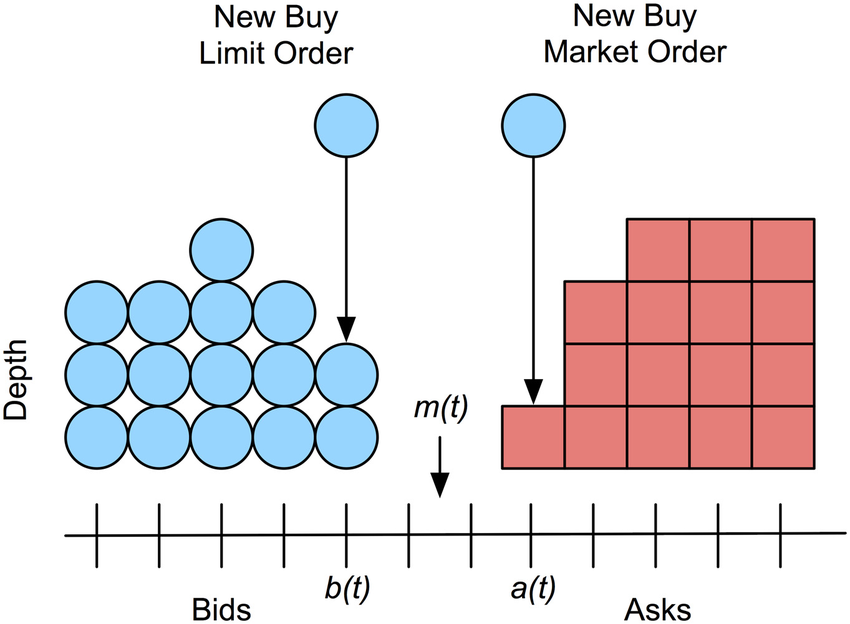
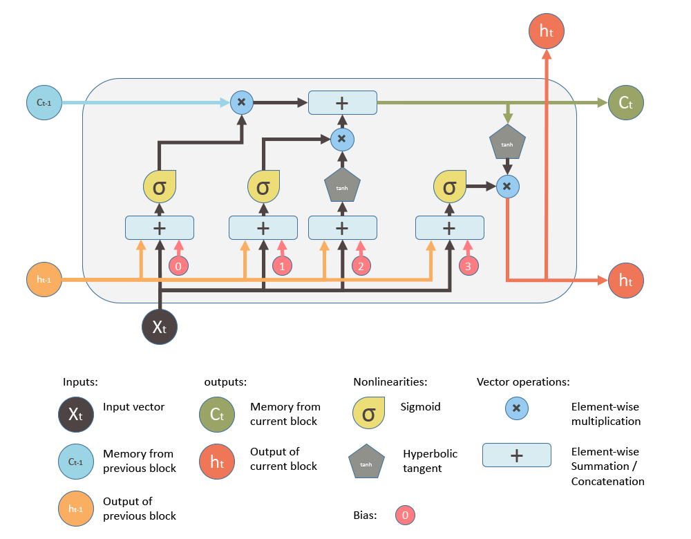

# A Deep Learning Approach to Limit Order Book Forecasting
By Aric Cutuli<br>
***

## Opening Remarks
The enigma concerning the predictability of markets has always been the principal driver of my interest in finance, and it inpires my ongoing exploration of machine learning's applications within the analysis and forecasting of financial time series. Today, we compare the performance of a studied deep learning model for limit order book forecasting on two stationary representations of the limit order book.

## Abstract
In this notebook, we implement an artificial neural network originally employed by Zhang et al[<sub>[1]</sub>](#ref1) that combines convolutional neural networks (CNNs) and a long short-term memory (LSTM) neural network in order to classify future directions of an order book at a high frequency. Specifically, given Coinbase order book data for Bitcoin, we seek to predict whether the mid price increases, decreases, or does not change in the next observation of the time series. Unlike Zhang et al's papers we reference[<sub>[1]</sub>](#ref1)[<sub>[2]</sub>](#ref2), which use non-stationary order book states as inputs to the network, our instantiation of the architecture is trained on order flow and order flow imbalance, which are stationary quantities derived from the limit order book[<sub>[3]</sub>](#ref3). Hence, this discussion also draws heavy inspiration from a 2021 article by Kolm et al[<sub>[4]</sub>](#ref4), which demonstrated that forecasting using order flow significantly outperforms raw order book inputs. Today, we further this discussion by doing an analysis of the impact that differencing order flow into order flow imbalance has on the forecasting performance of the model. We also approach the problem from a time series modeling perspective by analyzing the time-lag of the processes, a procedure that was not explicitly documented in those papers. We find that for our sparse data, the models are similarly poor in their ability to predict downward moves, but the model trained on order flow significantly outperforms the other when it comes to predicting upward moves. In the trading scenario we posit, we see that this failure to precisely predict downward moves is troublesome for intraday trading in a bearish market.

## Order Books, Flow, and Imbalance
Today's trading of equities and other securities is often facilitated by a [*limit order book*](https://en.wikipedia.org/wiki/Order_book), also known as an *order book*. The order book collects bids and offers made by prospective buyers and sellers and determines which incoming orders get executed and which are added to the book. The *bid price* is the highest price buyers are prepared to buy at, and the *ask price* is the lowest price sellers are willing to sell at. The *mid price*, which our model seeks to predict moves in, is the midpoint of the bid price and the ask price.

An order is defined by its side, quantity demanded, price to trade at, and time of submission. As one enters the system, the matching engine of the exchange tries to match the order with existing orders in the book. Orders that match are executed and called *market orders*, and orders that do not match or only partially match are added to the book and called *limit orders*.

[](https://www.researchgate.net/figure/Limit-order-book-diagram-A-new-buy-limit-order-arrives-at-price-bt-increasing-the_fig1_297725489)

Our model takes as inputs representations of the first ten levels of the order book. A level is denoted by its price and volume that is bid or asked. So, as we progress down levels on the bid side of the order book, the price decreases, and as we progress down levels of the ask side, the price increases. Each observation in our dataset will be a 40-variable vector displaying the price and volume for each of the top ten bid and ask levels, giving us a truncated screenshot of the *state of the limit order book* at each timestep. 

$$ \text{s}_t^{LOB} := (a_t^1, v_t^{1,a}, b_t^1, v_t^{1,b}, ..., a_t^{10}, v_t^{10,a}, b_t^{10}, v_t^{10,b})^T \in \mathbb{R}^{40} $$

We define the *bid order flows* (bOF) and *ask order flows* (aOF) at a timestamp to be 10-variable vectors computed using two consecutive order book states, where each element is given by

$$ \text{bOF}_{t,i} :=   \left\{
\begin{array}{ll}
      v_t^{i,b}, & b_t^i > b_{t-1}^i \\
      v_t^{i,b} - v_{t-1}^{i,b}, & b_t^i = b_{t-1}^i \\
      -v_t^{i,b}, & b_t^i < b_{t-1}^i \\
\end{array} 
\right. $$

$$ \text{aOF}_{t,i} :=   \left\{
\begin{array}{ll}
      -v_t^{i,a}, & a_t^i > a_{t-1}^i \\
      v_t^{i,a} - v_{t-1}^{i,a}, & a_t^i = a_{t-1}^i \\
      v_t^{i,a}, & a_t^i < a_{t-1}^i \\
\end{array} 
\right. $$

for $i = 1, ..., 10$. With this, we define *order flow* (OF)

$$ \text{OF}_t :=  (\text{bOF}_{t,1}, \text{aOF}_{t,1}, ..., \text{bOF}_{t,10}, \text{aOF}_{t,10})^T \in \mathbb{R}^{20} $$

and *order flow imbalance* (OFI)

$$ \text{OFI}_t := \text{bOF}_t - \text{aOF}_t \in \mathbb{R}^{10}. $$

While a sequence of limit order book states is a complex non-stationary process, the above formulas for order flow and order flow imbalance transform consecutive order book states into a [stationary process](https://en.wikipedia.org/wiki/Stationary_process). This property allows for our eventual test test of the deep learning model to be reasonably similar to the training set and thus appropriate to predict off of using the model. It also allows for more ease in the learning of long-term dependencies by our LSTM layer, which Kolm et al see as a reason behind their finding that sequence length only marginally impacted model performance[<sub>[4]</sub>](#ref4). On a separate note, when trained on order flow, which keeps the bid and ask sides separate, the CNN layers of our model will be given the added flexibility of being able to combine bid and ask order flows asymmetrically, so we hypothesize that our forecasting model will perform better on order flow than on order flow imbalance. This theory is expressed by Kolm et al[<sub>[4]</sub>](#ref4) and shared by time series analysis theory[<sub>[5]</sub>](#ref5).

## Introducing the CNN-LSTM Model
While the [universal approximation theorem](https://en.wikipedia.org/wiki/Universal_approximation_theorem) states that a feedforward neural network with a single hidden layer can approximate any continuous function on any compact set, different neural network architectures are capable of exploiting unique structures in data, which is a quality particularly useful for the learning of complex financial time series. These different architectures, which include CNNs and LSTMs among others, can compress data and change their behavior over time in a way that supports their efficacy in difficult modeling situations. On the other hand, simple feedforward neural networks can suffer from instability and less interpretability when seeking to learn complex relationships in data[<sub>[6]</sub>](#ref6).

Although artificial neural networks can be used individually, they are often complementary in their modeling capabilities and, when used together, can learn unique structures in data and improve a model's ability to execute a desired task. For instance, our CNN-LSTM model architecture we adopt consists of CNN layers and an Inception Module that compress and wrap the order book data in a manner that allows a LSTM module to learn temporal dependencies from a smaller parameter space, leading to a more parsimonious model[<sub>[1]</sub>](#ref1).

[*Convolutional neural networks*](https://en.wikipedia.org/wiki/Convolutional_neural_network) (CNNs) are feedforward neural networks that can exploit data locality in an input, so in the CNN-LSTM model, CNN layers reduce the dimension of the multivariate input by aggregating bid and ask sides and levels in the order book. The output of these convolutional layers serve as an input to the [*Inception Module*](https://arxiv.org/pdf/1409.4842v1.pdf), which wraps convolutions together to capture behavior over multiple timescales, acting as a sort of moving average indicator whose decay weights are learned via [backpropagation](https://en.wikipedia.org/wiki/Backpropagation)[<sub>[1]</sub>](#ref1). Then, the outputs of the Inception Module are concatenated and reshaped into an input to the [*long short-term memory*](https://en.wikipedia.org/wiki/Long_short-term_memory) (LSTM) layer. LSTMs are a class of [*recurrent neural networks*](https://en.wikipedia.org/wiki/Recurrent_neural_network) (RNNs) that are designed to handle temporal dependencies in sequential data and alleviate the [vanishing gradient problem](https://en.wikipedia.org/wiki/Vanishing_gradient_problem) faced by generic RNNs[<sub>[7]</sub>](#ref7). The LSTM unit consists of a memory cell and three gates that determine what information should be remembered by the memory cell. For an $ n $-dimensional input vector $\text{x}_t$, the LSTM unit is defined by

$$ 
\begin{equation}
    \begin{aligned}
        \text{f}_t &= \sigma (\text{U}^f \text{x}_t + \text{W}^f \text{h}_{t-1} + \text{b}^f) \\
        \text{i}_t &= \sigma (\text{U}^i \text{x}_t + \text{W}^i \text{h}_{t-1} + \text{b}^i) \\
        \text{o}_t &= \sigma (\text{U}^o \text{x}_t + \text{W}^o \text{h}_{t-1} + \text{b}^o) \\
        \text{c}_t &= \text{f}_t \circ \text{c}_{t-1} + \text{i}_t \circ \text{tanh} (\text{U}^c \text{x}_t + \text{W}^c \text{h}_{t-1} + \text{b}^c) \\
        \text{h}_t &= \text{o}_t \circ \text{tanh} (\text{c}_t) \\
    \end{aligned}
\end{equation}
$$

where $ m $ is the number of LSTM units in the module, $ \sigma := (1+e^{-x})^{-1} $ is the sigmoid activation function, $ \text{f}_t \in \mathbb{R}^m $ is the forget gate's activation vector, $ \text{i}_t \in \mathbb{R}^m $ is the input gate's activation vector, $ \text{o}_t \in \mathbb{R}^m $ is the output gate's activation vector, $ \text{c}_t \in \mathbb{R}^m $ is the LSTM unit's hidden state vector, and $ \text{h}_t \in \mathbb{R}^m $ is the unit's output vector. $ \text{U} \in \mathbb{R}^{m \times n} $, $ \text{W} \in \mathbb{R}^{m \times m} $, and $ \text{b} \in \mathbb{R}^m $ are learned during training and represent the weight matrices in connection to the input vector, the weight matrices in connection to the previous output state, and the bias vectors, respectively. 

[](https://blog.mlreview.com/understanding-lstm-and-its-diagrams-37e2f46f1714)

Moreover, Zhang et al[<sub>[2]</sub>](#ref2) showcase the performance benefit of applying [variational dropout](https://arxiv.org/pdf/1512.05287v5.pdf) to the model as a stochastic [regularizer](https://en.wikipedia.org/wiki/Regularization_(mathematics)) to reduce [overfitting](https://en.wikipedia.org/wiki/Overfitting) and make decisions with some understanding of the predictive variation produced by our model parameters. That is, with [*Monte-Carlo (MC) dropout*](https://docs.aws.amazon.com/prescriptive-guidance/latest/ml-quantifying-uncertainty/mc-dropout.html), we can add [epistemic uncertainty](https://en.wikipedia.org/wiki/Uncertainty_quantification#Aleatoric_and_epistemic)[<sup>1</sup>](#fn1) to our neural network architecture by making multiple out-of-sample predictions and dropping a different random sample of neurons with every forward pass. This random sampling leads to different predictions on each evaluation iteration, so we can average the results to––in theory––improve out-of-sample predictions. The dropout layer is inserted after the Inception Module, and we determine its rate with [cross-validated grid-search](https://scikit-learn.org/stable/modules/grid_search.html).

Lastly, since we formulate this forecasting problem as one of classification, we add an output layer with a [softmax activation function](https://en.wikipedia.org/wiki/Softmax_function), resulting in a final output whose elements represent the probability of observing each price movement in the next timestamp. We train the models by minimizing [categorical cross-entropy loss](https://en.wikipedia.org/wiki/Cross_entropy#Cross-entropy_loss_function_and_logistic_regression) with [stochastic gradient descent](https://en.wikipedia.org/wiki/Stochastic_gradient_descent) using the [Adam optimization algorithm](https://arxiv.org/pdf/1412.6980.pdf), whose parameters we set to those of the DeepLOB implementation of the model[<sub>[1]</sub>](#ref1).

<sup>1. </sup><span id="fn1"><sup>Here, epistemic uncertainty refers to the fact that we don't have an analytical understanding of the posterior distribution of the model parameters. Because of our lack of data, we are uncertain of the integrity of estimated model parameters.</sup></span>


```python
from tensorflow.keras import Input, layers
from tensorflow.keras.models import Model
from tensorflow.keras.optimizers import Adam

def CNN_LSTM(time_series, lag_param, dropout):
    
    # Convolutions across LOB levels
    if time_series == 'OF':
        input_tensor = Input(shape=(lag_param,20,1))
        # Combine imbalance information across sides for each level of the order book
        layer_x = layers.Conv2D(filters=16, kernel_size=(1,2), strides=(1,2))(input_tensor)
        layer_x = layers.LeakyReLU(alpha=0.01)(layer_x)
        # Combine imbalance information across time for each side and level of the order book
        layer_x = layers.Conv2D(filters=16, kernel_size=(4,1), padding='same')(layer_x)
        layer_x = layers.LeakyReLU(alpha=0.01)(layer_x)
        layer_x = layers.Conv2D(filters=16, kernel_size=(4,1), padding='same')(layer_x)
        layer_x = layers.LeakyReLU(alpha=0.01)(layer_x)
    elif time_series == 'OFI':
        input_tensor = Input(shape=(lag_param,10,1))
        # Combine imbalance information across time for each side and level of the order book
        layer_x = layers.Conv2D(filters=16, kernel_size=(4,1), padding='same')(input_tensor)
        layer_x = layers.LeakyReLU(alpha=0.01)(layer_x)
        layer_x = layers.Conv2D(filters=16, kernel_size=(4,1), padding='same')(layer_x)
        layer_x = layers.LeakyReLU(alpha=0.01)(layer_x)
    else:
        raise Exception("'time_series' should be 'OF' or 'OFI'")

    # Combine imbalance information across all levels of the book
    layer_x = layers.Conv2D(filters=16, kernel_size=(1,10))(layer_x)
    layer_x = layers.LeakyReLU(alpha=0.01)(layer_x)

    # Inception Module
    # Tower 1
    tower_1 = layers.Conv2D(filters=32, kernel_size=(1,1), padding='same')(layer_x)
    tower_1 = layers.LeakyReLU(alpha=0.01)(tower_1)
    tower_1 = layers.Conv2D(filters=32, kernel_size=(3,1), padding='same')(tower_1)
    tower_1 = layers.LeakyReLU(alpha=0.01)(tower_1)
    # Tower 2
    tower_2 = layers.Conv2D(filters=32, kernel_size=(1,1), padding='same')(layer_x)
    tower_2 = layers.LeakyReLU(alpha=0.01)(tower_2)
    tower_2 = layers.Conv2D(filters=32, kernel_size=(5,1), padding='same')(tower_2)
    tower_2 = layers.LeakyReLU(alpha=0.01)(tower_2)  
    # Tower 3
    tower_3 = layers.MaxPooling2D(pool_size=(3,1), padding='same', strides=(1,1))(layer_x)
    tower_3 = layers.Conv2D(filters=32, kernel_size=(1,1), padding='same')(tower_3)
    tower_3 = layers.LeakyReLU(alpha=0.01)(tower_3)

    # Concatenation and reshaping
    layer_x = layers.concatenate([tower_1, tower_2, tower_3], axis=-1)
    layer_x = layers.Reshape(target_shape=(lag_param, 96))(layer_x)
    
    # Insert variational dropout layer
    # By setting training to true, we enable dropout during evaluation passes
    layer_x = layers.Dropout(dropout)(layer_x, training=True)
    
    # LSTM with 64 hidden units
    layer_x = layers.LSTM(units=64)(layer_x)
    
    # Final output layer
    output = layers.Dense(units=3, activation='softmax')(layer_x)
    
    model = Model(input_tensor, output)
    
    opt = Adam(learning_rate=0.01, epsilon=1)
    model.compile(loss='categorical_crossentropy', optimizer=opt, metrics=['accuracy'])
    
    return model

```


```python
model_details = {
    'OF': {
        'model': None, 'function': CNN_LSTM, 'data': None
    },
    'OFI': {
        'model': None, 'function': CNN_LSTM, 'data': None
    }
}
```

## Data
We scrape our data using [Coinbase's public API](https://github.com/danpaquin/coinbasepro-python). Our method pulls live order book state information for Bitcoin traded on Coinbase. We essentially have the ability to choose however many observations we desire. But to avoid processing the data pull for an obscene length of time, we unfortunately decide not to get as many observations as the datasets used in the aforementioned related papers, since the purpose of this notebook is not to submit a solution to the model risk management team but instead to showcase what I've taught myself in the past few months. That being said, we extract 100,000 observations over the course of about a day, and we add a couple extra to account for the transformations we make later.


